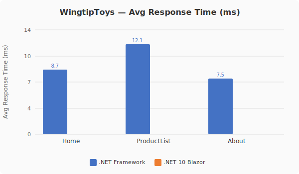
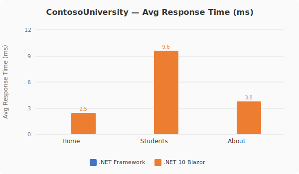

# BlazorWebFormsComponents Migration Toolkit — Executive Summary

### Automated Web Forms → Blazor Migration at Scale

---

## The Web Forms Migration Problem

When we released ASP.NET Core, Web Forms was left behind. There is no `System.Web.UI` in ASP.NET Core. For the thousands of organizations running production Web Forms applications — some spanning a decade or more of development — this created an urgent modernization challenge with no first-party migration path. The conventional advice is a full rewrite: rebuild every page, every control, every data-binding expression in Razor or a JavaScript SPA framework. That approach is expensive, risky, and discards years of investment in CSS, JavaScript, and battle-tested markup.

BlazorWebFormsComponents (BWFC) takes a different approach. Instead of rewriting, it provides **Blazor components that match Web Forms controls by name, by attribute, and by HTML output** — turning migration into a find-and-replace operation rather than a rewrite. The Copilot-enabled migration toolkit automates even that.

---

## How Fast Can You Migrate?

**Sub-2-second markup migration. Zero manual fixes. Faster runtime performance after migration.**

Layer 1 migrates a full Web Forms application's markup to Blazor in under 2 seconds. The complete pipeline — markup conversion, code-behind transformation, build, and test — runs without human intervention. The migrated apps are faster than the originals.

### Migration & Performance Summary

| Sample | Controls Migrated | L1 Migration Time | Acceptance Tests | Web Forms Avg (ms) | Blazor Avg (ms) | Runtime Speedup |
|--------|:-----------------:|:-----------------:|:----------------:|:------------------:|:----------------:|:---------------:|
| **WingtipToys** | 348 across 31 types | **1.51s** | 25/25 ✅ | 6.5 | 3.0 | **2.15×** faster |
| **ContosoUniversity** | 72 across 8 types | **0.59s** | 40/40 ✅ | 4.1 | 3.6 | **1.14×** faster |

> **50 iterations per page, 3 pages per app.** Avg response times from automated HTTP benchmarks (see [Runtime Performance Benchmarks](#runtime-performance-benchmarks) below). Blazor apps run on .NET 10; Web Forms apps on .NET Framework 4.8 under IIS Express.

**420+ control usages migrated. 65 acceptance tests passing. 0 build errors. 0 manual Layer 1 fixes for 8+ consecutive runs.**

---

## Why Drop-In Replacement Works

Most migration tools rewrite everything from scratch or generate code that "looks similar" but requires extensive rework. Both discard the years of investment teams have made in CSS, JavaScript, and visual design.

BWFC's approach: **Blazor components with the same names, same attributes, and same HTML output as Web Forms controls.** `<asp:GridView>` → `<GridView>`. `<asp:Button>` → `<Button>`. Identical HTML output means existing CSS produces pixel-perfect results. The shopping cart below — powered by BWFC's `<GridView>`, `<BoundField>`, `<TemplateField>`, `<TextBox>`, and `<CheckBox>` — is visually indistinguishable from the original.

Three advantages over rewrite approaches:

1. **Risk elimination** — Migrate page by page. Existing design and functionality remain intact at every step.
2. **Cost reduction** — CSS, JavaScript, and visual QA preserved automatically. Engineering work is only at the component layer.
3. **Speed** — Layer 1 migrates a full application's markup in under 2 seconds; the resulting app runs 1.14–2.15× faster with no performance enhancements added.

---

## Results at a Glance

| Metric | WingtipToys | ContosoUniversity | **Combined** |
|--------|:-----------:|:-----------------:|:------------:|
| **Benchmark Runs** | 21 | 19 | **40** |
| **Acceptance Tests** | 25 | 40 | **65** |
| **Perfect Runs (100%)** | 8 consecutive | 8 total | **16** |
| **Best Layer 1 Time** | **1.51s** | **0.59s** | — |
| **Layer 1 Manual Fixes** | 0 (8 consecutive) | 0 (latest) | **0** |
| **Layer 2 Fixes (stable)** | 3 | ~3 | **~6** |
| **Render Mode** | SSR | SSR | — |
| **Control Usages Migrated** | 348 across 31 types | 72 across 8 types | **420+** |
| **Build Errors (latest)** | 0 | 0 | **0** |

---

## Runtime Performance Benchmarks

Automated HTTP benchmarks comparing the original .NET Framework Web Forms apps against their migrated .NET 10 Blazor equivalents. 50 iterations per page, sequential single-client requests.

### WingtipToys — Response Times

| Page | Web Forms Avg (ms) | Blazor Avg (ms) | Speedup | Web Forms P95 (ms) | Blazor P95 (ms) |
|------|:------------------:|:----------------:|:-------:|:-------------------:|:----------------:|
| Home | 6.4 | 2.4 | **2.67×** | 9 | 3 |
| ProductList | 8.3 | 3.6 | **2.31×** | 11 | 7 |
| About | 4.9 | 3.1 | **1.58×** | 6 | 4 |

### ContosoUniversity — Response Times

| Page | Web Forms Avg (ms) | Blazor Avg (ms) | Speedup | Web Forms P95 (ms) | Blazor P95 (ms) |
|------|:------------------:|:----------------:|:-------:|:-------------------:|:----------------:|
| Home | 2.2 | 1.6 | **1.38×** | 3 | 4 |
| Students | 6.5 | 6.3 | **1.03×** | 8 | 14 |
| About | 3.6 | 2.8 | **1.29×** | 5 | 5 |

### Response Time Charts

> Methodology: plain HTTP requests via `Invoke-WebRequest -UseBasicParsing`. No JS execution. Results are machine-dependent — focus on relative comparisons. Full details in [`dev-docs/benchmarks/performance-report.md`](../benchmarks/performance-report.md).

---

## Visual Fidelity — Side-by-Side Comparisons

The migration toolkit's drop-in replacement strategy produces visually identical output. The following screenshots demonstrate that migrated Blazor pages match the original Web Forms rendering.

### WingtipToys — Web Forms vs. Blazor (Run 1 Comparisons)

| Page | Comparison |
|------|------------|
| **Home Page** |  |
| **Product List** |  |
| **Shopping Cart** |  |

> These side-by-side comparisons from Run 1 show the toolkit producing matching visual output from the very first benchmark — before any optimization or tuning.

---

## Built and Improved with Squad

The BWFC framework and migration toolkit are developed with [**Squad**](https://github.com/bradygaster/squad) — a system for growing and improving software frameworks using specialized AI agent teams. Squad enables rapid iteration across the component library, migration scripts, benchmarks, and documentation by coordinating domain-specific agents that each focus on what they do best: component development, test authoring, migration automation, and performance analysis.

Squad's contribution to BWFC is visible in the pace of progress: 40 benchmark runs, 65 acceptance tests, and two fully migrated sample applications — all within 8 days of continuous iteration. The framework's skills, agents, and automation pipelines are all Squad-managed, enabling the kind of sustained, high-quality output that would otherwise require a much larger team.

---

## Two-Layer Pipeline Architecture

The migration toolkit separates concerns into two distinct layers, each optimized for its class of transformation.

### Layer 1 — Mechanical Transformation

**What it does:** Regex-based markup conversion — deterministic, fast, zero-touch.

- Removes `asp:` prefixes and `runat="server"` attributes
- Converts data-binding expressions (`<%# Eval("Name") %>` → `@context.Name`)
- Maps Web Forms attributes to Blazor parameters
- Copies static assets (CSS, JS, images, fonts) to `wwwroot/`
- Converts template placeholders to Blazor `RenderFragment` patterns
- Auto-detects and preserves `<script>` references
- **`Find-DatabaseProvider`** — auto-detects database provider from `Web.config` `<connectionStrings>` and scaffolds the correct EF Core provider package (e.g., SQL Server, SQLite, PostgreSQL). Emits a `[DatabaseProvider]` review item for L2 verification.

**Performance:** 1.51s for 314 transforms (WingtipToys Run 18) · 1.70s for 348 transforms (Run 20, zero-error pipeline) · 1.79s for 348 transforms (Run 21, with SelectMethod preservation) · 0.59s for 78 transforms (ContosoUniversity Run 17) · 0.62s for 72 transforms (ContosoUniversity Run 19, with provider detection)

### Layer 2 — Semantic Transformation

**What it does:** Context-aware code transformations requiring understanding of application structure.

- Generates `Program.cs` with correct DI registrations, database configuration, and auth setup
- Converts code-behind files from `System.Web.UI.Page` inheritance to Blazor component models
- Handles authentication form rewiring (cookie auth, Identity integration)
- Applies SSR-specific patterns (streaming, enhanced navigation)

**Current state:** Pattern C (Program.cs) fully automated. Patterns A (code-behinds) and B (auth forms) use known-good overlays pending full automation.

### Why Two Layers Work

Separating mechanical transforms from semantic ones enables **independent iteration**. Layer 1 has been stable for 6 runs while Layer 2 continues advancing. Each layer can be tested, timed, and optimized without affecting the other. The result is a pipeline that is both **fast** (sub-2-second L1) and **extensible** (new semantic patterns added without touching L1).

---

## Test Project Coverage

The toolkit has been validated against two architecturally distinct Web Forms applications that together cover the breadth of real-world migration scenarios.

| Aspect | WingtipToys | ContosoUniversity |
|--------|:-----------:|:-----------------:|
| **Application Type** | E-commerce platform | Academic management |
| **Pages** | ~15 pages (32 markup files) | 5 pages + 1 master page |
| **Control Usages** | 348 across 31 types | 40+ across 8 types |
| **Data Access** | Code-First EF6 | Database-First EF6 (.edmx) |
| **AJAX Controls** | None | UpdatePanel, ScriptManager, AutoCompleteExtender |
| **Authentication** | ASP.NET Identity (login, register, cart) | None |
| **Key Challenge** | Auth/cookie handling in SSR mode | EF6 .edmx scaffolding + AjaxControlToolkit |
| **Acceptance Tests** | 25 (functional + visual integrity) | 40 (functional + CRUD + navigation) |
| **Benchmark Runs** | 21 | 19 |
| **Best Result** | 25/25, 1.51s L1, GridView ShoppingCart | 40/40, 0.59s L1, Run 19 SQL Server preservation |

**WingtipToys** exercises the full complexity of a production e-commerce application: product catalogs, a **GridView-powered shopping cart** with cookie-based state and editable quantities, user authentication with ASP.NET Identity, category filtering, and complex ListView/GridView/FormView patterns. Run 18 achieved the breakthrough of migrating the ShoppingCart page from a stubbed HTML table to a fully functional `<GridView>`. Run 20 delivered the **first zero-error L1→L2 pipeline** with 0 stubs. Run 21 then validated **SelectMethod preservation** — L1 keeps the attribute in markup, L2 converts it to a typed `SelectHandler<ItemType>` delegate — with all 3 core product/cart pages using `SelectHandler<ItemType>` delegates and 0 TODOs in product catalog, shopping cart, or layout pages. The 6 remaining TODOs are confined to account/payment pages (out of scope for BWFC).

**ContosoUniversity** validates a fundamentally different architecture: database-first Entity Framework with `.edmx` models, UpdatePanel-based AJAX interactions, and server-side data operations. Run 19 confirmed SQL Server LocalDB preservation — L1's `Find-DatabaseProvider` auto-detected the provider from `Web.config`, producing 229 output files with 5 BLL classes and 0 build errors. It proves the toolkit generalizes beyond a single application pattern and correctly handles database provider fidelity.

---

## What's Next

- ✅ **Performance Benchmarks** — Automated HTTP benchmark suite comparing .NET Framework Web Forms vs. .NET 10 Blazor response times across both sample apps (50 iterations/page, SVG charts, JSON + Markdown reports)
- ✅ **Component Health Dashboard** — Live diagnostic dashboard tracking 52 Web Forms controls across 6 dimensions (property parity, event parity, test coverage, documentation, samples, implementation status). Available at `/dashboard` in the sample app and as a static MkDocs page

---

Generated from 40 benchmark runs across WingtipToys (21 runs) and ContosoUniversity (19 runs). All data sourced from individual run reports in `dev-docs/migration-tests/`. Last updated: 2026-03-16.
