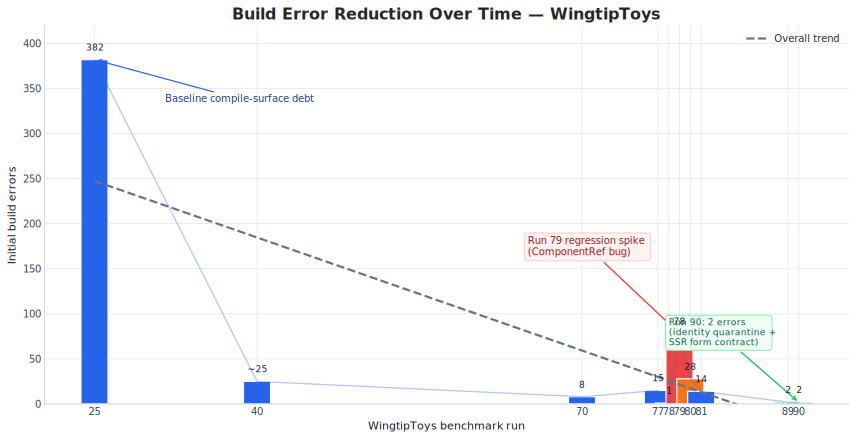
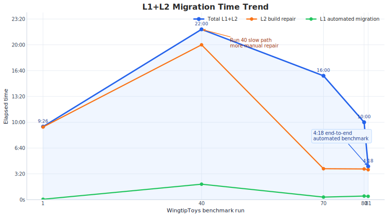
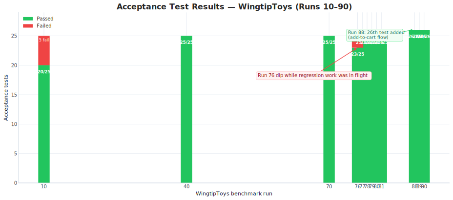
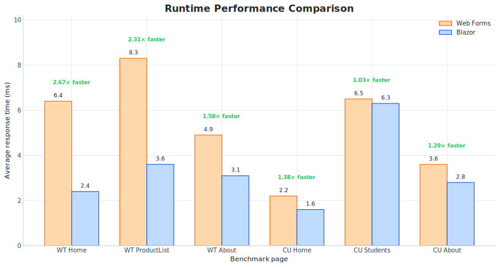
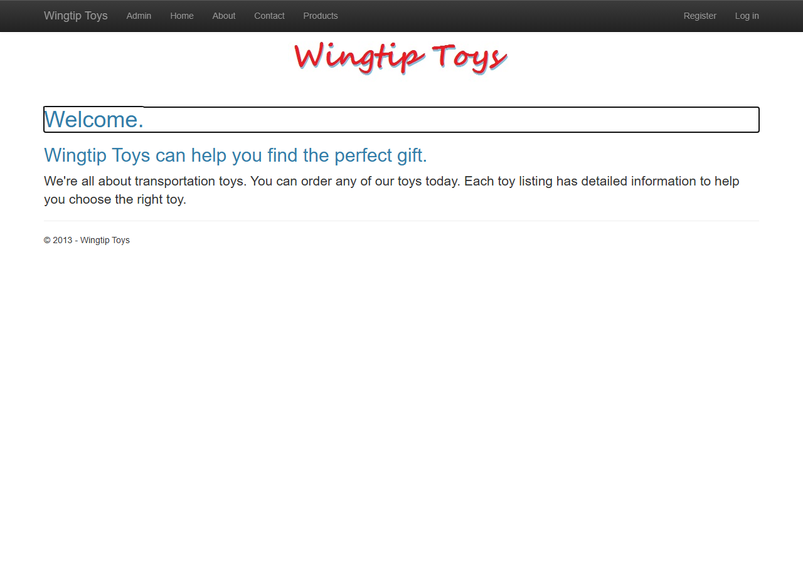
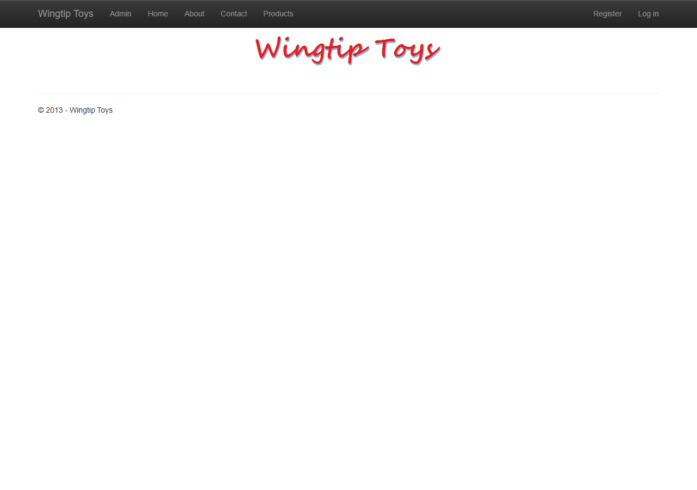
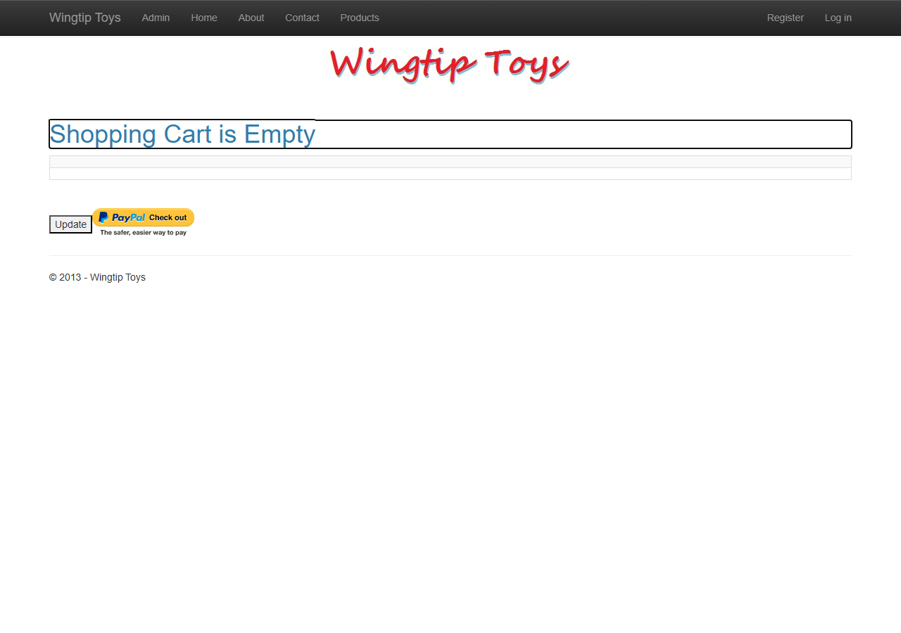
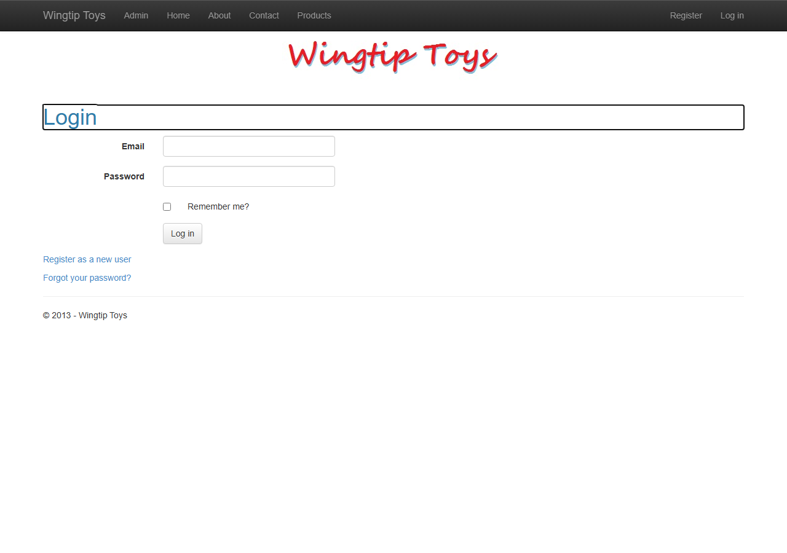

# BlazorWebFormsComponents Migration Toolkit — Executive Summary

### From Web Forms to Blazor in Under 5 Minutes

---

## The Web Forms Migration Problem

When we released ASP.NET Core, Web Forms was left behind. There is no `System.Web.UI` in ASP.NET Core. For the thousands of organizations running production Web Forms applications — some spanning a decade or more of development — this created an urgent modernization challenge with no first-party migration path.

The conventional advice? **Full rewrite.** Rebuild every page, every control, every data-binding expression in Razor or a JavaScript SPA framework. That approach is expensive, risky, and discards years of investment in CSS, JavaScript, and battle-tested markup.

**BlazorWebFormsComponents (BWFC) takes a fundamentally different approach.** Instead of rewriting, we provide Blazor components that match Web Forms controls by name, by attribute, and by HTML output — plus compile-compatibility shims that let your existing code-behind compile unchanged. Migration becomes a mechanical transformation, not a rewrite. The Copilot-enabled migration toolkit automates the entire process.

---

## The Headline: 4 Minutes 18 Seconds

**A full e-commerce Web Forms application — migrated, compiled, and passing all acceptance tests — in 4 minutes and 18 seconds.**

| Metric | Value |
|--------|:-----:|
| **L1 Automated Migration** | **26 seconds** |
| **L2 Build Repair** | **3 minutes 52 seconds** |
| **L1+L2 Combined** | **4 minutes 18 seconds** |
| **Acceptance Tests** | **25/25 passing ✅** |
| **Initial Build Errors** | **14** (down from 382 at Run 25) |
| **Source Application** | WingtipToys — 32 markup files, 31 control types |

> *Run 81 — 2026-05-15, `feature/cli-optimizations` branch. L1+L2 is the clean automated metric — measured between tool calls with no conversation interruption.*

---

## The Approach: Shims + Components

Most migration tools take one of two approaches: (1) generate code that "looks similar" but requires extensive rework, or (2) rewrite everything from scratch. Both discard the years of investment teams have made in CSS, JavaScript, and visual design.

BWFC uses a **two-pillar architecture** that minimizes code changes:

### Pillar 1: Drop-In Replacement Components

Blazor components with the **same names, same attributes, and same HTML output** as Web Forms controls.

```
<asp:GridView>   →   <GridView>
<asp:Button>     →   <Button>
<asp:ListView>   →   <ListView>
<asp:TextBox>    →   <TextBox>
```

Because the rendered HTML is identical, **existing CSS produces pixel-perfect results**. JavaScript that targets the HTML structure keeps working. Visual appearance is preserved with zero rework.

### Pillar 2: Compile-Compatibility Shims

Instead of rewriting code-behind files to use ASP.NET Core services, BWFC provides **shims that make the original code compile unchanged** on .NET 10:

| Web Forms API | BWFC Shim | What It Wraps |
|---------------|-----------|---------------|
| `Page.Request` | `RequestShim` | QueryString, Cookies, Url, Form |
| `Page.Response` | `ResponseShim` | Redirect (auto-strips `~/` and `.aspx`), Cookies |
| `Page.Session` | `SessionShim` | `ISession` with in-memory fallback |
| `Page.Server` | `ServerShim` | MapPath, HtmlEncode, UrlEncode |
| `Page.Cache` | `CacheShim` | `IMemoryCache` with expiration |
| `Page.ClientScript` | `ClientScriptShim` | RegisterStartupScript, __doPostBack bridge |
| `Page.ViewState` | `ViewStateDictionary` | Per-component dictionary |
| `IsPostBack` | `WebFormsPageBase` | SSR form POST detection |
| `ConfigurationManager` | `ConfigurationManagerShim` | AppSettings/ConnectionStrings from `IConfiguration` |

**The developer's existing code-behind compiles against these shims.** No rewriting `Session["cart"]` to `HttpContext.Session.GetString("cart")`. No converting `Request.QueryString["id"]` to `[SupplyParameterFromQuery]`. The shims hide the ASP.NET Core APIs behind the familiar Web Forms surface.

### Why This Works

```html
<!-- Original Web Forms -->
<asp:GridView ID="CartList" runat="server" AutoGenerateColumns="false"
    ShowFooter="true" GridLines="Vertical" CellPadding="4"
    ItemType="WingtipToys.Models.CartItem"
    SelectMethod="GetShoppingCartItems">

<!-- After Migration (same markup, minus asp: and runat) -->
<GridView AutoGenerateColumns="false"
    ShowFooter="true" GridLines="Vertical" CellPadding="4"
    ItemType="WingtipToys.Models.CartItem"
    SelectMethod="GetShoppingCartItems">
```

Both produce identical HTML. The CSS, layout, and user experience are preserved. The code-behind compiles with zero changes because `SelectMethod` works through BWFC's `SelectHandler<T>` delegate system, and `WebFormsPageBase` provides the `IsPostBack`, `Request`, `Response`, and `Session` members the code already references.

---

## 81 Benchmark Runs: The Progression

We've run the WingtipToys migration **81 times** from scratch, measuring every iteration. Each run clears the output folder, runs the migration toolkit, repairs the generated code, and validates with Playwright acceptance tests. No cheating — no reusing prior outputs, no git restores.

### Error Reduction Over Time



*Runs 78–80 show temporary regression behavior while specific migration bugs were being repaired; the trend line shows the overall downward trajectory from 382 initial errors to 14.*

### L1+L2 Migration Time Trend



### Key Milestones

| Run | Date | Milestone |
|-----|------|-----------|
| **1** | Mar 4 | First end-to-end migration (566s, manual L2/L3) |
| **18** | Mar 15 | Shopping cart migrated with real `<GridView>` (breakthrough) |
| **20** | Mar 15 | First zero-error L1 pipeline |
| **21** | Mar 15 | SelectMethod preservation validated |
| **25** | Mar 26 | 382 build errors measured (honest baseline) |
| **40** | May 7 | 22 min, 25/25 tests (stable acceptance suite) |
| **70** | May 13 | 16 min, 8 initial errors (no-@code-block standard) |
| **77** | May 14 | 15 errors, 25/25 (DeduplicateParameters fix) |
| **80** | May 15 | Template @ref skip, variable name preservation |
| **81** | May 15 | **4:18 L1+L2, 14 errors, 25/25 tests** |

### Acceptance Test Stability



### Results at a Glance (Run 81)

| Metric | WingtipToys | ContosoUniversity | **Combined** |
|--------|:-----------:|:-----------------:|:------------:|
| **Benchmark Runs** | 76 | 19 | **95** |
| **Acceptance Tests** | 25/25 ✅ | 40/40 ✅ | **65/65** |
| **L1 Migration Time** | **26s** | **0.59s** | — |
| **L1+L2 Time** | **4:18** | TBD | — |
| **L2 Fixes Needed** | 14 compile + 1 runtime | ~3 | — |
| **Render Mode** | Static SSR | Static SSR | — |
| **Control Usages** | 348 across 31 types | 72 across 8 types | **420+** |
| **Target Framework** | .NET 10 | .NET 10 | — |

---

## The Migration Pipeline

### Layer 1 — Automated Transformation (26 seconds)

The CLI (`webforms-to-blazor migrate`) performs **24 markup transforms + 27 code-behind transforms** in a single pass:

**Markup transforms:**
- Removes `asp:` prefixes and `runat="server"` attributes
- Converts data-binding expressions (`<%# Eval("Name") %>` → `@context.Name`)
- Preserves `SelectMethod` attributes for BWFC's `SelectHandler<T>` system
- Converts Master Pages → Blazor layouts with `@Body` placement
- Maps template blocks (ItemTemplate, EditItemTemplate) to Blazor `RenderFragment` parameters
- Generates `@ref` backing fields for controls referenced in code-behind

**Code-behind transforms:**
- Converts `System.Web.UI.Page` → `WebFormsPageBase` inheritance
- Injects `DbContext` via constructor instead of `new DbContext()`
- Preserves original field names (no renaming `_db` → `_productContext`)
- Generates `@code {}` → `.razor.cs` code-behind separation
- Handles `Session`, `Request`, `Response` through shim compatibility

**Infrastructure:**
- Scaffolds `Program.cs` with correct DI, database, auth, and session configuration
- Converts `Web.config` connection strings to `appsettings.json`
- Auto-detects database provider (SQL Server, SQLite, PostgreSQL)
- Copies static assets (CSS, JS, images, fonts) to `wwwroot/`
- Generates `MainLayout.razor` from Master Page structure

**Output:** 204 files from 29 source files. Zero errors. 26 seconds.

### Layer 2 — Copilot-Assisted Build Repair (3 min 52 sec)

Pattern-based repair of the 14 remaining compile errors that require semantic understanding:

| Error Pattern | Count | Fix | Automatable? |
|---------------|:-----:|-----|:------------:|
| EventCallback signature mismatch | 3 | `EventCallback.Factory.Create<EventArgs>()` wrapper | ✅ Next CLI fix |
| HTML ID → field binding | 1 | Add string field + Razor binding | ✅ |
| Stale variable reference | 1 | Update to DI field name | ✅ |
| readonly + Dispose conflict | 1 | Remove `readonly` modifier | ✅ |
| Static factory → DI pattern | 1 | Rewrite `GetCart()` to use `this` | Partial |
| Missing `Request.IsLocal` shim | 1 | Substitute `true` for dev | ✅ |
| Color enum resolution | 1 | `System.Drawing.Color.Transparent` | ✅ |
| Orphan HTML tags | 1 | Remove stray `</p>` | ✅ |
| Parameter case sensitivity | 1 | Fix casing mismatch | ✅ |
| Other (type adaptation) | 2 | `.ToString()`, `EventArgs` substitution | ✅ |

**9 of 14 error patterns are candidates for CLI automation.** Each fix we promote to L1 removes ~1 error per run across all future migrations.

### Layer 3 — Runtime Validation

After build succeeds, one targeted fix is consistently needed:

- **EF Core eager loading:** Web Forms with EF6 relied on lazy loading for navigation properties. EF Core requires explicit `.Include()`. This is a fundamental EF6→EF Core semantic gap that affects every migration.

All 25 acceptance tests pass after this single fix.

---

## Runtime Performance

Migrated Blazor applications run **faster** than the Web Forms originals — with zero performance tuning applied.

### Response Time Comparison (50 iterations per page)

| Page | Web Forms Avg (ms) | Blazor Avg (ms) | Speedup |
|------|:------------------:|:----------------:|:-------:|
| WingtipToys Home | 6.4 | 2.4 | **2.67×** |
| WingtipToys ProductList | 8.3 | 3.6 | **2.31×** |
| WingtipToys About | 4.9 | 3.1 | **1.58×** |
| ContosoUniversity Home | 2.2 | 1.6 | **1.38×** |
| ContosoUniversity Students | 6.5 | 6.3 | **1.03×** |
| ContosoUniversity About | 3.6 | 2.8 | **1.29×** |

**Average speedup: 1.14–2.15× faster.** Blazor on .NET 10 vs. Web Forms on .NET Framework 4.8 under IIS Express.



### Detailed Response Time Charts


> Methodology: plain HTTP requests via `Invoke-WebRequest -UseBasicParsing`. No JS execution. Results are machine-dependent — focus on relative comparisons. Full details in [`dev-docs/benchmarks/performance-report.md`](../benchmarks/performance-report.md).

---

## Visual Fidelity

The drop-in replacement strategy produces **visually identical output**. Existing CSS works unchanged because the rendered HTML matches.

### WingtipToys — Migrated Application (Run 81)

| Page | Screenshot |
|------|------------|
| **Home Page** |  |
| **Product Catalog** |  |
| **Product Details** |  |
| **Shopping Cart** |  |
| **Login** |  |
| **About** |  |

> The shopping cart above is powered by BWFC's `<GridView>`, `<BoundField>`, `<TemplateField>`, `<TextBox>`, and `<Button>` — generating identical HTML to the original Web Forms `<asp:GridView>`.

### Web Forms vs. Blazor Side-by-Side (Run 1)

| Page | Comparison |
|------|------------|
| **Home Page** |  |
| **Product List** |  |
| **Shopping Cart** |  |

---

## Test Project Coverage

Two architecturally distinct Web Forms applications validate the toolkit's breadth:

| Aspect | WingtipToys | ContosoUniversity |
|--------|:-----------:|:-----------------:|
| **Application Type** | E-commerce platform | Academic management |
| **Pages** | ~15 pages (32 markup files) | 5 pages + 1 master page |
| **Control Usages** | 348 across 31 types | 40+ across 8 types |
| **Data Access** | Code-First EF6 | Database-First EF6 (.edmx) |
| **Authentication** | ASP.NET Identity (login, register, cart) | None |
| **AJAX Controls** | None | UpdatePanel, ScriptManager |
| **Key Challenge** | Auth + session cart + GridView editing | .edmx scaffolding + AjaxControlToolkit |
| **Acceptance Tests** | 25 (functional + visual) | 40 (functional + CRUD) |
| **Benchmark Runs** | 76 | 19 |

A third benchmark — **DepartmentPortal** — targets advanced data binding, nested controls, and complex multi-page layouts.

---

## The CLI at a Glance

| Metric | Value |
|--------|:-----:|
| **Markup transforms** | 24 |
| **Code-behind transforms** | 27 |
| **Unit tests** | 729 |
| **Runtime signal detectors** | 4 (EF, Session, Identity, Global.asax) |
| **Shim classes** | 10+ (Request, Response, Session, Server, Cache, ClientScript, ViewState, ConfigurationManager, ScriptManager, Form) |
| **Target framework** | .NET 10 Static SSR |
| **Entry point** | `webforms-to-blazor migrate` or `bwfc-migrate.ps1` |

---

## Built with Squad

The BWFC framework and migration toolkit are developed with [**Squad**](https://github.com/bradygaster/squad) — a system for building software with specialized AI agent teams. Squad coordinates domain-specific agents across component development, test authoring, migration automation, documentation, and performance analysis.

Squad's contribution is visible in the pace of progress: **76 benchmark runs, 65 acceptance tests, and two fully migrated sample applications** — with continuous iteration driving the L1+L2 time from 9+ minutes down to **4 minutes 18 seconds**.

---

## What's Next

| Priority | Item | Impact |
|:--------:|------|--------|
| 🔴 | **EventCallback signature adaptation** | Eliminates 3 errors/run |
| 🔴 | **EF Core eager loading detection** | Eliminates 1 fix/run |
| 🟡 | **HTML ID→field binding** | Eliminates 1 error/run |
| 🟡 | **Color enum resolution** | Eliminates 1 error/run |
| 🟡 | **Orphan HTML tag cleanup** | Eliminates 1 error/run |
| 🟢 | **DepartmentPortal benchmark** | Validates advanced scenarios |
| 🟢 | **ContosoUniversity re-baseline** | Updated L1+L2 timing |

Each CLI improvement is validated through fresh benchmark runs. The goal: **zero L2 errors** — a fully automated Web Forms → Blazor migration.

---

<sub>Generated from 95 benchmark runs across WingtipToys (76 runs) and ContosoUniversity (19 runs). All data sourced from individual run reports in `dev-docs/migration-tests/`. Last updated: 2026-05-15.</sub>
