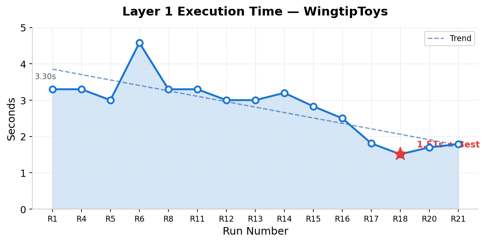
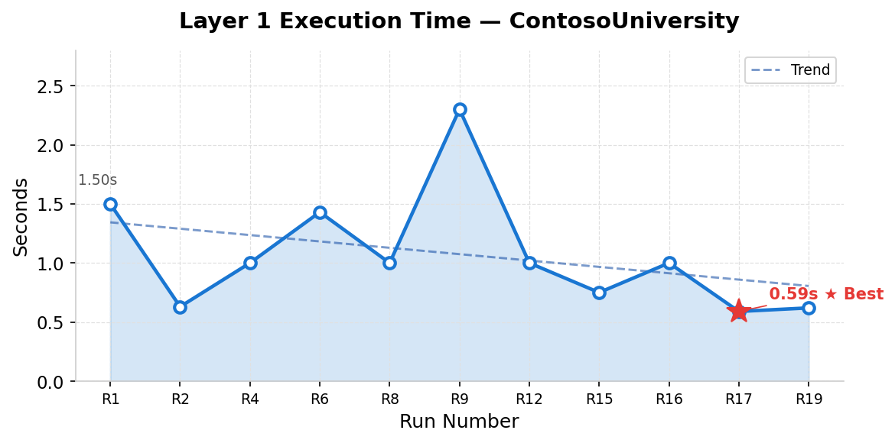
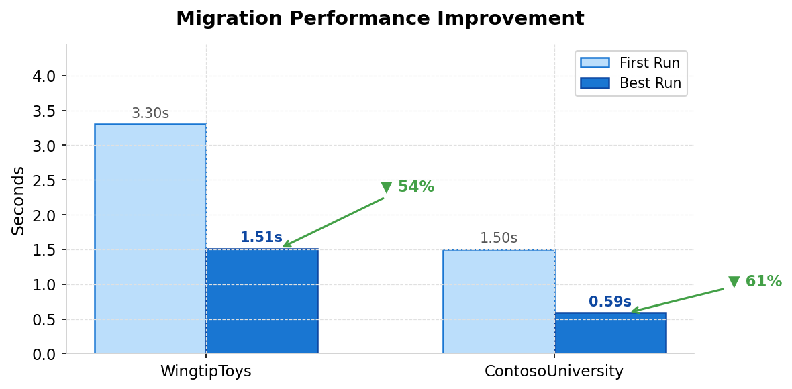
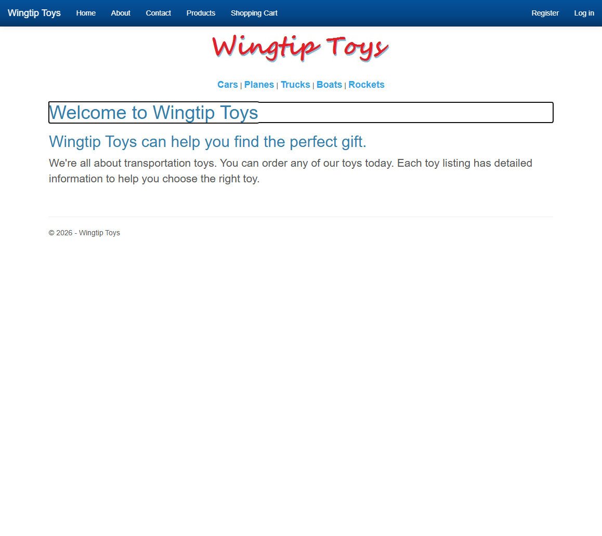
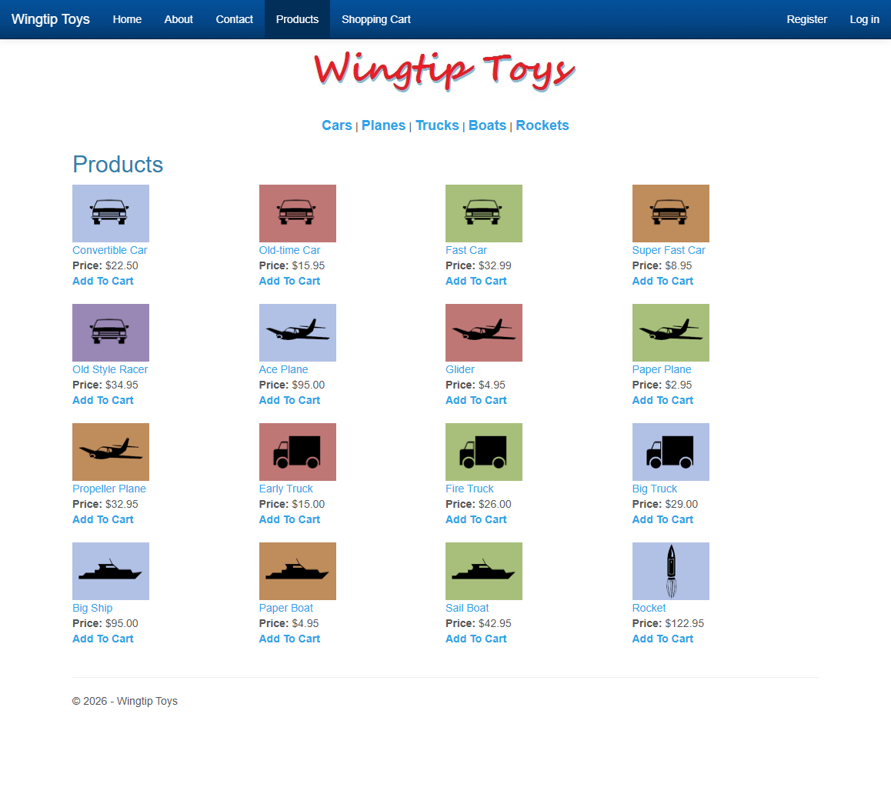
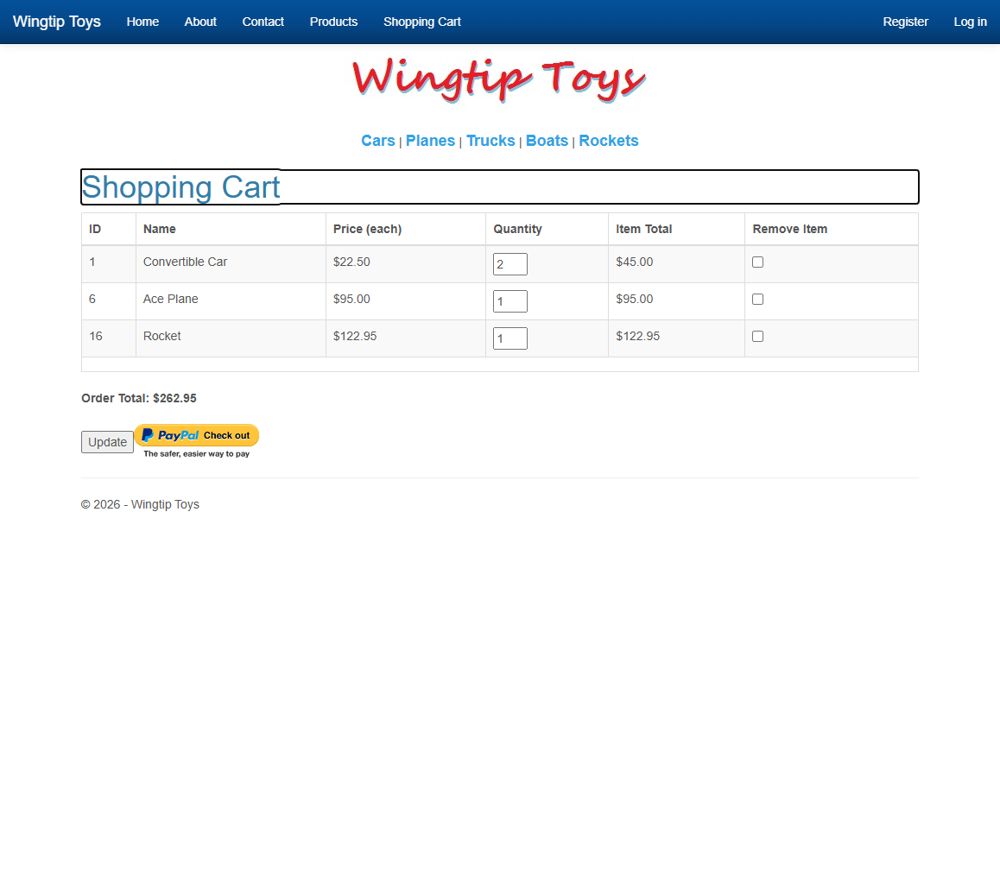
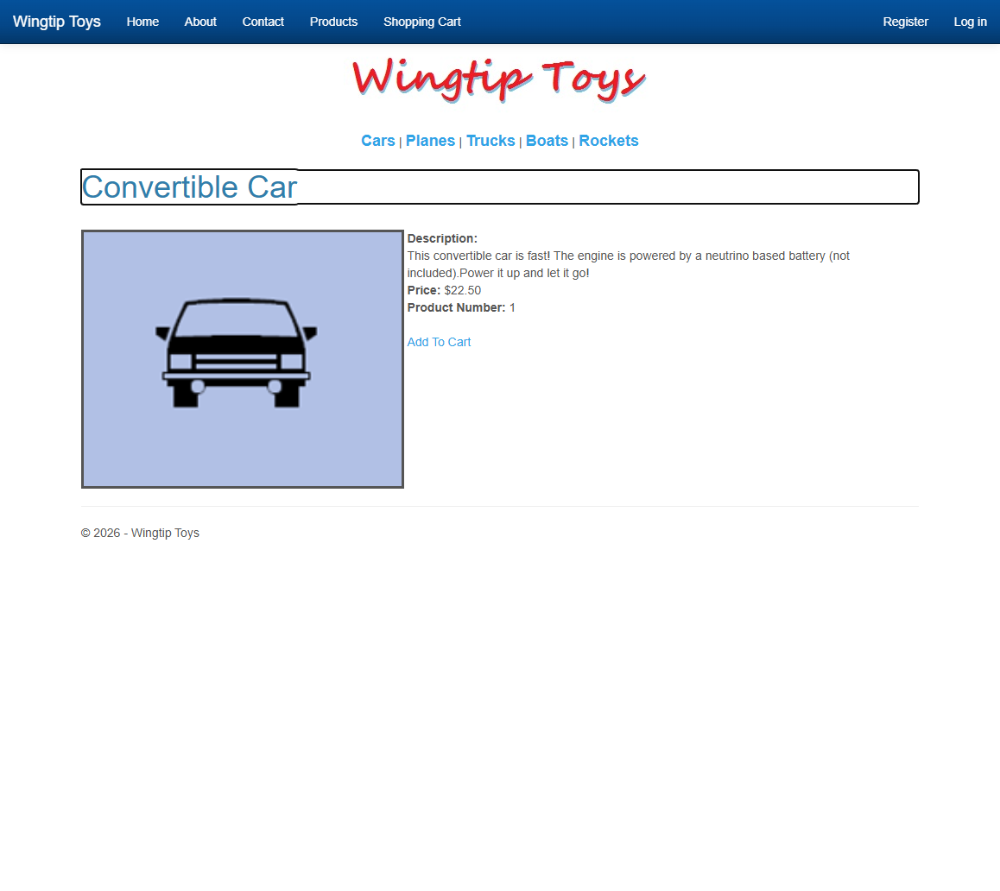
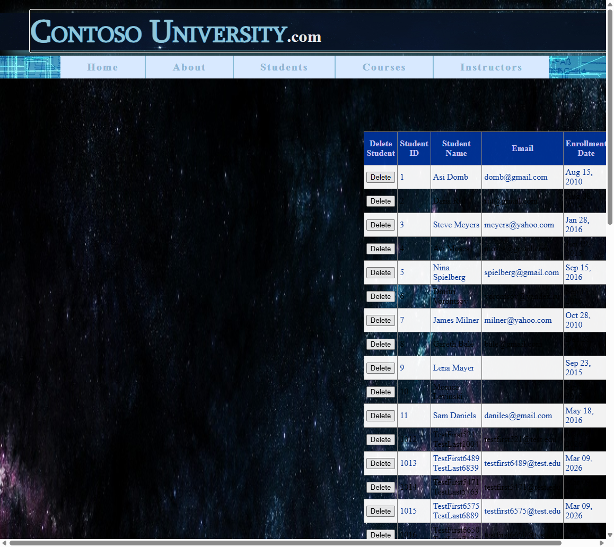
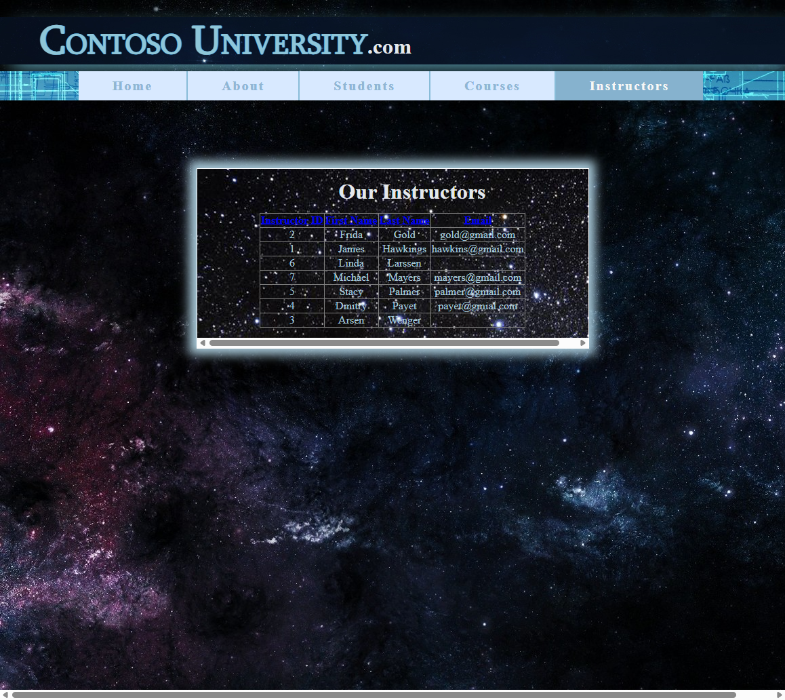

# BlazorWebFormsComponents Migration Toolkit — Executive Summary

### Automated Web Forms → Blazor Migration at Scale

---

## Executive Overview

**40 benchmark runs. 65 acceptance tests. Zero build errors. Sub-2-second migrations.**

| | WingtipToys | ContosoUniversity |
|--|:-----------:|:-----------------:|
| **Perfect runs** | 8 consecutive (25/25) | 8 total (40/40) |
| **Best L1 time** | 1.51s — 348 transforms | 0.59s — 72 transforms |
| **Latest build** | 0 errors ✅ | 0 errors ✅ |

The highlights from 8 days of continuous iteration:

- **Run 21** — SelectMethod preservation validated end-to-end. L1 keeps the attribute, L2 converts to typed `SelectHandler<ItemType>` delegates. Zero manual rewiring.
- **Run 20** — First zero-error L1→L2 pipeline. 32 Web Forms files → buildable Blazor app, no human intervention between layers.
- **Run 19** — SQL Server LocalDB auto-detected from `Web.config`. L1's new `Find-DatabaseProvider` scaffolds the correct EF Core provider package automatically.
- **Run 18** — GridView ShoppingCart breakthrough. `<asp:GridView>` with BoundField, TemplateField, TextBox, CheckBox → pixel-perfect Blazor `<GridView>`.

All of this is powered by a **drop-in replacement strategy**: BWFC components share the same names, same attributes, and produce the same HTML as their Web Forms counterparts. Existing CSS, JavaScript, and visual designs carry forward unchanged. The migration task reduces to removing `asp:` prefixes — and the toolkit automates even that.

---

## Why Drop-In Replacement Works

Most migration tools rewrite everything from scratch or generate code that "looks similar" but requires extensive rework. Both discard the years of investment teams have made in CSS, JavaScript, and visual design.

BWFC's approach: **Blazor components with the same names, same attributes, and same HTML output as Web Forms controls.** `<asp:GridView>` → `<GridView>`. `<asp:Button>` → `<Button>`. Identical HTML output means existing CSS produces pixel-perfect results. The shopping cart below — powered by BWFC's `<GridView>`, `<BoundField>`, `<TemplateField>`, `<TextBox>`, and `<CheckBox>` — is visually indistinguishable from the original.

Three advantages over rewrite approaches:

1. **Risk elimination** — Migrate page by page. Existing design and functionality remain intact at every step.
2. **Cost reduction** — CSS, JavaScript, and visual QA preserved automatically. Engineering work is only at the component layer.
3. **Speed** — Layer 1 migrates a full application's markup in under 2 seconds.

---

## Results at a Glance

| Metric | WingtipToys | ContosoUniversity | **Combined** |
|--------|:-----------:|:-----------------:|:------------:|
| **Benchmark Runs** | 21 | 19 | **40** |
| **Acceptance Tests** | 25 | 40 | **65** |
| **Perfect Runs (100%)** | 8 consecutive | 8 total | **16** |
| **Best Layer 1 Time** | **1.51s** | **0.59s** | — |
| **Layer 1 Manual Fixes** | 0 (8 consecutive) | 0 (latest) | **0** |
| **Layer 2 Fixes (stable)** | 3 | ~3 | **~6** |
| **Render Mode** | SSR | SSR | — |
| **Control Usages Migrated** | 348 across 31 types | 72 across 8 types | **420+** |
| **SelectMethod Preserved** | ✅ Native delegates | Items= binding | — |
| **Build Errors (latest)** | 0 | 0 | **0** |
| **L1 Provider Detection** | — | ✅ SQL Server auto-detected | — |

> **Key takeaway:** Zero Layer 1 manual fixes for 8+ consecutive runs across both projects. Run 21 validated SelectMethod preservation — L1 keeps the attribute, L2 converts to typed delegates — eliminating an entire class of manual rewiring. Run 19 confirmed SQL Server LocalDB auto-detection via L1's new `Find-DatabaseProvider` function. All latest builds succeed with 0 errors.

---

## Performance Progression

### Layer 1 Execution Time — WingtipToys

### Layer 1 Execution Time — ContosoUniversity

### Migration Performance Improvement

### Summary of Performance Gains

| Project | First Run | Best Run | Latest Run | Improvement |
|---------|:---------:|:--------:|:----------:|:-----------:|
| **WingtipToys** | 3.3s (Run 1) | **1.51s** (Run 18) | 1.79s (Run 21) | **54%** |
| **ContosoUniversity** | 1.50s (Run 1) | **0.59s** (Run 17) | 0.62s (Run 19) | **61%** |

Layer 1 manual fixes dropped from "not tracked" in early runs to **0 for 8+ consecutive runs** — a complete elimination of manual markup intervention. Recent runs (WT 20–21, CU 19) trade marginal L1 time for richer transforms — SelectMethod preservation and database provider detection add processing without requiring human intervention.

---

## Visual Fidelity — Side-by-Side Comparisons

The migration toolkit's drop-in replacement strategy produces visually identical output. The following screenshots demonstrate that migrated Blazor pages match the original Web Forms rendering.

### WingtipToys — Web Forms vs. Blazor (Run 1 Comparisons)

| Page | Comparison |
|------|------------|
| **Home Page** |  |
| **Product List** |  |
| **Shopping Cart** |  |

> These side-by-side comparisons from Run 1 show the toolkit producing matching visual output from the very first benchmark — before any optimization or tuning.

### WingtipToys — Latest Blazor Screenshots (Run 18 — GridView Breakthrough)

Run 18 represents the culmination of the WingtipToys migration: the **ShoppingCart page now renders using BWFC's `<GridView>` component** with `<BoundField>`, `<TemplateField>`, `<TextBox>`, and `<CheckBox>` — the exact same component model as the original Web Forms `<asp:GridView>`. Previous runs used a stubbed HTML table; Run 18 delivers the real thing.

| Page | Screenshot |
|------|------------|
| **Home** |  |
| **Products** |  |
| **Shopping Cart (GridView)** |  |
| **Product Details** |  |

> **Shopping Cart highlight:** The GridView renders column headers (ID, Name, Price, Quantity, Item Total, Remove Item), editable `<TextBox>` quantity fields, `<CheckBox>` removal controls, computed line totals, and an order total — all from BWFC components that produce the same HTML as `asp:GridView`. CSS styling, PayPal checkout button, and layout are preserved pixel-perfect.

### ContosoUniversity — Blazor Screenshots (Run 15 Visual Reference)

| Page | Screenshot |
|------|------------|
| **Home** |  |
| **Students** |  |
| **Courses** |  |
| **Instructors** |  |
| **About** |  |

> ContosoUniversity pages render with full data binding, sorting, filtering, and CRUD operations — all migrated from Web Forms GridView and DetailsView controls. Screenshots are from Run 15; the latest Run 19 validated SQL Server LocalDB preservation with 0 build errors, 72 transforms, and 5 BLL classes created — confirming that the visual output and data layer remain correct with the original database provider intact.

---

## Key Milestones

| Run | Date | Milestone | Impact |
|-----|------|-----------|--------|
| **WT Run 1** | 2026-03-04 | First automated migration benchmark | Baseline established: 230 control usages across 31 types, L1 in 3.3s |
| **WT Run 8** | 2026-03-06 | First 100% acceptance pass (14/14 tests) | Proved end-to-end migration is achievable |
| **WT Run 9** | 2026-03-06 | Visual regression discovered | Led to 11 new visual integrity tests — raised the bar to 25 tests |
| **WT Run 11** | 2026-03-07 | ListView + Scripts/ gaps identified | Script fixes shipped: `Invoke-ScriptAutoDetection`, `Convert-TemplatePlaceholders` |
| **WT Run 12** | 2026-03-08 | **First perfect score (25/25)** | All 25 acceptance tests pass — markup, data, auth, and visual fidelity |
| **WT Run 13** | 2026-03-08 | **SSR breakthrough** | Static Server Rendering eliminated HttpContext/SignalR problems entirely |
| **WT Run 14** | 2026-03-08 | **Layer 1 zero-touch achieved** | 0 manual fixes for the first time — fully autonomous markup migration |
| **WT Run 16** | 2026-03-08 | **Layer 2 automation begins** | Program.cs auto-generated; automation crosses into semantic territory |
| **WT Run 17** | 2026-03-09 | Genericized toolkit validated | L1 at 1.81s (28% faster); toolkit works across projects without modification |
| **WT Run 18** | 2026-03-11 | **GridView ShoppingCart breakthrough** | ShoppingCart now uses `<GridView>` with BoundField/TemplateField — last stubbed page resolved. 314 transforms, 1.51s L1 |
| **WT Run 20** | 2026-03-11 | **Zero-error build, L1+L2 pipeline** | Full pipeline (L1 → L2) produces 0-error build. 348 transforms, 0 stubs, 1.70s L1, ~25 min L2 |
| **WT Run 21** | 2026-03-11 | **SelectMethod preservation validated** | L1 preserves SelectMethod → L2 converts to typed delegates. 0 errors, 44 files transformed, ~28 min total |
| **CU Run 1** | 2026-03-08 | ContosoUniversity benchmark begins | Database-first EF6 + AJAX patterns validated; 31/40 on first attempt |
| **CU Run 5** | 2026-03-09 | **First Contoso perfect score (40/40)** | SQL Server LocalDB + InteractiveServer per-page opt-in |
| **CU Run 17** | 2026-03-10 | Best Contoso run: 0.59s L1, 40/40 | LocalDB wait/retry feature; git restore workflow for code-behind |
| **CU Run 19** | 2026-03-11 | **SQL Server preservation validated** | L1 `Find-DatabaseProvider` auto-detects provider from Web.config. 0 errors, 0.62s L1, 229 output files |

> From first benchmark to eighth consecutive perfect score in **8 days**. Each run produced actionable data that directly improved the next. The latest runs (20–21, CU 19) validated two critical features: SelectMethod delegate preservation and database provider auto-detection.

---

## Two-Layer Pipeline Architecture

The migration toolkit separates concerns into two distinct layers, each optimized for its class of transformation.

### Layer 1 — Mechanical Transformation

**What it does:** Regex-based markup conversion — deterministic, fast, zero-touch.

- Removes `asp:` prefixes and `runat="server"` attributes
- Converts data-binding expressions (`<%# Eval("Name") %>` → `@context.Name`)
- Maps Web Forms attributes to Blazor parameters
- Copies static assets (CSS, JS, images, fonts) to `wwwroot/`
- Converts template placeholders to Blazor `RenderFragment` patterns
- Auto-detects and preserves `<script>` references
- **`Find-DatabaseProvider`** — auto-detects database provider from `Web.config` `<connectionStrings>` and scaffolds the correct EF Core provider package (e.g., SQL Server, SQLite, PostgreSQL). Emits a `[DatabaseProvider]` review item for L2 verification.

**Performance:** 1.51s for 314 transforms (WingtipToys Run 18) · 1.70s for 348 transforms (Run 20, zero-error pipeline) · 1.79s for 348 transforms (Run 21, with SelectMethod preservation) · 0.59s for 78 transforms (ContosoUniversity Run 17) · 0.62s for 72 transforms (ContosoUniversity Run 19, with provider detection)

### Layer 2 — Semantic Transformation

**What it does:** Context-aware code transformations requiring understanding of application structure.

- Generates `Program.cs` with correct DI registrations, database configuration, and auth setup
- Converts code-behind files from `System.Web.UI.Page` inheritance to Blazor component models
- Handles authentication form rewiring (cookie auth, Identity integration)
- Applies SSR-specific patterns (streaming, enhanced navigation)

**Current state:** Pattern C (Program.cs) fully automated. Patterns A (code-behinds) and B (auth forms) use known-good overlays pending full automation.

### Why Two Layers Work

Separating mechanical transforms from semantic ones enables **independent iteration**. Layer 1 has been stable for 6 runs while Layer 2 continues advancing. Each layer can be tested, timed, and optimized without affecting the other. The result is a pipeline that is both **fast** (sub-2-second L1) and **extensible** (new semantic patterns added without touching L1).

---

## Test Project Coverage

The toolkit has been validated against two architecturally distinct Web Forms applications that together cover the breadth of real-world migration scenarios.

| Aspect | WingtipToys | ContosoUniversity |
|--------|:-----------:|:-----------------:|
| **Application Type** | E-commerce platform | Academic management |
| **Pages** | ~15 pages (32 markup files) | 5 pages + 1 master page |
| **Control Usages** | 348 across 31 types | 40+ across 8 types |
| **Data Access** | Code-First EF6 | Database-First EF6 (.edmx) |
| **AJAX Controls** | None | UpdatePanel, ScriptManager, AutoCompleteExtender |
| **Authentication** | ASP.NET Identity (login, register, cart) | None |
| **Key Challenge** | Auth/cookie handling in SSR mode | EF6 .edmx scaffolding + AjaxControlToolkit |
| **Acceptance Tests** | 25 (functional + visual integrity) | 40 (functional + CRUD + navigation) |
| **Benchmark Runs** | 21 | 19 |
| **Best Result** | 25/25, 1.51s L1, GridView ShoppingCart | 40/40, 0.59s L1, Run 19 SQL Server preservation |

**WingtipToys** exercises the full complexity of a production e-commerce application: product catalogs, a **GridView-powered shopping cart** with cookie-based state and editable quantities, user authentication with ASP.NET Identity, category filtering, and complex ListView/GridView/FormView patterns. Run 18 achieved the breakthrough of migrating the ShoppingCart page from a stubbed HTML table to a fully functional `<GridView>`. Run 20 delivered the **first zero-error L1→L2 pipeline** with 0 stubs. Run 21 then validated **SelectMethod preservation** — L1 keeps the attribute in markup, L2 converts it to a typed `SelectHandler<ItemType>` delegate — with all 3 core product/cart pages using `SelectHandler<ItemType>` delegates and 0 TODOs in product catalog, shopping cart, or layout pages. The 6 remaining TODOs are confined to account/payment pages (out of scope for BWFC).

**ContosoUniversity** validates a fundamentally different architecture: database-first Entity Framework with `.edmx` models, UpdatePanel-based AJAX interactions, and server-side data operations. Run 19 confirmed SQL Server LocalDB preservation — L1's `Find-DatabaseProvider` auto-detected the provider from `Web.config`, producing 229 output files with 5 BLL classes and 0 build errors. It proves the toolkit generalizes beyond a single application pattern and correctly handles database provider fidelity.

---

## What's Next

- **Layer 2 Full Automation:** Complete Pattern A (code-behind conversion) and Pattern B (auth form rewiring) to achieve end-to-end zero-touch migration for both test projects
- **SelectMethod Ecosystem:** ✅ Core delegate conversion validated (Run 21). Next: expand to InsertMethod, UpdateMethod, and DeleteMethod with the same preserve-then-convert pattern
- **ContosoUniversity SelectMethod Re-run:** Run 19 used Items= binding (skills were fixed after that run). Re-run CU with corrected skills to validate SelectMethod as `SelectHandler<ItemType>` delegates
- **Acceptance Test Validation:** Run acceptance tests against ContosoUniversity Run 19 output to confirm functional correctness with SQL Server LocalDB
- **Additional Test Projects:** Expand validation to applications with Web API integration, SignalR hubs, and third-party control libraries to broaden coverage
- **Migration Time Target:** Drive total end-to-end migration (L1 + L2 + build + test) under 5 minutes for medium-complexity applications

---

Generated from 40 benchmark runs across WingtipToys (21 runs) and ContosoUniversity (19 runs). All data sourced from individual run reports in `dev-docs/migration-tests/`. Last updated: 2026-03-12.
