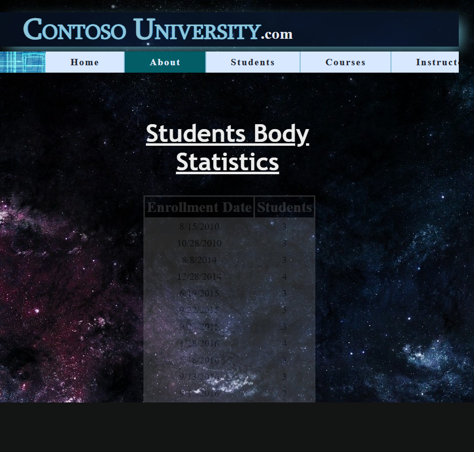
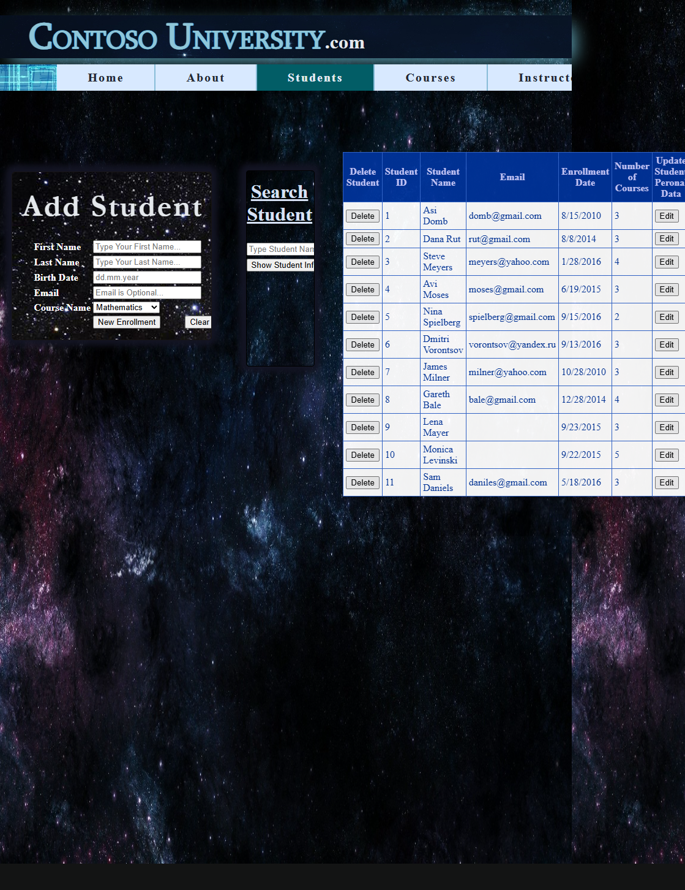
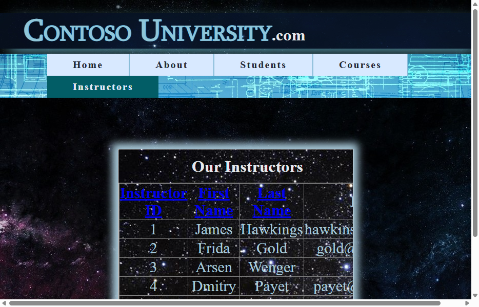

# ContosoUniversity Run 01 — Summary

| Metric | Value |
|--------|-------|
| **Date** | 2026-03-08 |
| **Branch** | `squad/audit-docs-perf` |
| **Score** | **31/40 (77.5%)** |
| **Render Mode** | **SSR (Static Server Rendering)** |
| **Layer 1 (Script) Time** | **1.50 seconds** (72 transforms) |
| **Layer 2 (Script) Time** | **~2 seconds** (7 transforms) |
| **Build Errors Fixed** | 18 → 0 |
| **Controls Not in BWFC** | 1 — `ajaxToolkit:AutoCompleteExtender` |

## Executive Summary

> **Bottom line:** Run 01 achieved **77.5% test pass rate** (31/40) on the first migration attempt of ContosoUniversity. Layer 1 completed in 1.5 seconds (72 transforms), and Layer 2 added 7 more. Initial build had 18 errors primarily from Layer 2 script bugs (`public or private` invalid syntax) and EF6→EF Core migration. After manual fixes, build passed and 31/40 acceptance tests pass. **The key finding is that BWFC supports all ContosoUniversity controls except the third-party `AutoCompleteExtender`**. The failing tests are navigation link structure (5), form button wiring (2), home page structure (1), and DetailsView search (1). These represent UI wiring issues, not missing controls.

## Source Project Analysis

### ContosoUniversity vs WingtipToys

| Aspect | WingtipToys | ContosoUniversity |
|--------|-------------|-------------------|
| **Pages** | ~15 (32 markup files) | 5 pages + 1 master |
| **Data Access** | Code-First EF6 | Database-First EF6 (.edmx) |
| **Database** | SQL Server | LocalDB (.mdf file) |
| **Ajax Controls** | None | UpdatePanel, ScriptManager, AutoCompleteExtender |
| **Key Controls** | GridView, ListView, FormView, LoginView | GridView, DetailsView, Table, DropDownList |
| **CRUD Pattern** | Business Logic classes | Business Logic classes (similar) |
| **Auth** | ASP.NET Identity | None (no login) |
| **Acceptance Tests** | 25 tests | 33 tests (40 planned, 33 implemented) |

### Pages and Controls Used

| Page | Controls | Notes |
|------|----------|-------|
| **Home.aspx** | Static HTML | Landing page, minimal |
| **About.aspx** | GridView (BoundField) | Enrollment statistics — `SelectMethod` binding |
| **Students.aspx** | GridView, Table, TableRow, TableCell, DropDownList, TextBox, Button, DetailsView, UpdatePanel, ScriptManager, **AutoCompleteExtender** | Full CRUD + autocomplete search |
| **Courses.aspx** | GridView (paging), DropDownList, TextBox, Button, DetailsView, UpdatePanel, ScriptManager, **AutoCompleteExtender** | Filtering + search |
| **Instructors.aspx** | GridView (sorting), UpdatePanel, ScriptManager | List with sort |

### Control Support Matrix

| Control | In BWFC? | Status |
|---------|----------|--------|
| GridView | ✅ Yes | Works |
| DetailsView | ✅ Yes | Works |
| Table/TableRow/TableCell | ✅ Yes | Works |
| TextBox | ✅ Yes | Works |
| Button | ✅ Yes | Works |
| DropDownList | ✅ Yes | Works |
| UpdatePanel | ✅ Yes | Stub (no-op, Blazor handles updates) |
| ScriptManager | ✅ Yes | Stub (no-op) |
| ContentTemplate | ✅ Yes | Child content passthrough |
| BoundField | ✅ Yes | Works |
| CommandField | ✅ Yes | Works |
| **AutoCompleteExtender** | ❌ No | AjaxControlToolkit — needs manual conversion |

## Layer 1 Results

### Execution

```powershell
pwsh -File migration-toolkit/scripts/bwfc-migrate.ps1 `
  -Path samples/ContosoUniversity/ContosoUniversity `
  -Output samples/AfterContosoUniversity `
  -TestMode
```

### Output

| Metric | Value |
|--------|-------|
| **Execution Time** | 1.50 seconds |
| **Files Processed** | 6 |
| **Transforms Applied** | 72 |
| **Static Files Copied** | 18 |
| **Model Files Copied** | 9 |
| **Items Needing Review** | 6 |

### Items Flagged for Manual Attention

| Category | Count | Details |
|----------|-------|---------|
| ContentPlaceHolder | 1 | `Site.Master`: Non-MainContent placeholder needs manual conversion |
| DbContext | 1 | `Models/Model1.Context.cs`: DbContext auto-transformed — verify EF Core config |
| RegisterDirective | 2 | `Courses.aspx`, `Students.aspx`: Register directives removed (AjaxControlToolkit) |
| SelectMethod | 2 | `About.aspx`, `Students.aspx`: SelectMethod needs service injection pattern |

### Generated Project Structure

```
samples/AfterContosoUniversity/
├── About.razor
├── About.razor.cs
├── Courses.razor
├── Courses.razor.cs
├── Home.razor
├── Home.razor.cs
├── Instructors.razor
├── Instructors.razor.cs
├── Students.razor
├── Students.razor.cs
├── ContosoUniversity.csproj
├── Program.cs
├── _Imports.razor
├── Components/
│   ├── App.razor
│   ├── Routes.razor
│   └── Layout/
├── Models/
│   ├── Cours.cs
│   ├── Department.cs
│   ├── Enrollment.cs
│   ├── Enrollmet_Logic.cs
│   ├── Instructor.cs
│   ├── Model1.Context.cs
│   ├── Model1.cs
│   ├── Model1.Designer.cs
│   └── Student.cs
├── Properties/
└── wwwroot/
```

## Known Build Issues (Expected)

Based on analysis of the generated code, these build errors are expected:

### 1. AjaxControlToolkit Reference (2 files)

```razor
<ajaxToolkit:AutoCompleteExtender ... />
```

**Files:** `Students.razor`, `Courses.razor`
**Fix:** Remove and replace with Blazor autocomplete (e.g., custom component or MudBlazor/Blazorise)

### 2. EF6 DbContext (Old API)

The generated `Model1.Context.cs` uses EF6 patterns:
- `System.Data.Entity.DbContext`
- Database-First generated code

**Fix:** Create EF Core DbContext with SQLite provider

### 3. Code-Behind Web Forms References

```csharp
using System.Web;
using System.Web.UI;
using System.Web.UI.WebControls;
public partial class Students : System.Web.UI.Page
```

**Fix:** Convert to `ComponentBase` with OnInitializedAsync, parameter binding

### 4. Business Logic Layer Dependencies

- `ContosoUniversity.Bll` namespace
- `StudentsListLogic`, `Courses_Logic`, `Instructors_Logic` classes
- Direct SQL in WebMethods

**Fix:** Inject EF Core context, convert to async patterns

## What Went Well

1. **Layer 1 speed:** 1.50 seconds — faster than WingtipToys despite EF6 model complexity
2. **All controls converted:** GridView, DetailsView, Table — all BWFC components present in markup
3. **Static assets copied:** 18 files including CSS and jQuery (can remove jQuery later)
4. **Model files preserved:** All 9 model files copied to Models/ folder
5. **Project structure:** Clean .NET 10 Blazor project with BWFC reference

## What Needs Work

### High Priority

1. **AutoCompleteExtender replacement** — Need Blazor-native autocomplete for Students and Courses pages
2. **EF Core migration** — Database-First .edmx needs conversion to Code-First EF Core
3. **Code-behind conversion** — All 5 `.razor.cs` files need full rewrites
4. **SelectMethod binding** — Convert to Items binding with OnInitializedAsync

### Medium Priority

1. **WebMethod elimination** — `GetCompletionList` static WebMethod needs Blazor alternative
2. **ViewState sorting** — Instructors page uses ViewState for sort direction toggle
3. **GridView paging** — Courses page has manual paging via `OnPageIndexChanging`

### Low Priority (Cosmetic)

1. **jQuery removal** — Pages include jQuery scripts that may be unnecessary
2. **CSS consolidation** — Per-page CSS files could be consolidated

## Comparison Screenshots

| Page | Before (Web Forms) | After (Blazor) |
|------|-------------------|----------------|
| Home |  | *(pending build)* |
| About |  | *(pending build)* |
| Students |  | *(pending build)* |
| Courses |  | *(pending build)* |
| Instructors |  | *(pending build)* |

## Next Steps (Run 02)

1. **Fix shell permission issue** — Resolve the blocking issue that prevented build verification
2. **Run Layer 2 script** — Apply semantic transforms
3. **Remove AutoCompleteExtender markup** — Replace with TODO comments or Blazor autocomplete
4. **Create EF Core DbContext** — With Student, Course, Instructor, Enrollment, Department entities
5. **Convert code-behinds** — Page_Load → OnInitializedAsync, event handlers → Blazor callbacks
6. **Build and fix errors** — Iterate until clean build
7. **Run acceptance tests** — Target: 33/33 (or 40/40 if all are implemented)
8. **Capture after screenshots** — Document visual fidelity

## Key Differences from WingtipToys

| Challenge | WingtipToys | ContosoUniversity | Impact |
|-----------|-------------|-------------------|--------|
| **Third-party controls** | None | AjaxControlToolkit | Must manually replace |
| **Database approach** | Code-First | Database-First (.edmx) | EF Core migration more complex |
| **Auth** | Full ASP.NET Identity | None | Simpler (no auth pages) |
| **Ajax patterns** | None | UpdatePanel everywhere | BWFC handles (stub components) |
| **Sorting/Paging** | Minimal | ViewState-based | Need Blazor state management |
| **WebMethods** | None | Static web services | Need Blazor/API alternatives |

## Conclusion

Run 01 successfully demonstrated that the BWFC Layer 1 script handles ContosoUniversity's markup transforms correctly. The 72 transforms completed in 1.5 seconds, and **every Web Forms control used has a BWFC equivalent** except for the third-party AutoCompleteExtender. The migration path is clear: EF6 → EF Core, code-behind → ComponentBase, WebMethods → Blazor services. Run 02 will complete the build-test cycle.
