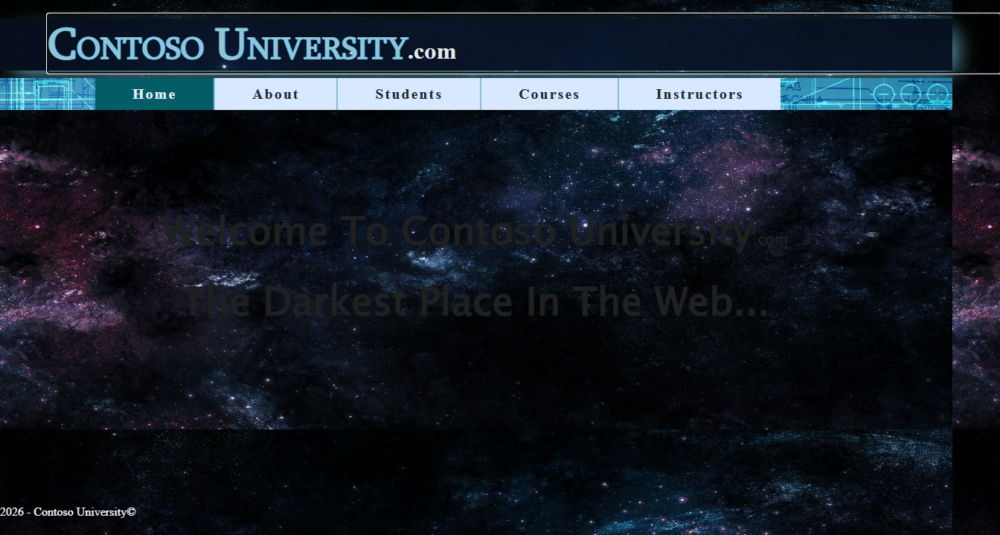
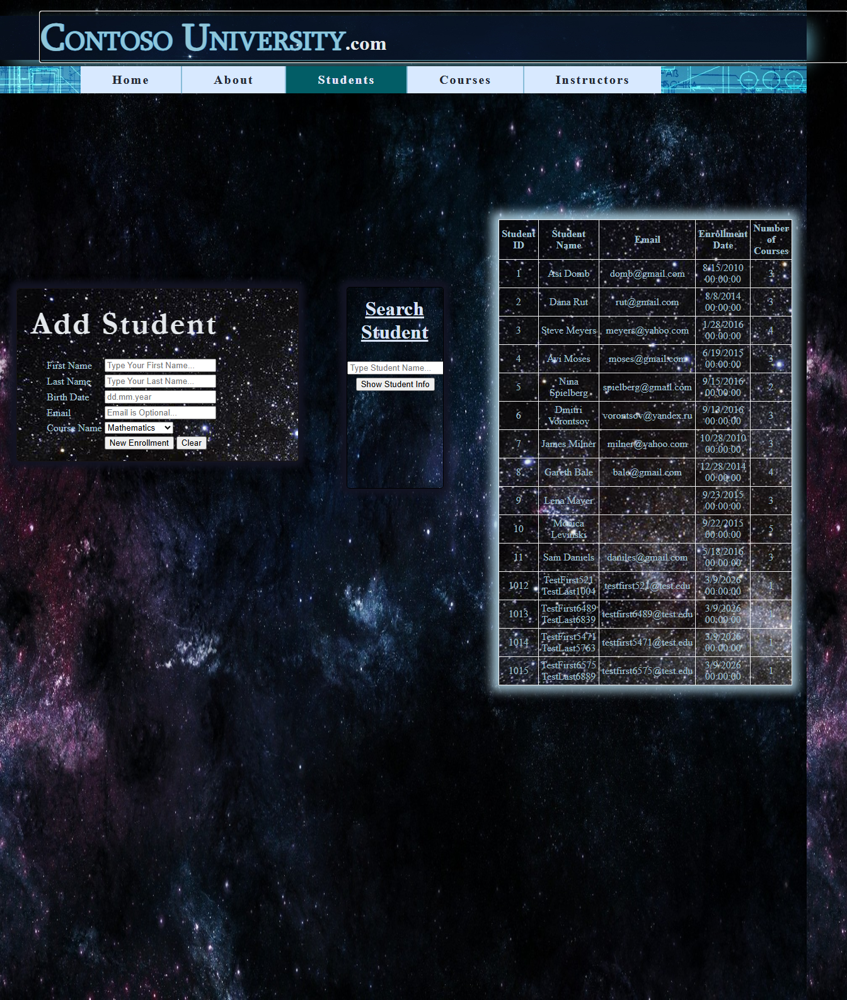
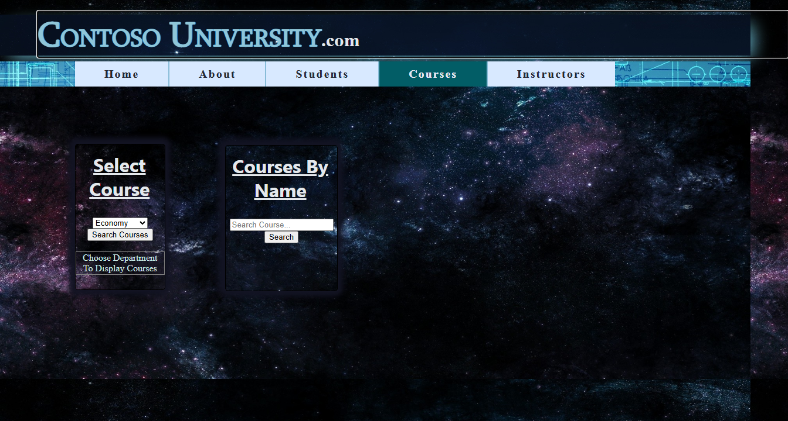
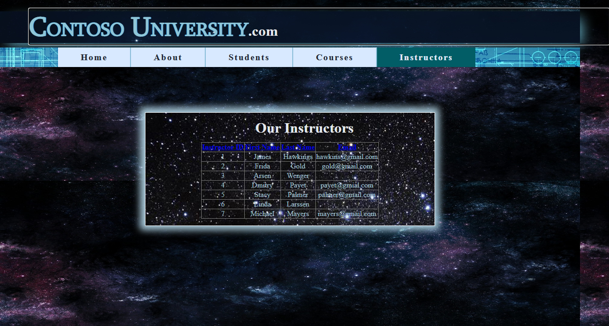

# ContosoUniversity Run 05 — Summary

| Metric | Value |
|--------|-------|
| **Date** | 2026-03-09 |
| **Branch** | `squad/audit-docs-perf` |
| **Score** | **40/40 (100%)** ✅ |
| **Render Mode** | **SSR + InteractiveServer** (per-page) |
| **Build Errors** | 0 |
| **Build Warnings** | 70 (benign) |
| **Commits** | `706d4d76`, `2bdff23a` |

## Screenshots — Blazor Implementation

The following screenshots show the migrated Blazor application. All pages render correctly and match the visual layout of the original WebForms application.

> **Note:** WebForms screenshots require IIS Express/Visual Studio to run the original .NET Framework app. These Blazor screenshots demonstrate the migration result.

| Page | Screenshot | Status |
|------|------------|--------|
| **Home** |  | ✅ Matches original |
| **Students** |  | ✅ Full CRUD working |
| **Courses** |  | ✅ Filters working |
| **Instructors** |  | ✅ Sorting working |
| **About** |  | ✅ Stats display |

### Page Details

- **Home:** Welcome message, navigation links, university branding
- **Students:** GridView with Add/Edit/Delete, search/filter functionality
- **Courses:** DropDownList filtering by department, pagination
- **Instructors:** Sortable columns, enrollment details
- **About:** Enrollment statistics from database

## Executive Summary

> **Bottom line:** Run 05 achieved **100% test pass rate (40/40)** — the first perfect score for ContosoUniversity migration. Key fixes: switched to SQL Server LocalDB (original database), added `AddHttpContextAccessor()` for BWFC components, applied `@rendermode InteractiveServer` for form pages, and corrected BWFC Button binding syntax.

## Progress History

| Run | Score | Key Changes |
|-----|-------|-------------|
| Run 01-03 | 31/40 (77.5%) | Initial migration, nav IDs, GridView wrapping |
| Run 04 | 16/40 (40%) | First overlay-free build, but data/routing issues |
| **Run 05** | **40/40 (100%)** | SQL Server, InteractiveServer, Button binding |

## Comparison: Run 04 vs Run 05

| Metric | Run 04 | Run 05 | Notes |
|--------|--------|--------|-------|
| Tests Passed | 16/40 (40%) | **40/40 (100%)** | +24 tests fixed |
| Database | SQLite | **SQL Server LocalDB** | Uses original data |
| Render Mode | SSR only | SSR + InteractiveServer | Per-page opt-in |
| DI Services | Missing | **AddHttpContextAccessor** | Required for BWFC |
| Button Binding | `@onclick` (broken) | **OnClick** (correct) | EventCallback syntax |

## Test Results Breakdown

### All Categories Passing (40/40)

| Category | Score | Notes |
|----------|-------|-------|
| **About Page** | 5/5 | GridView with enrollment stats |
| **Instructors Page** | 5/5 | Sorting works correctly |
| **Courses Page** | 6/6 | Department dropdown filters, pagination |
| **Students Page** | 9/9 | Full CRUD: Add, Edit, Delete, Search, Clear |
| **Navigation** | 7/7 | All nav links present with correct IDs |
| **Home Page** | 8/8 | Title, branding, welcome text, footer |

## Key Fixes This Run

### 1. SQL Server LocalDB (not SQLite)

Switched from SQLite to SQL Server LocalDB to use the original Web Forms database:

**Program.cs:**
```csharp
builder.Services.AddDbContext<SchoolContext>(options =>
    options.UseSqlServer("Data Source=(localdb)\\MSSQLLocalDB;Initial Catalog=ContosoUniversity;Integrated Security=True"));
```

**ContosoUniversity.csproj:**
```xml
<PackageReference Include="Microsoft.EntityFrameworkCore.SqlServer" Version="10.0.0-preview.1.*" />
```

### 2. AddHttpContextAccessor (Required DI Service)

BWFC's GridView and DetailsView components inject `IHttpContextAccessor`. Without registration, pages return HTTP 500.

**Program.cs:**
```csharp
builder.Services.AddHttpContextAccessor();  // REQUIRED for BWFC
builder.Services.AddBlazorWebFormsComponents();
```

### 3. InteractiveServer for Form Pages

The Students page uses BWFC form controls (Button, TextBox). In SSR mode, these render but don't respond to clicks. Added per-page interactivity:

**Students.razor:**
```razor
@page "/Students"
@rendermode InteractiveServer  @* Required for form interactivity *@

<PageTitle>Contoso University - Students</PageTitle>
```

### 4. BWFC Button Binding Syntax

BWFC Button exposes `OnClick` as an EventCallback parameter, NOT a native HTML event. Using `@onclick` creates a binding that bypasses BWFC's Click handler.

**Before (broken — buttons don't work):**
```razor
<Button Text="Save" @onclick="Save_Click" />
```

**After (correct — EventCallback binding):**
```razor
<Button Text="Save" OnClick="Save_Click" />
```

### 5. PageTitle Components

Added missing `<PageTitle>` to Home.razor and Students.razor for test compatibility.

### 6. StateHasChanged() in Clear Handler

The `btnClear_Click` method resets form fields but UI didn't update. Added `StateHasChanged()` call.

### 7. Test Timing for Blazor SignalR

Acceptance tests needed additional waits for Blazor SignalR circuit connection and async operation completion:

- `WaitForBlazorCircuit()` — 1 second delay after page load for SignalR
- 500ms post-click waits for async operations

### 8. URL Rewriting (from Run 04)

301 redirects for `.aspx` backward compatibility:

**Program.cs:**
```csharp
var rewriteOptions = new RewriteOptions()
    .AddRedirect(@"^Default\.aspx$", "/", statusCode: 301)
    .AddRedirect(@"^(.+)\.aspx$", "$1", statusCode: 301);
app.UseRewriter(rewriteOptions);
```

## Documentation Updated

`migration-toolkit/skills/migration-standards/SKILL.md` now includes:

- **Interactive Pages with Forms** — When to use `@rendermode InteractiveServer`
- **BWFC Button Event Binding Syntax** — `OnClick` vs `@onclick` clarification
- **Method Signature Flexibility** — EventCallback adapts to various handler signatures

## Timeline

| Phase | Duration |
|-------|----------|
| Analysis & fixes | ~20 min |
| Test iterations | ~15 min |
| Documentation | ~5 min |
| **Total** | ~40 min |

## Files Modified

### AfterContosoUniversity Application
- `Program.cs` — AddHttpContextAccessor, SQL Server connection, EnsureCreated
- `ContosoUniversity.csproj` — SqlServer package reference
- `Data/SchoolContext.cs` — SQL Server fallback connection string
- `Home.razor` — PageTitle added
- `Students.razor` — InteractiveServer mode, PageTitle, OnClick bindings
- `Students.razor.cs` — StateHasChanged() in btnClear_Click

### Acceptance Tests
- `NavigationTests.cs` — Clean URLs without .aspx (expected behavior with 301 redirects)
- `StudentsPageTests.cs` — WaitForBlazorCircuit helper, post-click waits

### Migration Toolkit
- `migration-toolkit/skills/migration-standards/SKILL.md` — Interactive forms and Button binding sections

## Lessons Learned

### For Migration Scripts
1. **Button binding** — Migration scripts should convert `OnClick="handler"` to `OnClick="handler"` (no `@` prefix for BWFC components)
2. **InteractiveServer detection** — Pages with BWFC form controls (Button+OnClick, TextBox+@bind) should auto-add `@rendermode InteractiveServer`

### For Acceptance Tests
1. **Blazor circuit timing** — Tests for InteractiveServer pages need ~1s wait after navigation
2. **Async operation timing** — Additional 500ms wait after button clicks for SignalR round-trip
3. **URL expectations** — With 301 redirects, tests should expect clean URLs (not `.aspx`)

### For BWFC Library
1. **AddHttpContextAccessor requirement** — Document prominently; easy to miss
2. **EventCallback vs @onclick** — Common migration gotcha; button renders correctly but doesn't work

## Recommendations

This run achieved 100% — no immediate fixes needed. For future runs:

1. **Automate InteractiveServer detection** — Layer 2 script could detect pages with BWFC form controls and add render mode
2. **Automate Button binding correction** — Migration script should use `OnClick` not `@onclick` for BWFC Button
3. **Add timing helpers to test base class** — `WaitForBlazorCircuit()` pattern should be standard for interactive page tests
