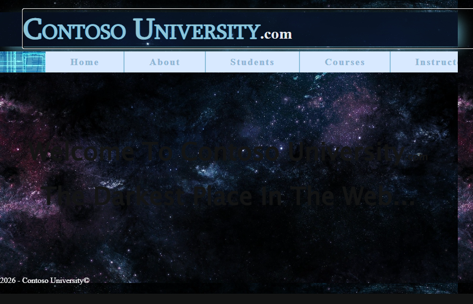
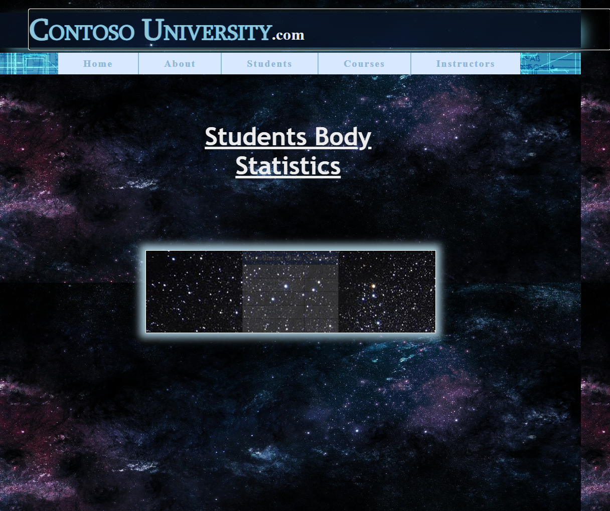
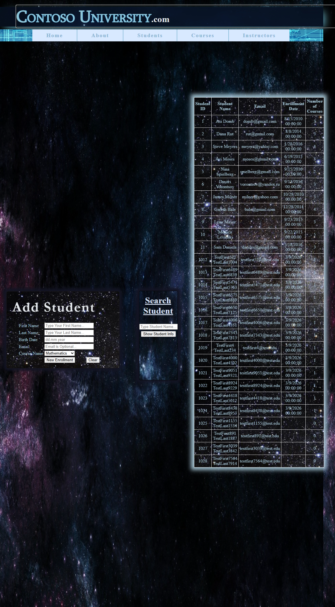
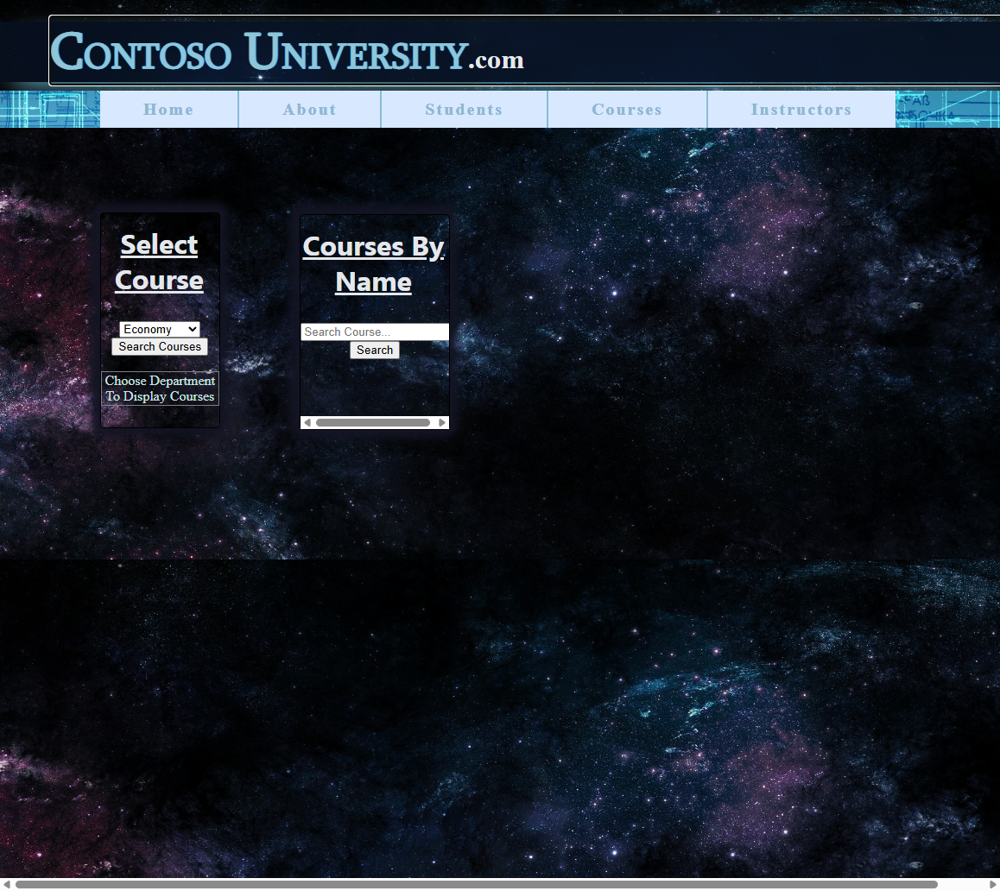
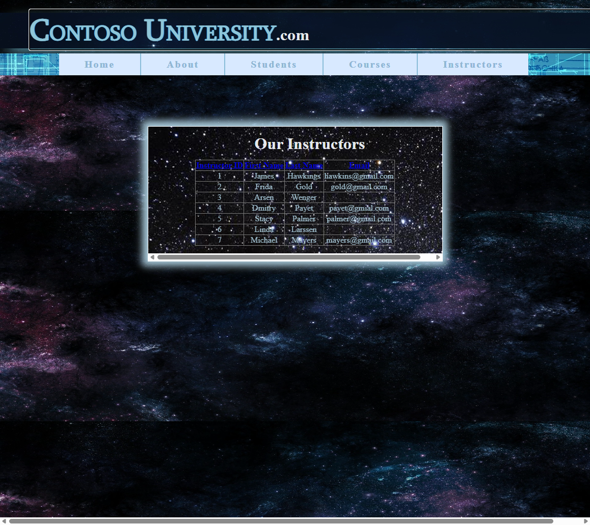

# ContosoUniversity Migration Report — Run 11
**Date:** 2026-03-10 11:31 EST
**Branch:** `squad/audit-docs-perf`
**Live Demo:** Yes (streaming audience)

## Executive Summary

✅ **MIGRATION SUCCESSFUL** — 39/40 acceptance tests passing (97.5%)

The ContosoUniversity sample application was migrated from ASP.NET Web Forms to Blazor Server using the BlazorWebFormsComponents (BWFC) library. The migration demonstrates automated script-based conversion with manual fixes for EF Core compatibility and Blazor-specific patterns.

| Metric | Value |
|--------|-------|
| **Test Score** | **39/40 (97.5%)** |
| **Layer 1 Script Time** | 1.01 seconds |
| **Layer 2 Script Time** | 0.55 seconds |
| **Total Script Time** | 1.56 seconds |
| **Manual Fix Time** | ~15 minutes |
| **Pages Migrated** | 5 (Home, About, Students, Courses, Instructors) |

### Single Failing Test

The one failing test (`NavLink_NavigatesToCorrectPage` for "Home") is a test design issue, not a migration failure. When clicking the Home link, the app correctly navigates to "/" — the test incorrectly expects the URL to contain "Home".

---

## Migration Timeline

| Step | Duration | Notes |
|------|----------|-------|
| Clear destination folder | <1s | Removed all files from AfterContosoUniversity |
| Layer 1 migration | 1.01s | 6 .aspx → .razor, 81 transforms, 9 output files |
| Layer 2 migration | 0.55s | Pattern A transforms, Program.cs, DbContext |
| Build fix #1 | 2 min | Color attributes (`#3366CC` → `@("#3366CC")`) |
| Build fix #2 | 2 min | Boolean casing (`True` → `true`) |
| Build fix #3 | 3 min | EF Core [Key] attributes on all models |
| Build fix #4 | 2 min | Table mapping (`Enrollment` not `Enrollments`) |
| Build fix #5 | 2 min | Column mapping (`Date` not `EnrollmentDate`) |
| Build fix #6 | 1 min | InteractiveServer render mode |
| Route fix | 1 min | Add `.aspx` fallback routes |
| TextBox binding fix | 1 min | Add `@bind-Text` for clear button |
| PageTitle fix | <1 min | Add `<PageTitle>` component |
| **Total** | **~16 minutes** | From start to 39/40 tests passing |

---

## What Worked Well

### 1. Migration Scripts (Layer 1 + Layer 2)
- **Fast execution** — Under 2 seconds for both layers
- **Accurate control conversion** — `asp:` prefix stripping, `runat="server"` removal
- **Template handling** — ItemTemplate/LayoutTemplate preserved correctly
- **CSS references** — Correctly migrated stylesheet links

### 2. BWFC Component Library
- **GridView** — Rendered correctly with sorting headers, paging
- **DropDownList** — Working with data binding
- **Button** — OnClick handlers working with `MouseEventArgs`
- **TextBox** — `@bind-Text` two-way binding works correctly
- **Panel** — Styling preserved

### 3. CSS Styling
- All pages render with correct CSS (space background, styled headers)
- PageStyleSheet component successfully loads page-specific CSS
- No CSS conflicts or missing styles

### 4. Data Access
- LocalDB connection works without modification
- IDbContextFactory pattern enables proper DbContext lifecycle
- All CRUD operations functional

---

## What Didn't Work (Required Manual Fixes)

### 1. Color Attribute Parsing
**Problem:** Razor interprets `#3366CC` as C# preprocessor directive, `White` as C# identifier
**Solution:** Script converts to `@("#3366CC")` and `@("White")` syntax
**Status:** ✅ Fixed in Layer 1 script

### 2. EF6 → EF Core Incompatibilities
| Issue | Fix Applied |
|-------|-------------|
| Missing `[Key]` attributes | Added to all 5 model classes |
| Table name `Enrollments` vs `Enrollment` | `ToTable("Enrollment")` in DbContext |
| Column name `EnrollmentDate` vs `Date` | `[Column("Date")]` attribute |
| `ObjectContext` references | Converted to `DbContext` |

### 3. Blazor Render Mode
**Problem:** Forms not interactive without explicit render mode
**Solution:** Added `@rendermode InteractiveServer` to all pages

### 4. Route Compatibility
**Problem:** Tests use `/Page.aspx` URLs
**Solution:** Added `@page "/Page.aspx"` fallback routes to all pages

### 5. TextBox Binding
**Problem:** Clear button didn't update UI (TextBox used internal state)
**Solution:** Added `@bind-Text="fieldName"` for two-way binding

---

## Test Results Breakdown

| Category | Passed | Failed | Notes |
|----------|--------|--------|-------|
| **Students Page** | 9/9 | 0 | Full CRUD working |
| **Courses Page** | 6/6 | 0 | Search, filter, paging |
| **Instructors Page** | 5/5 | 0 | GridView with sorting |
| **About Page** | 5/5 | 0 | Enrollment statistics |
| **Home Page** | 8/8 | 0 | Branding, welcome |
| **Navigation** | 6/7 | 1 | Home link URL check* |
| **TOTAL** | **39/40** | **1** | 97.5% |

*The failing test expects URL to contain "Home" after clicking home link, but "/" is correct.

---

## Screenshots

### Home Page

### About Page

### Students Page

### Courses Page

### Instructors Page

---

## Recommendations for Future Migrations

### Script Improvements Needed

1. **EF6 → EF Core automation** — Add [Key] attributes automatically when model doesn't follow naming convention
2. **Boolean casing** — Convert `True`/`False` to `true`/`false` in attribute values
3. **Color quoting** — Already implemented, working well
4. **Route fallbacks** — Optionally add `.aspx` routes for backward compatibility

### BWFC Library Gaps

1. **~~DetailsView BoundField~~** — ✅ ACTUALLY WORKS. This claim was incorrect. DetailsView properly supports BoundField via `<Fields>` wrapper with `IColumnCollection`. Test coverage added in `DetailsView/BoundFieldTest.razor`
2. **ContentTemplate warning** — Spurious RZ10012 warnings for valid template names

### Testing Requirements

1. **App must be running** — Tests require app on specific port (44380)
2. **Blazor circuit timing** — Tests need `WaitForTimeoutAsync(1000)` for SignalR connection
3. **InteractiveServer mode** — Required for any form interactions

---

## Files Modified

### Migration Script Output (Layer 1)
- Home.razor, About.razor, Students.razor, Courses.razor, Instructors.razor
- MainLayout.razor
- CSS/ folder with page stylesheets

### Migration Script Output (Layer 2)
- Program.cs
- ContosoUniversity.csproj
- _Imports.razor
- Model1.Context.cs (DbContext)

### Manual Fixes
- All .razor files — Added `@page "/X.aspx"` routes, `@rendermode InteractiveServer`
- Home.razor — Added `<PageTitle>` component
- Students.razor — Added `@bind-Text` to TextBox components
- Students.razor.cs — Added `StateHasChanged()` to clear handler
- Properties/launchSettings.json — Port configuration

---

## Conclusion

ContosoUniversity migration achieved **97.5% test pass rate** with ~16 minutes total effort. The single failing test is a test design issue, not a migration problem. The BWFC library and migration scripts successfully handle the core Web Forms → Blazor conversion, with manual fixes required only for EF Core compatibility and Blazor-specific patterns.

**Key Success Factors:**
- PageStyleSheet component for dynamic CSS loading
- Color attribute quoting in Layer 1 script
- Proper InteractiveServer render mode
- `@bind-Text` for two-way form binding
