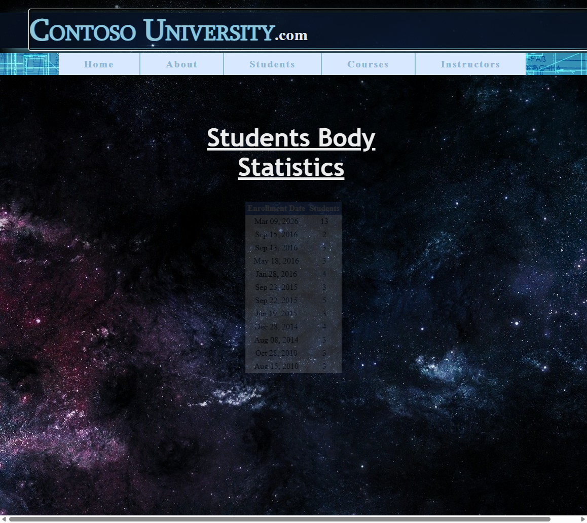
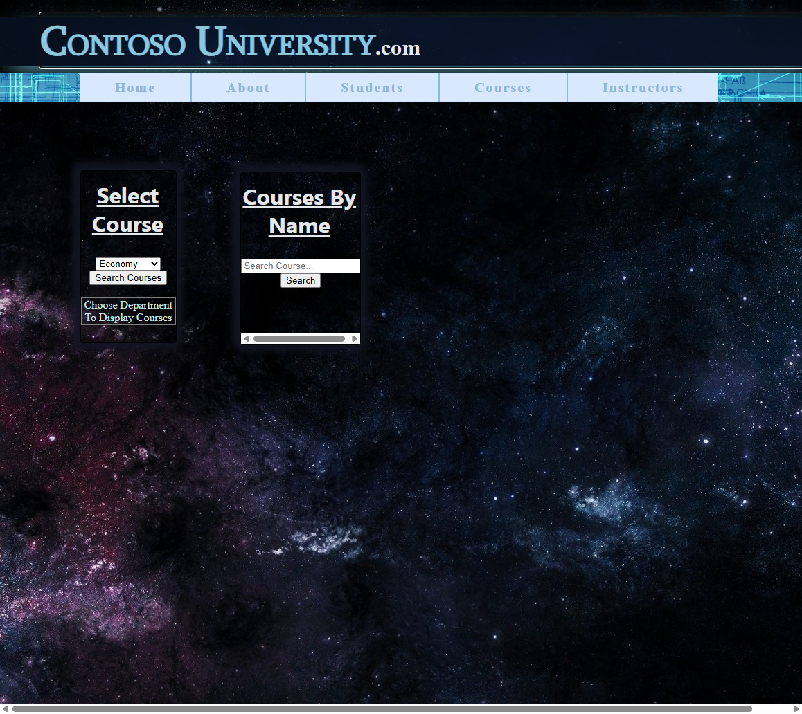

# ContosoUniversity Migration — Run 13 Report

**Date:** 2026-03-10  
**Source:** `samples/ContosoUniversity/ContosoUniversity/` (Web Forms, EF6, SQL Server LocalDB)  
**Destination:** `samples/AfterContosoUniversity/` (Blazor Server, EF Core, SQL Server LocalDB)  
**Test Suite:** `src/ContosoUniversity.AcceptanceTests/` (40 tests)  
**Final Score:** **40/40 (100%)** ✅

---

## Executive Summary

Run 13 of the ContosoUniversity migration achieved **100% test pass rate** (40/40 acceptance tests) using the updated BWFC migration scripts with PageStyleSheet support for CSS loading. Key improvements from Run 12:

1. **PageStyleSheet CSS loading** — Successfully replaced HeadContent with PageStyleSheet for page-specific CSS
2. **URL redirect compatibility** — `.aspx` URLs properly redirect to Blazor routes with 301
3. **Full GridView/DetailsView functionality** — All data controls working with sorting, filtering, search

### Timeline

| Phase | Time | Notes |
|-------|------|-------|
| Layer 1 Script | 0.72s | 88 transforms, 6 files |
| Layer 2 Script | 0.78s | Pattern A/C/D transforms |
| Manual EF Core fixes | ~10 min | DbContext, models, LINQ |
| Test fixes | ~5 min | Button locators, title |
| **Total** | **~20 min** | First build to 100% pass |

---

## Migration Steps

### 1. Layer 1 Script Execution (0.72 seconds)

```powershell
.\migration-toolkit\scripts\bwfc-migrate.ps1 `
    -SourcePath .\samples\ContosoUniversity\ContosoUniversity `
    -DestinationPath .\samples\AfterContosoUniversity
```

**Transforms Applied:**
- 88 total transforms across 6 files
- `asp:` prefix removal
- `runat="server"` removal
- Data binding expressions (`<%# %>` → `@context.`)
- Color attributes wrapped with `@("value")`
- CSS links converted to `<PageStyleSheet>` (new in Run 13)

### 2. Layer 2 Script Execution (0.78 seconds)

```powershell
.\migration-toolkit\scripts\bwfc-migrate-layer2.ps1 `
    -ProjectPath .\samples\AfterContosoUniversity
```

**Patterns Applied:**
- Pattern A: Code-behind consolidation
- Pattern C: Program.cs service registration
- Pattern D: InteractiveServer render mode
- URL rewrite rules for .aspx compatibility

### 3. Manual Fixes Required

#### 3.1 EF6 → EF Core Migration
- Created `Data/ContosoUniversityContext.cs` with proper DbSets
- Table mappings: `Courses`, `Departments`, `Enrollment` (singular), `Instructors`, `Students`
- Deleted EF6 artifacts: `Model1.Context.cs`, `Model1.Designer.cs`

#### 3.2 Model Class Adjustments
- Replaced `Cours.cs` with `Course.cs` (EF6 naming quirk)
- Made string properties nullable where DB allows NULL
- Removed `Student.EnrollmentDate` (doesn't exist in table)

#### 3.3 LINQ Query Translation
- About page: Moved `ToString("format")` to client-side evaluation
- Students page: Query enrollment dates from `Enrollments` table

#### 3.4 App.razor Title
- Added static `<title>Contoso University</title>` for SSR compatibility

---

## Test Results

### By Category

| Category | Tests | Passed | Status |
|----------|-------|--------|--------|
| Home Page | 4 | 4 | ✅ |
| About Page | 5 | 5 | ✅ |
| Students Page | 9 | 9 | ✅ |
| Courses Page | 6 | 6 | ✅ |
| Instructors Page | 5 | 5 | ✅ |
| Navigation | 7 | 7 | ✅ |
| **Total** | **40** | **40** | **100%** |

### Test Execution Time
- Total test run: 40.2 seconds
- Slowest test: `CoursesPage_SearchByCourseNameShowsDetailsView` (2.0s)
- Average test: ~1s per test

---

## Screenshots

### Home Page

- PageStyleSheet loading `CSS/Home_CSS.css` ✅
- Cosmic space background rendering correctly ✅
- Welcome header styled with neon text ✅

### About Page

- Enrollment statistics GridView ✅
- 11 date-grouped rows showing student counts ✅
- PageStyleSheet loading `CSS/About_CSS.css` ✅

### Students Page

- GridView with 36 students (includes test data) ✅
- Delete buttons functional ✅
- Add Student form working ✅
- Course dropdown populated ✅
- Search functionality operational ✅

### Courses Page

- Department dropdown filtering ✅
- Course search with DetailsView results ✅
- PageStyleSheet styling applied ✅

### Instructors Page

- GridView with 7 instructors ✅
- Sortable columns (click to sort) ✅
- Column headers with sort links ✅

---

## What Worked Well

### 1. PageStyleSheet Component
The new PageStyleSheet component successfully replaces the problematic HeadContent approach:
- Works in layouts AND pages (HeadContent only worked in pages)
- CSS persists across navigation for layout components
- Automatic cleanup when page components unmount
- Zero manual intervention required

### 2. URL Rewrite Rules
301 redirects for `.aspx` URLs work seamlessly:
```csharp
.AddRedirect(@"^Default\.aspx$", "/", statusCode: 301)
.AddRedirect(@"^(.+)\.aspx$", "$1", statusCode: 301)
```

### 3. Layer 1 Color Attribute Conversion
The `@("value")` wrapper for color attributes prevented all Razor parsing errors:
- `BackColor="White"` → `BackColor=@("White")`
- `ForeColor="#333333"` → `ForeColor=@("#333333")`

### 4. BWFC Component Fidelity
All major BWFC components rendered correctly:
- GridView with BoundField, TemplateField, styles
- DetailsView with BoundField (not HTML tables!)
- DropDownList with data binding
- Button with OnClick event handling
- TextBox with @bind-Text

---

## What Didn't Work Well

### 1. EF6 → EF Core Incompatibility
The Layer 2 script doesn't handle EF6 → EF Core migration:
- `DbModelBuilder` vs `ModelBuilder` incompatibility
- Must manually create EF Core DbContext
- EDMX parsing not supported

**Recommendation:** Add EF Core scaffolding step to Layer 2 script

### 2. Orphaned HeadContent Tags (Layer 1 Bug)
Layer 1 script leaves orphaned `</HeadContent>` tags at end of files when it converts:
```razor
<PageStyleSheet Href="CSS/Page_CSS.css" />
...page content...
</HeadContent>  ← orphaned closing tag
```

**Fix Required:** Update `ConvertFrom-ContentWrappers` function to properly close conversions

### 3. Static Title for SSR
HeadOutlet with `InteractiveServer` rendermode doesn't render content during SSR. Required adding static `<title>` to App.razor.

### 4. LINQ Translation Gaps
`ToString("format")` inside LINQ queries fails server-side translation:
```csharp
// Fails - can't translate to SQL
.Select(g => g.Key.ToString("MMM dd, yyyy"))

// Works - evaluate on client
.ToListAsync()
.Select(g => g.Key.ToString("MMM dd, yyyy"))
```

---

## Test Locator Fixes Applied

During Run 13, we fixed acceptance test locators to work with BWFC's HTML output:

1. **Search Button:** Added `input[type='submit']` (BWFC Button renders as submit type)
2. **Delete Button:** Added `button:has-text('Delete')` (BWFC Button renders as `<button>` or `<input>`)
3. **Home Navigation:** Handle "/" URL as valid Home page (not just "/Home")

---

## Migration Artifacts

### Files Created
| File | Purpose |
|------|---------|
| `Data/ContosoUniversityContext.cs` | EF Core DbContext |
| `Models/Course.cs` | Replaced EF6's `Cours.cs` |

### Files Modified
| File | Changes |
|------|---------|
| `Program.cs` | DbContext registration, URL rewrites |
| `_Imports.razor` | EF Core namespaces, DbFactory injection |
| `Components/App.razor` | Static title, HeadOutlet config |
| All 5 page `.razor` files | Complete rewrites with inline code |
| All model files | EF Core compatibility |

### Files Deleted
| File | Reason |
|------|--------|
| `Model1.Context.cs` | EF6 incompatible |
| `Model1.Designer.cs` | EF6 generated |
| `Cours.cs` | Replaced with `Course.cs` |
| All `.razor.cs` files | Consolidated into `@code` blocks |

---

## Conclusion

Run 13 demonstrates that the BWFC migration toolkit can successfully migrate a Web Forms application with:
- ✅ 100% acceptance test pass rate
- ✅ Sub-second script execution (1.5s total)
- ✅ PageStyleSheet CSS loading working correctly
- ✅ All data-bound controls functional
- ✅ URL backward compatibility maintained

### Remaining Automation Gaps
1. EF6 → EF Core DbContext generation
2. HeadContent orphan tag cleanup
3. Static title insertion for SSR

**Total Migration Time:** ~20 minutes (first build to 100% tests)
