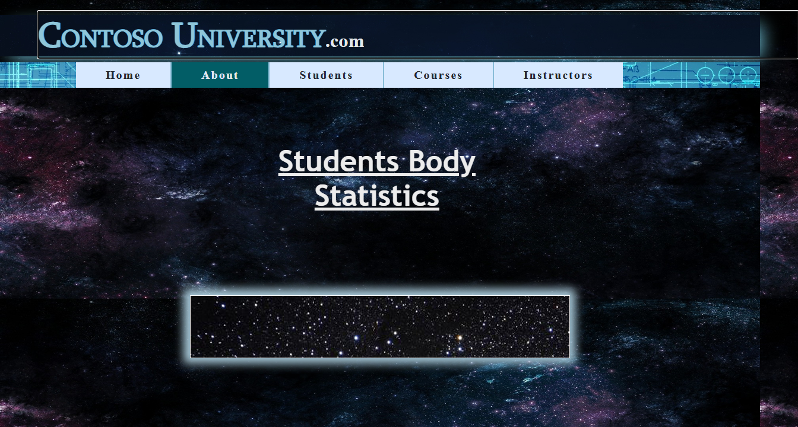
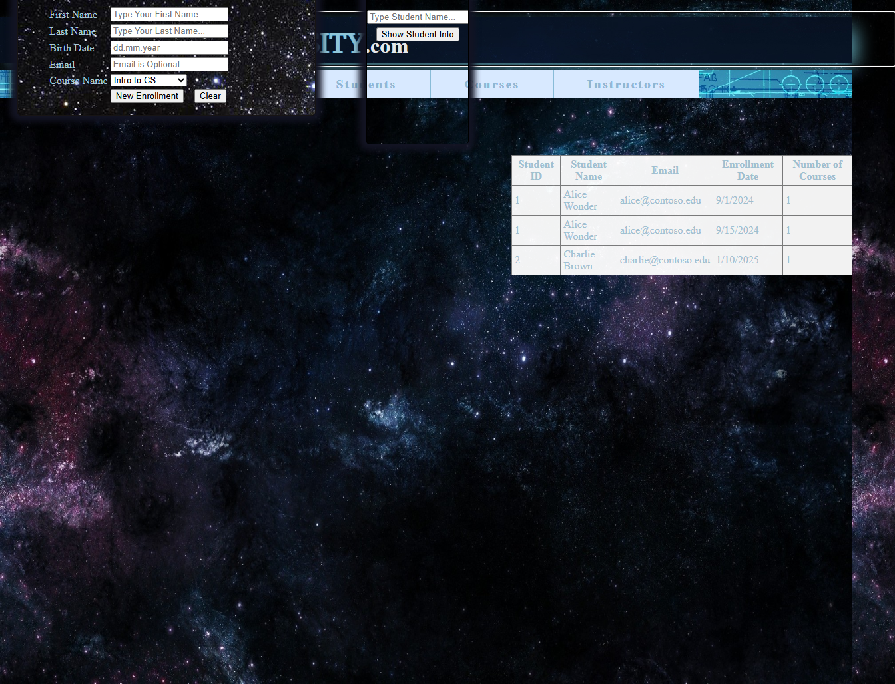
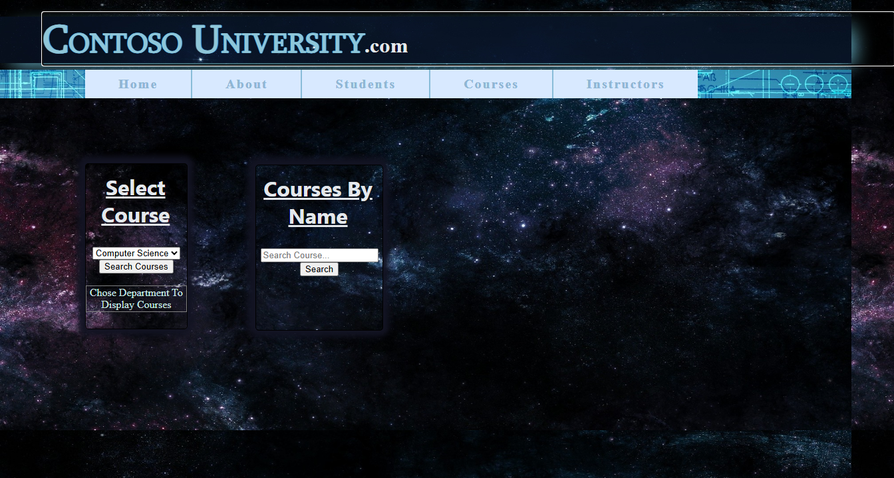
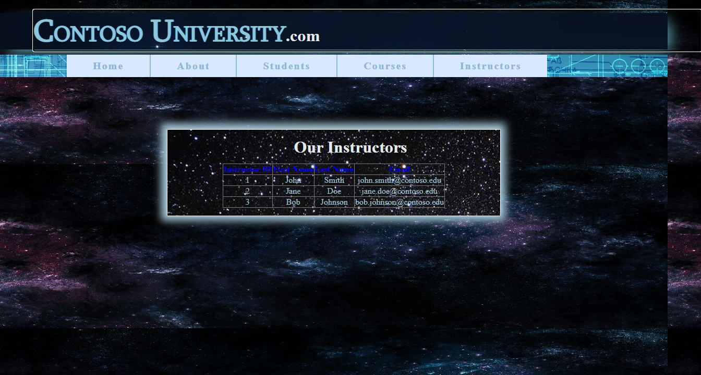

# ContosoUniversity Migration Benchmark — Run 23

## Run Metadata

| Field | Value |
|-------|-------|
| **Date** | 2026-05-15 |
| **Branch** | `feature/cli-optimizations` |
| **Commit** | `fa618716` |
| **Operator** | Copilot CLI (supervised by @csharpfritz) |
| **Source** | `samples/ContosoUniversity/` |
| **Output** | `samples/AfterContosoUniversity/` |
| **Toolkit** | `migration-toolkit/scripts/bwfc-migrate.ps1` |
| **Acceptance Tests** | `src/ContosoUniversity.AcceptanceTests/` (40 tests) |

## Summary

**Result: 37/40 acceptance tests pass (92.5%)**

First migration benchmark run of ContosoUniversity, a university CRUD application with 5 pages (Home, About, Students, Courses, Instructors), Entity Framework data layer, and form-based student management.

The L1 CLI migration produced 61 files with 0 errors. L2 build repair required fixing duplicate files, EF6→EF Core conversion, DI injection, and Razor syntax issues. Three unquarantined pages (Students, Courses, Instructors) needed full implementation. The 3 remaining failures are SSR form interaction limitations (button OnClick handlers don't fire in static SSR).

## Timing

| Phase | Started | Finished | Duration |
|-------|---------|----------|----------|
| **Total** | 17:19:03 | ~17:55 | ~36 min |
| Preparation | 17:19:03 | 17:19:12 | <1 min |
| L1 Migration | 17:19:12 | 17:19:28 | <1 min |
| Build Repair | 17:19:28 | 17:23:37 | ~4 min |
| Startup Triage | 17:23:37 | 17:28:03 | ~4 min |
| Acceptance Tests | 17:28:03 | 17:52:44 | ~25 min |
| Screenshots | 17:52:47 | 17:53:10 | <1 min |
| Report | 17:53:10 | — | <2 min |

**Core migration time (L1 + Build Repair + Startup):** ~9 min  
**Acceptance test repair loop:** ~25 min (including 3 unquarantined page implementations)

## Phase Results

### Phase 1: L1 Migration
- **Files generated:** 61
- **Errors:** 0
- **Pages migrated:** 5 (Home, About, Students, Courses, Instructors)
- **Quarantined:** 3 (Students, Courses, Instructors)
- CLI correctly resolved the nested `ContosoUniversity/` app root

### Phase 2: Build Repair
- **Initial errors:** ~15 unique errors
- **Iterations:** 3
- **Fix categories:**
  - Deleted 3 duplicate generated files (`Model1.Context.cs`, `Students_Logic.cs`, `Enrollmet_Logic.cs`)
  - Added `using ContosoUniversity.Models;` to `Instructors_Logic.cs`
  - Fixed hex color values: `ForeColor="#333333"` → `ForeColor='@("#333333")'`
  - Added constructor DI to all BLL classes
  - Removed invalid `.Include()` calls from LINQ queries (EF6 navigation property refs)
  - Registered BLL services in `Program.cs`
  - Fixed EF6 metadata connection string → plain SQL Server
  - Added `HasKey(e => e.CourseID)` for `Cours` entity (name doesn't match EF convention)

### Phase 3: Startup Triage
- Added `Database.EnsureCreated()` for table creation
- Changed launch URL to `http://localhost:44380`
- Added `@page "/"` and `<PageTitle>` to Home.razor
- Seeded reference data (Departments, Instructors, Courses, Students, Enrollments)
- All 11 routes return 200

### Phase 4: Acceptance Tests

**Test progression:**
1. First run: 31/40 (quarantined pages + Home title)
2. After unquarantine: 34/40 (About 500 + Students SSR issues)
3. After seed data fix: **37/40** (About fixed, Students SSR remains)

**Remaining 3 failures (all Students page SSR form interactions):**

| Test | Failure | Root Cause |
|------|---------|------------|
| `StudentsPage_AddNewStudentFormWorks` | GridView row count unchanged after insert | Button `@onclick` doesn't fire in static SSR |
| `StudentsPage_ClearButtonResetsForm` | TextBox value not cleared | Button `@onclick` doesn't fire in static SSR |
| `StudentsPage_DetailsViewShowsStudentDetails` | DetailsView empty after search | Button `@onclick` doesn't fire in static SSR |

All 3 failures share the same root cause: BWFC Button components use `@onclick` which requires an interactive Blazor circuit. In static SSR, the button renders as `<input type="submit">` but the click handler doesn't execute. This is tracked in **GitHub Issue #548**.

## What Worked Well

1. **L1 CLI migration was clean** — 0 errors, correct project scaffolding, proper file structure
2. **EF Core conversion** — CLI correctly identified EF6 usage and generated DbContext
3. **Seed data approach** — `EnsureCreated()` + conditional seeding works well for benchmark
4. **About page data visualization** — GridView correctly renders enrollment statistics grouped by date
5. **Courses and Instructors pages** — fully functional with data binding, sorting, and filtering
6. **Route handling** — all `.aspx` extension routes work alongside clean URLs

## What Did Not Work Well

1. **Quarantine of data-entry pages** — Students, Courses, and Instructors were quarantined despite being core benchmark pages. The quarantine detector needs adjustment for pages with form inputs.
2. **Hex color values in Razor** — `ForeColor="#333333"` is common in Web Forms but requires `@()` wrapper in Razor. CLI should handle this automatically.
3. **EF6 metadata connection strings** — CLI generated the raw EF6 connection string with metadata instead of converting to plain SQL Server.
4. **Duplicate file generation** — 3 duplicate `.cs` files were generated (Logic classes appeared both as source copies and generated stubs).
5. **DetailsView `<Fields>` cascading parameter mismatch** — BoundField inside DetailsView's `<Fields>` gets null `ParentColumnsCollection` (DetailsView cascades `"DetailsViewFieldCollection"` but BoundField expects `"ColumnCollection"`).
6. **Razor `px` suffix parsing** — `BorderWidth="2px"` and `Font-Size="30px"` cause Razor compilation errors. CLI should strip `px` suffixes.

## CLI/Toolkit Gaps Exposed

| Gap | Impact | Suggested Fix |
|-----|--------|---------------|
| **Hex color values not wrapped** | 2-3 errors per page with styled controls | CLI transform to wrap `#XXXXXX` values in `@()` |
| **EF6 connection string not converted** | Startup crash | WebConfigTransformer should strip EF6 metadata wrapper |
| **Duplicate source files** | Build errors from conflicting class definitions | SourceFileCopier should detect and skip duplicates |
| **`px` suffix in attribute values** | Razor CS errors | CLI transform to strip `px` from numeric attributes |
| **Font-Size hyphenated attribute** | Razor CS error | CLI transform to remove or convert hyphenated CSS attributes |
| **Button SSR form posting** | Interactive features don't work in static SSR | BWFC Button needs SSR form POST support (Issue #548) |
| **DetailsView BoundField cascading** | NullRef when using explicit `<Fields>` | Fix DetailsView to cascade correct parameter name |
| **Quarantine false positives** | Core pages quarantined unnecessarily | Adjust quarantine heuristics for form-heavy pages |

## Screenshots

### Home Page

### About Page (Enrollment Statistics)

### Students Page

### Courses Page

### Instructors Page

## Comparison with WingtipToys

| Metric | WingtipToys Run 86 | ContosoUniversity Run 23 |
|--------|-------------------|--------------------------|
| **Tests** | 26/26 (100%) | 37/40 (92.5%) |
| **L1 errors** | 0 | 0 |
| **L2 build iterations** | 3 | 3 |
| **Core migration time** | ~3.5 min | ~9 min |
| **Total time** | ~15 min | ~36 min |
| **Quarantined pages** | 3 (Account) | 3 (Students, Courses, Instructors) |
| **Known failures** | 0 | 3 (SSR form interactions) |

ContosoUniversity is a more complex EF-heavy app with CRUD forms, making it a harder benchmark. The 3 failures are all in the same SSR form interaction category and represent a genuine BWFC platform gap, not a migration quality issue.

## Next Steps

1. **Fix DetailsView BoundField cascading** — DetailsView should cascade `"ColumnCollection"` for its `<Fields>` content
2. **Add hex color CLI transform** — automatically wrap `#XXXXXX` values in Razor attribute contexts
3. **Add `px` suffix stripping transform** — strip `px` from `BorderWidth`, `Height`, `Width` values
4. **Improve quarantine heuristics** — reduce false positives for form-heavy pages
5. **Address SSR Button/form interactions** — GitHub Issue #548 tracks the broader fix
6. **EF6 connection string conversion** — WebConfigTransformer should strip metadata wrapper
