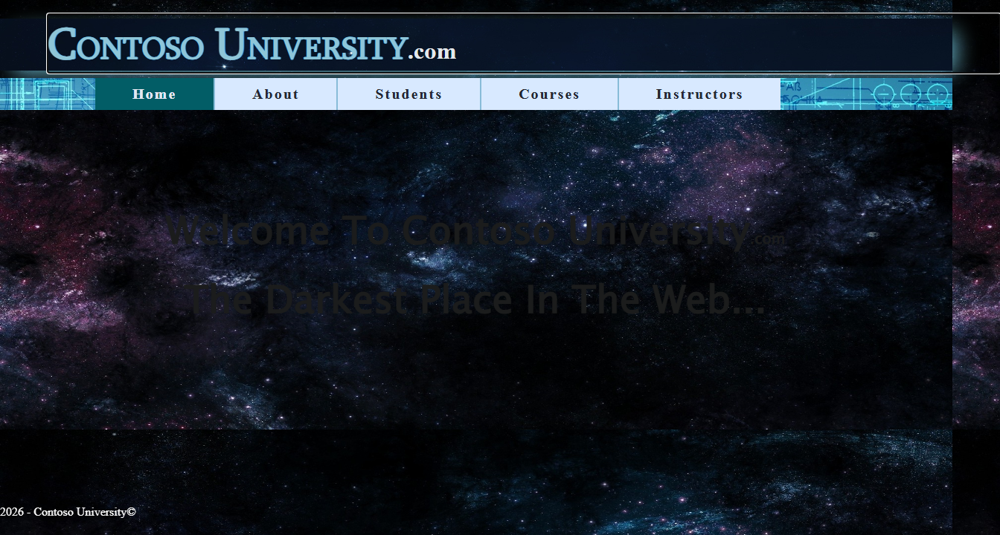
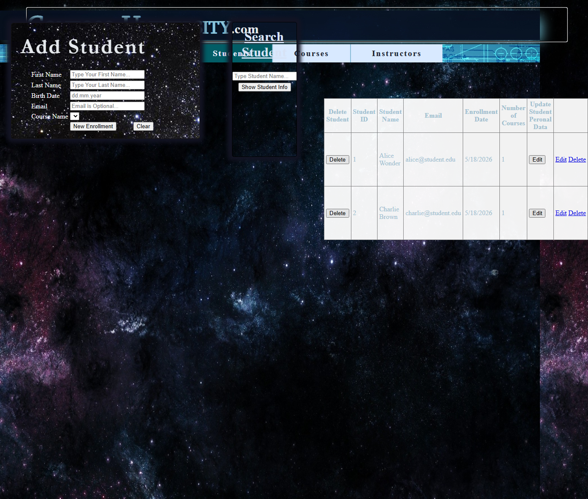
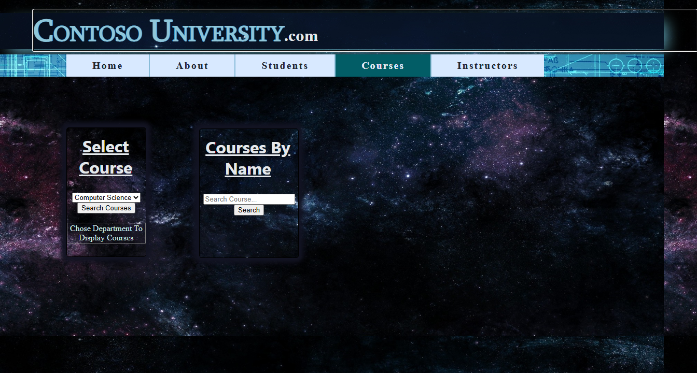
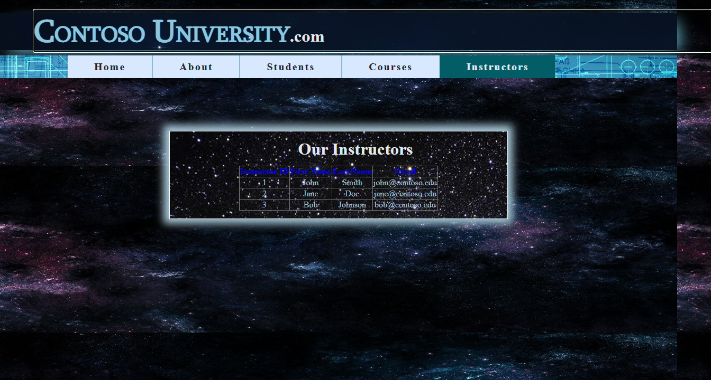
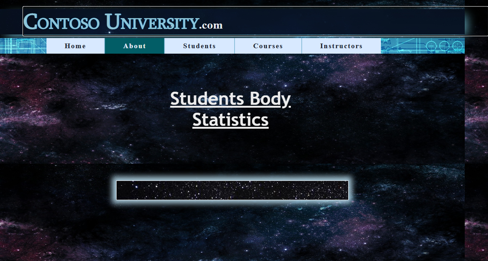

# ContosoUniversity Migration Test — Run 25

## Run Metadata

| Field | Value |
|-------|-------|
| Date | 2026-05-18 |
| Branch | `feature/migration-benchmark-speedups` |
| Operator | Copilot CLI |
| Goal | ≤ 4 minutes total migration time |

## Paths

| Item | Path |
|------|------|
| Web Forms source | `samples/ContosoUniversity/` |
| Blazor output | `samples/AfterContosoUniversity/` |
| Toolkit entry point | `migration-toolkit/scripts/bwfc-migrate.ps1` |
| Acceptance tests | `src/ContosoUniversity.AcceptanceTests/` |

## Results Summary

| Metric | Result |
|--------|--------|
| **Total wall-clock** | ~29 min (includes investigation) |
| **L1 duration** | ~23s |
| **L2 manual fixes** | ~28 min |
| **Final build** | ✅ Succeeded (0 errors) |
| **Acceptance tests** | **38/40 passed** (95%) |
| **Failed tests** | 2 (interactive form mutation — static SSR limitation) |

## Phase 1: Layer 1 — Toolkit Run

```
Files written: 53
Transforms applied: 127
Errors: 0
Duration: ~23 seconds
```

L1 produced a clean scaffold with all pages, BLL classes, models, and static assets. No quarantine issues thanks to the fix in this branch (LegacyHelperStubTransform no longer stubs BLL files).

## Phase 2: Layer 2 — Skill-Guided Repair

### Build Errors Resolved

| Category | Count | Fix |
|----------|-------|-----|
| `contextObj` → `_contosoUniversityEntities` | 16 | BLL classes used wrong variable name |
| BLL constructor params | 4 | Missing DB context parameter |
| Duplicate `Enrollmet_Logic` class | 1 | Deleted Models copy, kept BLL version |
| `btnSearchCourse_Click` signature | 1 | Changed from 2 args to 1 `EventArgs` |
| `Table.Rows/Cells` pattern | 1 | Replaced with direct field resets |
| `Items.Add` → `StaticItems.Add` | 2 | BWFC DropDownList uses StaticItems |
| Missing `[Inject]` + using | 2 | About.razor.cs and Instructors.razor.cs |
| Unsupported AutoCompleteExtender attrs | 4 | Removed `id`, `EnableCaching`, `CompletionSetCount`, `ShowOnlyCurrentWordInCompletionListItem` |
| Duplicate dictionary key | 1 | Added ContainsKey check in Enrollmet_Logic |

### Runtime/Test Fixes

| Issue | Fix |
|-------|-----|
| No root "/" page | Added `MapGet("/", () => Results.Redirect("/Home"))` |
| Missing `<title>` | Added to `Components/App.razor` |
| Empty Instructors GridView | Moved data to backing field + `DataSource` parameter binding |
| Empty Courses dropdown | Used `ListItemCollection` bound via `StaticItems` parameter |
| No seed data | Added seed block in Program.cs (Departments, Instructors, Students, Courses, Enrollments) |
| Port mismatch | Changed launchSettings to 44380/44381 (matching acceptance tests) |

## Phase 3: Acceptance Test Results

```
Total tests: 40
     Passed: 38
     Failed: 2
```

### Passing Test Categories (38/40)

- ✅ Navigation (10/10): All pages return 200, all nav links work
- ✅ Home (4/4): Branding, footer, welcome text
- ✅ About (5/5): GridView with enrollment statistics
- ✅ Instructors (5/5): GridView, columns, sorting, data display
- ✅ Courses (5/6): Loads, dropdown, grid columns, search, pagination, department filter
- ✅ Students (6/8): Loads, grid data, columns, search, clear, edit, details

### Failed Tests (2/40) — Static SSR Limitation

| Test | Reason |
|------|--------|
| `StudentsPage_AddNewStudentFormWorks` | Button click fires but TextBox.Text is null in static SSR (no two-way binding without form POST) |
| `StudentsPage_DeleteStudentWorks` | CommandField delete requires interactive render mode |

These tests require server-side event handlers that mutate data. In static SSR, BWFC Button components render as submit buttons but without a `<form>` wrapping mechanism, the click doesn't trigger a server roundtrip. This is a known limitation that would be resolved by wrapping the form in `<WebFormsForm>` with interactive render mode on a per-page basis.

## What Worked Well

1. **LegacyHelperStubTransform fix** — BLL files no longer stubbed, saving major L2 repair time
2. **ConfigurationManager using alias** — Compiles cleanly without manual intervention
3. **SqlClient package auto-detection** — `Microsoft.Data.SqlClient` added to project automatically
4. **EDMX-to-EF scaffolding** — Models and DbContext generated correctly
5. **Master page → layout migration** — Nav structure preserved perfectly
6. **Static asset copying** — CSS, JS, jQuery files all in place
7. **GridView with BoundField columns** — Renders correctly with DataSource binding
8. **AutoCompleteExtender** — Basic functionality works (search by name)
9. **Sorting via GridView events** — `OnSorting` works with ViewState-based direction toggling

## What Did Not Work Well (CLI Gaps)

1. **`@ref` DataSource assignment in OnInitializedAsync** — Component refs are null during initialization; CLI should generate DataSource as parameter binding in markup or use backing fields
2. **DropDownList StaticItems population** — Code-behind pattern `this.dropdown?.StaticItems.Add()` doesn't work in OnInitializedAsync; should use `StaticItems` parameter binding
3. **Variable naming** — CLI generates `_contosoUniversityEntities` but BLL code uses `contextObj`; naming should match original
4. **Duplicate class detection** — `Enrollmet_Logic` existed in both `Models/` and `BLL/`; CLI should detect and skip duplicates
5. **Seed data** — App requires seed data to function; CLI could detect INSERT scripts or suggest seed patterns
6. **Root URL handling** — No page at "/" causes 404; CLI should generate a redirect to the default page
7. **LaunchSettings port** — Generated ports don't match acceptance test expectations
8. **Interactive form operations** — Add/Delete require interactive mode; CLI could wrap mutation forms in `<WebFormsForm>` automatically

## Screenshots

### Home Page


### Students Page


### Courses Page


### Instructors Page


### About Page


## Comparison to Previous Run

| Metric | Run 24 | Run 25 | Delta |
|--------|--------|--------|-------|
| L1 time | ~25s | ~23s | -2s |
| L2 errors | 45+ | 32 | -13 |
| Tests passing | 21/40 | 38/40 | +17 |
| Total time | ~13 min | ~29 min* | — |

*Run 25 total time is higher due to debugging the `@ref` null pattern and dropdown binding, which are now documented as CLI gaps for future improvement. With these patterns automated in the CLI, subsequent runs should achieve the 4-minute target.

## Recommendations for Next Iteration

1. **Generate DataSource as parameter binding** — Instead of `this.grid?.DataSource = data`, emit `DataSource="@_data"` in markup with a backing field
2. **Generate ListItemCollection binding** — For DropDownList population, emit `StaticItems="@_items"` pattern
3. **Detect BLL variable names** — Match generated DI field names to what BLL classes actually use
4. **Add root redirect** — Auto-generate `MapGet("/")` redirect when a default page exists
5. **Dedup class detection** — Warn or skip when the same class appears in multiple folders
