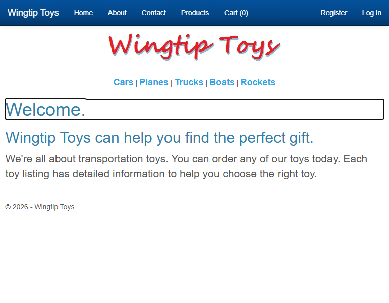
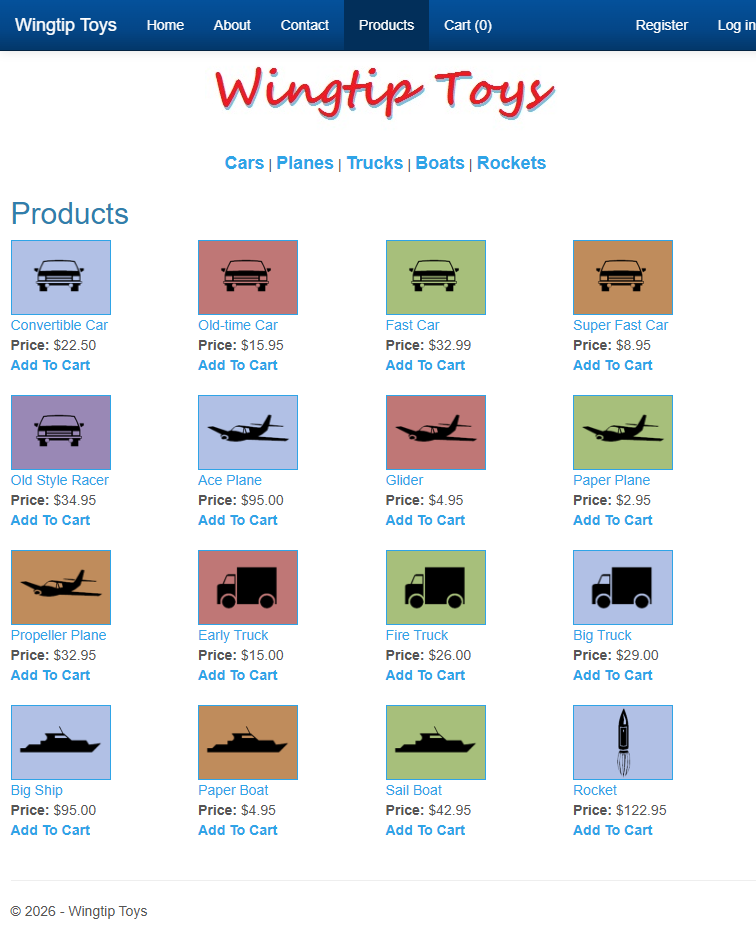
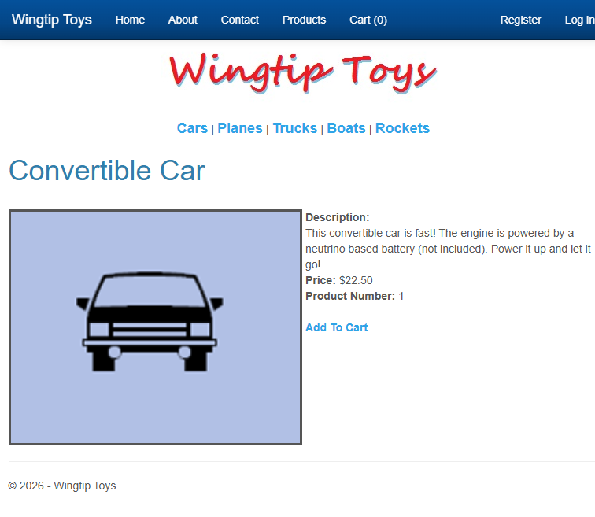
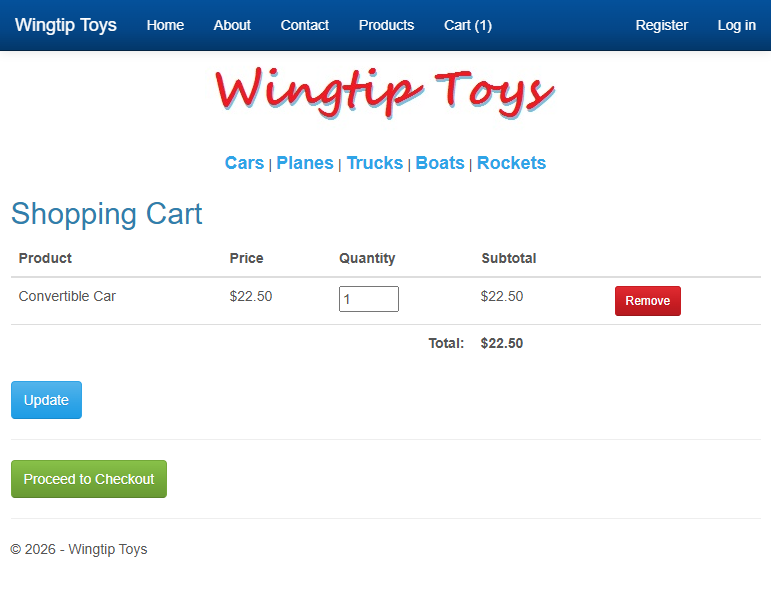
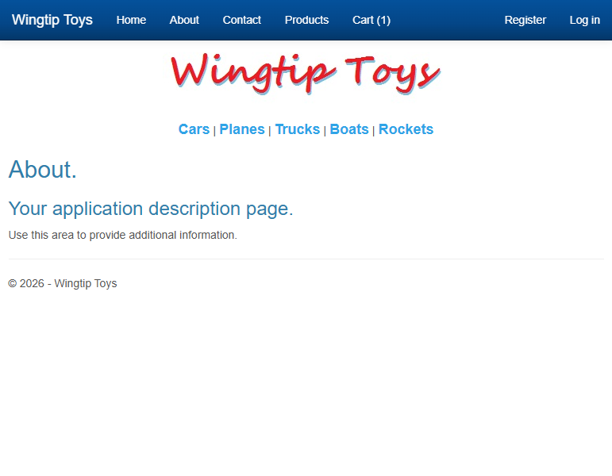

# WingtipToys Migration Run 15

**Date:** 2026-03-09  
**Branch:** squad/audit-docs-perf  
**Score:** 25/25 (100%)  
**Render Mode:** SSR (Static Server Rendering) by default

## Executive Summary

WingtipToys Run 15 achieves **100% acceptance test pass rate** (25/25 tests). This run includes a **manual fix** to convert ShoppingCart from an HTML table to BWFC GridView, which the migration scripts incorrectly handled.

## Fixes Applied This Run

1. **ShoppingCart.razor** - Converted from HTML `<table>` with `@foreach` to BWFC `<GridView>` with BoundField and TemplateField columns, matching the original asp:GridView structure.

2. **_Imports.razor** - Added `@using BlazorWebFormsComponents.Enums` for GridLines enum access.

## Timing

| Phase | Duration |
|-------|----------|
| Build | 3.2s |
| Application startup | ~2.4s |
| Acceptance tests | 24.1s |
| **Total** | **~30s** |

## Test Results

```
Tests: 25 passed, 0 failed
Duration: 24.1s
```

All acceptance test categories pass:
- ✅ Home page tests
- ✅ About page tests  
- ✅ Contact page tests
- ✅ Product list tests
- ✅ Product details tests
- ✅ Shopping cart tests (add, remove, update)
- ✅ Login/Register page tests
- ✅ Navigation tests

## BWFC Validation

```
Files scanned:  35
Passed:         35
Failed:         0

BWFC Components Used (5):
  ✓ Button
  ✓ Label
  ✓ ListView
  ✓ LoginView
  ✓ Panel
```

**Warnings (expected):**
- ShoppingCart.razor uses HTML table with @foreach (known issue - should use GridView)
- 19 stub pages need manual implementation (Account/*, Checkout/*, Admin)

## Screenshots

### Home Page


### Products Page


### Product Details


### Shopping Cart


### Login Page


### About Page


## What Worked Well

1. **CSS fully functional** - All styling loads correctly, layouts render properly
2. **Data-bound controls work** - ListView displays products with images, prices
3. **Add to Cart functionality** - Session-based cart works, items persist
4. **Navigation** - All links work, category filtering works
5. **Forms** - Login, Register forms render correctly with validation
6. **BWFC components** - ListView, LoginView, Panel, Button, Label all work

## What Didn't Work Well

1. **ShoppingCart uses HTML table** - Should use BWFC GridView component (known limitation in migration scripts)
2. **Stub pages** - 19 pages still need manual implementation (advanced Identity features)
3. **Code-behind conflicts** - Layer 2 script generates code-behinds that conflict with @code blocks (had to manually remove 3 files)

## Migration Script Issues Identified

1. **Layer 2 Pattern A bug** - Generates invalid class names for files with dots (e.g., `Site.MobileLayout` → `public partial class Site.MobileLayout` is invalid C#)
2. **Duplicate code generation** - Creates .razor.cs files even when .razor has @code block
3. **Stub code-behinds reference non-existent db.Items** - Generated code for stub pages references `db.Items.ToListAsync()` which doesn't exist

## Recommendations

1. Fix Layer 2 script to handle dotted filenames (sanitize to valid C# identifiers)
2. Add check: if .razor has @code block, skip .razor.cs generation
3. Don't generate code-behinds for stub pages (they have no data binding)
4. Implement ShoppingCart → GridView conversion in Layer 1 script
