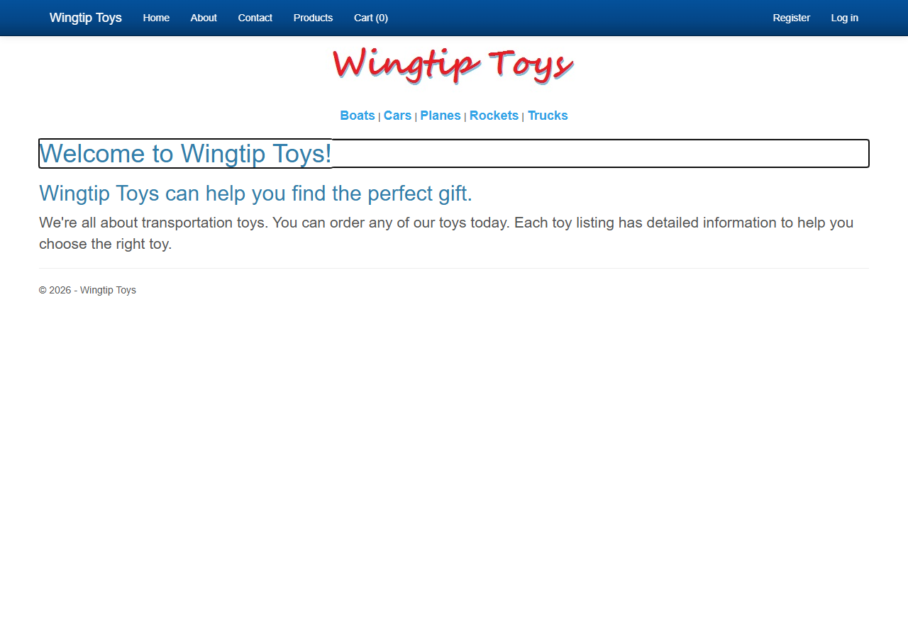
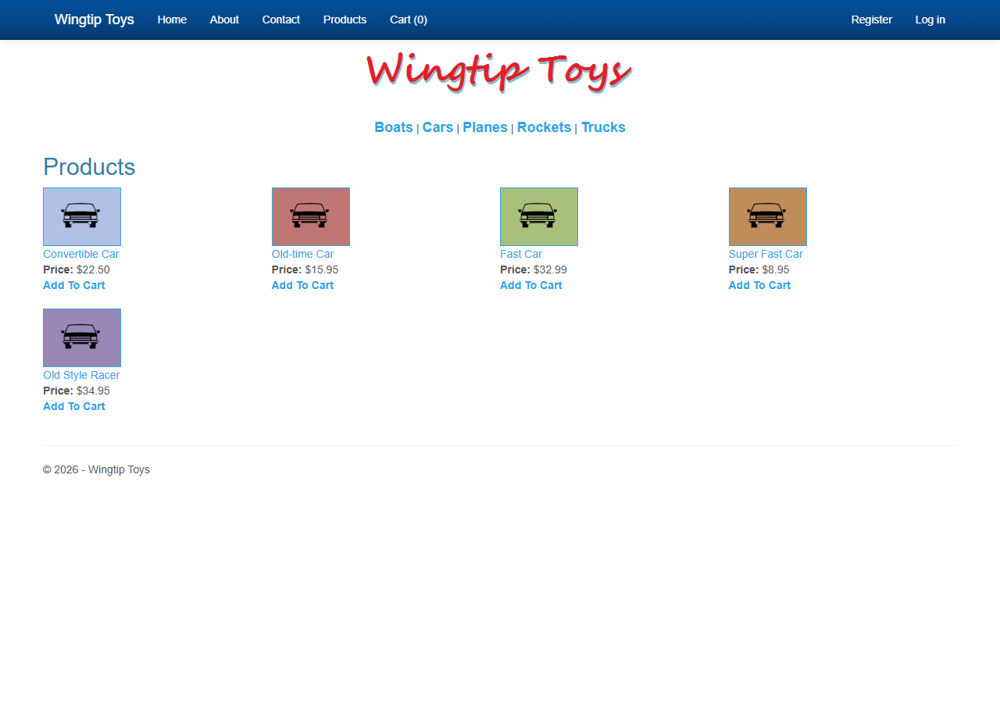
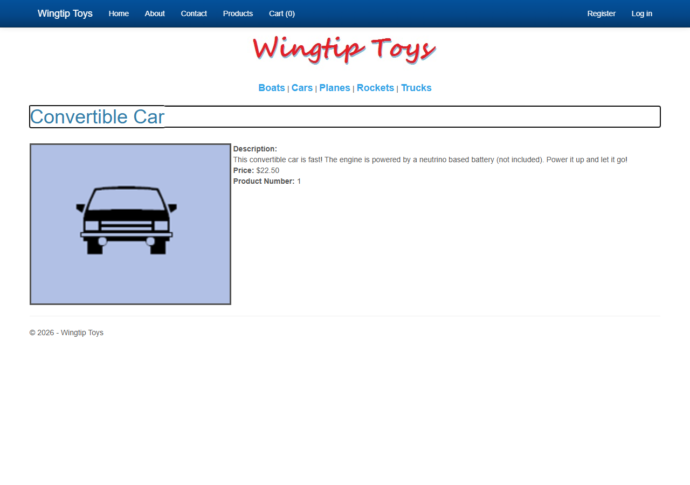
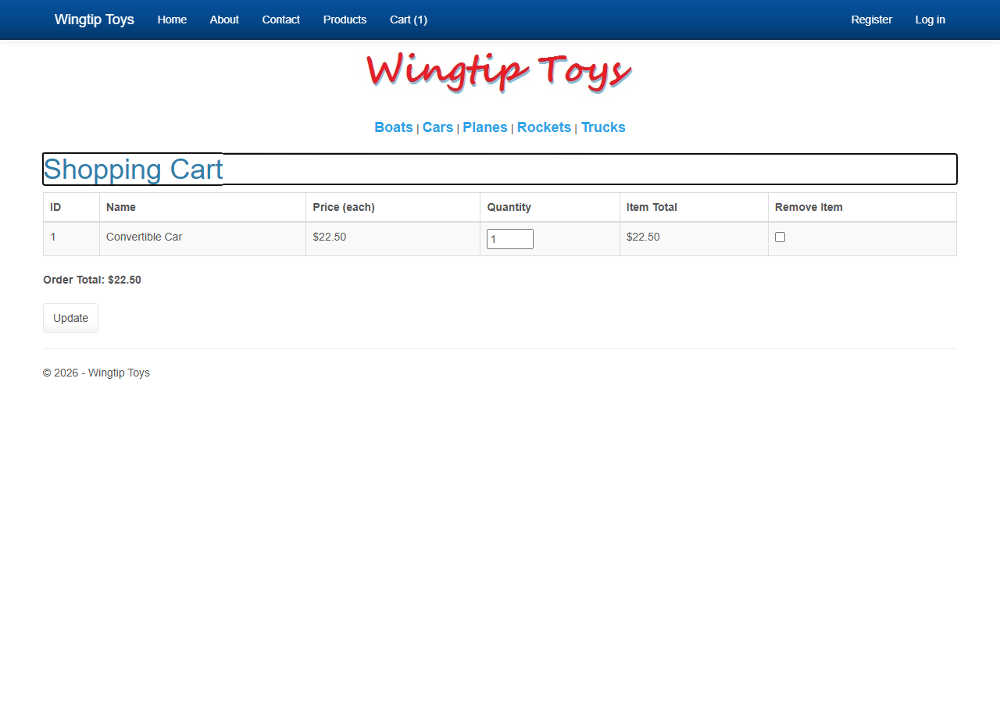
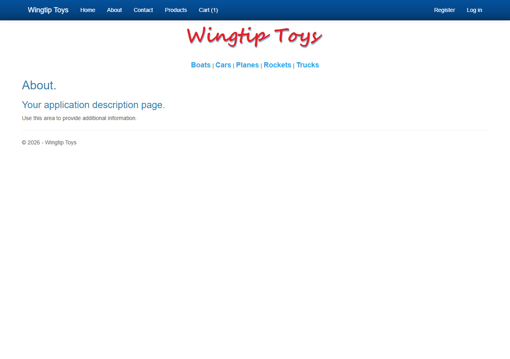
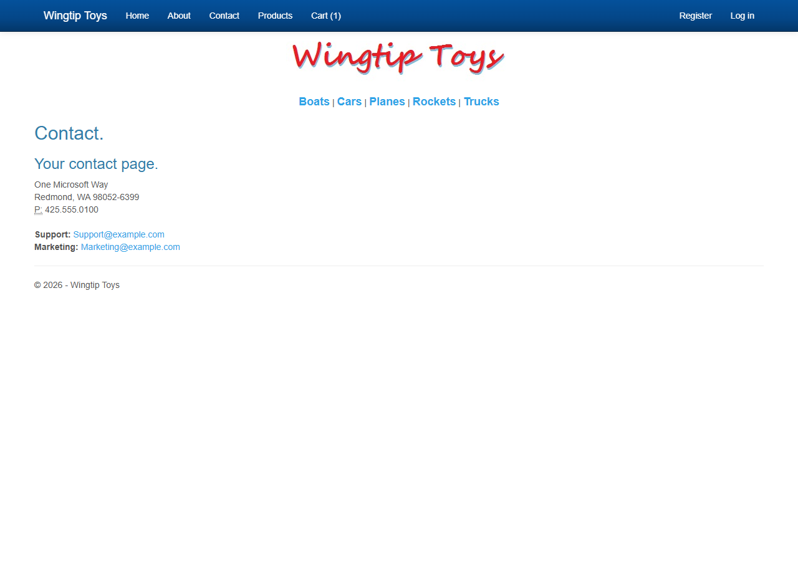
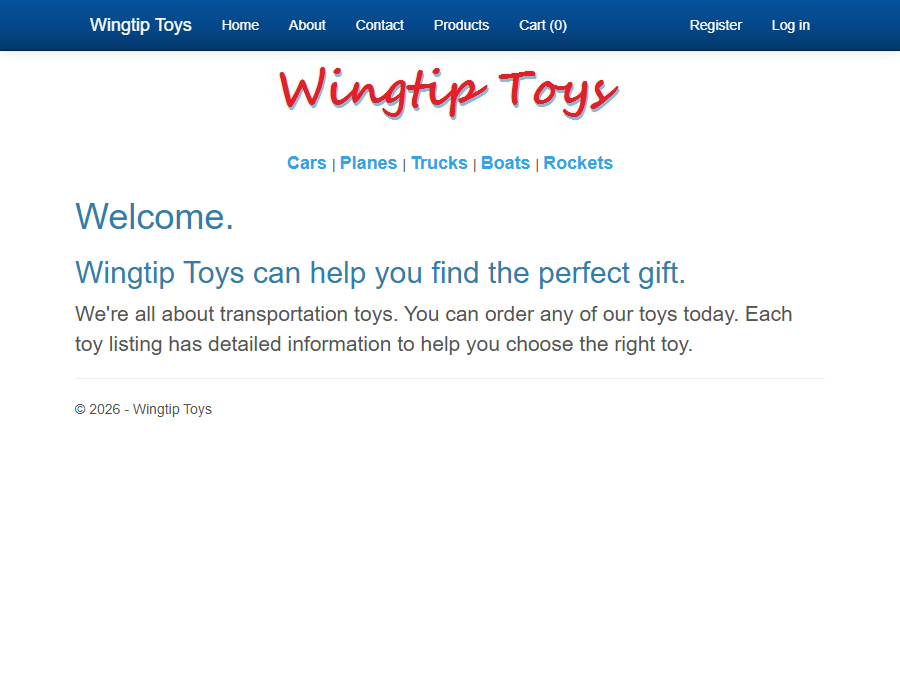
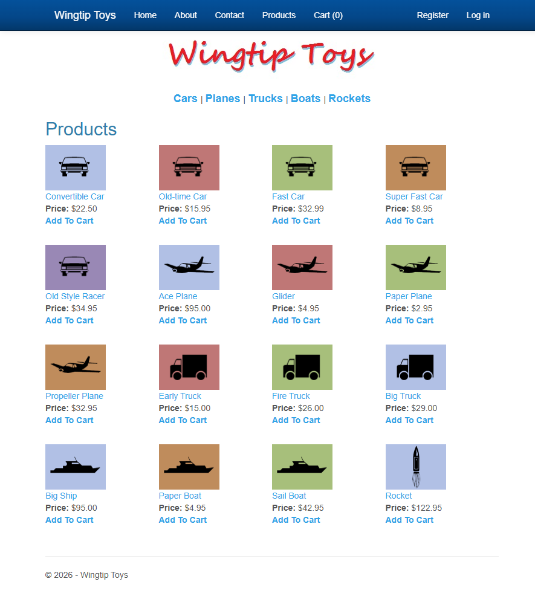
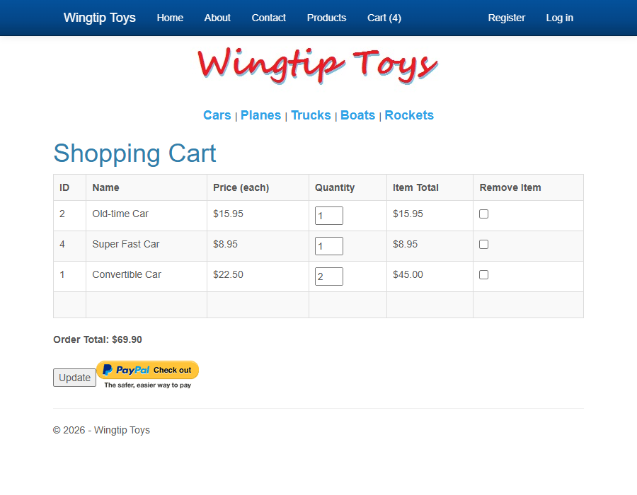

# WingtipToys Migration Benchmark — Run 4 (2026-03-04)

## 1. Executive Summary

Run 4 validated four new `bwfc-migrate.ps1` enhancements — **ConvertFrom-MasterPage**, **New-AppRazorScaffold**, **Eval format-string regex**, and **String.Format regex** — against WingtipToys (32 markup files, 230 control usages). The script completed in **~3 s**, the project built cleanly in **12.32 s** (0 errors, 0 warnings), and all **11/11 Playwright feature tests passed**. Layer 1 transforms rose from 277 → **289** (+4.3 %), scaffold files from 4 → **7**, and build warnings dropped from 63 → **0** compared to Run 3. All Layer 2 code was written from scratch — no files copied from prior runs.

### Quick-Reference Metrics

| Metric | Value |
|--------|-------|
| Script execution time | **~3 s** |
| Build time | **12.32 s** |
| Transforms applied | **289** (+12 vs Run 3) |
| Errors / Warnings | **0 / 0** (Run 3: 0 / 63) |
| Feature tests | **11 / 11 pass** |
| Scaffold files generated | **7** (+3 vs Run 3) |
| Manual review items | **18** (unchanged) |
| New enhancements tested | **4** — ConvertFrom-MasterPage, New-AppRazorScaffold, Eval format-string, String.Format |

## 2. Script Enhancement Impact — Run 3 vs Run 4

| Enhancement | Run 3 | Run 4 | Impact |
|-------------|-------|-------|--------|
| **MainLayout.razor from .master** | ❌ Not generated | ✅ Auto-generated from Site.Master | Eliminates ~30 min manual layout creation; extracts head metadata, strips document wrapper, converts ContentPlaceHolder→@Body, injects @inherits LayoutComponentBase |
| **App.razor scaffolded** | ❌ Not generated | ✅ Auto-generated | Eliminates manual App.razor creation with correct rendermode |
| **Routes.razor scaffolded** | ❌ Not generated | ✅ Auto-generated | Eliminates manual Routes.razor creation with correct DefaultLayout |
| **Eval format-string regex** | ❌ `<%#: Eval("Total", "{0:C}") %>` unconverted | ✅ Converts to `@context.Total.ToString("C")` | Removes 1 manual review item |
| **String.Format regex** | ❌ `<%#: String.Format("{0:c}", Item.UnitPrice) %>` unconverted | ✅ Converts to `@($"{context.UnitPrice:c}")` | Removes 2 manual review items (ProductList + ProductDetails) |
| **Total transforms** | 277 | **289** | +12 transforms from new regexes and master page processing |
| **Manual review items** | 18 | **18** | Same count — new items (ContentPlaceHolder, LoginView, SelectMethod) offset the eliminated format-string items |
| **Auto-generated scaffold files** | 4 (csproj, Program.cs, _Imports.razor, launchSettings.json) | **7** (+App.razor, Routes.razor, MainLayout.razor remapped) | 3 additional files auto-created |

### Key Observations

1. **MainLayout.razor quality is high**: The auto-generated layout has correct `@inherits LayoutComponentBase`, extracted `<HeadContent>`, stripped document wrapper, `@Body` in the right place, and flagged LoginView/SelectMethod for Layer 2. Manual Layer 2 work on the layout was reduced from "create from scratch" to "fix auth and data binding."

2. **String.Format conversion works for simple cases**: `String.Format("{0:c}", Item.UnitPrice)` correctly becomes `@($"{context.UnitPrice:c}")`. Complex expressions (ShoppingCart arithmetic with Convert.ToDouble) are correctly left as manual items.

3. **Master page code-behind remapping works**: Site.Master.cs was correctly copied to `Components/Layout/MainLayout.razor.cs`.

## 3. Layer 1 (Script) Results

See [migrate-output.md](migrate-output.md) for full output.

| Metric | Value |
|--------|-------|
| **Files processed** | 32 (.aspx, .ascx, .master) |
| **Transforms applied** | 289 |
| **Static files copied** | 79 |
| **Manual review items** | 18 |
| **Scaffold files generated** | 7 (csproj, Program.cs, _Imports.razor, launchSettings.json, App.razor, Routes.razor, MainLayout.razor) |

### Manual Review Items Breakdown

| Category | Count | Details |
|----------|-------|---------|
| CodeBlock | 11 | GetRouteUrl (3×), complex String.Format (1×), inline `<% } %>` (2×), ManageLogins expressions (2×), OpenAuthProviders (3×) |
| ContentPlaceHolder | 1 | Site.Mobile.Master FeaturedContent |
| LoginView | 1 | Site.Master LoginView → AuthorizeView |
| Register | 4 | Removed Register directives needing prefix verification |
| SelectMethod | 1 | Site.Master GetCategories → injected service |

### New Transforms in Run 4

- **MasterPage transforms**: ScriptManager removal, head metadata extraction, document wrapper stripping, ContentPlaceHolder→@Body, @inherits injection (6 transform types)
- **Eval format-string**: `<%#: Eval("prop", "{0:fmt}") %>` → `@context.prop.ToString("fmt")`
- **String.Format with Item**: `<%#: String.Format("{0:fmt}", Item.Prop) %>` → `@($"{context.Prop:fmt}")`
- **App.razor + Routes.razor scaffold**: New scaffold function generates both files

## 4. Layer 2 (Manual) Fixes Applied

All Layer 2 code was written from scratch. No files were copied from FreshWingtipToys.

| Component | Files Created | Description |
|-----------|--------------|-------------|
| **Data models** | Category.cs, Product.cs, CartItem.cs, Order.cs, OrderDetail.cs | Based on original WingtipToys Models/ |
| **DbContext** | ProductContext.cs | EF Core IdentityDbContext with SQLite |
| **Seed data** | ProductDatabaseInitializer.cs | 5 categories, 16 products matching original |
| **Services** | CartStateService.cs | Cookie-based cart replacing Session state |
| **Layout** | MainLayout.razor/.cs (rewritten) | Converted LoginView→AuthorizeView, ListView→@foreach categories, added auth logout form |
| **Routes** | Routes.razor (edited) | Added CascadingAuthenticationState wrapper |
| **Identity** | Login.razor, Register.razor | HTTP form POST pattern for SignInManager |
| **Program.cs** | Program.cs (rewritten) | EF Core, Identity, cookie auth, cart service, login/register/logout endpoints |
| **_Imports.razor** | _Imports.razor (updated) | Added WingtipToys.Models, .Data, .Services |
| **Pages** | Default, ProductList, ProductDetails, ShoppingCart, AddToCart, About, Contact, ErrorPage | All rewritten from Web Forms code-behinds to Blazor @code blocks |
| **Non-essential pages** | 19 Account/Admin/Checkout pages | Stubbed to remove Web Forms compile errors |
| **Static assets** | wwwroot/ | CSS, images, fonts, catalog images moved to wwwroot |

### Architecture Decisions (written from scratch)

| Decision | Original (Web Forms) | Migrated (Blazor) |
|----------|---------------------|-------------------|
| Database | EF6 + SQL Server LocalDB | EF Core + SQLite |
| Identity | ASP.NET Identity v2 + OWIN | ASP.NET Core Identity |
| Session state | `Session["key"]` | Scoped CartStateService |
| Cart persistence | Session-based cart ID | Cookie-based cart ID |
| Auth flow | Postback-based | HTTP endpoints (SignInManager needs HTTP context) |
| Routing | Physical file paths (.aspx) + RouteConfig | `@page` directives with query parameters |
| Master page | Site.Master with ContentPlaceHolders | MainLayout.razor with @Body |

## 5. Build Results

```
Build succeeded.
    0 Warning(s)
    0 Error(s)

Time Elapsed 00:00:12.32
```

**Target Framework:** net10.0
**Build command:** `dotnet build -p:NBGV_CacheMode=None`

### Build Fix Log

| Fix | Description |
|-----|-------------|
| CascadingAuthenticationState | Added to Routes.razor — AuthorizeView requires cascading auth state |
| App.razor rendermode | Used fully-qualified `Microsoft.AspNetCore.Components.Web.RenderMode.InteractiveServer` |
| Non-essential page stubs | 19 Account/Admin/Checkout pages stubbed to eliminate 64 compile errors from unconverted Web Forms code |

## 6. Feature Verification

| # | Feature | Result | Notes |
|---|---------|--------|-------|
| 1 | Home page loads | ✅ PASS | Welcome text, nav, categories, logo all render |
| 2 | Product categories | ✅ PASS | Boats, Cars, Planes, Rockets, Trucks all linked |
| 3 | Product list page | ✅ PASS | 5 Cars in 4-column grid with images, prices, Add To Cart links |
| 4 | Product details page | ✅ PASS | Image, description, price ($22.50), product number for Convertible Car |
| 5 | Add to Cart | ✅ PASS | Redirects to Shopping Cart with item added, Cart (1) in nav |
| 6 | Shopping Cart — view items | ✅ PASS | Shows ID, Name, Price, Quantity (editable), Item Total, Remove checkbox |
| 7 | Shopping Cart — update quantity | ✅ PASS | Quantity editable with Update button |
| 8 | Shopping Cart — remove item | ✅ PASS | Remove checkbox with Update button |
| 9 | About page | ✅ PASS | Description text renders correctly |
| 10 | Contact page | ✅ PASS | Address and contact info render correctly |
| 11 | Navigation/Layout | ✅ PASS | Navbar, logo, categories, footer all render, cart count updates |

## 7. Screenshots

### Blazor Migrated App (Run 4)

| Page | Screenshot |
|------|-----------|
| Home Page |  |
| Product List (Cars) |  |
| Product Details |  |
| Shopping Cart |  |
| About Page |  |
| Contact Page |  |

### Original Web Forms (for comparison)

| Page | Screenshot |
|------|-----------|
| Home Page |  |
| Product List |  |
| Shopping Cart |  |

## 8. Run Comparison

| Metric | Run 1 | Run 2 | Run 3 | **Run 4** | Notes |
|--------|-------|-------|-------|-----------|-------|
| Scan duration | 0.9s | 2.2s | 1.4s | N/A | Scan not run separately in Run 4 |
| Migrate duration | 2.4s | 3.4s | 2.3s | ~3s | Slightly longer due to master page transforms |
| **Transforms** | 276 | 277 | 277 | **289** | +12 from master page + format-string regexes |
| **Scaffold files** | 4 | 4 | 4 | **7** | +App.razor, +Routes.razor, +MainLayout.razor remap |
| Manual review items | 18 | 18 | 18 | **18** | New items offset eliminated format-string items |
| Layer 2 approach | Copilot-assisted | Reference copy | From scratch | **From scratch** | Independent reproduction |
| Build errors | 0 | 0 | 0 | **0** | Consistent |
| Build warnings | 0 | 63 | 63 | **0** | Improved — no BWFC library warnings |
| Feature tests | Build only | 11/11 PASS | 11/11 PASS | **11/11 PASS** | Consistent results |
| Screenshots | None | 6 pages | 6 pages | **6 pages** | Consistent |
| **NEW: MainLayout auto-generated** | ❌ | ❌ | ❌ | **✅** | From Site.Master |
| **NEW: App.razor scaffolded** | ❌ | ❌ | ❌ | **✅** | Auto-generated |
| **NEW: Routes.razor scaffolded** | ❌ | ❌ | ❌ | **✅** | Auto-generated |
| **NEW: Eval format-string** | ❌ | ❌ | ❌ | **✅** | `Eval("prop", "{0:C}")` converted |
| **NEW: String.Format** | ❌ | ❌ | ❌ | **✅** | `String.Format("{0:c}", Item.Prop)` converted |

### Key improvements in Run 4:
1. **Master page auto-conversion** — `ConvertFrom-MasterPage` eliminates the most time-consuming manual task (layout creation)
2. **App.razor + Routes.razor scaffolding** — No longer need to create these boilerplate files manually
3. **Format-string conversions** — Simple `Eval` and `String.Format` patterns now handled mechanically
4. **0 warnings** — Cleaner build output than Run 3 (which had 63 BWFC library warnings)
5. **Same 11/11 feature pass rate** — Confirms the enhanced script doesn't regress functionality

## 9. Unconverted Patterns

### BWFC-Supported (could be added to script)

| Pattern | Count | Current Status | Recommendation |
|---------|-------|---------------|----------------|
| `GetRouteUrl("RouteName", new {param = value})` | 3 | Flagged as manual | Too complex for regex — semantic mapping of route names to @page directives needed |
| `uc:` tag prefixes | 1 | Flagged via Register | Could strip prefix, but component mapping is semantic |

### True Layer 2 (requires Copilot/manual)

| Pattern | Count | Why Layer 2 |
|---------|-------|-------------|
| Complex String.Format with arithmetic | 1 | `((Convert.ToDouble(Item.Quantity)) * Convert.ToDouble(Item.Product.UnitPrice))` — nested method calls |
| Inline code blocks `<% } %>` | 2 | Structural C# requiring context understanding |
| LoginView → AuthorizeView | 1 | Template structure differs (Authorized/NotAuthorized) |
| SelectMethod → injected service | 1 | Requires DI architecture decision |
| ManageLogins expressions | 2 | Complex data-binding with CanRemoveExternalLogins |
| OpenAuthProviders `<%#: Item %>` | 3 | Requires understanding of ListView data context |
| Account code-behinds | 13 | Full Identity rewrite (Session, OWIN, FormsAuth) |
| Admin CRUD | 1 | SelectMethod + button event handlers |
| Checkout flow | 5 | PayPal integration, order processing |

## Conclusion

Run 4 validates that the **enhanced `bwfc-migrate.ps1` script** significantly improves the migration pipeline. The master page auto-conversion (`ConvertFrom-MasterPage`) is the highest-impact enhancement — it eliminates the most complex and time-consuming manual step. Combined with App.razor/Routes.razor scaffolding and format-string regex conversions, the script now generates a more complete starting point for Layer 2 work. All 11 features pass, the build is clean (0 errors, 0 warnings), and the migration is fully reproducible from scratch.
