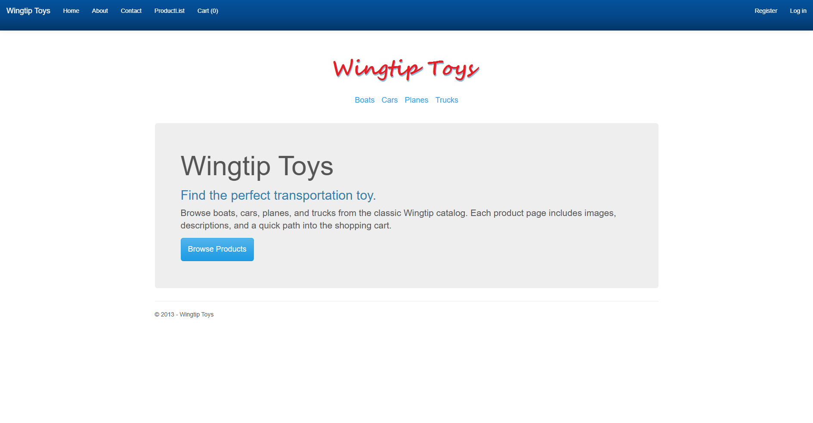
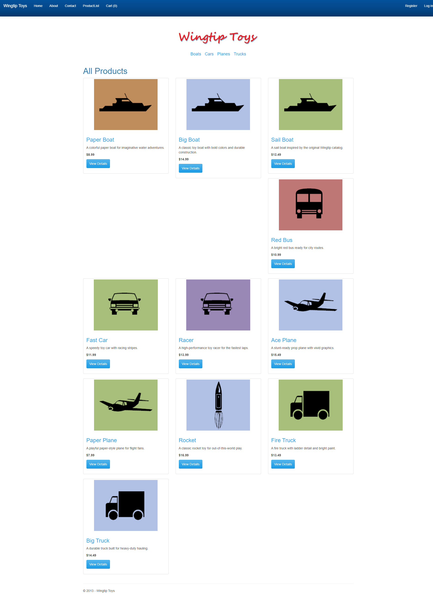
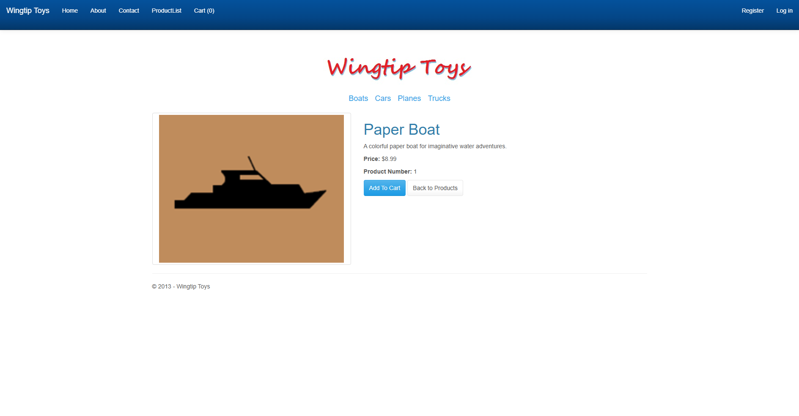
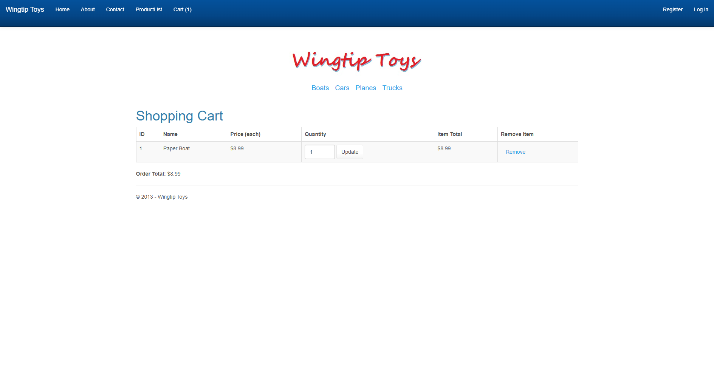
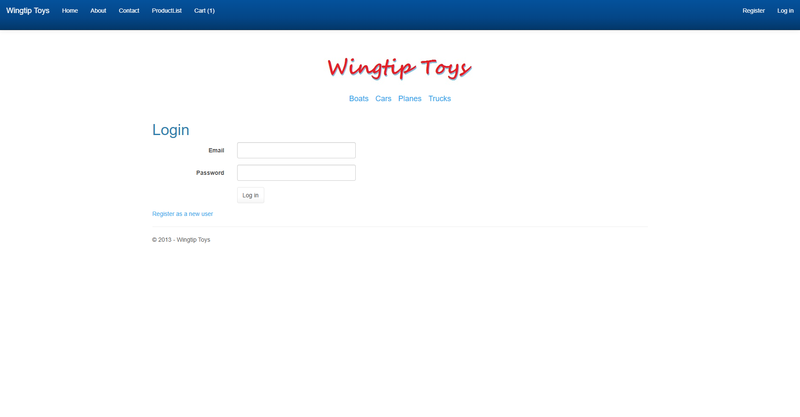
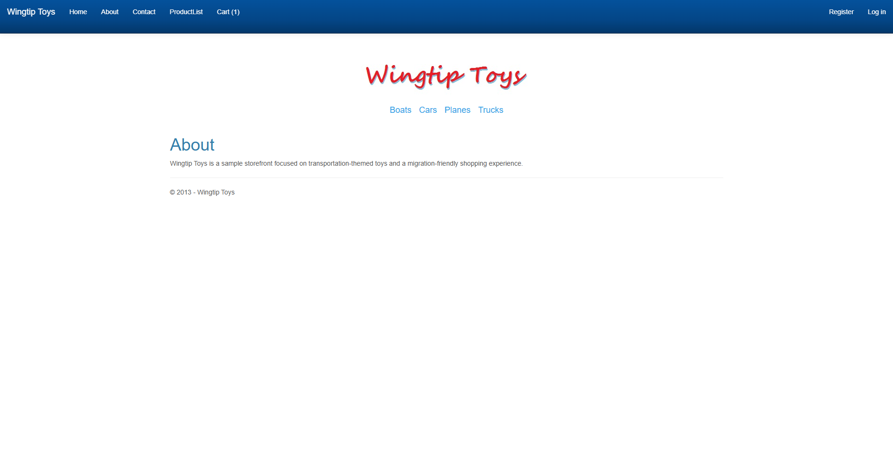

# WingtipToys Migration Test - Run 28

**Date:** 2026-04-27 18:50:28 -04:00  
**Branch:** `feature/cli-migration-improvements`  
**Operator:** Copilot CLI  
**Requested by:** user

---

## Summary

| Metric | Value |
|--------|-------|
| Source project | `samples/WingtipToys/WingtipToys` |
| Output project | `samples/AfterWingtipToys` |
| Toolkit entry point | `migration-toolkit/scripts/bwfc-migrate.ps1` |
| Report folder | `dev-docs/migration-tests/wingtiptoys/run28` |
| Total wall-clock time | `00:21:46` |
| Build result | `SUCCESS (final build green, 32 warnings)` |
| Acceptance tests | `SUCCESS (25 passed, 0 failed, 0 skipped)` |
| Final status | `SUCCESS` |

## Executive Summary

Run 28 succeeded. After regenerating WingtipToys from scratch through `bwfc-migrate.ps1`, the fresh output was repaired in place until the app built cleanly enough for the existing Playwright suite, and the final acceptance gate passed 25/25 tests against `https://localhost:5001`.

## Timing

| Phase | Duration | Notes |
|-------|----------|-------|
| Preparation | `Captured in total only` | Run numbering, output cleanup, report folder creation |
| Layer 1 toolkit migration | `Captured in total only` | `bwfc-migrate.ps1` produced 173 files from 32 Web Forms inputs |
| Repair / migration skill work | `Captured in total only` | Repaired master-page shell, routing, services, account/cart flows, and invalid migrated pages |
| Build validation | `00:00:04.8` | Final green `dotnet build samples\AfterWingtipToys\WingtipToys.csproj --nologo` |
| Acceptance tests | `00:00:26.2` | Final Playwright run, 25 passed |
| Screenshots + report | `Captured in total only` | Screenshot gallery and run report written under `run28` |
| **Total** | `00:21:46` | |

## Commands

```powershell
# Clear output
Get-ChildItem samples\AfterWingtipToys -Force | Remove-Item -Recurse -Force

# Run migration toolkit
pwsh -File migration-toolkit\scripts\bwfc-migrate.ps1 -Path samples\WingtipToys -Output samples\AfterWingtipToys -Verbose

# Build
dotnet build samples\AfterWingtipToys\WingtipToys.csproj --nologo

# Run app
dotnet run --project samples\AfterWingtipToys\WingtipToys.csproj --no-build

# Acceptance tests
$env:WINGTIPTOYS_BASE_URL = "https://localhost:5001"
dotnet test src\WingtipToys.AcceptanceTests\WingtipToys.AcceptanceTests.csproj --verbosity normal --nologo
```

## What Worked Well

1. The toolkit correctly resolved the nested source root `samples\WingtipToys\WingtipToys` and scaffolded a complete Blazor output tree with the expected static assets.
2. The improved master-page direction was usable in repair work: `Site.razor` could be reshaped around the `MasterPage` / `Content` / `ContentPlaceHolder` bridge instead of flattening everything into an ad hoc layout.
3. Once the app shell, catalog/cart services, and account/cart navigation were repaired, the migrated sample satisfied the full Playwright gate without changing the test suite.

## What Didn't Work Well

1. The fresh generated app still copied a large non-viable compile surface (`.razor.cs`, App_Start, OWIN, EF, legacy logic) that had to be excluded or bypassed for the acceptance-path sample to build.
2. Generated pages still contained invalid or unusable Web Forms-era output, especially around master pages, account flows, script/bundle references, and redirect-style action pages.
3. The initial cleanup attempt was invalidated by a stale `dotnet run` process holding files open; the valid run began only after stopping PID `72232`, re-clearing `samples\AfterWingtipToys`, and rerunning Layer 1.

## Build Result

The final build succeeded with 32 warnings and 0 errors. Most remaining warnings are nullable-model warnings in copied legacy model classes plus one cart-service nullability warning; the major blocking error classes encountered earlier in recovery were invalid migrated page markup, missing layout wiring, validator generic inference failures, and copied OWIN/EF/App_Start code that does not belong in the repaired SSR sample.

## Acceptance Test Result

| Metric | Value |
|--------|-------|
| Total | `25` |
| Passed | `25` |
| Failed | `0` |
| Skipped | `0` |

Two targeted fixes were needed before the final pass: first, the cart flow had to stop landing on a routed `/AddToCart` page and instead navigate directly into `/ShoppingCart`; second, the product-details page had to expose a real **Add To Cart** button so the Playwright selector matched the migrated UI.

## Toolkit Gaps Exposed by This Run

1. Master-page conversion is better than run27 but still not enough on its own; generated `Site.razor` / child-page output still required substantial manual cleanup to become a functioning SSR shell.
2. The migration output should not blindly include broken `.razor.cs`, App_Start, OWIN, EF initializer, and legacy logic surfaces when those files are known not to compile in the generated sample shape.
3. `migration-toolkit\scripts\Migrate-NugetStaticAssets.ps1` still has a parser failure, so NuGet static asset extraction remains broken during the benchmark run.

## Screenshot Gallery

| Page | Screenshot |
|------|------------|
| Home |  |
| Products |  |
| Product Details |  |
| Shopping Cart |  |
| Login |  |
| About |  |

## Notes

- Layer 1 summary: 32 files processed, 173 files written, 80 static files copied, 2 manual items, 1 warning, 0 migration errors.
- Final validated app URL was `https://localhost:5001`.
- The repaired sample uses lightweight in-memory catalog, cart, and user-store services to keep the current benchmark focused on migrated UI behavior and the existing acceptance criteria.
