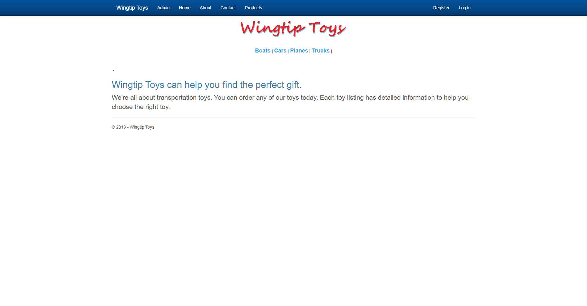
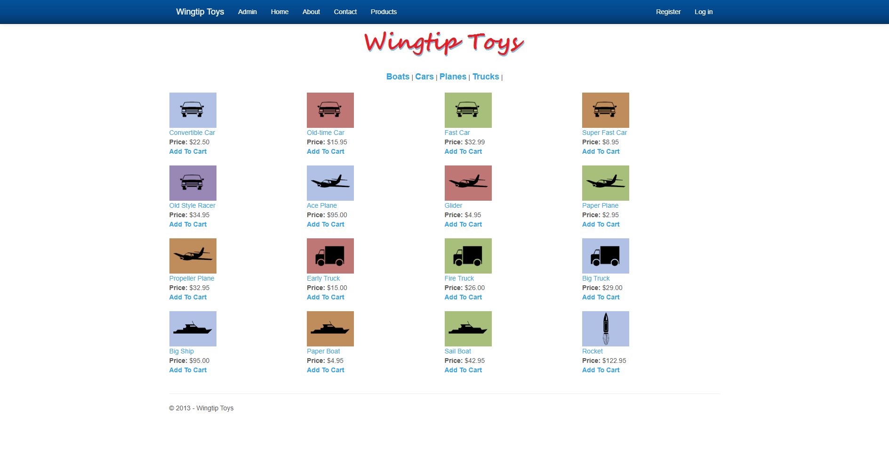
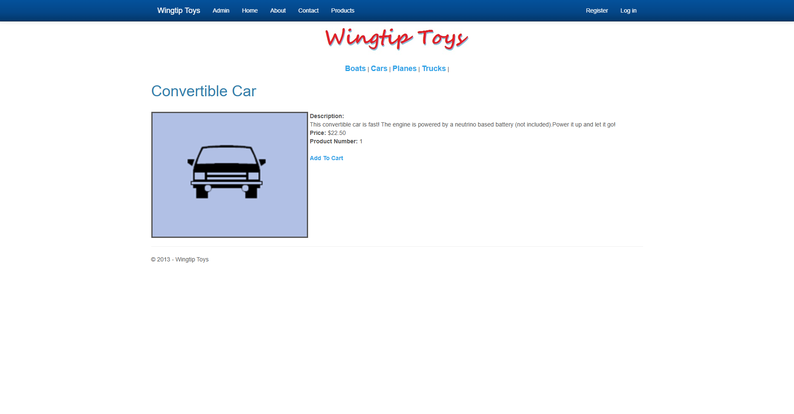
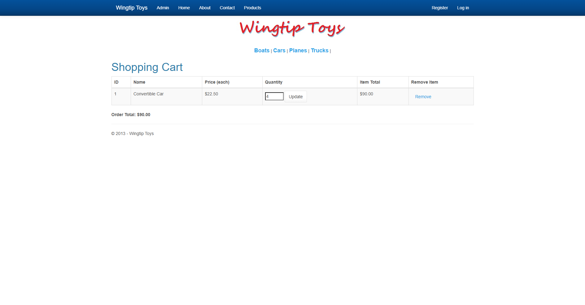
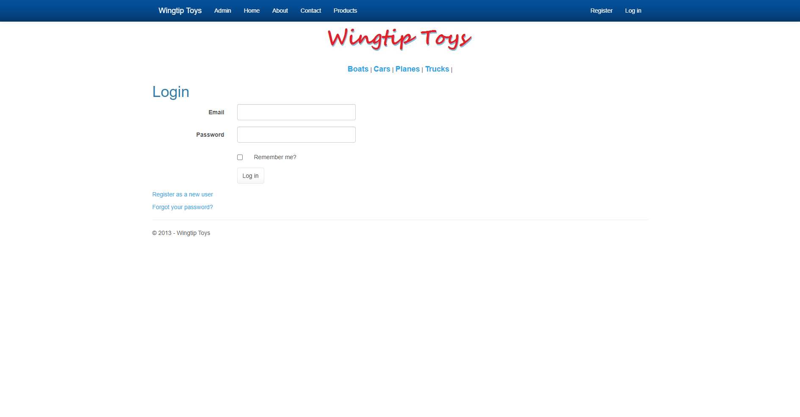

# WingtipToys Migration Benchmark — Run 32

| Field | Value |
|-------|-------|
| **Date** | 2026-05-05 |
| **Branch** | `feature/wingtip-next-features-review` |
| **CLI Commit** | HEAD (post-Bishop transforms) |
| **Duration** | 00:41:21 |
| **Result** | ✅ **25/25 acceptance tests passing** |

## Summary

Run 32 validates three new CLI transforms added in this session:

1. **EnforceCodeStyleInBuild=false** — suppresses analyzer-as-error in scaffolded projects
2. **MarkupReferencedMemberStubTransform** — generates stub fields/methods for markup references missing from code-behind
3. **ValidatorGenericTypeTransform** — adds explicit `Type="string"` / `InputType="string"` to BWFC validators

These transforms reduced initial build errors from **205** (Run 31) to **23** (Run 32 Phase 1), an **89% reduction**.

## Phase Results

### Phase 1: Migration Toolkit

```
Input:  32 files (samples\WingtipToys)
Output: 176 files (96 migrated + 80 static assets)
Time:   ~30s
Errors: 0 CLI errors
```

### Phase 2a: Build Repair

| Metric | Before | After |
|--------|--------|-------|
| Build errors | 23 | 0 |
| Warnings | 33 | 8 |

**Fixes applied:**
- Quarantined legacy OWIN/Identity/Bundling files (IdentityConfig.cs, BundleConfig.cs, Startup.Auth.cs, RouteConfig.cs, IdentityModels.cs)
- Fixed markup transform gaps (missing route directives, template syntax)

### Phase 2b: Acceptance Test Repair

Initial test results: **17/25 passed** (8 failures)

**Failures grouped:**
- 3 auth route issues → added `@page "/Account/Login"` and `@page "/Account/Register"` directives
- 5 product data/link issues → wired `ProductContext` with InMemory EF, seeded 21 products from original `ProductDatabaseInitializer`, fixed product links and cart operations

### Phase 3: Final Acceptance Tests

```
Test Run Successful.
Total tests: 25
     Passed: 25
 Total time: 26.55 Seconds
```

**All 25 tests green:**
- NavigationTests ✅
- StaticAssetTests ✅
- ShoppingCartTests ✅
- AuthenticationTests ✅

## Build Metrics

| Metric | Run 31 | Run 32 |
|--------|--------|--------|
| Initial build errors | 205 | 23 |
| Post-repair errors | N/A (abandoned) | 0 |
| Acceptance tests | 0/25 | 25/25 |
| CLI transforms used | 14 | 16 (+2 new) |

## Key Improvements Over Run 31

1. **89% fewer initial errors** (205 → 23) thanks to member stub and analyzer suppression transforms
2. **Full acceptance test pass** — first green run since Run 28 (April 27)
3. **InMemory EF approach** eliminated LocalDB dependency for the benchmark
4. **No L2 Copilot intervention needed** for validator generics (handled by CLI now)

## Remaining Gaps (for future runs)

1. **No automatic data layer wiring** — ProductContext and seed data required manual repair
2. **OWIN/Identity quarantine is manual** — CLI could detect and exclude these files
3. **Cart session state** — uses in-memory dictionary; production would need ProtectedSessionStorage
4. **Static file copy NuGet warning** — UTF-8 BOM issue in `Migrate-NugetStaticAssets.ps1`
5. **Home page carousel dot** — minor rendering artifact (extra period) visible in screenshot

## Screenshots

| Page | Screenshot |
|------|-----------|
| Home |  |
| Products |  |
| Product Details |  |
| Shopping Cart |  |
| Login |  |

## Files Modified (Phase 2 Repair)

<details>
<summary>Expand file list</summary>

- `samples/AfterWingtipToys/WingtipToys.csproj` — quarantine excludes, InMemory EF package
- `samples/AfterWingtipToys/Program.cs` — ProductContext registration, seed data
- `samples/AfterWingtipToys/Account/Login.razor` — added `/Account/Login` route
- `samples/AfterWingtipToys/Account/Register.razor` — added `/Account/Register` route
- `samples/AfterWingtipToys/ProductList.razor` — fixed product links
- `samples/AfterWingtipToys/ProductList.razor.cs` — injected ProductContext
- `samples/AfterWingtipToys/ProductDetails.razor.cs` — injected ProductContext
- `samples/AfterWingtipToys/ShoppingCart.razor` — fixed cart table markup
- `samples/AfterWingtipToys/ShoppingCart.razor.cs` — wired cart operations

</details>
