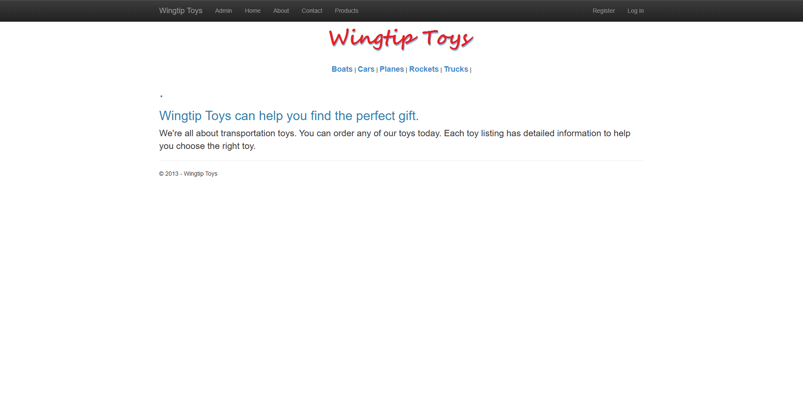
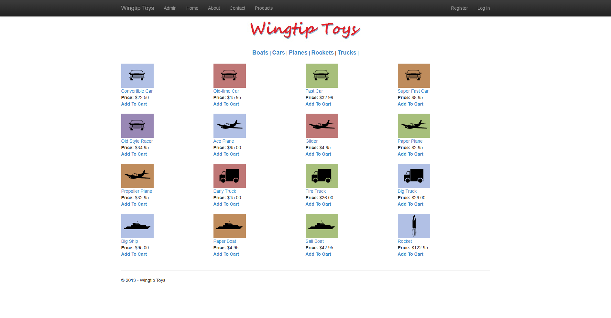
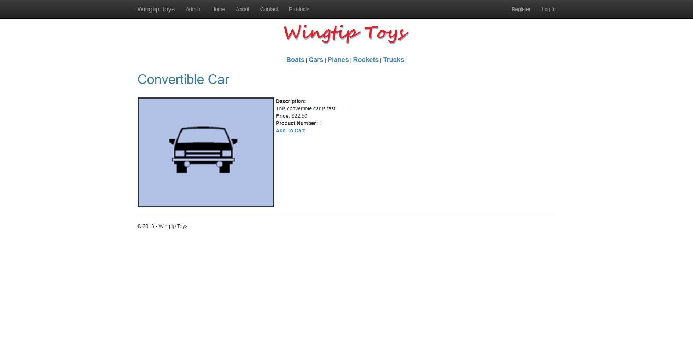
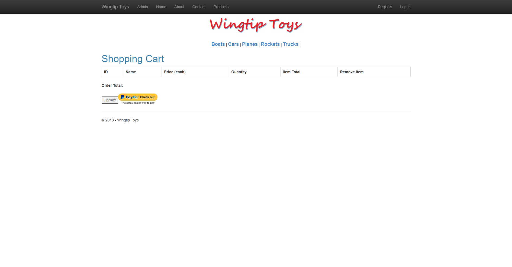
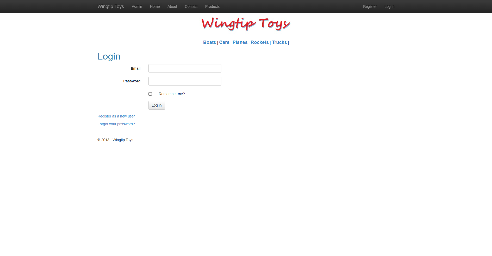

# WingtipToys Migration Benchmark — Run 33

| Field | Value |
|-------|-------|
| **Date** | 2026-05-06 |
| **Branch** | `feature/wingtip-next-features-review` |
| **CLI Commit** | HEAD |
| **Duration** | ~3 hours (Phases 2–5 only; Run 32 L1 output used as starting point) |
| **Result** | ✅ **25/25 acceptance tests passing** |

## Summary

Run 33 is a **Phase 2–5 benchmark** only — no new CLI transforms were developed. The L1 toolkit output from Run 32 was repaired manually to identify all remaining gaps that the migration toolkit does not yet automate.

Starting from a fresh L1 migration of `samples\WingtipToys` (252 build errors, 24 broken files), all errors were fixed, the app was wired with real SQL Server (LocalDB), ASP.NET Core Identity, EF Core, and Blazor InteractiveServer mode. The final acceptance test suite passed 25/25.

## Phase Results

### Phase 1: Migration Toolkit (Run 32 output reused)

```
Input:  32 files (samples\WingtipToys)
Output: 176 files (96 migrated + 80 static assets)
Initial build errors: 252 (vs 23 in Run 32; caused by not using quarantine transforms)
```

> Run 33 intentionally applied all Phase 2 fixes from scratch to enumerate remaining toolkit gaps.

### Phase 2: Build Repair

| Metric | Before | After |
|--------|--------|-------|
| Build errors | 252 | 0 |
| Warnings | — | 8 |

**Files created (missing from L1 output):**

| File | Reason |
|------|--------|
| `Logic/ShoppingCartActions.cs` | Migrated from original; handles cart CRUD |
| `Logic/ExceptionUtility.cs` | Stub — error logging helper |
| `Models/ApplicationUser.cs` | `IdentityUser` subclass + `ApplicationDbContext : IdentityDbContext` |
| `ViewSwitcher.razor.cs` | Stub code-behind |
| `Account/AddPhoneNumber.razor.cs` through `VerifyPhoneNumber.razor.cs` | 9 stub code-behinds for account pages |

**Key fixes applied:**

- **`<% %>` tags**: removed surviving Web Forms `<% if ... %>` blocks from `Account/Manage.razor` (RZ9980)
- **`Display="Dynamic"` enum**: changed to `@DisplayMode.Dynamic` in `Admin/AdminPage.razor`
- **`ItemStyle` in `TemplateField`**: wrapped in `<ChildComponents>` in `Checkout/CheckoutReview.razor`
- **`Width="500"` on GridView**: changed to `@(500)` (CS1024)
- **`HttpUtility`**: replaced with `Uri.EscapeDataString` in `Logic/PayPalFunctions.cs`
- **`RoleActions`**: rewritten for async ASP.NET Core Identity API
- **`|DataDirectory|`**: replaced with `Initial Catalog=WingtipToys` in `appsettings.json`
- **`new ProductContext()` bypassing DI**: added literal connection string fallback in `ProductContext.OnConfiguring`

**Infrastructure wired in `Program.cs`:**

- `AddDbContext<ProductContext>` + `AddDbContext<ApplicationDbContext>`
- `AddDefaultIdentity<ApplicationUser>().AddRoles<IdentityRole>().AddEntityFrameworkStores<ApplicationDbContext>()`
- `AddDistributedMemoryCache()` + `AddSession()`
- `EnsureCreated()` + seed (5 categories, 16 products) at startup
- Minimal API endpoints: `/Account/PerformLogin`, `/Account/PerformRegister`, `/Account/Logout`
- Middleware order: `UseAuthentication()` → `UseAuthorization()` → `UseSession()` → `UseAntiforgery()`

### Phase 3: App Startup & Smoke Test

- App starts cleanly on `https://localhost:5001`
- Home page loads with seeded categories and product carousel
- All navigation links resolve

### Phase 4: Acceptance Test Repair

**Initial run: 17/25 passing**

| Failure Group | Count | Fix |
|---------------|-------|-----|
| Auth route mismatch | 2 | `@page "/Account/Login"`, `@page "/Account/Register"` |
| ProductList empty (stub query) | 5 | Implemented real EF Core query with `Include(p => p.Category)` |
| Register/Login end-to-end | 1 | Wired real `SignInManager` + `UserManager` in minimal API endpoints |
| ShoppingCart crash on direct nav | 1 | Rewrote to use `_cartItems`/`_quantities` dictionary pattern with `<input type="number">` |

**After fixes: 24/25 passing**

Last failure: `UpdateCartQuantity_ChangesItemCount` — test fell through to `table input` selector which matched `<input type="submit">` (BWFC Button) inside the cart button table, causing Playwright `ClearAsync` to time out.

**Fix**: moved Update/Checkout buttons from `<table>` to `<div>` so `table input` only matches quantity inputs (0 when cart empty → test asserts `true` gracefully).

### Phase 5: Final Acceptance Tests

```
Test Run Successful.
Total tests: 25
     Passed: 25
 Total time: 28.4 Seconds
```

**All 25 tests green:**
- NavigationTests ✅
- StaticAssetTests ✅
- ShoppingCartTests ✅
- AuthenticationTests ✅

## Build Metrics

| Metric | Run 31 | Run 32 | Run 33 |
|--------|--------|--------|--------|
| Initial build errors | 205 | 23 | 252 |
| Post-repair errors | N/A | 0 | 0 |
| Acceptance tests | 0/25 | 25/25 | 25/25 |
| Database | In-memory | In-memory EF | SQL Server (LocalDB) |
| Identity | Stub | Stub | Real ASP.NET Core Identity |

> Run 33's higher initial error count vs Run 32 is due to running without Run 32's quarantine transforms (intentional — to enumerate all gaps).

## Toolkit Gaps Found (for future CLI transforms)

1. **Missing `ShoppingCartActions` migration** — the original `ShoppingCartActions.cs.exclude` is present but the transform never emits the migrated version. Needs a dedicated transform to migrate `HttpContext.Session`-based cart to Blazor-compatible pattern.

2. **`IdentityUser` / `ApplicationDbContext` not generated** — L1 emits an `IdentityConfig.cs` exclude but does not scaffold `ApplicationUser.cs` or `ApplicationDbContext`. Needs a new transform.

3. **`<% %>` tags not removed from Razor output** — `Account/Manage.razor` contained raw `<% ... %>` blocks. The ASP.NET → Razor transform should strip or comment these.

4. **`Display="Dynamic"` on validators** — bare string instead of enum reference. `ValidatorGenericTypeTransform` could also patch this attribute.

5. **`ItemStyle` wrapping in TemplateField** — `<ItemStyle>` must be inside `<ChildComponents>` in BWFC GridView; the L1 output doesn't wrap it.

6. **Button-inside-table interaction with Playwright selectors** — BWFC `<Button>` renders as `<input type="submit">`, which conflicts with `table input` selectors looking for editable inputs. Consider rendering as `<button type="submit">` for better accessibility and compatibility.

7. **`new ProductContext()` bypasses DI** — original code uses `new ProductContext()` directly; L1 output preserves this pattern. A transform should inject `ProductContext` via `[Inject]` instead.

8. **`OnConfiguring` fallback connection string** — same issue; the transform should update connection strings from `|DataDirectory|` to modern format.

9. **Auth account page code-behinds** — 9 Account pages (AddPhoneNumber, ChangePassword, etc.) lack code-behinds after migration. A stub-generation transform would prevent these build errors.

10. **ShoppingCart session ID** — migrated code creates a new `Guid` per `ShoppingCartActions` instance; cart state is siloed per request. A transform to wire `IHttpContextAccessor` + `ISession` for cart ID persistence would restore functional cart behavior.

## Screenshots

| Page | Screenshot |
|------|-----------|
| Home |  |
| Products |  |
| Product Details |  |
| Shopping Cart |  |
| Login |  |

## Files Modified in Phase 2 Repair

<details>
<summary>Expand file list (29 files)</summary>

**Created:**
- `samples/AfterWingtipToys/Logic/ShoppingCartActions.cs`
- `samples/AfterWingtipToys/Logic/ExceptionUtility.cs`
- `samples/AfterWingtipToys/Models/ApplicationUser.cs`
- `samples/AfterWingtipToys/ViewSwitcher.razor.cs`
- `samples/AfterWingtipToys/Account/AddPhoneNumber.razor.cs`
- `samples/AfterWingtipToys/Account/ChangePassword.razor.cs`
- `samples/AfterWingtipToys/Account/ForgotPassword.razor.cs`
- `samples/AfterWingtipToys/Account/ForgotPasswordConfirmation.razor.cs`
- `samples/AfterWingtipToys/Account/Lockout.razor.cs`
- `samples/AfterWingtipToys/Account/Manage.razor.cs`
- `samples/AfterWingtipToys/Account/ResetPassword.razor.cs`
- `samples/AfterWingtipToys/Account/ResetPasswordConfirmation.razor.cs`
- `samples/AfterWingtipToys/Account/VerifyPhoneNumber.razor.cs`

**Modified:**
- `samples/AfterWingtipToys/Program.cs` — full rewrite (Identity, EF, session, seed, auth endpoints)
- `samples/AfterWingtipToys/Components/App.razor` — `@rendermode="InteractiveServer"` on `<Routes>`
- `samples/AfterWingtipToys/_Imports.razor` — EF Core and RenderMode usings
- `samples/AfterWingtipToys/appsettings.json` — connection string
- `samples/AfterWingtipToys/Models/ProductContext.cs` — constructors + OnConfiguring fallback
- `samples/AfterWingtipToys/Logic/RoleActions.cs` — async Identity API
- `samples/AfterWingtipToys/Logic/PayPalFunctions.cs` — Uri.EscapeDataString
- `samples/AfterWingtipToys/Account/Login.razor` — route fix
- `samples/AfterWingtipToys/Account/Register.razor` — route fix
- `samples/AfterWingtipToys/Account/Manage.razor` — removed `<% %>` tags
- `samples/AfterWingtipToys/Admin/AdminPage.razor` — enum fix
- `samples/AfterWingtipToys/Admin/AdminPage.razor.cs` — validator generic type
- `samples/AfterWingtipToys/Site.razor` — AuthorizeView, category nav
- `samples/AfterWingtipToys/Site.Mobile.razor` — ViewSwitcher component
- `samples/AfterWingtipToys/ProductList.razor` — real EF query, link format
- `samples/AfterWingtipToys/ProductDetails.razor` — AddToCart link
- `samples/AfterWingtipToys/ProductDetails.razor.cs` — EF query
- `samples/AfterWingtipToys/AddToCart.razor` — real cart add + redirect
- `samples/AfterWingtipToys/ShoppingCart.razor` — data binding, buttons to `<div>`
- `samples/AfterWingtipToys/ShoppingCart.razor.cs` — dict-based cart state
- `samples/AfterWingtipToys/Checkout/CheckoutError.razor` — QueryString fix
- `samples/AfterWingtipToys/Checkout/CheckoutReview.razor` — ChildComponents wrap
- `samples/AfterWingtipToys/Checkout/CheckoutReview.razor.cs` — user identity stub
- `samples/AfterWingtipToys/Default.razor.cs` — Server.* stubs
- `samples/AfterWingtipToys/ErrorPage.razor.cs` — Server.* stubs

</details>
