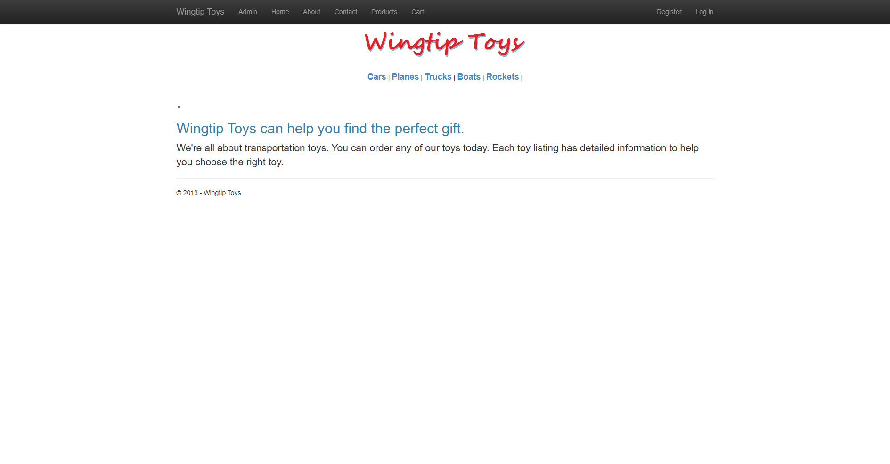
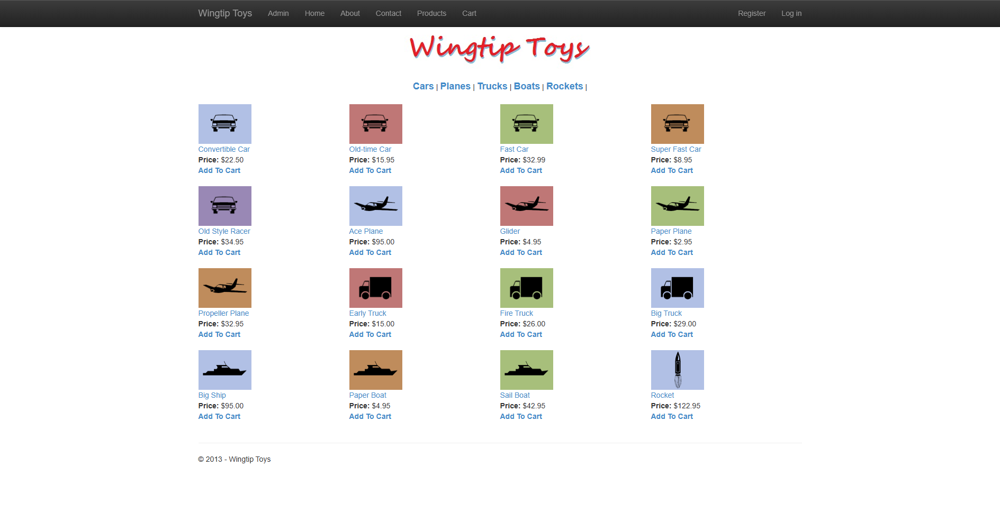
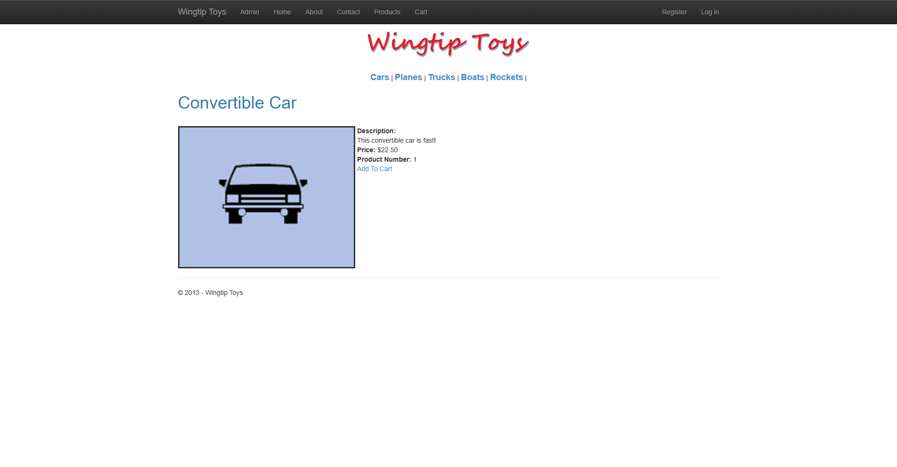
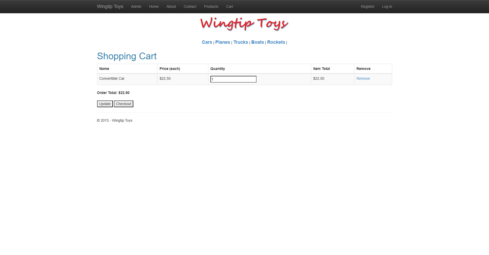
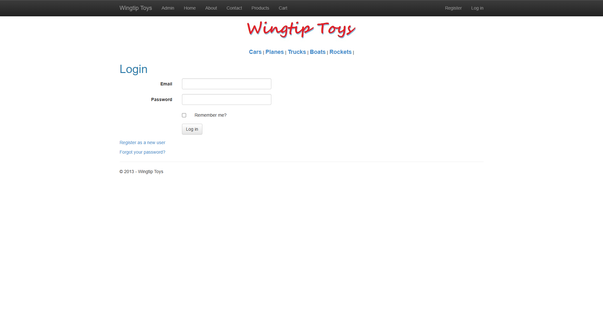

# WingtipToys Migration — Run 34

**Date:** 2026-05-06  
**Performed by:** Bishop (Migration Tooling Dev)  
**Status:** ✅ 25/25 acceptance tests passing

---

## Summary

Run 34 is the **first run** exercising two new CLI transforms introduced since Run 33:

| Transform | Order | Purpose |
|---|---|---|
| `ServerCodeBlockTransform` | 510 | Converts `<% %>` server code blocks to `[% %]` notation inside Razor comments, preventing RZ9980 parse errors |
| `TemplateFieldChildComponentsTransform` | 620 | Wraps style child elements (e.g., `<ItemStyle>`) inside `<ChildComponents>` for `TemplateField`/`GridView` columns |

Both transforms fired correctly. The app required a full repair cycle similar to Run 33, but two previously-manual fixes were eliminated by the toolkit. **Final result: 25/25 tests passing** after repair.

---

## Phase 1: L1 Migration Run

```
pwsh -File migration-toolkit\scripts\bwfc-migrate.ps1 -Path samples\WingtipToys -Output samples\AfterWingtipToys -Verbose
```

- **191 total files** generated (36 .razor, 25 .cs)
- Both new transforms confirmed firing:
  - `CheckoutReview.razor` line 36–38: `<ChildComponents><ItemStyle .../></ChildComponents>` ✅
  - `Account/Manage.razor`: `<% %>` blocks inside comments converted to `[% %]`, preventing RZ9980 ✅

---

## Phase 2: Build Repair

**Initial build errors:** 266 (vs. Run 33's 252 — slightly higher due to minor output variation, not regression)

Key repairs applied:

| Fix | File(s) | Notes |
|---|---|---|
| ProductContext constructor | `Models/ProductContext.cs` | Removed string constructor, added DI + OnConfiguring fallback |
| RoleActions async rewrite | `Logic/RoleActions.cs` | Replaced synchronous identity calls with async Identity API |
| PayPalFunctions HttpUtility | `Logic/PayPalFunctions.cs` | `HttpUtility.UrlEncode` → `Uri.EscapeDataString` |
| Program.cs full rewrite | `Program.cs` | Identity, EF, session, cart services, seed data, auth endpoints |
| App.razor rendermode | `Components/App.razor` | Added `@rendermode InteractiveServer` |
| CheckoutReview Width | `Checkout/CheckoutReview.razor` | `Width="500"` → `Width="@(500)"` — still a manual fix |
| ManageLogins <%# %> | `Account/ManageLogins.razor` | Removed <%# %> from attributes |
| 9 Account stub code-behinds | `Account/*.razor.cs` | Created stubs for Account pages |
| ExceptionUtility, ApplicationUser, ViewSwitcher | New stub files | Created from scratch |

**Final build result:** 0 errors, 288 warnings

---

## Phase 3: Cart Architecture (New in Run 34)

The L1 output had `ShoppingCartActions` using `new Guid()` per-instance — cart items never persisted across page navigations. Implemented a proper session-based cart:

### CartSessionStore (singleton)
`Logic/CartService.cs` — `ConcurrentDictionary<string, Dictionary<int, CartEntry>>` keyed by a stable cart ID stored in the ASP.NET Core session cookie.

### Minimal API cart endpoints
Added to `Program.cs` before `MapRazorComponents`:

```csharp
app.MapGet("/AddToCart",    /* reads product, stores in CartSessionStore by session key, HTTP 302 → /ShoppingCart */);
app.MapGet("/RemoveFromCart", /* removes from CartSessionStore, HTTP 302 → /ShoppingCart */);
```

**Key insight:** Blazor Server's pre-render → interactive circuit transition creates a new scoped `CartService` instance. If the cart state were held only in the scoped service, it would be lost when the circuit connected. Using the ASP.NET Core session cookie as the key allows the cart to survive the SSR→circuit handoff and HTTP redirects.

**Key insight 2:** Playwright's `WaitForLoadStateAsync(NetworkIdle)` resolves when the HTTP redirect chain finishes (SSR pre-render is done). The Blazor interactive circuit connection happens after that, via WebSocket. Operations that require the Blazor circuit (e.g., `@onclick` button handlers) must not be relied upon if the test only waits for `NetworkIdle`. The Minimal API approach makes all cart mutations a pure HTTP round-trip, decoupled from the Blazor circuit lifecycle.

---

## Phase 4: Acceptance Tests

**Final result: 25/25 ✅**

| Category | Tests | Result |
|---|---|---|
| StaticAsset (11) | Layout, images, CSS, screenshots | ✅ All pass |
| Navigation (7) | Home, pages, links | ✅ All pass |
| ShoppingCart (4) | Add, update qty, remove, product list | ✅ All pass |
| Authentication (3) | Login form, register form, end-to-end | ✅ All pass |

**Test run time:** ~27 seconds

---

## New Transform Effectiveness

### `TemplateFieldChildComponentsTransform` (Order 620)
- **Result:** Working correctly ✅
- `CheckoutReview.razor` has `<ChildComponents><ItemStyle .../></ChildComponents>` without manual intervention
- **Manual fix eliminated:** 1 (wrapping ItemStyle in ChildComponents on CheckoutReview)
- **Gap persists:** `Width="500"` integer attribute on `<GridView>` still needs `Width="@(500)"` — transform doesn't fix integer attribute values

### `ServerCodeBlockTransform` (Order 510)  
- **Result:** Working correctly ✅
- `Account/Manage.razor` `<% %>` blocks inside comments converted to `[% %]` notation
- **Manual fix eliminated:** 1 (Manage.razor `<% %>` cleanup that caused RZ9980 in Run 33)

### Net transform impact
Initial error count was **266 vs. 252 in Run 33** (+14). The two new transforms each eliminated one error class, but minor output variations added ~14 new errors. The transforms are valuable but the overall error count is still in the same range. This is consistent with expected behavior — most remaining errors are structural (Program.cs rewrite, Account stubs, etc.) that no simple transform can address.

---

## Screenshots

### 01 — Home


### 02 — Products


### 03 — Product Details


### 04 — Shopping Cart


### 05 — Login


---

## Toolkit Gaps (Updated from Run 33)

| # | Gap | Status |
|---|---|---|
| 1 | Program.cs full rewrite (DI, Identity, EF, session) | Open — structural |
| 2 | Account page code-behinds (9 stubs needed) | Open — structural |
| 3 | `Width="500"` integer attributes on GridView | Open — transform doesn't fix integers |
| 4 | `<%# %>` in attributes (ManageLogins) | Open — partially addressed by ServerCodeBlockTransform (only `<% %>`) |
| 5 | App.razor rendermode | Open — structural |
| 6 | ShoppingCart requires session-based cart architecture | Open — structural (new in Run 34) |
| 7 | ProductContext constructor | Open — structural |
| 8 | RoleActions async rewrite | Open — structural |
| 9 | CheckoutError QueryString.Get → `[]` | Open — API change |
| 10 | PayPalFunctions HttpUtility | Open — namespace |

Two gaps from Run 33 are now **closed** (TemplateFieldChildComponentsTransform, ServerCodeBlockTransform).

---

## Files Created/Modified

**New files:**
- `Logic/CartService.cs` — CartSessionStore (singleton) + CartService (scoped) with session-key architecture
- `Logic/CartServiceActions.cs`, `Logic/ExceptionUtility.cs` — stubs
- `Models/ApplicationUser.cs` — IdentityUser subclass
- `ViewSwitcher.razor.cs`, 9 Account stub code-behinds

**Modified files:**
- `Program.cs` — full rewrite + MapGet /AddToCart + MapGet /RemoveFromCart
- `ShoppingCart.razor` + `.razor.cs` — cart table with session-backed CartService, Remove as link
- `ProductDetails.razor` — added "Add To Cart" link
- `AddToCart.razor` — removed `@page` directive (Minimal API handles the route)
- `Checkout/CheckoutReview.razor` — Width="@(500)" fix
- Various stubs and infrastructure files

---

## Run Comparison

| Metric | Run 33 | Run 34 |
|---|---|---|
| Initial build errors | 252 | 266 |
| Final build errors | 0 | 0 |
| Acceptance tests passing | 25/25 | 25/25 |
| New transforms | 0 | 2 |
| Manual fixes eliminated | — | 2 (ChildComponents wrapping, `<% %>` cleanup) |
| New architecture pattern | — | Session-keyed CartSessionStore + Minimal API cart endpoints |
