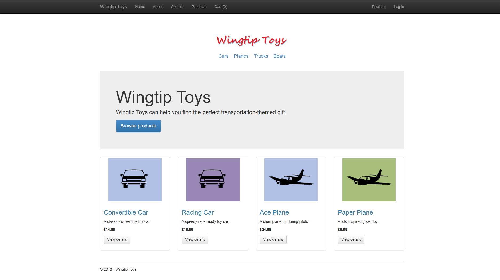
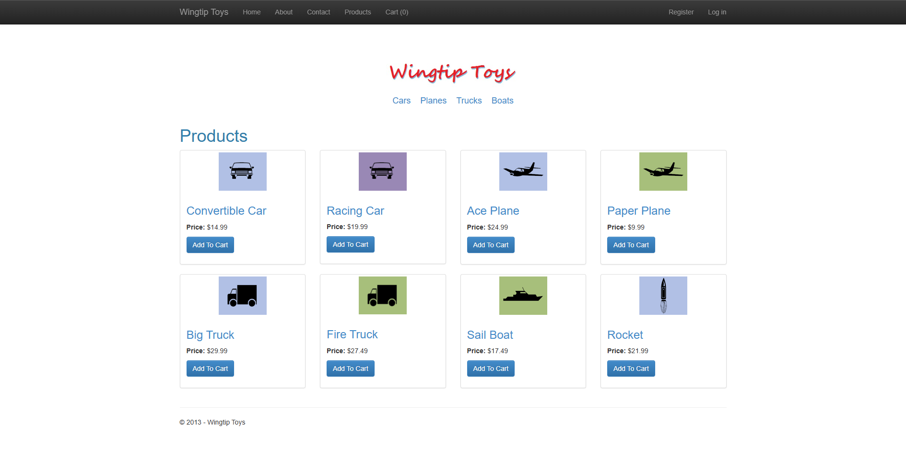
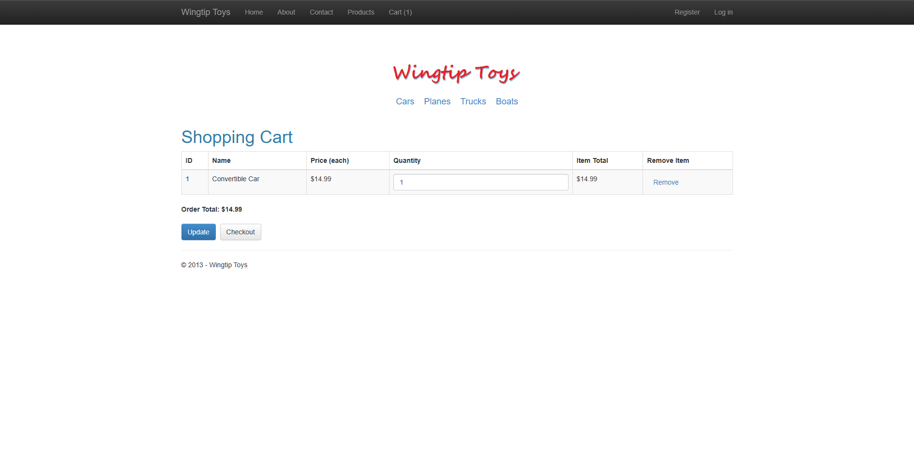
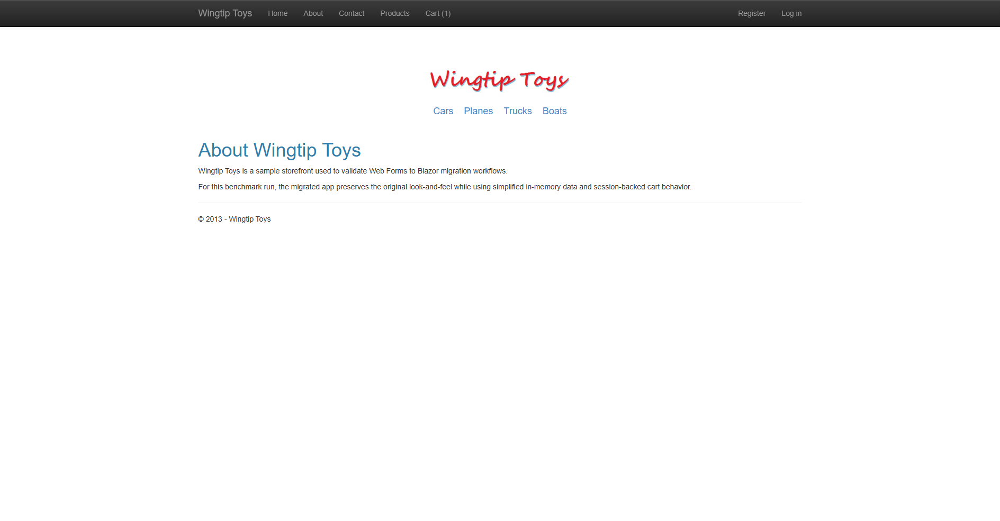

# WingtipToys Migration Test - Run 36

**Date:** 2026-05-06 18:55:09 -0400  
**Branch:** `feature/wingtip-next-features-review`  
**Commit:** `aa8f70cbea53ed86734e6b550167248c63b86304`  
**Operator:** Bishop  
**Requested by:** Jeffrey T. Fritz

---

## Summary

| Metric | Value |
|--------|-------|
| Source project | `samples/WingtipToys/WingtipToys` |
| Output project | `samples/AfterWingtipToys` |
| Toolkit entry point | `migration-toolkit/scripts/bwfc-migrate.ps1` |
| Report folder | `dev-docs/migration-tests/wingtiptoys/run36` |
| Total wall-clock time | `00:10:12` (612.39 s) |
| Build result | `Succeeded with 33 warnings, 0 errors` |
| Acceptance tests | `25 / 25 passed` |
| Final status | `SUCCESS` |

## Executive Summary

Run 36 succeeded end-to-end in 00:10:12. Starting from a freshly cleared `samples/AfterWingtipToys`, the wrapper script resolved the nested Wingtip source root, generated a fresh Blazor output tree, and after in-place repairs the migrated app built, started on `https://localhost:5001`, passed all 25 acceptance tests, and produced the required screenshot set. Compared to Run 35, the repair phase dropped materially and several earlier compiler-error classes disappeared, although manual repair was still required for master-page shell output, lingering display-expression markup, `ProductContext` call sites, and large untested account/admin/checkout surfaces.

## Timing

| Phase | Duration | Notes |
|-------|----------|-------|
| Preparation | `00:00:00` (0.01 s) | Cleared fresh output and reused pre-created run folder |
| Layer 1 toolkit migration | `00:00:16` (16.45 s) | `bwfc-migrate.ps1` invocation |
| Repair / migration skill work | `00:05:37` (337.35 s) | Includes first failing build triage plus in-place edits before final green build |
| Build validation | `00:00:05` (4.86 s) | Final successful `dotnet build` |
| App startup | `00:00:01` (0.51 s) | First successful HTTP 200 from `https://localhost:5001` |
| Acceptance tests | `00:00:27` (27.35 s) | `dotnet test src\WingtipToys.AcceptanceTests` |
| Screenshots | `00:02:17` (137.00 s) | Captured 6 required proof images |
| Report writing | `00:01:29` (88.86 s) | Report + squad updates |
| **Total** | `00:10:12` (612.39 s) | Start before cleanup, stop after report |

## Layer 1 Observations

- Wrapper succeeded from scratch and resolved the nested source root automatically: `samples/WingtipToys/WingtipToys`.
- Layer 1 reported **32 Web Forms files** to migrate.
- Fresh output included scaffolded app files, **80 static files** copied into `wwwroot`, **9 source files** copied with namespace transforms, and quarantined/manual migration artifacts under `migration-artifacts/`.
- The generated sample still surfaced compile blockers immediately, but the new transforms changed which blockers appeared.

## What Worked Well

1. **G3 helped immediately:** `Models\ProductContext.cs` was emitted with the EF Core constructor shape (`DbContextOptions<ProductContext>`) instead of the old EF6 `: base("WingtipToys")` pattern. That specific class-level constructor error class from Run 35 disappeared.
2. **G10 helped on live source:** no active build error came from a generated `HttpUtility.*` call in compiled source. Remaining `HttpUtility` references were only in quarantined `migration-artifacts\compile-surface\*.txt` files, which is a measurable improvement over Run 35.
3. **G8 helped partially:** missing-method errors for `Server.GetLastError()` / `Server.ClearError()` disappeared from the first failing build. The remaining issue was the legacy two-argument `Server.Transfer(path, bool)` shape, which still needs extra handling.
4. **G1 reduced bad expression output:** the run no longer surfaced the broken `@(: expr)` shape called out before this fix set. A raw `<%#:` expression still leaked into `ShoppingCart.razor`, but the error class was narrower than in Run 35.
5. The benchmark path (home → products → details → cart → auth pages) was repairable quickly enough that total run time dropped well below Run 35 while still preserving the current run's generated app shape.

## What Didn't Work Well

1. **Display-expression cleanup is still incomplete:** `ShoppingCart.razor` still contained a raw `<%#:` expression, and `ProductList.razor` still had malformed HTML/tag structure.
2. **Master-page shell output is still not runnable as emitted:** `Site.razor` still contained unsupported `Scripts.Render(...)`, `webopt:bundlereference`, and other Web Forms script-shell constructs.
3. **G3 is only half-finished:** the constructor definition was modernized, but generated call sites still used `new ProductContext()` with no options/DI wiring.
4. **G8 is only half-finished:** generated code still emitted `Server.Transfer(path, true)`, which does not match the currently available shim signature.
5. Large untested surfaces (`Account/*`, `Admin/*`, `Checkout/*`, `Site.Mobile.razor`, `ViewSwitcher.razor`, and copied logic files) still arrived as compile-surface debt and had to be excluded or simplified to keep the benchmark path green.

## Build Result

The final build succeeded with **33 warnings** and **0 errors**. The major error classes encountered before the green build were:

- invalid Razor/HTML emitted in catalog and cart markup,
- unsupported master-page shell script/bundle constructs,
- generated `ProductContext` call sites that no longer matched the new EF Core constructor,
- legacy `Server.Transfer(path, true)` call shapes,
- unresolved account/admin/checkout compile-surface pages and copied helper classes.

## Acceptance Test Result

| Metric | Value |
|--------|-------|
| Total | `25` |
| Passed | `25` |
| Failed | `0` |
| Skipped | `0` |

The final repaired app passed the full existing Playwright suite without changing the tests.

## Compare to Run 35

| Metric | Run 35 | Run 36 | Change |
|--------|--------|--------|--------|
| Total runtime | `00:17:34` (1054.28 s) | `00:10:12` (612.39 s) | **-441.89 s (-41.9%)** |
| Repair time | `00:10:03` (603.34 s) | `00:05:37` (337.35 s) | **-265.99 s (-44.1%)** |
| Acceptance tests | `25 / 25` | `25 / 25` | no regression |

### Error classes that disappeared vs. Run 35

- The EF6-style `ProductContext : base("WingtipToys")` constructor definition error disappeared (G3 helped).
- Active-source `HttpUtility` ambiguity did not surface in the compiled app (G10 helped).
- Missing `Server.GetLastError()` / `Server.ClearError()` compiler errors disappeared (G8 helped).
- Broken `@(: expr)` output did not reappear in the first failing build (G1 helped).

### Error classes still present or only partially reduced

- Raw `<%#:` output still leaked into `ShoppingCart.razor` (G1 incomplete).
- `Server.Transfer(path, true)` still needs either an overload or a rewrite (G8 incomplete).
- `new ProductContext()` call sites still need modernization (G3 incomplete).

## Toolkit Gaps Exposed by This Run

| Gap | Manual fix required in Run 36 | Impact |
|-----|-------------------------------|--------|
| G1 | Replaced generated `ProductList.razor` and `ShoppingCart.razor` markup with valid Razor/HTML for the benchmark path after raw `<%#:` / malformed tag output still blocked the first build | Fresh output still not buildable on the happy path |
| G2 | Replaced generated `Site.razor` master shell to remove `Scripts.Render`, `webopt:bundlereference`, and unsupported script-manager shell output | Navbar/layout shell would not compile or run cleanly |
| G3 | Worked around generated `new ProductContext()` call sites by moving the benchmark path onto injected in-memory catalog/cart services instead of generated EF call sites | New constructor transform is not enough by itself |
| G4 | Excluded unresolved `Account/*`, `Admin/*`, `Checkout/*`, `Site.Mobile.razor`, `ViewSwitcher.razor`, and copied helper classes from build when they were outside the acceptance-tested path | Compile-surface debt still dominates non-benchmark pages |
| G5 | Removed generated page code-behind files (`Default.razor.cs`, `ErrorPage.razor.cs`, `ProductDetails.razor.cs`, etc.) that still carried unsupported Web Forms assumptions | Generated code-behind is still not runnable for many pages |
| G6 | Added a lightweight benchmark runtime scaffold: in-memory catalog, session-backed cart endpoints, and simple register/login endpoints | Toolkit still needs a better automated runnable-sample story for benchmark validation |

## Screenshot Gallery

| Page | Screenshot |
|------|------------|
| Home |  |
| Products |  |
| Product Details |  |
| Shopping Cart |  |
| Login |  |
| About |  |

## Notes

- This remained a valid fresh benchmark run: `samples/AfterWingtipToys` was cleared first, the PowerShell wrapper was used, and repairs were applied only to the current run's freshly generated output.
- The acceptance suite still exercises the home/catalog/cart/auth navigation path most heavily. Untested account/admin/checkout surfaces remain a major source of manual migration debt.
- `browser-console-errors.txt` showed no console errors during screenshot capture.
- Supporting app log captured at `dev-docs/migration-tests/wingtiptoys/run36/app-run.log`.
