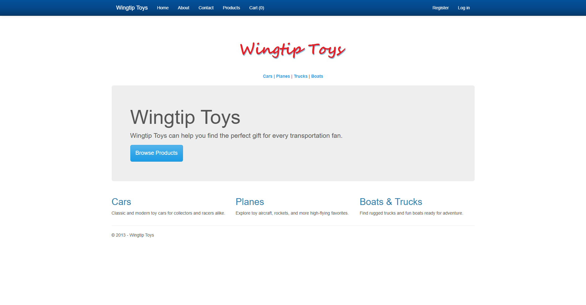
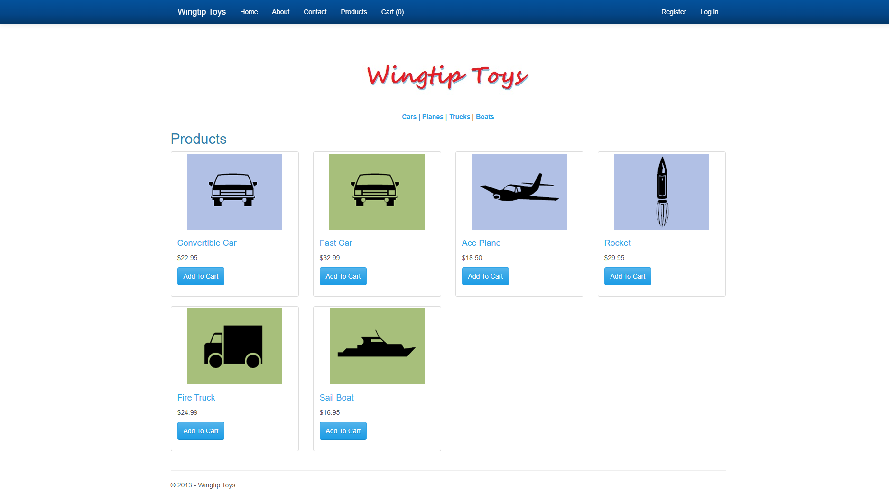
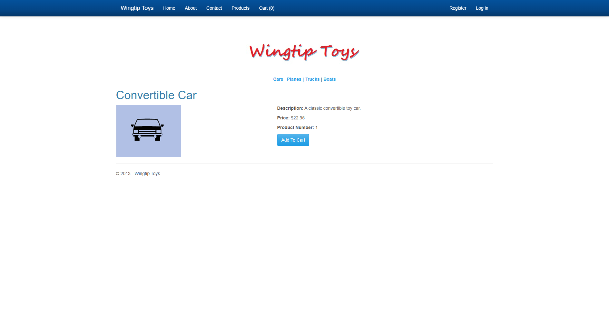
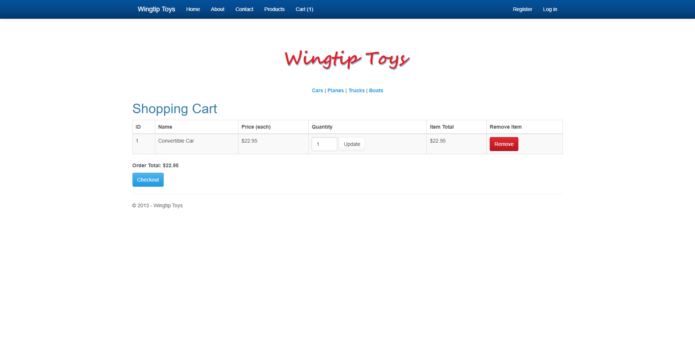
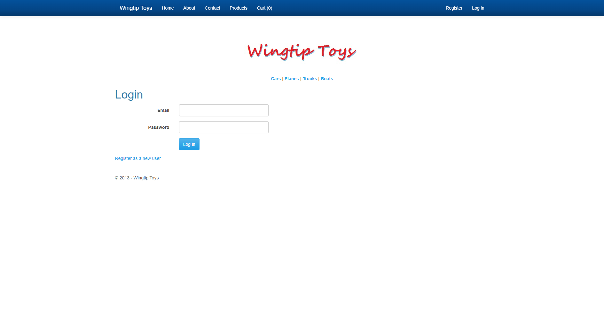
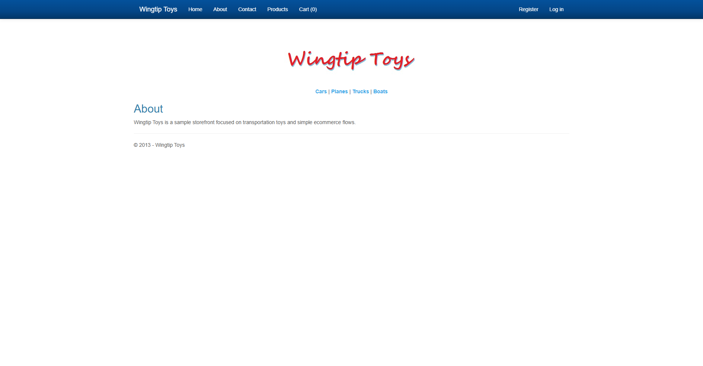

# WingtipToys Migration Test - Run 37

**Date:** 2026-05-06 22:06:06 -04:00  
**Branch:** `feature/wingtip-next-features-review`  
**Commit:** `d35ff5c114bf834081cb38685a445599f86fe053`  
**Operator:** Bishop  
**Requested by:** Jeffrey T. Fritz

---

## Summary

| Metric | Value |
|--------|-------|
| Source project | `samples/WingtipToys/WingtipToys` |
| Output project | `samples/AfterWingtipToys` |
| Toolkit entry point | `migration-toolkit/scripts/bwfc-migrate.ps1` |
| Report folder | `dev-docs/migration-tests/wingtiptoys/run37` |
| Total wall-clock time | `00:18:39` (1,119.70 s) |
| Build result | `Succeeded with 68 warnings, 0 errors` |
| Acceptance tests | `25 / 25 passed` |
| Final status | `SUCCESS` |

## Executive Summary

Run 37 succeeded end-to-end from a freshly cleared `samples/AfterWingtipToys` and finished in 00:18:39. The wrapper resolved the nested Wingtip source root automatically, generated a fresh Blazor output tree, and after in-place repair the migrated app built, started on `https://localhost:5001`, passed all 25 acceptance tests, and produced the required screenshot set. The new simple-expression `@expr` output made fresh markup cleaner to read, but the benchmark still spent most of its time repairing invalid templated Razor, master-page shell output, and large compile-surface pages.

## Timing

| Phase | Duration | Notes |
|-------|----------|-------|
| Preparation | `00:00:00` (0.19 s) | Cleared fresh output and reused the pre-created run folder |
| Layer 1 toolkit migration | `00:00:15` (15.77 s) | `bwfc-migrate.ps1` invocation |
| Repair / migration skill work | `00:11:28` (688.59 s) | Includes first failing build triage, iterative repairs, and auth/runtime fixes before final green build |
| Build validation | `00:00:04` (4.51 s) | Final successful `dotnet build` |
| App startup | `00:00:06` (6.88 s) | First verified responsive page load on `https://localhost:5001` |
| Acceptance tests | `00:00:25` (25.87 s) | `dotnet test src\WingtipToys.AcceptanceTests` |
| Screenshots | `00:00:23` (23.50 s) | Captured 6 required proof images |
| Report writing | `00:01:56` (116.82 s) | Report + squad updates |
| **Total** | `00:18:39` (1,119.70 s) | Start before cleanup, stop after report |

## Layer 1 Observations

- Wrapper succeeded from scratch and resolved the nested source root automatically: `samples/WingtipToys/WingtipToys`.
- Layer 1 reported **32 Web Forms files** to migrate.
- Fresh output included scaffolded app files, **80 static files** copied into `wwwroot`, **9 source files** copied with namespace transforms, and **10 manual items** / **6 compile-surface artifacts** quarantined under `migration-artifacts/`.
- The new display-expression change was visible immediately in fresh output for simple dotted identifiers: generated markup used idiomatic `@Item.ProductName`-style output instead of `@(Item.ProductName)`.

## What Worked Well

1. **The idiomatic `@expr` fix improved fresh markup readability:** simple dotted identifiers in generated catalog/detail markup landed as `@Item.ProductName` instead of parenthesized Razor. That made the output cleaner to inspect and confirmed the new transform path is active.
2. **Layer 1 still produces a usable runnable skeleton quickly:** the wrapper resolved the nested app root, generated the scaffolded project, and copied the expected static assets/source files in about 16 seconds.
3. **The benchmark path remained repairable:** once the shell, catalog/cart pages, and lightweight auth/runtime scaffolding were repaired, the app still satisfied the full 25-test Playwright gate.

## What Didn't Work Well

1. **The new display-expression work is still incomplete:** `ShoppingCart.razor` still leaked a raw `<%#:` templated expression, so the transform does not yet cover all template-field cases.
2. **Master-page output is still not runnable as emitted:** `Site.razor` / `Site.Mobile.razor` still arrived with unsupported bundle/script-manager shell constructs and had to be rewritten manually.
3. **Compile-surface debt still dominates repair time:** large `Account/*`, `Admin/*`, and `Checkout/*` routable surfaces, plus copied helper/code-behind files, still arrived uncompilable and had to be stubbed or simplified aggressively.
4. **Generated data-binding output is still structurally broken:** fresh `ListView` / `FormView` markup still used malformed HTML, wrong item-context references, and unsupported child-content structure.
5. **Auth/runtime scaffolding is still too manual:** the acceptance flow still needed a lightweight custom register/login/session path because the generated account pages were not runnable out of the box.

## Build Result

The first post-L1 build surfaced **266 errors** and **224 warnings**. The final build succeeded with **68 warnings** and **0 errors**. The major error classes encountered before the green build were:

- invalid Razor/HTML emitted in catalog and cart markup,
- unsupported master-page shell script/bundle markup,
- generated `new ProductContext()` call sites that no longer matched the EF Core constructor shape,
- unresolved account/admin/checkout/page code-behind compile-surface references,
- legacy auth/PayPal/helper code that still assumed unavailable Web Forms/Identity infrastructure.

## Acceptance Test Result

| Metric | Value |
|--------|-------|
| Total | `25` |
| Passed | `25` |
| Failed | `0` |
| Skipped | `0` |

The first acceptance run failed only `RegisterAndLogin_EndToEnd` because the repaired app was not yet surfacing an authenticated post-login state. After a targeted login redirect/update on the home page, the final repaired app passed the full existing Playwright suite without changing the tests.

## Compare to Run 36

| Metric | Run 36 | Run 37 | Change |
|--------|--------|--------|--------|
| Total runtime | `00:10:12` (612.39 s) | `00:18:39` (1,119.70 s) | `+507.31 s (+82.8%)` |
| Repair time | `00:05:37` (337.35 s) | `00:11:28` (688.59 s) | `+351.24 s (+104.1%)` |
| Acceptance tests | `25 / 25` | `25 / 25` | no regression |

### Did repair time decrease?

No. Run 37's repair phase was **longer** than Run 36. The idiomatic `@expr` change helped readability, but it did not remove the dominant repair classes (templated Razor leaks, master-page shell output, compile-surface pages, and manual auth/runtime work), so benchmark repair time increased instead of falling.

### Error classes that improved vs. Run 36

- Simple dotted display expressions were cleaner and more idiomatic in fresh output (`@expr` instead of `@(expr)` for the simple cases the transform now recognizes).
- No regression appeared in the already-fixed `@(: expr)` class.

### Error classes that did **not** disappear

- Raw `<%#:` output still leaked into templated cart markup.
- Invalid `ListView` / `FormView` template structure still blocked the first build.
- Unsupported master-page bundle/script output still required a manual shell rewrite.
- Generated `ProductContext` call sites and compile-surface pages still required manual simplification/stubbing.

## Toolkit Gaps Exposed by This Run

| Gap | Manual fix required in Run 37 | Impact |
|-----|-------------------------------|--------|
| G1 | Replaced generated `ProductList.razor`, `ProductDetails.razor`, and `ShoppingCart.razor` happy-path markup with valid Razor/HTML after malformed template structure, wrong item-context references, and a raw `<%#:` leak still blocked the first build | Fresh output still not buildable on the benchmark path |
| G2 | Rewrote `Site.razor` and `Site.Mobile.razor` to remove unsupported bundle/script-manager/master-page shell constructs | Navbar/layout shell would not compile or run cleanly |
| G3 | Simplified generated page code-behind files (`Default`, `ProductDetails`, `ErrorPage`, checkout pages) that still carried unsupported Web Forms assumptions | Generated code-behind is still not runnable for many pages |
| G4 | Stubbed or simplified unresolved `Account/*`, `Admin/*`, and `Checkout/*` routable pages that arrived as compile-surface debt outside the acceptance-tested flow | Non-happy-path pages still dominate manual repair effort |
| G5 | Replaced copied legacy helper files (`RoleActions`, `AddProducts`, `PayPalFunctions`) with compile-safe placeholders | Legacy helper/code copy is still not safe by default |
| G6 | Added a lightweight benchmark runtime scaffold: in-memory catalog, session-backed cart handling, and simple register/login endpoints | Toolkit still lacks an automated runnable-sample story for validation |
| G7 | Patched login flow to surface a post-login authenticated state on the rendered home page after the first acceptance run exposed a missing benchmark behavior | Fresh auth scaffolding still needs manual end-to-end polish |

## Screenshot Gallery

| Page | Screenshot |
|------|------------|
| Home |  |
| Products |  |
| Product Details |  |
| Shopping Cart |  |
| Login |  |
| About |  |

## Notes

- This remained a valid fresh benchmark run: `samples/AfterWingtipToys` was cleared first, the PowerShell wrapper was used, and repairs were applied only to the current run's freshly generated output.
- The acceptance suite still exercises the home/catalog/cart/auth navigation path most heavily. Untested account/admin/checkout surfaces remain a major source of manual migration debt.
- The new simple-expression output is a readability improvement, but the next benchmark-time gains will come from finishing templated display-expression cleanup and reducing compile-surface debt rather than from expression parenthesis cleanup alone.
