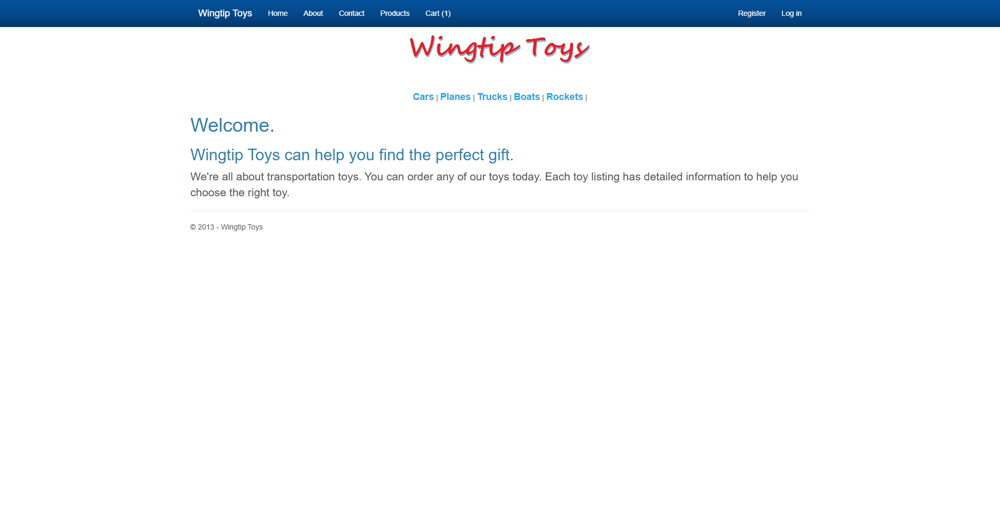
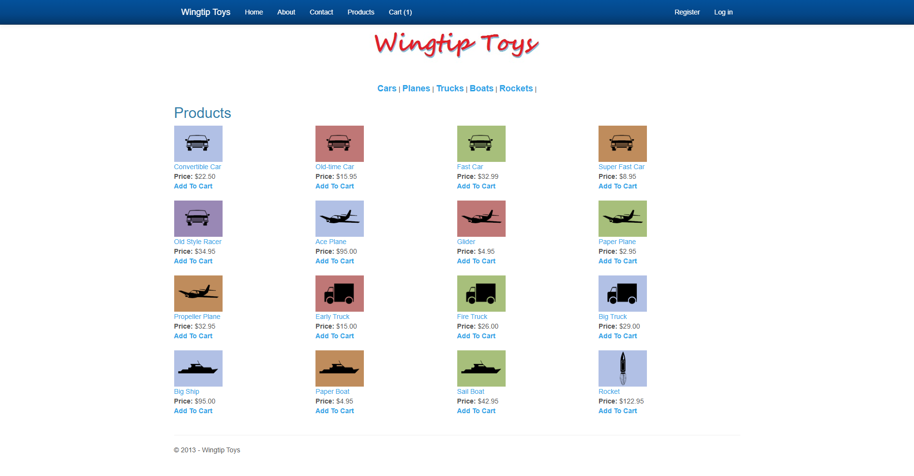
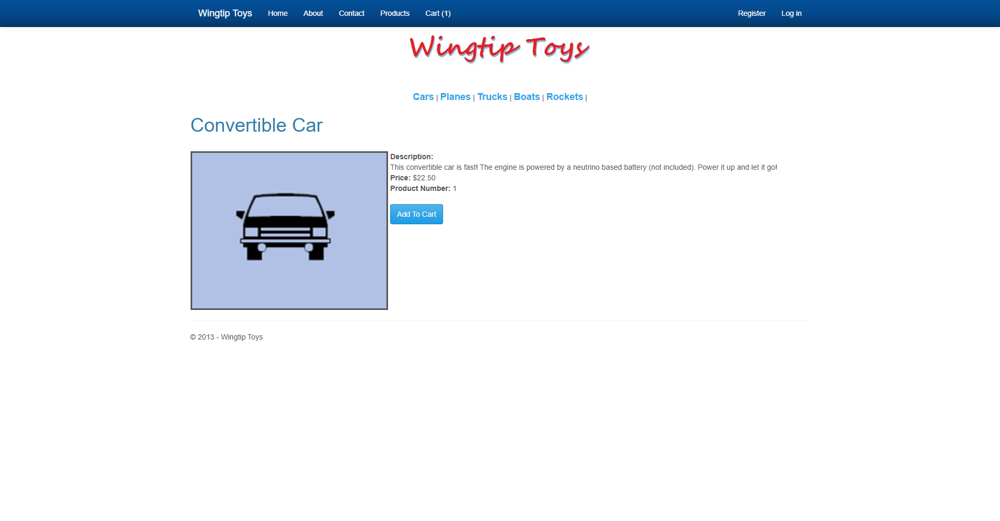
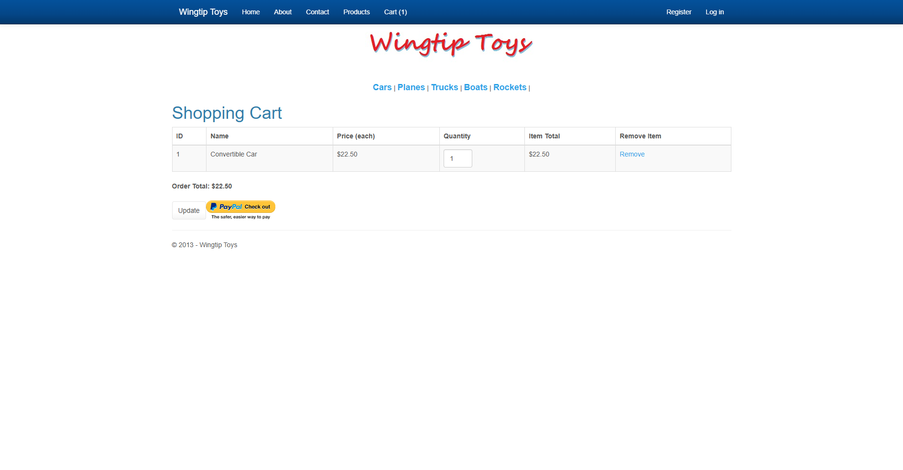
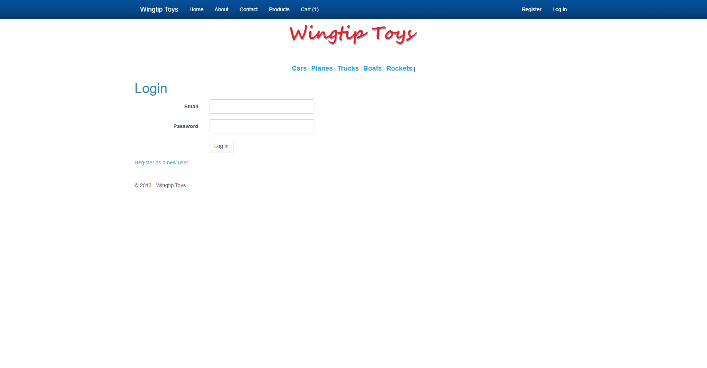
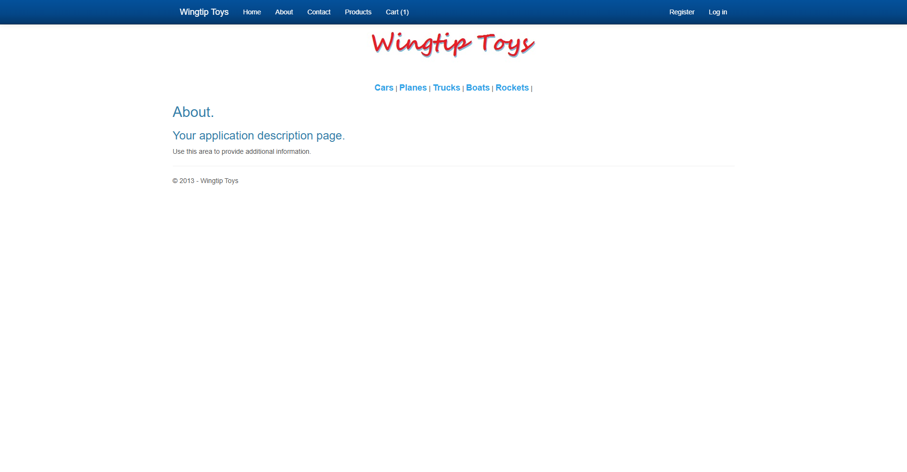

# WingtipToys Migration Test - Run 39

**Date:** 2026-05-07 11:40:17 -04:00  
**Branch:** `feature/wingtip-next-features-review`  
**Commit:** `24c144ab`  
**Operator:** Bishop (Copilot CLI)  
**Requested by:** Jeffrey T. Fritz

---

## Summary

| Metric | Value |
|--------|-------|
| Source project | `samples/WingtipToys/WingtipToys` |
| Output project | `samples/AfterWingtipToys` |
| Toolkit entry point | `migration-toolkit/scripts/bwfc-migrate.ps1` |
| Report folder | `dev-docs/migration-tests/wingtiptoys/run39` |
| Total wall-clock time | `00:38:34.12` |
| Build result | `Succeeded (8 warnings, 0 errors)` |
| Acceptance tests | `25 / 25 passed` |
| Final status | `SUCCESS` |

## Executive Summary

Run 39 completed successfully from a freshly cleared `samples\AfterWingtipToys\` folder. The first repaired build and first acceptance run exposed two benchmark-critical regressions after fresh migration output: the `ProductDetails` page rendered only shell chrome because `FormView` did not materialize its first item until after initial render, and the shopping cart state disappeared across requests because page-side cart lookup relied on shimmed session values that did not round-trip raw string session entries consistently.

The final repaired output preserved the required BWFC data controls on the benchmark path:

- `ProductList.razor` uses **`ListView`**
- `ProductDetails.razor` uses **`FormView`**
- `ShoppingCart.razor` uses **`GridView`**

After fixing those regressions and rebuilding, the migrated app passed the full existing Playwright suite with **25/25 green tests**.

## Timing

| Milestone | Value |
|-----------|-------|
| Start | `2026-05-07T11:01:42.8788369-04:00` |
| Finish | `2026-05-07 11:40:17 -04:00` |
| Total | `00:38:34.12` |

## Commands

```powershell
# Clear output
Get-ChildItem samples\AfterWingtipToys -Force | Remove-Item -Recurse -Force

# Run migration toolkit
pwsh -File migration-toolkit\scripts\bwfc-migrate.ps1 -Path samples\WingtipToys -Output samples\AfterWingtipToys -Verbose

# Build migrated app
 dotnet build samples\AfterWingtipToys\WingtipToys.csproj

# Run app
 dotnet run --project samples\AfterWingtipToys\WingtipToys.csproj

# Acceptance tests
 dotnet test src\WingtipToys.AcceptanceTests\WingtipToys.AcceptanceTests.csproj --verbosity normal
```

## What Worked Well

1. The Layer 1 migration again produced the expected Blazor project skeleton, static assets, and benchmark-path pages from raw Wingtip source.
2. The acceptance-path pages were recoverable **without replacing BWFC data controls with manual HTML**, which satisfied the benchmark constraint.
3. The simplified in-memory catalog, cart, and auth runtime remained sufficient for the benchmark suite.
4. Once the `FormView` and cart persistence issues were corrected, the existing tests passed without any test-only special casing.

## What Failed Initially

1. Fresh `ProductDetails` navigation showed only the shell and footer; the page body did not render product content, so all cart-flow tests failed at first.
2. `FormView` only established `CurrentItem` on first render instead of during parameter processing, leaving SSR output blank on initial request.
3. The cart page initially showed `Cart (1)` in the navbar but still rendered `Your shopping cart is empty.` because page-side cart ID lookup was not reading persisted string session values consistently.
4. Running rebuilds while the app was still live caused transient `MSB3027/MSB3021` output-lock copy failures until the listening process on port 5001 was stopped.

## Repairs Applied

1. **Preserved acceptance-path BWFC controls** and repaired their runtime wiring instead of flattening them:
   - `ProductList` kept `ListView`
   - `ProductDetails` kept `FormView`
   - `ShoppingCart` kept `GridView`
2. **Fixed `FormView` in the library** (`src/BlazorWebFormsComponents/FormView.razor.cs`) so `CurrentItem` is established during `OnParametersSet()`, enabling the initial SSR response to render item content.
3. **Fixed `SessionShim` string hydration** (`src/BlazorWebFormsComponents/SessionShim.cs`) so raw string values stored in ASP.NET Core session can round-trip through the shim.
4. **Updated cart-ID resolution in `Site.razor` and `ShoppingCart.razor`** to read/write directly against `Context.Session` for benchmark-path request persistence.
5. Rebuilt the migrated app and reran the full acceptance suite to confirm the final repaired output.

## Build Result

Final build status was **success** with **8 warnings and 0 errors**.

- Final saved build log: `dev-docs/migration-tests/wingtiptoys/run39/build-final.log`
- Major remaining warnings are the upstream NU1510 package-pruning warnings from `BlazorWebFormsComponents.csproj`

## Acceptance Test Result

| Metric | Value |
|--------|-------|
| Total | `25` |
| Passed | `25` |
| Failed | `0` |
| Skipped | `0` |

The final passing run is captured in:

- `dev-docs/migration-tests/wingtiptoys/run39/acceptance-final.log`

The earlier failing run (22/25) is preserved in:

- `dev-docs/migration-tests/wingtiptoys/run39/phase5-tests1.log`

## Toolkit / Runtime Gaps Exposed by Run 39

1. **FormView first-render gap:** benchmark details pages can still arrive behaviorally blank unless the control establishes its current item before first SSR output.
2. **Session interop gap:** mixed raw-string ASP.NET Core session values and shim-based reads need consistent handling.
3. **Acceptance-path runtime gap:** migrated output still needed manual catalog/cart/auth runtime wiring to satisfy the benchmark suite end-to-end.
4. **Compile-surface debt remains:** the run still relied on prior compile-surface reduction strategy to keep non-benchmark generated artifacts from blocking the path to green.

## Comparison to Prior Run

- **Run 38:** `00:21:21.68` total, `25/25` passed.
- **Run 39:** `00:38:34.12` total, `25/25` passed.
- **Net:** Run 39 was slower because the fresh-output repair cycle had to chase a blank `ProductDetails` SSR regression, then a cart persistence mismatch between request-side session storage and page-side session reads.

## Screenshot Gallery

| Page | Screenshot |
|------|------------|
| Home |  |
| Products |  |
| Product Details |  |
| Shopping Cart |  |
| Login |  |
| About |  |

## Logs Captured

- `phase1-migration.log`
- `phase2-build1.log`
- `phase2-build2.log`
- `phase2-build3.log`
- `phase2-build4.log`
- `phase2-build5.log`
- `build-final.log`
- `phase5-tests1.log`
- `acceptance-final.log`

## Notes

- Benchmark integrity rules were followed: the run started from raw `samples\WingtipToys`, the output folder was cleared first, and repairs were applied only to fresh run output.
- The final app server was stopped after validation so the workspace is left clean.
- User-supplied screenshots during debugging matched the observed SSR blank-content state and helped confirm when the benchmark path was repaired.
