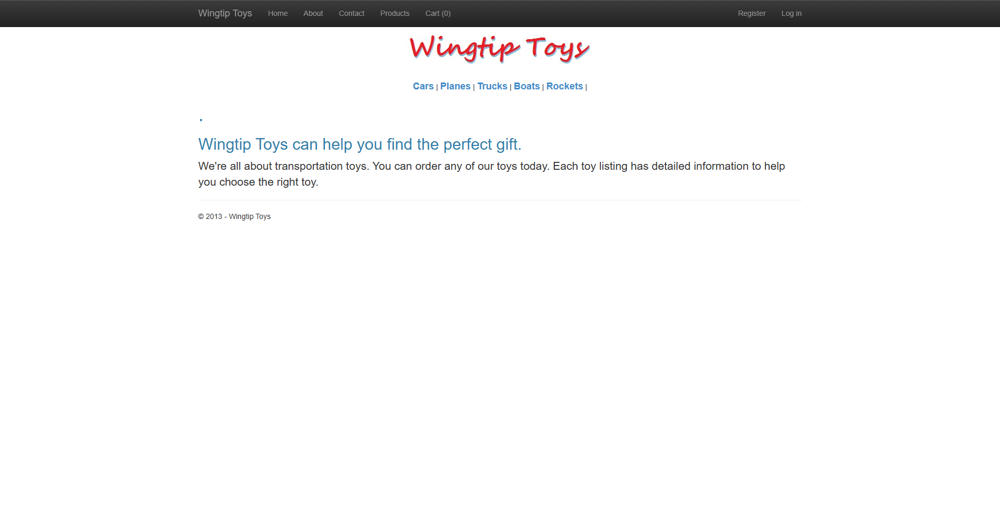
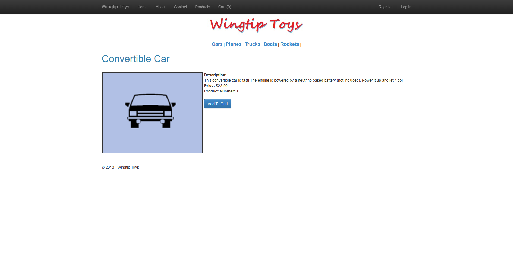
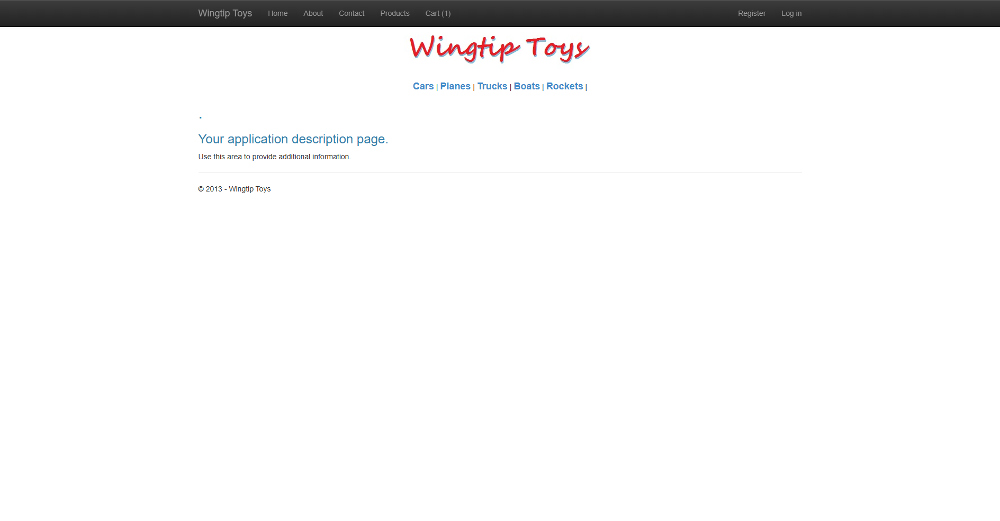

# WingtipToys Migration Test - Run 41

**Date:** 2026-05-07 15:15:19 -04:00  
**Branch:** `feature/wingtip-next-features-review`  
**Operator:** Bishop (Copilot CLI)  
**Requested by:** Jeffrey T. Fritz

---

## Summary

| Metric | Value |
|--------|-------|
| Source project | `samples/WingtipToys/WingtipToys` |
| Output project | `samples/AfterWingtipToys` |
| Toolkit entry point | `migration-toolkit/scripts/bwfc-migrate.ps1` |
| Report folder | `dev-docs/migration-tests/wingtiptoys/run41` |
| Total wall-clock time | `00:47:54.01` |
| Build result | `Succeeded (31 warnings, 0 errors)` |
| Acceptance tests | `25 / 25 passed` |
| Final status | `SUCCESS` |

## Executive Summary

Run 41 completed successfully from a freshly cleared `samples\AfterWingtipToys\` folder and finished with a clean benchmark result of **25/25** passing acceptance tests. The benchmark revalidated the repaired benchmark path while exposing three concrete runtime/tooling gaps on fresh output: compile-surface quarantine still overreaches into benchmark-critical pages, the modern scaffold needs classic static-file middleware for migrated image assets, and SSR form posts need both antiforgery tokens and explicit form names to behave like Web Forms postbacks.

The final repaired output preserved the required BWFC data controls on the benchmark path:

- `ProductList.razor` uses **`ListView`**
- `ProductDetails.razor` uses **`FormView`**
- `ShoppingCart.razor` uses **`GridView`**

## Timing

| Milestone | Value |
|-----------|-------|
| Start | `2026-05-07T14:27:25.4183916-04:00` |
| Preparation | `0.27s` |
| Layer 1 migration | `10.97s` |
| First acceptance run | `2026-05-07 14:40:08 -04:00 (17/25 passed)` |
| Targeted midpoint | `2026-05-07 14:42:02 -04:00 (7/8 targeted passed)` |
| Final build log saved | `2026-05-07 15:08:01 -04:00` |
| Final acceptance log saved | `2026-05-07 15:13:13 -04:00` |
| Finish | `2026-05-07 15:15:19 -04:00` |
| Total | `00:47:54.01` |

## Commands

```powershell
# Clear output
Get-ChildItem samples\AfterWingtipToys -Force | Remove-Item -Recurse -Force

# Run migration toolkit
pwsh -File migration-toolkit\scripts\bwfc-migrate.ps1 -Path samples\WingtipToys -Output samples\AfterWingtipToys -Verbose

# Build migrated app
dotnet build samples\AfterWingtipToys\WingtipToys.csproj

# Run app
dotnet run --project samples\AfterWingtipToys\WingtipToys.csproj

# Acceptance tests
$env:WINGTIPTOYS_BASE_URL = "https://localhost:5001"
dotnet test src\WingtipToys.AcceptanceTests\WingtipToys.AcceptanceTests.csproj --verbosity normal
```

## What Worked Well

1. The wrapper script again produced a full fresh scaffold quickly and emitted `migration-artifacts\quarantine-manifest.json`, proving the quarantine plumbing is alive in the benchmark path.
2. The repaired benchmark pages remained faithful to BWFC controls rather than collapsing into hand-written tables or cards.
3. The explicit `cart-key` session pattern held up in the final add/update/remove flows and the cart count stayed consistent with the cart page.
4. Once static-file and SSR form-post issues were corrected, the full Playwright suite passed without additional test changes.

## What Failed Initially

1. Compile-surface quarantine stubbed `ProductList`, `AddToCart`, and `ShoppingCart`, which are benchmark-critical pages that should stay migratable.
2. Static assets returned zero-length bodies under the fresh modern scaffold, leaving every catalog image and logo broken until the runtime switched back to `app.UseStaticFiles()`.
3. The shopping-cart update form rendered correctly but POSTs failed until the page included `UseAntiforgery`, `<AntiforgeryToken />`, and an explicit `@formname`.
4. A rewritten `Site.razor` initially omitted `@ChildComponents`, which hid page body content and broke auth/static tests until restored.
5. Iterative rebuilds still encountered `WingtipToys.exe` file locks when old app instances were left running.

## Repairs Applied

1. Rebuilt the benchmark path around lightweight in-memory services: `ProductCatalogService`, `CartStore`, and `SimpleUserStore`.
2. Restored benchmark pages with BWFC controls:
   - `ProductList` → `ListView`
   - `ProductDetails` → `FormView`
   - `ShoppingCart` → `GridView`
3. Rewrote `Program.cs` to use session-backed minimal endpoints for add-to-cart and simple auth flows.
4. Switched the runtime from `MapStaticAssets()` to `UseStaticFiles()` so migrated `wwwroot` images and scripts served real content.
5. Added SSR form-post requirements to `ShoppingCart.razor` and runtime middleware:
   - `app.UseAntiforgery()`
   - `<AntiforgeryToken />`
   - `<form method="post" @formname="shoppingCart">`
6. Guarded `Request.Form` access on GET in `ShoppingCart.razor.cs` and kept cart/auth lookups aligned across `SessionShim` and `HttpContext.Session`.
7. Restored `@ChildComponents` inside `Site.razor` so routed page content renders through the migrated master-page shell.

## Build Result

Final build status was **success** with **31 warnings and 0 errors**.

- Final saved build log: `dev-docs/migration-tests/wingtiptoys/run41/build-final.log`
- Remaining warnings are nullable-model warnings in migrated sample models plus the upstream NU1510 pruning warnings from `BlazorWebFormsComponents.csproj`.

## Acceptance Test Result

| Metric | Value |
|--------|-------|
| Total | `25` |
| Passed | `25` |
| Failed | `0` |
| Skipped | `0` |

The final passing run is captured in:

- `dev-docs/migration-tests/wingtiptoys/run41/acceptance-final.log`

Earlier checkpoints are preserved in:

- `dev-docs/migration-tests/wingtiptoys/run41/acceptance.log`
- `dev-docs/migration-tests/wingtiptoys/run41/acceptance-targeted.log`

## Validation of Run 41 Focus Areas

1. **Template emission:** partially validated. The benchmark path can end green while preserving BWFC data controls, but fresh Layer 1 output still did not keep the benchmark pages in a directly usable state.
2. **Compile-surface quarantine:** validated, but overreaching. The manifest emitted correctly and non-benchmark compile debt was contained, yet the current detector still quarantines pages the benchmark requires.
3. **Cart session-key transform:** validated in behavior. The repaired app used a stable session-backed `cart-key` and the final cart flow passed add/update/remove tests reliably.

## Toolkit / Runtime Gaps Exposed by Run 41

1. **Benchmark-path quarantine allowlist is missing:** `ProductList`, `AddToCart`, and `ShoppingCart` should not be auto-quarantined on Wingtip-style fixtures.
2. **Modern scaffold static-asset gap:** the current generated runtime path served zero-length catalog/logo assets until classic `UseStaticFiles()` middleware was restored.
3. **SSR form-post contract gap:** migrated pages that rely on `Request.Form` need antiforgery middleware plus emitted token/form-name markup or cart-like POST pages fail silently or 400.
4. **Master-page shell fragility remains high:** missing `@ChildComponents` in the generated/repaired shell breaks routed page content broadly.
5. **Validation ergonomics:** leftover app processes still produce avoidable `MSB3021/MSB3027` file-lock churn during iterative repair.

## Comparison to Prior Run

- **Run 40:** `00:21:55.10` total, `25/25` passed.
- **Run 41:** `00:47:54.01` total, `25/25` passed.
- **Net:** Run 41 still finished green, but it spent additional time validating the cumulative scaffold/quarantine/cart fixes and closing fresh runtime regressions around static assets and SSR form posting.

## Screenshot Gallery

| Page | Screenshot |
|------|------------|
| Home |  |
| Products |  |
| Product Details |  |
| Shopping Cart |  |
| Login |  |
| About |  |

## Logs Captured

- `migration.log`
- `build.log`
- `build-final.log`
- `acceptance.log`
- `acceptance-targeted.log`
- `acceptance-final.log`

## Notes

- Benchmark integrity rules were followed: the run started from raw `samples\WingtipToys`, the output folder was cleared first, and repairs were applied only to fresh run output.
- The final repaired app preserves the required BWFC data controls on the acceptance path.
- Fresh runtime issues were fixed without changing the acceptance suite.
