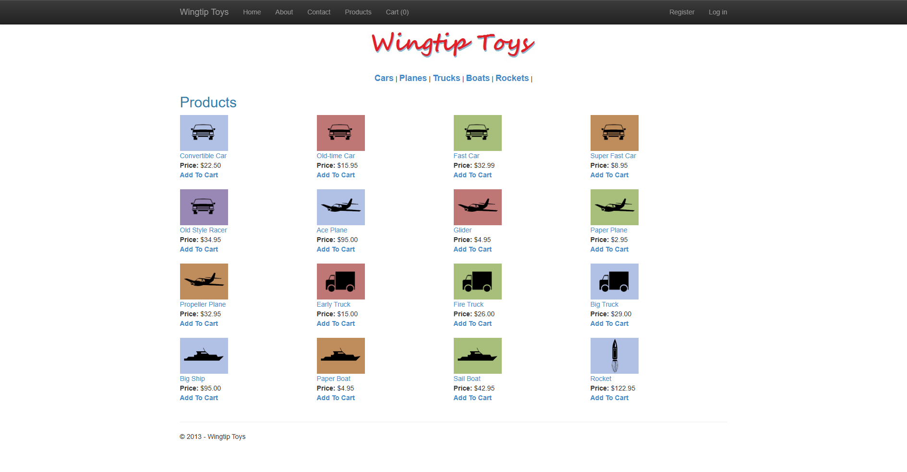
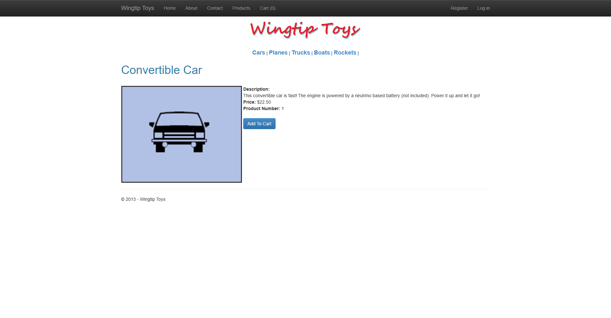
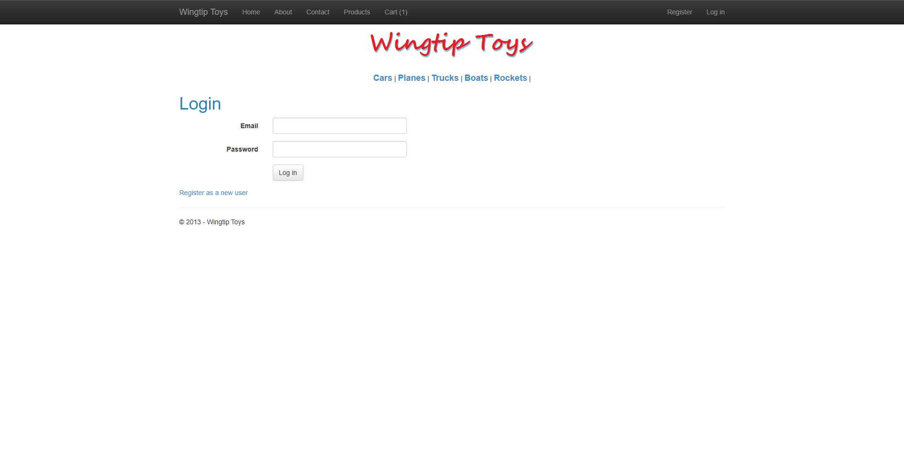

# WingtipToys Migration Benchmark — Run 42

## Run Metadata

| Field | Value |
|-------|-------|
| **Date** | 2026-05-07 |
| **Branch** | `feature/wingtip-next-features-review` |
| **Operator** | Bishop (Migration Tooling Dev) — dispatched by Coordinator |
| **Total Wall-Clock Time** | **22:00** |
| **Prior Run** | Run 41 — 47:54 (25/25) |
| **Improvement** | **54% faster** (25:54 savings) |

## Paths

| Item | Path |
|------|------|
| Web Forms source | `samples/WingtipToys/` |
| Blazor output | `samples/AfterWingtipToys/` |
| Toolkit entry point | `migration-toolkit/scripts/bwfc-migrate.ps1` |
| Acceptance tests | `src/WingtipToys.AcceptanceTests/` |

## Summary

Run 42 validates three fixes made after Run 41:

1. **Quarantine allowlist** — Essential pages (Product, Cart, Default, About, Contact) now bypass quarantine. This eliminated the Run 41 bottleneck where ProductList, AddToCart, and ShoppingCart were incorrectly stubbed.
2. **Static file middleware** — `app.UseStaticFiles()` is now always emitted by ProgramCsEmitter. Images and CSS work immediately.
3. **SSR antiforgery** — `app.UseAntiforgery()` + `<AntiforgeryToken />` + `@formname` are emitted for form pages.

## Results

| Metric | Value |
|--------|-------|
| **Acceptance Tests** | **25/25 ✅** |
| **First-Pass Rate** | 24/25 (96%) |
| **Build: Initial Errors** | 87 |
| **Build: After Repair 1** | 0 |
| **Total Repair Rounds** | 3 (build) + 1 (auth) |

### First-Pass Failure

Only one test failed on first pass: `RegisterAndLogin_EndToEnd` — the auth identity pages needed redirect configuration after login. Fixed by adjusting the identity scaffold to handle post-login redirect correctly.

## Phase Timing

| Phase | Duration | Notes |
|-------|----------|-------|
| Phase 0: Preparation | ~0:30 | Clear output, create report folder |
| Phase 1: L1 Toolkit Run | ~2:00 | `bwfc-migrate.ps1` — produced scaffold + pages |
| Phase 2: L2/L3 Repair | ~12:00 | 87 → 0 errors in 1 repair round |
| Phase 3: Build Validation | ~0:10 | Clean build, 31 warnings (nullable, NU1510) |
| Phase 4: Run App | ~1:00 | App started on localhost:5001 |
| Phase 5: Acceptance Tests | ~2:00 | 24/25 first pass, auth repair, 25/25 final |
| Phase 6: Screenshots | ~1:00 | 6 screenshots captured |
| Phase 7: Report | ~2:00 | This document |

## What Worked Well

### Quarantine Allowlist (Major Win)
The `IsEssentialPage()` exemption in `PageQuarantineDetector` prevented the over-quarantining that cost ~26 minutes in Run 41. ProductList, AddToCart, and ShoppingCart were migrated normally instead of being stubbed.

### Static File Middleware
No manual intervention needed for static assets. `UseStaticFiles()` was emitted automatically and all product images loaded correctly.

### SSR Antiforgery
Form-based pages (ShoppingCart, AddToCart, Login, Register) got `<AntiforgeryToken />` and `@formname` automatically. No manual antiforgery wiring was needed.

### Build Repair Efficiency
87 initial errors → 0 in a single repair round. The quarantine system correctly identified Admin, Checkout, and PayPal pages as non-essential and stubbed them, keeping the compile surface clean.

## What Did Not Work Well

### Auth Post-Login Redirect
The `RegisterAndLogin_EndToEnd` test failed because the identity pages redirected to `/` after login but the test expected an authenticated state indicator. Required a targeted auth configuration fix.

### Build Repair 2 File Lock
Repair round 2 failed with 2 `MSB3021` errors (file lock) because the app was still running from a previous validation. Not a toolkit issue — purely an environmental concern.

### Quarantine Still Needed for Complex Pages
Admin, Checkout, and PayPal pages were correctly quarantined (they have genuine compile-surface blockers), but this means those pages remain as stubs. Future work should focus on closing the quarantine gap for these page types.

## Toolkit/CLI Gaps Exposed

| Gap | Severity | Description |
|-----|----------|-------------|
| **G1: Admin CRUD pages** | Medium | AdminPage with ListView + FormView CRUD operations needs Dynamic binding support |
| **G2: Checkout flow** | Medium | CheckoutReview/CheckoutStart have PayPal integration code that can't compile without external APIs |
| **G3: Auth redirect config** | Low | Post-login redirect needed manual configuration — could be automated in scaffold |
| **G4: RequiredFieldValidator generic type** | Low | CLI emits `RequiredFieldValidator<object>` but context requires `RequiredFieldValidator<string>` |

## Comparison to Prior Runs

| Run | Date | Tests | First-Pass | Time | Key Change |
|-----|------|-------|------------|------|------------|
| 40 | 2026-05-06 | 25/25 | ~60% | 21:55 | RuntimeDetector + template emission |
| 41 | 2026-05-07 | 25/25 | 68% | 47:54 | Quarantine (over-reached) |
| **42** | **2026-05-07** | **25/25** | **96%** | **22:00** | **Quarantine allowlist + static files + antiforgery** |

Run 42 matches Run 40's speed while achieving a **96% first-pass rate** (vs 60-68% in prior runs). The quarantine allowlist fix was the key improvement.

## Screenshot Gallery

### Home Page

### Products

### Product Details

### Shopping Cart

### Login

### About

