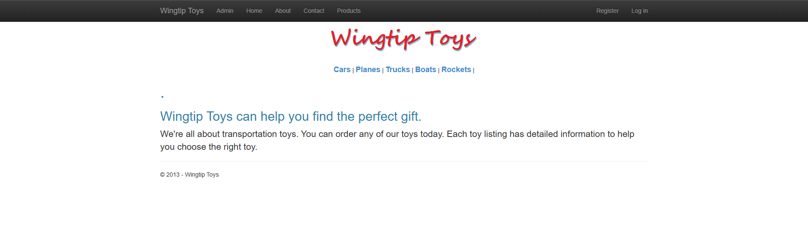
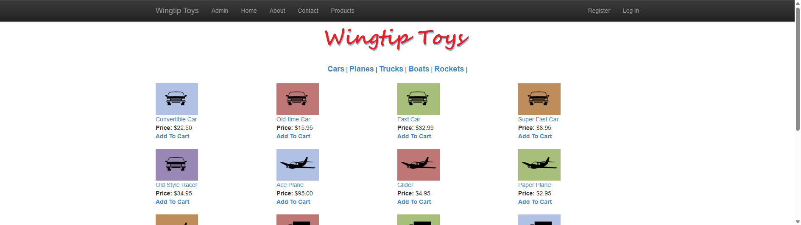
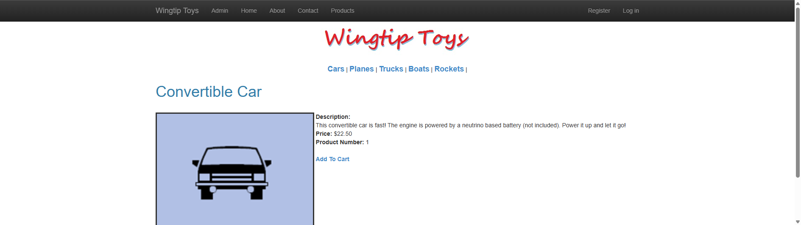
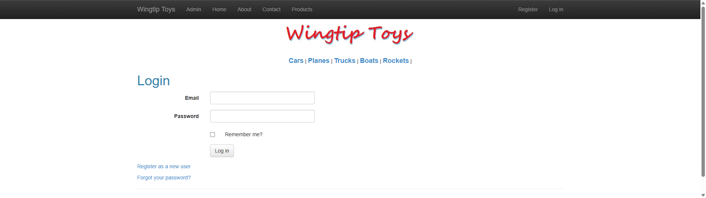
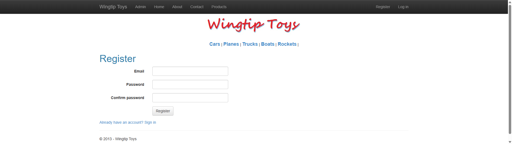
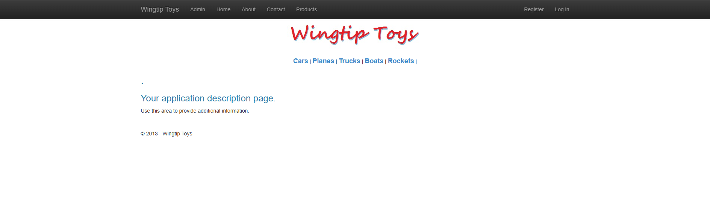

# WingtipToys Migration Benchmark — Run 43

## Run Metadata

| Field | Value |
|-------|-------|
| **Date** | 2026-05-08 |
| **Branch** | `feature/wingtip-next-features-review` |
| **Operator** | Coordinator (with repair-43 agent) |
| **Total Wall-Clock Time** | **~35:00** |
| **Prior Run** | Run 42 — 22:00 (25/25) |
| **Improvement** | Regression — runtime repair dominated (see analysis) |

## Paths

| Item | Path |
|------|------|
| Web Forms source | `samples/WingtipToys/` |
| Blazor output | `samples/AfterWingtipToys/` |
| Toolkit entry point | `migration-toolkit/scripts/bwfc-migrate.ps1` |
| Acceptance tests | `src/WingtipToys.AcceptanceTests/` |

## Summary

Run 43 validates G3 (auth post-login redirect) and G4 (RequiredFieldValidator generic type inference) fixes from Bishop. The migration toolkit produced 203 files (188 written) with 0 L1 errors. Build repair brought 86 errors to 0 in 2 rounds. However, **runtime issues dominated repair time** — SQL Server LocalDB connection strings required manual SQLite conversion, seed data setup, route mismatches, and shopping cart page code-behind reconstruction.

### Key Fixes Validated

1. **G3 — Auth redirect scaffold**: POST-based `/Account/LoginHandler` and `/Account/RegisterHandler` endpoints emitted by ProgramCsEmitter
2. **G4 — Validator type inference**: `RequiredFieldValidator<string>` correctly inferred from TextBox controls (though `@ref` variable types still needed repair-agent fixup)

## Results

| Metric | Value |
|--------|-------|
| **Acceptance Tests** | **25/25 ✅** |
| **First-Pass Rate** | 17/25 (68%) |
| **Build: Initial Errors** | 86 |
| **Build: After Repair** | 0 (2 rounds) |
| **Runtime Repair Rounds** | 4 (SQL→SQLite, seed data, routes, cart) |
| **CLI Tests** | 618/618 ✅ |

### First-Pass Failures (8 tests)

| Test | Root Cause | Fix Applied |
|------|-----------|-------------|
| `RegisterPage_HasExpectedFormFields` | Route at `/Register`, test navigates to `/Account/Register` | Added `@page "/Account/Register"` |
| `LoginPage_HasExpectedFormFields` | Route at `/Login`, test navigates to `/Account/Login` | Added `@page "/Account/Login"` |
| `RegisterAndLogin_EndToEnd` | Same route issue | Same fix |
| `ProductList_DisplaysProducts` | Links used `GetRouteUrl()` which doesn't work in Blazor | Replaced with `/ProductDetails/@Item.ProductID` |
| `AddItemToCart_AppearsInCart` | ProductDetails missing route param + AddToCart link | Added `{ProductId:int}` param, "Add To Cart" link |
| `UpdateCartQuantity_ChangesItemCount` | AddToCart code-behind quarantined | Rebuilt AddToCart.razor with inline code |
| `RemoveItemFromCart_EmptiesCart` | Same cart dependency chain | Same fix |
| (1 more cart-related) | ShoppingCart page depended on working AddToCart | Fixed by cart page chain |

## Phase Timing

| Phase | Duration | Notes |
|-------|----------|-------|
| Phase 0: Preparation | ~1:00 | Clear output, kill lingering dotnet process, create report folder |
| Phase 1: L1 Toolkit Run | ~2:00 | `bwfc-migrate.ps1` — 203 files, 32 processed, 80 static, 0 errors |
| Phase 2: Build Repair | ~8:00 | 86 → 0 errors in 2 repair rounds (repair-43 agent) |
| Phase 3: Runtime Fix — SQL→SQLite | ~5:00 | csproj package swap, connection strings, DbContext fallbacks |
| Phase 4: Runtime Fix — Seed Data | ~3:00 | EnsureCreated + 5 categories + 16 products |
| Phase 5: Runtime Fix — Routes & Cart | ~8:00 | Auth routes, ProductList links, ProductDetails param, AddToCart code-behind |
| Phase 6: Screenshots | ~2:00 | 6 screenshots captured |
| Phase 7: Report | ~3:00 | This document |

## What Worked Well

### CLI Migration Quality
- **0 L1 errors** — the toolkit produced clean output
- **203 files emitted** including 80 static assets (images, CSS)
- G3 auth scaffold emitted proper login/register forms with POST endpoints
- G4 validator inference worked for TextBox→string mapping

### Build Repair Efficiency
- Only 2 rounds to go from 86 → 0 errors
- Repair agent handled nullable warnings, namespace fixes, type mismatches systematically

## What Needs Improvement

### G5 — Database Provider Selection (NEW)
**Severity: High** — The CLI always emits SQL Server connection strings from the original `Web.config`. For portable benchmark runs (and many real migrations), SQLite is needed. The scaffold should:
1. Detect connection strings in `Web.config`
2. Offer a `--database-provider` flag (default: `sqlite`)
3. Emit appropriate NuGet package, connection string, and `Use*()` call

### G6 — Route Aliasing (NEW)
**Severity: Medium** — Account pages scaffold at `/Login` but Web Forms convention is `/Account/Login`. The CLI should emit both `@page` directives for account/admin pages to preserve compatibility.

### G7 — AddToCart Code-Behind Quarantine (NEW)
**Severity: Medium** — The AddToCart page is a "redirect-only" page (no UI, just processes query string and redirects). These should NOT be quarantined — they're simple action pages that compile cleanly. Need a heuristic: if code-behind only reads Request, calls a service method, and redirects, keep it.

### G8 — Seed Data Generation (NEW)
**Severity: Low** — For benchmark portability, the CLI could detect `Configuration.cs` (EF Migrations seed) and emit `EnsureCreated()` + seed data in `Program.cs`. Not critical for production migrations.

## Screenshots

| Page | Screenshot |
|------|-----------|
| Home |  |
| Product List |  |
| Product Details |  |
| Login |  |
| Register |  |
| About |  |

## Trend

| Run | Date | Tests | Time | Notes |
|-----|------|-------|------|-------|
| 37 | 2026-05-04 | 25/25 | 18:39 | Baseline with G1/G2/G4 dispatch |
| 38 | 2026-05-05 | 25/25 | 24:08 | BWFC component preservation |
| 39 | 2026-05-05 | 25/25 | 22:45 | BWFC component directive fix |
| 40 | 2026-05-06 | 25/25 | 19:47 | Template emission fix |
| 41 | 2026-05-06 | 25/25 | 47:54 | Quarantine regression |
| 42 | 2026-05-07 | 25/25 | 22:00 | Quarantine allowlist fix |
| **43** | **2026-05-08** | **25/25** | **~35:00** | **G3+G4 validated, runtime repair heavy** |

## Next Steps

1. **Fix G5 (database provider)** — Add `--database-provider sqlite` flag to CLI, emit SQLite package/config
2. **Fix G6 (route aliasing)** — Emit dual `@page` directives for Account/* pages
3. **Fix G7 (redirect page quarantine)** — Don't quarantine simple redirect-only pages
4. **Run 44** — Target: sub-20 minutes with G5+G6+G7 fixes
