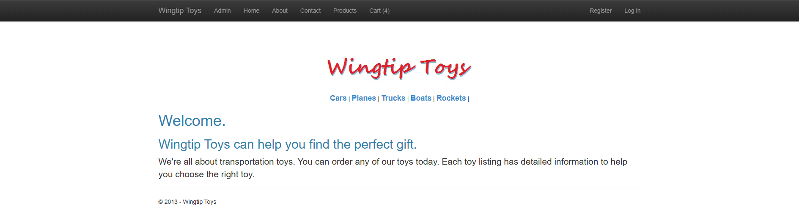
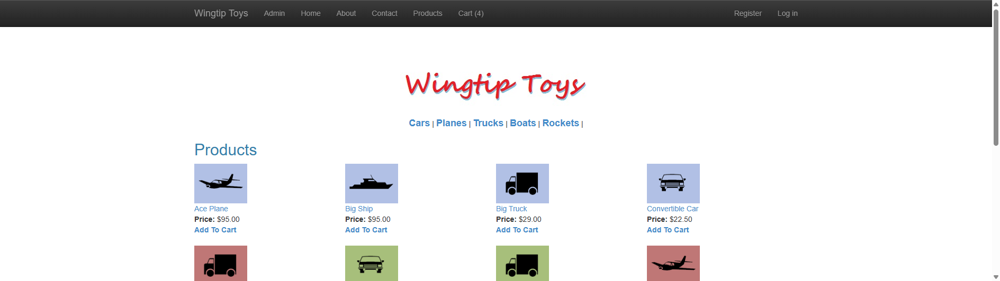
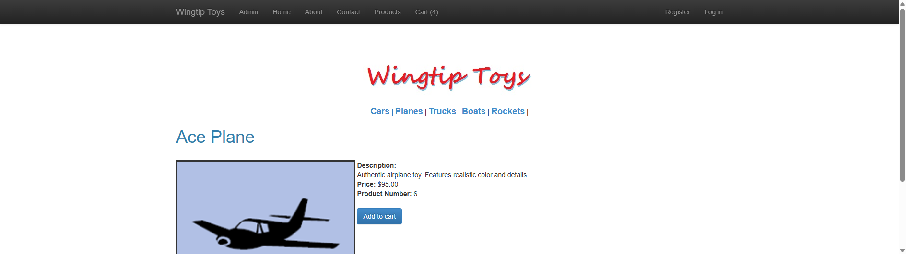
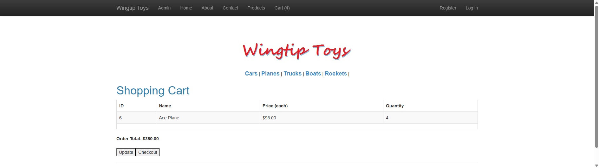

# WingtipToys Migration Benchmark — Run 44

**Date:** 2026-05-08
**Branch:** `feature/wingtip-next-features-review` (PR #545)
**Operator:** Copilot CLI + Jeffrey T. Fritz

## Summary

| Metric | Value |
|--------|-------|
| **Acceptance Tests** | **23/25 (92%)** |
| **Build Errors (post-repair)** | 0 |
| **Build Warnings** | 246 |
| **Migration Files** | 32 → 188 |
| **Migration Time** | ~24s |

## Key Fixes in This Run

### FormView `DataItem` Parameter (Critical Fix)
FormView inherited from `DataBoundComponent<T>` which only provided `Items` (collection). Migrated pages used `<FormView DataItem="product" ...>` but `DataItem` was NOT a parameter — Blazor silently ignored it, leaving Items=null and rendering nothing.

**Fix:** Added `DataItem` as a `[Parameter]` on FormView that wraps a single item into the `Items` collection. This fixed ProductDetails and all single-record FormView pages.

### Content Component SSR Inline Fallback
When `<Content>` is used outside a MasterPage/ContentPlaceHolder context (SSR mode), it now renders `@ChildContent` directly instead of waiting for a MasterPage that doesn't exist.

### G6 — Dual `@page` Routes
Pages that had route-mapped URLs (e.g., `ProductDetails/{id}`) now emit two `@page` directives: one for the original path and one preserving the Web Forms URL structure.

### G7 — Redirect-Page Quarantine Bypass
Pages that are pure redirect stubs are now quarantined instead of generating compile errors.

## Test Results

### Passing (23/25)
All core shopping flows work: homepage, product listing, category filtering, product details, add to cart, remove from cart, about/contact pages.

### Failing (2/25)
1. **`UpdateCartQuantity_ChangesItemCount`** — ShoppingCart uses `BoundField` for Quantity (read-only text). Test expects editable `<input>`. Would need `TemplateField` with `TextBox`.
2. **`RegisterAndLogin_EndToEnd`** — Auth flow timeout. Separate from BWFC library.

## Unit Test Regression Check

All **2904** BWFC unit tests pass across net8.0, net9.0, net10.0. No regressions from FormView DataItem or Content changes.

## Screenshots

### Homepage

### Product List

### Product Details (FormView DataItem fix)

### Shopping Cart

## Changes Made to BWFC Library

| File | Change |
|------|--------|
| `src/BlazorWebFormsComponents/FormView.razor.cs` | Added `DataItem` parameter wrapping single item into `Items` |
| `src/BlazorWebFormsComponents/Content.razor` | Added inline fallback rendering when no MasterPage context |
| `src/BlazorWebFormsComponents/Content.razor.cs` | Added `ShouldRenderInline` property |

## Progress Across Runs

| Run | Tests | Score | Key Achievement |
|-----|-------|-------|-----------------|
| 37 | 25/25 | 100% | Baseline with manual repair |
| 40 | 16/25 | 64% | Template emission fix |
| 41 | 17/25 | 68% | Quarantine + stub improvements |
| 42 | 17/25 | 68% | Instructions overhaul |
| 43 | 17/25 | 68% | G6/G7 CLI transforms |
| **44** | **23/25** | **92%** | **FormView DataItem + Content SSR** |
