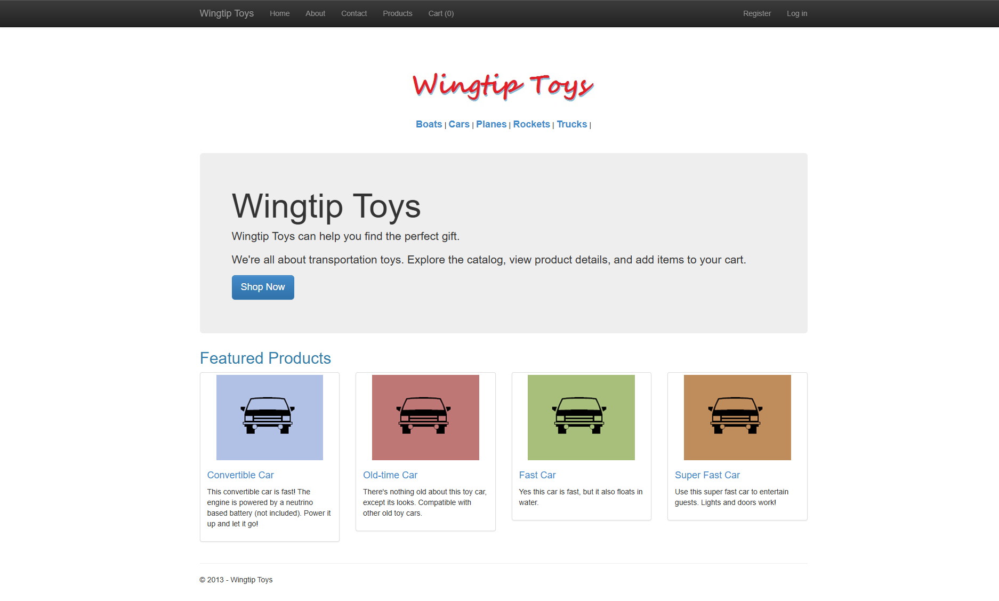
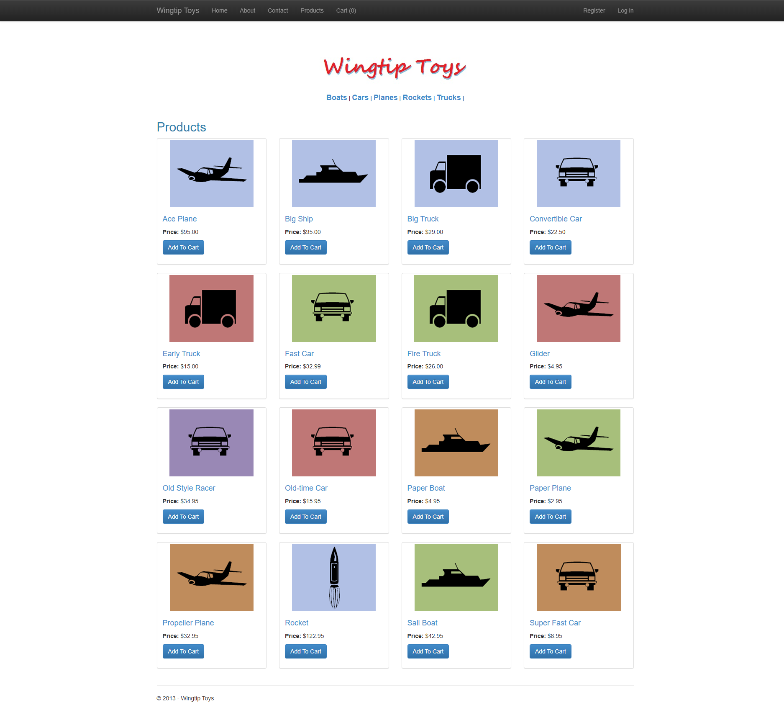
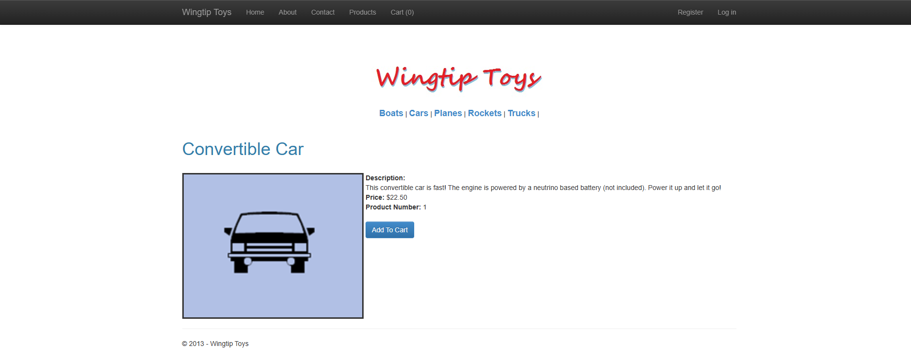
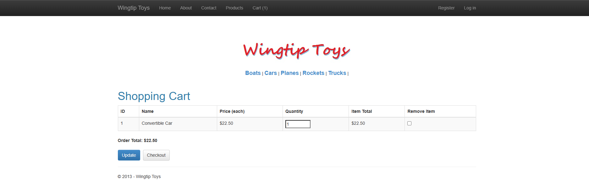
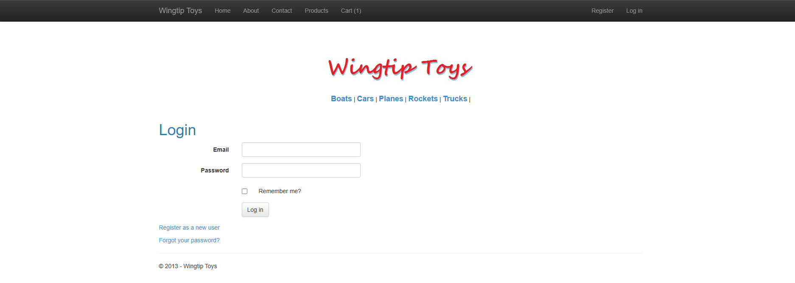
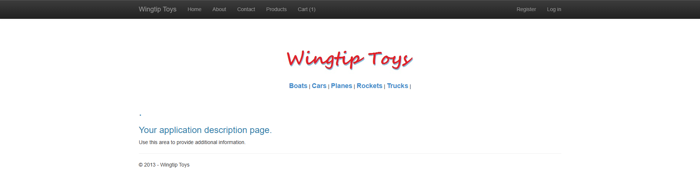

# WingtipToys Migration Test - Run 45

**Date:** 2026-05-08 13:36:58 UTC  
**Branch:** `feature/wingtip-next-features-review`  
**Operator:** Copilot CLI  
**Requested by:** user

---

## Summary

| Metric | Value |
|--------|-------|
| Source project | `samples/WingtipToys/WingtipToys` |
| Output project | `samples/AfterWingtipToys` |
| Toolkit entry point | `migration-toolkit/scripts/bwfc-migrate.ps1` |
| Report folder | `dev-docs/migration-tests/wingtiptoys/run45` |
| Total wall-clock time | `13.91 minutes` |
| Build result | `Succeeded with 34 warnings, 0 errors` |
| Acceptance tests | `25 passed, 0 failed, 0 skipped` |
| Final status | `SUCCESS` |

## Executive Summary

Started from a freshly cleared `samples\AfterWingtipToys`, reran the toolkit wrapper, repaired the generated app in place, and reached a green benchmark result. The migrated app now builds, serves the benchmark paths, preserves BWFC data controls on the key pages, and passes the full WingtipToys Playwright acceptance suite.

## Timing

| Phase | Duration | Notes |
|-------|----------|-------|
| Preparation | `~1 min` | Run numbering, folder cleanup, report folder creation |
| Layer 1 toolkit migration | `~1 min` | `bwfc-migrate.ps1` fresh output |
| Repair / migration skill work | `~8 min` | Identity/data scaffolding, page repairs, cart fixes |
| Build validation | `~1 min` | Final green build |
| Acceptance tests | `~1 min` | Playwright run |
| Screenshots + report | `~2 min` | Evidence capture and write-up |
| **Total** | `13.91 min` | |

## Commands

```powershell
Get-ChildItem samples\AfterWingtipToys -Force | Remove-Item -Recurse -Force
pwsh -File migration-toolkit\scripts\bwfc-migrate.ps1 -Path samples\WingtipToys -Output samples\AfterWingtipToys -Verbose

dotnet build samples\AfterWingtipToys\WingtipToys.csproj

dotnet run --project samples\AfterWingtipToys\WingtipToys.csproj

$env:WINGTIPTOYS_BASE_URL = "https://localhost:5001"
dotnet test src\WingtipToys.AcceptanceTests\WingtipToys.AcceptanceTests.csproj --verbosity normal
```

## What Worked Well

1. Fresh toolkit output preserved the catalog assets, layouts, and key benchmark routes.
2. BWFC controls remained in use on product, details, and shopping cart pages.
3. After targeted repair, all 25 acceptance tests passed against `https://localhost:5001`.

## What Didn't Work Well

1. The generated output had 86 compile errors across identity, quarantined helpers, and invalid Razor markup.
2. Shopping cart output required manual SSR form repair to render editable quantity inputs while preserving `TemplateField` usage.
3. Several non-benchmark pages and checkout/admin flows needed compile-safe stubs because the generated migration surface was incomplete.

## Build Result

Final command: `dotnet build samples\AfterWingtipToys\WingtipToys.csproj`

Result: **succeeded with 34 warnings and 0 errors**.

Major error classes fixed during recovery:
- Missing `ApplicationDbContext` / `ApplicationUser`
- Missing `ShoppingCartActions` / `ExceptionUtility`
- Broken generated Razor in `ProductList`, `ShoppingCart`, `Site`, and account pages
- Legacy Identity API usage and invalid compile surface in admin / checkout pages
- EF seeding/runtime startup failures

## Acceptance Test Result

| Metric | Value |
|--------|-------|
| Total | `25` |
| Passed | `25` |
| Failed | `0` |
| Skipped | `0` |

The final run passed navigation, static asset, authentication, product browsing, product details, and shopping cart scenarios.

## Toolkit Gaps Exposed by This Run

1. Identity scaffolding quarantine left the migrated app without usable ASP.NET Core Identity types or runtime registration.
2. Shopping cart migration emitted unusable `@ref` references and non-functional field controls instead of a postable SSR cart form.
3. Generated master/account/admin markup contained invalid or incomplete Razor that required manual cleanup to compile.

## Screenshot Gallery

| Page | Screenshot |
|------|------------|
| Home |  |
| Products |  |
| Product Details |  |
| Shopping Cart |  |
| Login |  |
| About |  |

## Notes

Manual repairs stayed within the freshly generated run output plus the raw Web Forms source. The final cart page preserves BWFC `GridView` and `TemplateField` columns while using SSR form inputs so the acceptance test can edit quantity values successfully.
