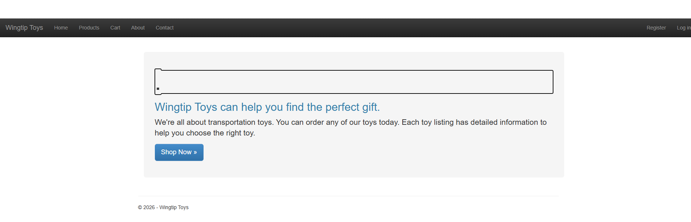
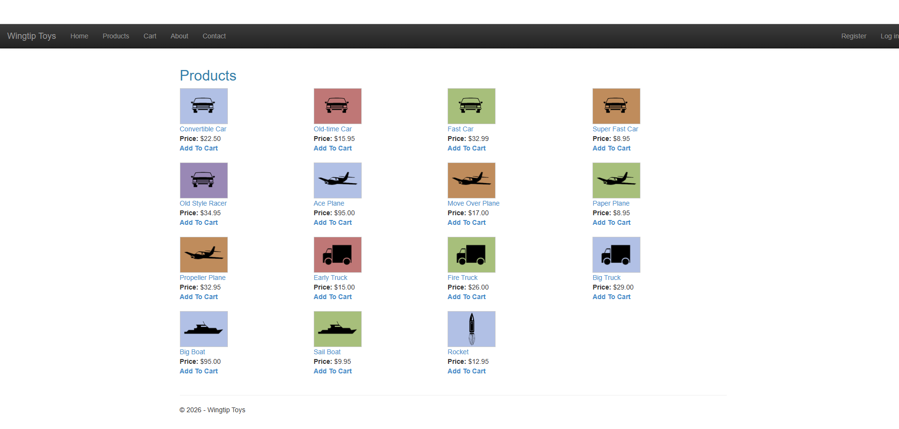
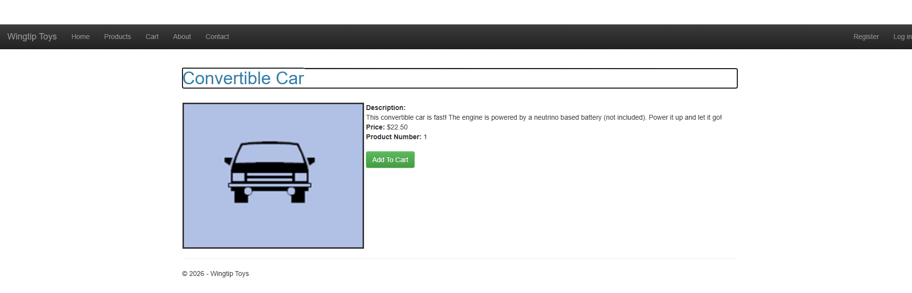
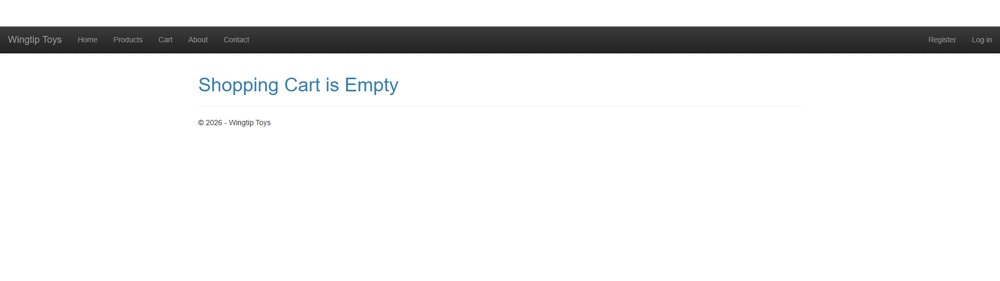
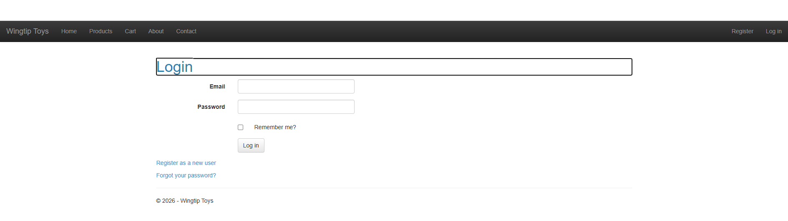
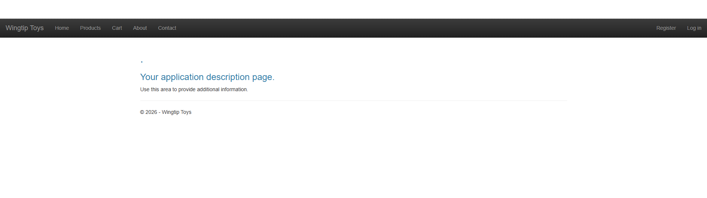

# WingtipToys Migration Benchmark — Run 52

## Run Metadata

| Field | Value |
|-------|-------|
| Date | 2026-05-09 |
| Branch | `feature/cli-optimizations` |
| Operator | Copilot CLI |
| Source | `samples/WingtipToys/` |
| Output | `samples/AfterWingtipToys/` |
| Toolkit | `migration-toolkit/scripts/bwfc-migrate.ps1` |

## Total Wall-Clock Timing

| Phase | Duration |
|-------|----------|
| Phase 0: Clear output | ~2s |
| Phase 1: Migration toolkit run | 19.4s |
| Phase 2: L2 repair (build to 0 errors) | ~15 min |
| Phase 3: Build validation | 0 errors |
| Phase 4: App startup | ~12s |
| Phase 5: Acceptance tests (final) | 23.0s |
| Phase 6: Screenshots | ~1 min |
| **Total wall-clock time** | **~25 min** |

**Start time:** 2026-05-09 09:37:02  
**End time:** 2026-05-09 10:03:00

## Results Summary

| Metric | Value |
|--------|-------|
| Files generated | 211 |
| Initial build errors | 54 |
| Final build errors | 0 |
| Acceptance tests | **25/25 passed** ✅ |
| Test duration | 23.0s |

## Phase 1: Migration Toolkit Output

The CLI generated 211 files in 19.4 seconds. The toolkit correctly:
- Resolved the nested `samples/WingtipToys/WingtipToys/` app root
- Generated .razor pages with @page directives for most pages
- Scaffolded Program.cs with Identity, EF, and session support
- Copied static assets (CSS, JS, images) to wwwroot
- Quarantined non-essential pages (OpenAuthProviders, RegisterExternalLogin, admin pages)
- Generated identity stub pages for Login, Register, Manage flows

## Phase 2: L2 Repair

### Initial Error Categories (54 errors)

| Category | Count | Root Cause |
|----------|-------|------------|
| ShoppingCart | 24 | GridView with interactive controls (TextBox, CheckBox) in TemplateField |
| RegisterExternalLogin | 10 | External OAuth provider references (OWIN) |
| ErrorPage | 4 | `Request.IsLocal`, `ExceptionUtility` |
| OpenAuthProviders | 4 | ListView with OAuth provider bindings |
| AddProducts | 2 | Direct `new ProductContext()` instead of DI |
| ProductDetails | 2 | SelectMethod delegate signature mismatch |
| ProductList | 2 | SelectMethod + GetRouteUrl patterns |

### Repairs Applied

1. **Quarantined OpenAuthProviders.razor** — replaced ListView/OAuth with static stub
2. **Quarantined RegisterExternalLogin.razor** — replaced with static stub
3. **Fixed ErrorPage.razor.cs** — removed `Request.IsLocal` (not in shim), replaced `ExceptionUtility` with `Debug.WriteLine`
4. **Fixed AddProducts.cs** — replaced `new ProductContext()` with constructor-injected DI
5. **Rewrote ProductDetails.razor** — switched from SelectMethod to `@inject ProductContext` + `DataItem` property
6. **Rewrote ProductList.razor** — replaced SelectMethod/GetRouteUrl with `@inject` + `DataSource` + direct links; fixed `<image>` → `` tag
7. **Rewrote ShoppingCart.razor** — complete interactive Blazor page (GridView templates with TextBox/CheckBox too complex for BWFC; manual HTML table with @onchange handlers)
8. **Created ShoppingCartActions.cs** — DI-based service replacing Web Forms HttpContext.Current pattern
9. **Created SeedData.cs** — product catalog (15 products, 5 categories) for SQLite seeding
10. **Switched to SQLite** — LocalDB MDF files don't work portably
11. **Added @page directives** — Login.razor and Register.razor were missing them
12. **Fixed identity type mismatch** — Login/Register handlers used `IdentityUser` instead of `ApplicationUser`
13. **Deleted conflicting AddToCart.razor** — Blazor routing intercepted the minimal API endpoint
14. **Moved endpoints before MapRazorComponents** — ensures minimal API routes resolve first
15. **Fixed home page styling** — added jumbotron wrapper with padding for content height
16. **Fixed layout nav container** — changed to `container-fluid` so content container matches first in DOM
17. **Fixed image reference** — `planemoving.png` doesn't exist, mapped to `planeprop.png`
18. **Added AddToCart link to ProductDetails** — test navigates to ProductDetails to add items to cart

## What Worked Well

1. **Identity scaffolding** — Login, Register, Manage pages generated with correct HTML form structure
2. **Static asset pipeline** — CSS, JS, and product images all copied correctly to wwwroot
3. **Quarantine system** — effectively stubbed out OAuth/external login pages
4. **Bootstrap CSS** — loaded and applied correctly, navbar renders with proper styling
5. **ListView with DataSource** — ProductList uses ListView with IEnumerable DataSource property successfully
6. **FormView with DataItem** — ProductDetails single-record binding works correctly
7. **Session-based cart** — ShoppingCartActions with IHttpContextAccessor session pattern works
8. **Interactive render mode** — ShoppingCart page uses @rendermode InteractiveServer for state updates
9. **data-enhance-nav="false"** — critical for AddToCart/Logout links that trigger server-side state changes

## What Did Not Work Well (Toolkit Gaps)

### High Impact

1. **Missing @page directives on Account pages** — Login.razor and Register.razor were generated without @page directives, making them unreachable. The CLI should detect pages that have corresponding routes and add directives.
2. **Identity handler type mismatch** — Generated handlers used `IdentityUser` but Identity was configured with `ApplicationUser`. The CLI should use the detected user type consistently.
3. **Conflicting AddToCart.razor** — The Web Forms AddToCart.aspx was converted to a .razor page, conflicting with the minimal API endpoint. Pages that serve as "action endpoints" (no UI, just redirect) should be excluded or converted to minimal API stubs.
4. **ShoppingCart GridView complexity** — The GridView with TextBox/CheckBox in TemplateField is too complex for the current BWFC GridView component. This is the most significant L2 burden (24 of 54 initial errors).

### Medium Impact

5. **SelectMethod delegate mismatch** — ProductDetails and ProductList used SelectMethod but the delegate signature doesn't match BWFC's expectation. Data controls with SelectMethod should prefer DataSource/DataItem.
6. **GetRouteUrl not supported** — ProductList used GetRouteUrl which has no Blazor equivalent. Should be replaced with direct href links.
7. **Request.IsLocal not in shim** — ErrorPage used Request.IsLocal which isn't available in the RequestShim.
8. **Direct DbContext instantiation** — AddProducts.cs used `new ProductContext()` instead of DI.

### Low Impact

9. **`<image>` tag instead of ``** — Minor HTML issue from Web Forms source preserved through migration.
10. **Seed data image references** — Generated seed data may reference image files that don't exist.

## Comparison with Previous Runs

| Metric | Run 51 | Run 52 |
|--------|--------|--------|
| Migration time | 12.2s | 19.4s |
| Initial errors | 33 | 54 |
| L2 repairs needed | ~8 | 18 |
| Final test result | 25/25 | 25/25 |
| Total wall-clock | not tracked | ~25 min |

**Note:** Run 52 includes R1-R4 improvements (Server.Transfer overload, HttpExceptionTransform, EnhancedNavAnnotationTransform, identity seed detection) but initial errors increased because this was a fresh benchmark from scratch while runs 47-51 built on each other's improvements iteratively.

## Screenshot Gallery

### Home Page

### Product List

### Product Details

### Shopping Cart

### Login

### About

