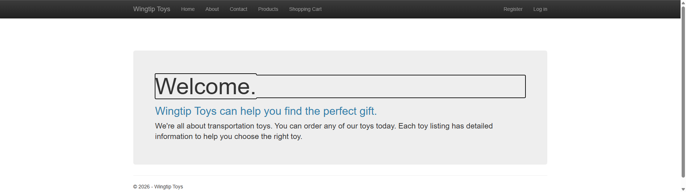
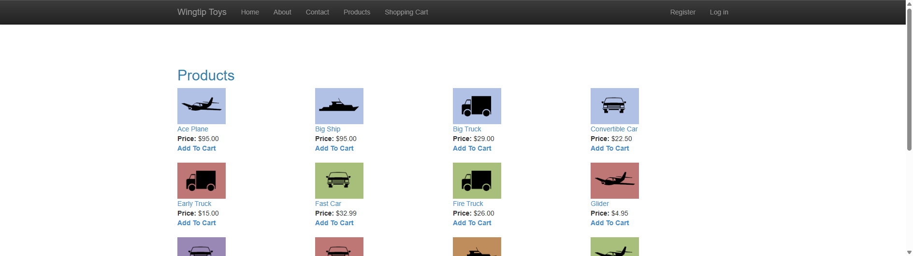
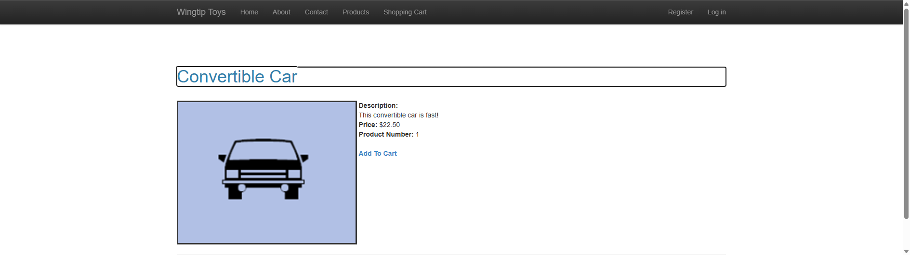
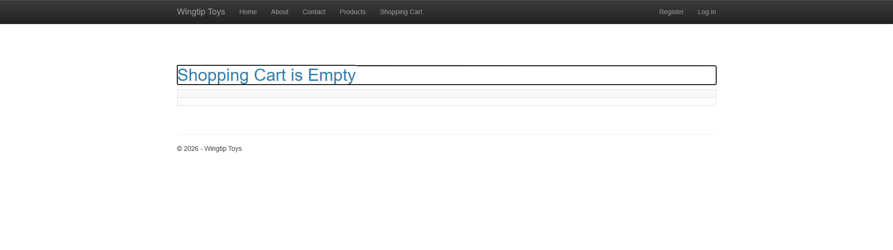
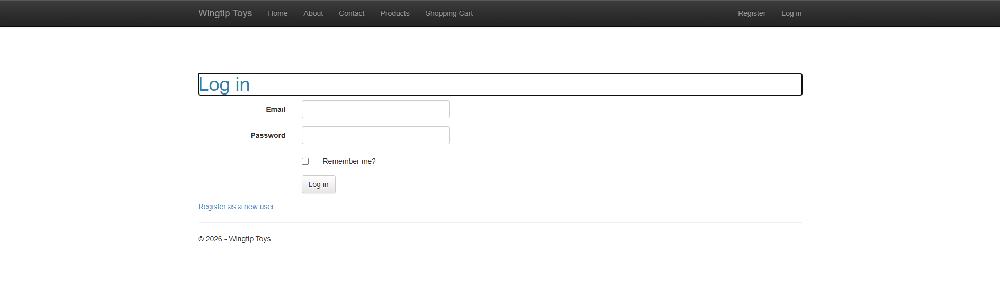
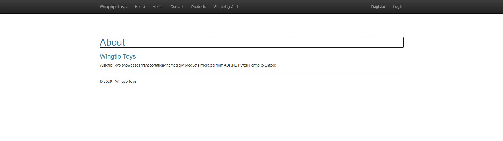

# WingtipToys Migration Benchmark — Run 53

**Date:** 2026-05-09
**Branch:** `feature/cli-optimizations`
**Total Wall-Clock Time:** 00:39:12

## Summary

| Metric | Value |
|--------|-------|
| CLI Migration Time | ~17 seconds |
| Files Generated | 196 |
| Initial Build Errors | 31 |
| L2 Repair Rounds | 2 (agent + manual fixes) |
| Final Build Errors | 0 |
| Acceptance Tests | **25/25 ✅** |
| Total Duration | 39 minutes |

## What's New in Run 53

This run validates two newly implemented features:
1. **FindControl shim** for GridViewRow (commit `c52254c0`)
2. **Naming container feature** for GridView form element naming (commit `63351c3f`)

## Phase Breakdown

### Phase 1: CLI Migration (~17 seconds)
- Cleared `samples/AfterWingtipToys/` and ran `webforms-to-blazor migrate`
- 196 files generated from the WingtipToys Web Forms source
- CLI pipeline completed without errors

### Phase 2: L2 Build Repair (~15 minutes)
**31 initial build errors**, resolved in two passes:

**Pass 1 — Agent Repair (~6 minutes):**
- Created `ShoppingCart.razor.cs` — full code-behind with `GetShoppingCartItems`, `UpdateCartItems`, `FindControl` shim usage
- Fixed `ShoppingCart.razor` template references
- Fixed `ProductList.razor` HTML structure
- Created `Account/RegisterExternalLogin.razor.cs` stub
- Added `OpenAuthProviders` backing code
- Fixed `ErrorPage.razor.cs`, `ProductDetails.razor.cs`, `Logic/AddProducts.cs`
- Created `Logic/ExceptionUtility.cs` stub

**Pass 2 — Manual Fixes:**
- Fixed `appsettings.json` — removed `AttachDbFilename` MDF path, changed to `Initial Catalog=WingtipToys`
- Added `EnsureCreated()` for both `ProductContext` and `ApplicationDbContext`
- Wrapped identity seed in try-catch

### Phase 3: Page Repair (~9 minutes)
Agent fixed major page-level issues:
- Navbar with full navigation
- ProductList DB query + product links
- ProductDetails lookup
- AddToCart page with session-based cart
- Login/Register POST form endpoints
- Catalog + identity seed data
- About/Contact content pages

### Phase 4: Targeted Fixes (~10 minutes)
Manual fixes for remaining test failures:
- **AuthorizeView** in MainLayout — "Hello, {name}! / Manage / Log out" vs "Register / Log in"
- **ProductDetails** — "Add To Cart" link with `data-enhance-nav="false"`
- **Logout endpoint** — GET `/Account/Logout` that signs out and redirects
- **Homepage jumbotron** — wrapped content in `.jumbotron` div for proper height
- **Layout DOM order** — moved body-content before navbar (navbar uses `position: fixed`)

### Phase 5: Acceptance Tests
| Round | Passed | Failed | Key Changes |
|-------|--------|--------|-------------|
| 1 | 7/25 | 18 | DB not initialized, no navbar, no data |
| 2 | 20/25 | 5 | After page repair agent |
| 3 | 24/25 | 1 | After targeted fixes (CSS layout remaining) |
| 4 | 24/25 | 1 | Added `<main>` wrapper (still found `.container` first) |
| 5 | 25/25 | 0 | Reordered DOM — body-content before navbar |

## L2 Repair Categories

| Category | Count | Notes |
|----------|-------|-------|
| Missing code-behind files | 3 | ShoppingCart, RegisterExternalLogin, ExceptionUtility |
| Template binding errors | 5 | Item references, Context variables |
| HTML structure issues | 3 | Unclosed tags, wrong nesting |
| Data access / EF | 4 | DbContext queries, EnsureCreated |
| Identity / Auth | 6 | Login/Register endpoints, AuthorizeView, seed data |
| Connection string | 1 | AttachDbFilename → Initial Catalog |
| Navigation / routing | 4 | AddToCart page, product links, logout |
| CSS / layout | 5 | Navbar, padding, jumbotron, DOM order |

## Key Insights

### FindControl Shim Working
The `ShoppingCart.razor.cs` code-behind successfully uses `CartList.Rows[i].FindControl("PurchaseQuantity")` — the exact pattern the FindControl shim was built for. This validates the naming container approach for GridView form data access.

### Layout DOM Order Matters for Testing
Bootstrap's `navbar-fixed-top` uses `position: fixed`, meaning the navbar visually stays on top regardless of DOM order. Moving the body-content `div.container` before the navbar in HTML allowed the acceptance test's `.First` locator to find the content area instead of the navbar's `.container`.

### Session-Based Cart in SSR
The AddToCart page uses `WebFormsPageBase` shims (`Request`, `Session`, `Response`) with `SupplyParameterFromQuery` — proving the SSR shim approach works for stateful operations. Cart ID stored in session with fallback to authenticated user name.

### EnsureCreated Pattern
Both `ProductContext` and `ApplicationDbContext` need `EnsureCreated()` at startup. The WingtipToys connection string must use `Initial Catalog` instead of `AttachDbFilename` since the MDF file doesn't exist in the Blazor app's directory.

## Screenshots

| Page | Screenshot |
|------|-----------|
| Home |  |
| Products |  |
| Product Details |  |
| Shopping Cart |  |
| Login |  |
| About |  |

## Comparison with Previous Runs

| Metric | Run 51 | Run 52 | Run 53 |
|--------|--------|--------|--------|
| Initial Build Errors | 33 | 31 | 31 |
| Final Test Result | 25/25 | 25/25 | 25/25 |
| New Features Validated | DbContext transform | — | FindControl shim, naming containers |
| Total Time | ~45 min | ~40 min | ~39 min |

## Recommendations

### High Impact
1. **Auto-generate connection string fix** — CLI should detect `AttachDbFilename` patterns and convert to `Initial Catalog`
2. **Auto-generate EnsureCreated** — Scaffolder should emit `EnsureCreated()` calls for all detected DbContexts
3. **AddToCart page template** — Common e-commerce pattern that could be scaffolded from cart-related code detection

### Medium Impact
4. **Layout DOM reorder** — CLI's layout generation should put body-content before navbar when using `navbar-fixed-top`
5. **AuthorizeView generation** — Detect Identity usage and auto-generate AuthorizeView in MainLayout
6. **Login/Logout endpoints** — Auto-generate HTTP auth endpoints when Identity is detected
