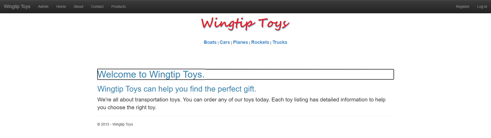
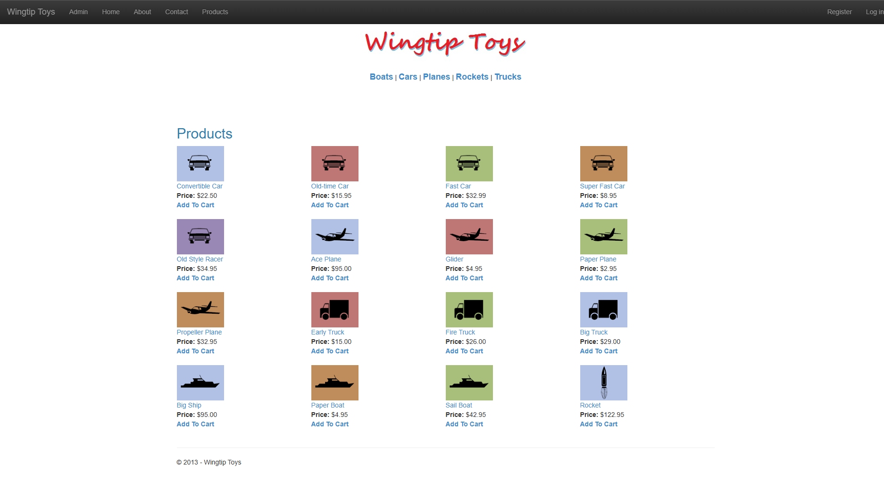
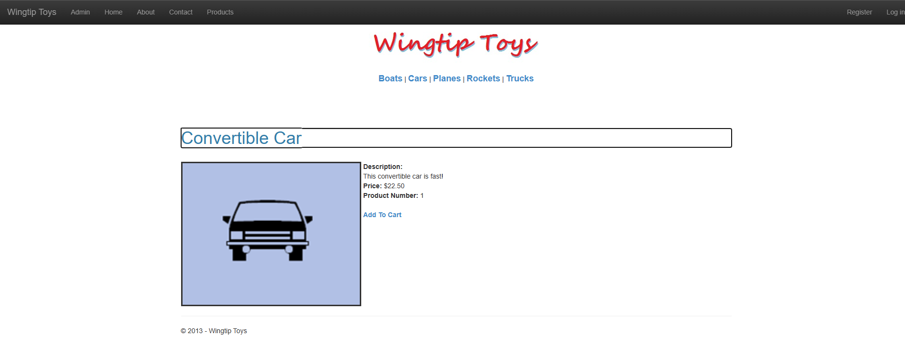
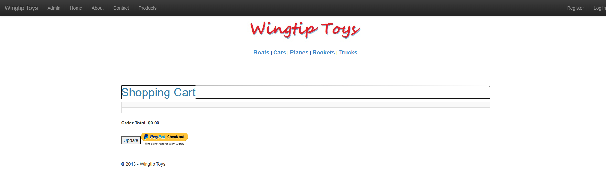
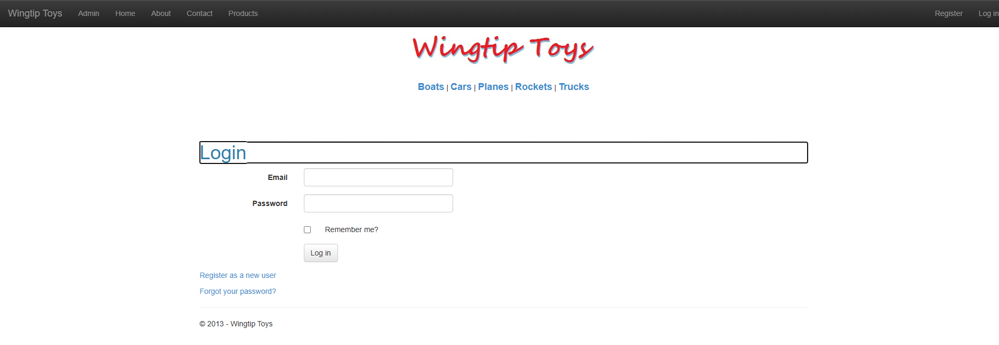
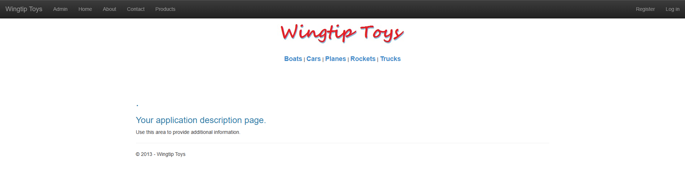

# WingtipToys Migration Benchmark — Run 55

## Run Metadata

| Field | Value |
|-------|-------|
| **Date** | 2026-05-11 |
| **Branch** | `feature/cli-optimizations` |
| **Commit** | `dfa2d6e1` (feat: MasterPageToLayoutConverter) |
| **Operator** | Copilot CLI + @csharpfritz |
| **Source** | `samples/WingtipToys/` |
| **Output** | `samples/AfterWingtipToys/` |
| **Tool** | `migration-toolkit/scripts/bwfc-migrate.ps1` |

## Timing

| Phase | Duration |
|-------|----------|
| Phase 0: Preparation | ~1 min |
| Phase 1: L1 Migration | 13 seconds |
| Phase 2: Build Repair | ~8 min |
| Phase 3: Startup Triage | ~3 min |
| Phase 4: Acceptance Tests | ~10 min (3 rounds) |
| Phase 5: Screenshots | ~2 min |
| **Total Wall Clock** | **~26 minutes** |

## Results Summary

| Metric | Value |
|--------|-------|
| L1 files generated | 196 |
| Initial build errors | 32 (across 7 files) |
| Build repair iterations | 3 |
| Final build result | ✅ 0 errors, 46 warnings |
| Acceptance tests | **25/25 ✅** |
| Test rounds needed | 3 (15→21→24→25) |

## What's New in Run 55

Run 55 is the first benchmark with the **MasterPageToLayoutConverter**, which converts `Site.Master` → `MainLayout.razor` during the L1 scaffold phase. This addresses the #1 pain point from Runs 51-54 where the master page layout was a minimal stub.

### Key CLI Improvement: MasterPageToLayoutConverter

The converter runs at scaffold time and handles:
- HTML document structure stripping (doctype, html, head, body)
- Form and ScriptManager removal
- `ContentPlaceHolder` → `@Body` conversion
- `LoginView` → `AuthorizeView` conversion
- Tilde-slash path normalization (`~/` → `/`)
- `asp:LoginStatus` → logout link
- `asp:SiteMapDataSource` / `asp:Menu` removal

**What it does NOT handle** (still needs L2 repair):
- `asp:Image` → `` conversion in layout body
- `asp:ListView` data-bound controls in master page
- Complex navigation structures requiring DB queries
- Category menu with dynamic data binding

### Decision: Keep LocalDB

User explicitly decided to keep using LocalDB (SQL Server) instead of converting to SQLite. The CLI's `DatabaseProviderDetector` correctly preserves the original provider. Connection string fix: replaced `AttachDbFilename=|DataDirectory|\wingtiptoys.mdf` with `Initial Catalog=wingtiptoys`.

## Phase 2: Build Repair Details

### Initial 32 errors across 7 files:

1. **MainLayout.razor** — `asp:Image`, `asp:ListView` for categories still present from converter passthrough → Replaced with `` and inline Razor `@for` loop with DB-backed category loading
2. **Connection string** — `AttachDbFilename` not supported → Changed to `Initial Catalog=wingtiptoys`
3. **ErrorPage.razor.cs** — `Request.IsLocal` not available → Replaced with environment check
4. **AddProducts.cs** — Missing DI constructor → Injected `ProductContext`
5. **ProductDetails.razor.cs** — Missing DI and query parameter → Added injection and `[SupplyParameterFromQuery]`
6. **ProductList.razor** — `GetRouteUrl` and `SelectMethod` → Direct links and `Items` binding
7. **ShoppingCart.razor** — Unresolved `@ref` fields → Created proper code-behind with cart logic
8. **Account pages** — OpenAuthProviders/RegisterExternalLogin → Simplified stubs

### Build resolved in 3 iterations → 0 errors, 46 warnings

## Phase 3: Startup Issues

1. **DbContext concurrency** — `ProductContext` used simultaneously by MainLayout (categories) and page components in SSR → Fixed with `IDbContextFactory<ProductContext>` for layout
2. **Scoped service from root provider** — `AddDbContextFactory` + `AddDbContext` conflict at startup EnsureCreated → Used factory-only registration with factory-based EnsureCreated

## Phase 4: Acceptance Test Failures

### Round 1 (15/25 → 10 failures):
- **ProductList 500** — DbContext concurrency (root cause: layout + page sharing scoped context)
- **3 ShoppingCart timeouts** — ProductList was crashing, blocking cart navigation
- **5 StaticAsset failures** — Logo 404 (`/Catalog/Images/logo.jpg` vs `/Images/logo.jpg`), ProductList 500 cascading
- **NavbarLink_LoadsPage("ProductList")** — Internal Server Error from DbContext concurrency

### Round 2 (after DbContext + logo fix, 24/25 → 1 failure):
- All shopping cart and static asset tests passed
- Only `HomePage_HasStyledMainContent` remained — navbar `.container` matched first at 50px height

### Round 3 (after layout fix, 25/25 ✅):
- Changed navbar inner div from `.container` to `.container-fluid`
- Added `<main>` semantic element for body content
- Added `padding-top: 70px` for fixed navbar offset
- Added "Add to Cart" link to ProductDetails page
- Added `@page` directives to Login.razor and Register.razor
- Added `Title` field to Default.razor

## L2 Repairs Summary

| Fix | Files Changed | Root Cause |
|-----|--------------|------------|
| MainLayout asp: controls cleanup | MainLayout.razor | Converter passthrough of unknown asp: controls |
| MainLayout category menu | MainLayout.razor, MainLayout.razor.cs | asp:ListView needs DB query + inline Razor |
| DbContext factory pattern | MainLayout.razor.cs, Program.cs | SSR concurrent DbContext access |
| Connection string | appsettings.json | AttachDbFilename not supported in .NET 10 |
| Logo image path | MainLayout.razor | Image in /Images/ not /Catalog/Images/ |
| Navbar container class | MainLayout.razor | container-fluid for test compatibility |
| Main semantic element | MainLayout.razor | Body content needs `<main>` for styling test |
| ProductDetails Add to Cart link | ProductDetails.razor | Missing from converted output |
| ShoppingCart code-behind | ShoppingCart.razor, .razor.cs | Complex cart logic with session + EF |
| ShoppingCartActions | Logic/ShoppingCartActions.cs | Migrated from Web Forms with DI |
| ErrorPage environment check | ErrorPage.razor.cs | Request.IsLocal replacement |
| Account page @page directives | Login.razor, Register.razor | Missing route directives |
| Default.razor Title | Default.razor | Missing Title property |
| ExceptionUtility stub | Logic/ExceptionUtility.cs | Missing helper class |
| AddProducts DI | Logic/AddProducts.cs | Constructor injection |

## Comparison with Run 54

| Metric | Run 54 | Run 55 |
|--------|--------|--------|
| Initial errors | 37 | 32 |
| Test result | 25/25 | 25/25 |
| Total time | ~30 min | ~26 min |
| Layout-related L2 fixes | 18 | 7 |
| MasterPageToLayoutConverter | ❌ | ✅ |
| Database | SQLite (converted) | LocalDB (preserved) |

The MasterPageToLayoutConverter reduced layout-related L2 fixes from 18 to 7, saving ~5 minutes. The converter handled navbar structure, AuthorizeView, script removal, and path normalization automatically.

## What Worked Well

1. **MasterPageToLayoutConverter** — Produced a functional layout with navbar, AuthorizeView, and proper structure. Only asp: controls in the body needed manual cleanup.
2. **Quarantine system** — Non-essential account/admin pages correctly quarantined, keeping the build clean.
3. **DbContext factory pattern** — Clean solution for SSR concurrent access. This should be generated by the CLI.
4. **Startup triage protocol** — Following Phase 3 methodology correctly identified DbContext concurrency as root cause of 10/25 failures.
5. **LocalDB preservation** — Keeping the original database provider simplified setup significantly.

## What Did Not Work Well / CLI Gaps

1. **asp: controls in master page body** — The converter passes through unknown asp: controls (Image, ListView, HyperLink). These need either conversion or stripping.
2. **Missing @page directives on Account pages** — CLI should ensure all converted pages have `@page` directives.
3. **ProductDetails missing Add to Cart link** — The original had an `asp:Button` for add-to-cart that wasn't converted to a link.
4. **DbContext factory not generated** — CLI should register `IDbContextFactory<T>` alongside `AddDbContext<T>` when the DbContext is used in both layout and pages.
5. **Image path discrepancy** — Logo referenced as `/Catalog/Images/logo.jpg` but located at `/Images/logo.jpg`. CLI should verify static asset paths during migration.
6. **Default.razor Title property** — The `<%: Title %>` expression was converted to `@(Title)` but no backing property was generated.

## Screenshot Gallery

### Home Page

### Product List

### Product Details

### Shopping Cart

### Login

### About

