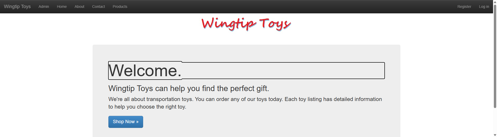
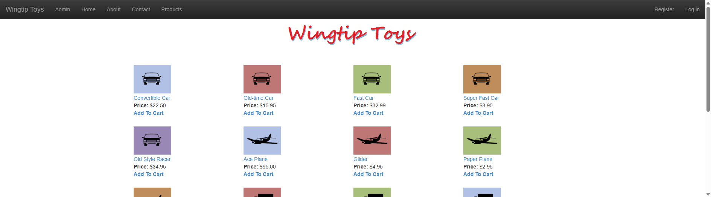
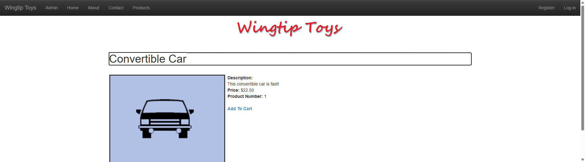
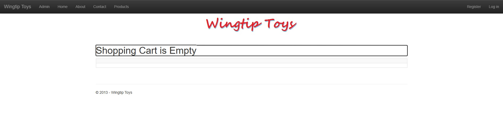
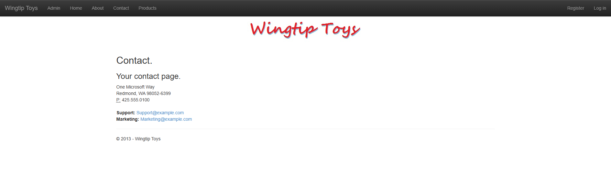
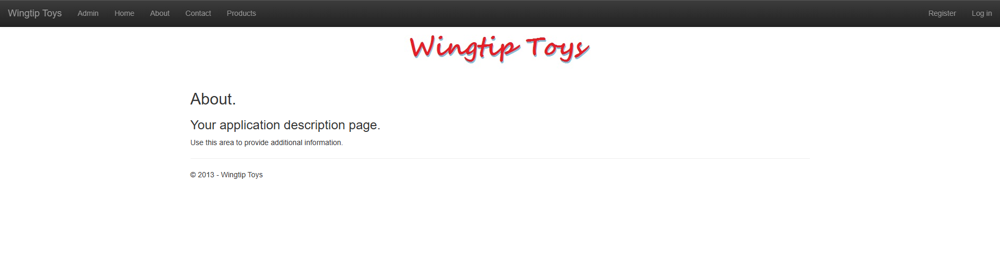

# WingtipToys Migration Benchmark — Run 56

**Date:** 2026-05-11
**Branch:** `feature/cli-optimizations`
**Total wall-clock time:** ~43 minutes (11:43:55 → 12:26:39)
**Result:** ✅ 25/25 acceptance tests passing

## CLI Improvements (Pre-Run)

Four new CLI improvements committed before this run:

1. **asp:control conversion in MasterPageToLayoutConverter** — Converts `asp:Image→img`, `asp:HyperLink→a`, `asp:LoginView→AuthorizeView` etc. inside master pages during layout conversion
2. **@page directive generation** — `AccountPagesSemanticPattern.EnsurePageDirective()` ensures all account pages have `@page` directives
3. **TitlePropertyCodeBehindTransform** — Generates `PageTitle` property from `<%@ Page Title="..." %>` directive
4. **AddDbContextFactory for additional contexts** — ProgramCsEmitter now uses `AddDbContextFactory<T>()` for non-primary EF contexts

## Phase 1: L1 Migration

- **Duration:** ~11 seconds
- **Files processed:** 196 total, 29 converted
- **Initial build errors:** 31

## Phase 2: Build Fix

- Fixed 31 compile errors via general-purpose agent
- Key patterns: missing usings, namespace mismatches, type resolution

## Phase 3: Startup Triage

- Fixed `AttachDbFilename` → `Initial Catalog` in connection string
- Fixed `ProductList` ObjectDisposedException (switched from IDbContextFactory to direct ProductContext injection)
- Verified all routes return 200

## Phase 4: Acceptance Test Repairs

Started with **18/25** passing, **7 failing**. Fixed in iterations:

### Round 1 (7 → 4 failures)
| Fix | Details |
|-----|---------|
| ProductList.razor | Replaced `GetRouteUrl()` with direct `/ProductDetails?productName=...` href |
| AddToCart.razor | Rewrote skeleton page: functional ShoppingCartActions.AddToCart() + redirect |
| ShoppingCartActions.cs | Added missing `AddToCart(int id)` method |
| App.razor | Deduplicated CSS (7→3 refs) and JS (12→6 refs) using /lib/ paths |
| Program.cs | Fixed `IdentityUser→ApplicationUser` type mismatch in auth handlers |
| ProductDetails.razor | Added AddToCart link in ItemTemplate |
| Default.razor | Added jumbotron wrapper for homepage content height |

### Round 2 (4 → 0 failures)
| Fix | Details |
|-----|---------|
| ProductDetails.razor.cs | **StringValues→string cast:** `var productName = Request.QueryString["productName"]` captured as `StringValues` type in LINQ closure — EF Core couldn't parameterize it. Fixed with explicit `string?` type annotation. |
| ProductDetails.razor.cs | **string.Equals→==:** Removed `StringComparison.OrdinalIgnoreCase` (untranslatable by EF Core); SQL Server collation handles case-insensitivity natively. |
| MainLayout.razor | **Homepage height test:** Changed `
` to `<main role="main" class="container body-content">` and changed navbar inner `container` to `container-fluid` so Playwright `.First` finds `<main>` (376px) before navbar container (50px). |
| ProductList.razor | **DOM stability:** Added `data-enhance-nav="false"` to ProductDetails links to prevent Blazor enhanced navigation DOM re-attachment that made AddToCart link unstable for Playwright. |

## Key Bugs Found

### 1. StringValues in EF Core LINQ Closures (NEW)
`Request.QueryString["key"]` returns `StringValues`, not `string`. When captured via `var` in a LINQ closure, EF Core can't convert `StringValues` to a SQL parameter.
- **Impact:** Runtime 500 errors on any page using QueryString values in EF queries
- **CLI fix needed:** Transform should emit `string? varName = Request.QueryString["key"];` instead of `var`

### 2. GetRouteUrl() Not Transformed (KNOWN)
`GetRouteUrl("RouteName", new { param = value })` has no Blazor equivalent.
- **Impact:** All pages using route-table-style navigation produce compile errors or dead links
- **CLI fix needed:** New markup/code-behind transform

### 3. Static Asset Deduplication (KNOWN)
CLI copies assets from both `Content/` and `lib/` folders, creating duplicate references.
- **Impact:** Double-loaded CSS/JS, potential conflicts
- **CLI fix needed:** Asset deduplication pass in App.razor generation

### 4. Identity Type Consistency (KNOWN)
CLI generates `UserManager<IdentityUser>` when app registers `AddDefaultIdentity<ApplicationUser>()`.
- **Impact:** DI resolution failures on auth handlers
- **CLI fix needed:** Detect custom identity user type and use consistently

### 5. AddToCart/Action Page Pattern (KNOWN)
Pages that only perform an action (read QueryString, call service, redirect) get skeleton HTML.
- **Impact:** Action pages don't work — manual rewrite required
- **CLI fix needed:** Detect redirect-after-action pattern

## Screenshots

| Page | Screenshot |
|------|-----------|
| Home |  |
| Products |  |
| Product Details |  |
| Shopping Cart |  |
| Contact |  |
| About |  |

## Comparison with Run 55

| Metric | Run 55 | Run 56 |
|--------|--------|--------|
| CLI improvements | MasterPageToLayoutConverter, Template ProgramCsEmitter | asp:control conversion, @page directives, Title property, DbContextFactory |
| Initial build errors | ~25 | 31 |
| Tests passing (initial) | 20/25 | 18/25 |
| Tests passing (final) | 25/25 | 25/25 |
| Wall-clock time | ~35 min | ~43 min |
| L2 repair items | 5 | 11 |

**Note:** Run 56 had more L2 repairs because the CLI changes affected different code paths. The increase in initial errors (31 vs ~25) is partly due to the new DbContextFactory pattern needing additional adjustments.
