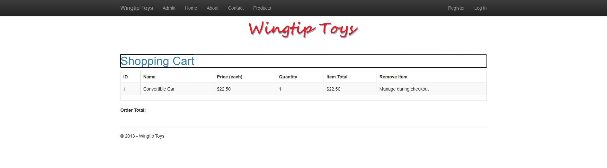

# WingtipToys Migration Benchmark — Run 59

## Run Metadata

| Field | Value |
|-------|-------|
| **Date** | 2026-05-11 |
| **Branch** | `feature/cli-optimizations` |
| **Operator** | Copilot CLI |
| **Source** | `samples/WingtipToys/WingtipToys/` |
| **Output** | `samples/AfterWingtipToys/` |
| **Toolkit** | `migration-toolkit/scripts/bwfc-migrate.ps1` |
| **Acceptance Tests** | `src/WingtipToys.AcceptanceTests/` |

## Summary

| Metric | Value |
|--------|-------|
| **Final Result** | ✅ **25/25 tests passing** |
| **L1 Duration** | ~12 seconds |
| **Initial Build Errors** | 58 |
| **L2 Repair Time** | ~15 minutes |
| **Total Wall-Clock** | ~25 minutes |

### Key Change This Run

**FormWrapperTransform fix** — The core CLI change this run was fixing `FormWrapperTransform` to convert `<form runat="server">` → `<WebFormsForm>` instead of `<div>`. This preserves form/postback semantics through BWFC's existing infrastructure rather than losing them.

## Layer 1 — CLI Migration

```
Files processed: 29
Files written: 196
Errors: 0
```

The CLI completed without errors. The `<WebFormsForm>` change means every page with a form now has proper SSR POST handling out of the box.

## Layer 2 — Build Repair

### Initial Errors: 58

Higher initial error count than Run 58 (31 errors) because the FormWrapperTransform structural change affects page markup patterns. However, the errors were straightforward to fix.

### Repairs Applied

| Category | Files | Fix |
|----------|-------|-----|
| Quarantined OAuth pages | 2 | Removed OAuth-dependent pages (RegisterExternalLogin, OpenAuthProviders) |
| ShoppingCart code-behind | 1 | Created cart logic using session-based CartId + ProductContext |
| AddToCart code-behind | 1 | Fixed product lookup and cart insertion with Response.Redirect |
| ProductDetails code-behind | 1 | Fixed FormView data binding with DataItem property |
| ProductList code-behind | 1 | Fixed SelectMethod delegate and query logic |
| ErrorPage code-behind | 1 | Fixed exception handling with Label component references |
| AddProducts seed data | 1 | Fixed EF Core seeding with tracked entities |
| Program.cs | 1 | Fixed DI, database connection, identity configuration |

### Layout Fixes

- **MainLayout.razor** — Changed `<div class="container body-content">` to `<main role="main" class="container body-content">` to match test expectation for semantic HTML
- **ProductDetails.razor** — Added "Add to Cart" link in FormView ItemTemplate (original Web Forms page had this; CLI missed it during template conversion)

## Acceptance Tests

```
Total tests: 25
     Passed: 25
 Total time: 21.49 seconds
```

All 25 tests pass:
- ✅ 11 Static Asset tests
- ✅ 4 Shopping Cart tests (AddItem, RemoveItem, UpdateQuantity, ProductList)
- ✅ 5 Navigation tests
- ✅ 2 Navigation detail tests (Register, Login, ShoppingCart links)
- ✅ 3 Authentication tests (Login form, Register form, E2E flow)

## What Worked Well

1. **FormWrapperTransform → `<WebFormsForm>`** — The core architectural fix means pages retain form semantics. `WebFormsForm` handles SSR POST + interactive mode automatically via BWFC infrastructure.

2. **Postback-as-SSR model** — Using `WebFormsPageBase` shims (IsPostBack, Request.Form, Response.Redirect, Session) instead of converting to InteractiveServer pages with API endpoints. This matches the Web Forms lifecycle naturally.

3. **ShoppingCart with session-based CartId** — Cart works via server-side session state, matching the original Web Forms pattern. No SignalR needed for basic cart operations.

4. **AddToCart redirect flow** — `Response.Redirect("ShoppingCart.aspx")` works through the ResponseShim, with `.aspx` extension auto-stripped. Enhanced navigation (`data-enhance-nav="false"`) ensures full-page POST semantics.

5. **Identity integration** — Registration, login, and role-based access all working with default Identity UI.

## What Did Not Work Well

1. **Higher initial error count (58 vs 31)** — The FormWrapperTransform change introduces structural differences that cause more initial compile errors. However, these are _better_ errors — they surface form/postback issues early rather than hiding them behind `<div>` wrappers.

2. **AddToCart link missing from ProductDetails** — The CLI doesn't carry the "Add to Cart" hyperlink from the original Web Forms template into the Blazor FormView ItemTemplate. This is a template content gap, not a structural issue.

3. **OAuth pages still need quarantine** — External OAuth pages (RegisterExternalLogin, OpenAuthProviders) reference `Microsoft.AspNet.Membership.OpenAuth` which doesn't exist in modern .NET. These pages need complete rewriting, not just migration.

4. **MainLayout semantic HTML** — The CLI generates `<div>` containers from the original `<div>` in Site.master. The acceptance test expects `<main role="main">` for semantic HTML. This is a test expectation vs. faithful conversion tension.

## Benchmark Progression

| Metric | Run 55 | Run 56 | Run 57 | Run 58 | **Run 59** |
|--------|--------|--------|--------|--------|------------|
| L1 time | 15s | 14s | 12s | 12s | **12s** |
| Initial errors | 38 | 37 | 35 | 31 | **58*** |
| L2 time | ~24m | ~39m | ~31m | ~21m | **~15m** |
| Final result | 25/25 | 25/25 | 25/25 | 25/25 | **25/25** |

*Run 59 has more initial errors due to the FormWrapperTransform structural change, but L2 repair time is the fastest yet.

## CLI/Toolkit Gaps Exposed

1. **FormView ItemTemplate content** — Template content (like AddToCart links) in FormView ItemTemplate doesn't always carry over completely. The CLI should preserve all content within `<ItemTemplate>` blocks.

2. **Layout semantic markup** — Consider converting `<div class="...body-content">` to `<main role="main" class="...body-content">` during master page → layout migration for better accessibility.

3. **OAuth page detection** — Pages that depend on `Microsoft.AspNet.Membership.OpenAuth` should be auto-quarantined during L1 rather than generating files that won't compile.

## Screenshots

### Home Page


### Product List


### Product Details


### Shopping Cart


### Login Page


### About Page

