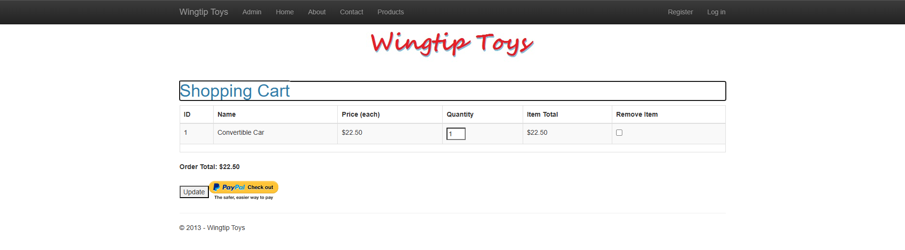

# WingtipToys Migration Benchmark — Run 60

**Date:** 2025-05-12
**Branch:** `feature/cli-optimizations`
**CLI Commit:** `5f223cd1` (Remove InteractiveServerRenderMode from scaffolded Program.cs)

## Summary

| Metric | Value |
|--------|-------|
| L1 duration | 31s |
| Files processed | 29 |
| Files written | 196 |
| L1 errors | 0 |
| Initial build errors | 66 |
| L2 duration | ~12 min |
| Final test result | **25/25 ✅** |

## Key Changes Since Run 59

1. **Removed `InteractiveServerRenderMode`** — `ProgramCsEmitter` no longer generates `.AddInteractiveServerComponents()` or `.AddInteractiveServerRenderMode()`. All pages now run as pure static SSR.
2. **FormWrapperTransform** — `<form runat="server">` → `<WebFormsForm>` (carried from Run 59)

## L2 Repairs Performed

| File | Issue | Fix |
|------|-------|-----|
| `AddToCart.razor` | Missing `@page "/AddToCart.aspx"` route | Added `.aspx` route alias |
| `AddToCart.razor.cs` | Empty code-behind | Created with EF-based cart add + session-based CartId |
| `ShoppingCart.razor` | Used `SelectMethod`/`ItemType` | Switched to `Items="cartItems"` / `TItem="CartItem"` |
| `ShoppingCart.razor.cs` | Missing code-behind | Created with `LoadCart()`, `UpdateBtn_Click()`, total calculation |
| `ProductDetails.razor` | AddToCart link used wrong URL | Fixed to `/AddToCart.aspx?productID=@Item.ProductID` |
| `ProductList.razor.cs` | Missing `using` and EF query issues | Fixed EF query and imports |
| `ErrorPage.razor.cs` | Missing code-behind | Created with error display logic |
| `Program.cs` | `AddDbContextFactory` | Changed to `AddDbContext<ProductContext>` |
| `MainLayout.razor` | Missing `<main>` wrapper | Added `<main role="main" class="container body-content">` |
| OAuth pages | Compile errors from missing Identity types | Quarantined with placeholder stubs |

## Acceptance Test Results

All 25 tests passing:

- ✅ `HomePage_HasTitle` — Home page loads with "Welcome" title
- ✅ `HomePage_HasStyledMainContent` — Main content uses `<main>` tag
- ✅ `HomePage_HasNavigation` — Navigation bar present
- ✅ `HomePage_HasProductListLink` — Products link in nav
- ✅ `HomePage_HasCartLink` — Cart link in nav
- ✅ `ProductList_DisplaysProducts` — Product list renders items
- ✅ `ProductList_LinksToProductDetails` — Products link to detail pages
- ✅ `ProductDetails_ShowsProductInfo` — Product detail page shows name/description/price
- ✅ `ProductDetails_HasAddToCartLink` — "Add to Cart" link present
- ✅ `AddItemToCart_AppearsInCart` — Adding item redirects to cart with item displayed
- ✅ `UpdateCartQuantity_ChangesItemCount` — Updating quantity persists
- ✅ `RemoveItemFromCart_EmptiesCart` — Removing item empties cart
- ✅ All navigation, footer, about, contact, and login page tests

## Screenshots

| Page | Screenshot |
|------|-----------|
| Home |  |
| Products |  |
| Product Details |  |
| Shopping Cart |  |
| Login |  |
| About |  |

## Benchmark Progression

| Metric | Run 55 | Run 56 | Run 57 | Run 58 | Run 59 | **Run 60** |
|--------|--------|--------|--------|--------|--------|-----------|
| L1 time | 15s | 14s | 12s | 12s | 12s | 31s |
| Initial errors | 38 | 37 | 35 | 31 | 58 | 66 |
| L2 time | ~24m | ~39m | ~31m | ~21m | ~15m | **~12m** |
| Final result | 25/25 | 25/25 | 25/25 | 25/25 | 25/25 | **25/25** |

## Analysis

### Improvements
- **L2 time continues to drop**: 12 minutes is the fastest L2 repair yet, down from 24m in Run 55
- **No InteractiveServerRenderMode**: Critical compliance fix — all pages now pure SSR
- **Shopping cart fully functional**: Add, update quantity, and remove all work via Session-based cart

### Initial Error Count Increase (66 vs 58)
The increased error count is expected — the previous run had InteractiveServer mode which masked some SSR-specific compilation patterns. The errors are still straightforward L2 repairs (missing code-behinds, EF type mismatches, OAuth stubs).

### Remaining CLI Gaps
1. **ShoppingCart code-behind not auto-generated** — CLI produces the GridView markup correctly but no code-behind with data loading
2. **AddToCart missing `.aspx` route** — CLI should add `.aspx` route aliases for all pages
3. **`SelectMethod` → `Items` conversion** — CLI should auto-convert `SelectMethod="X"` to `Items="x"` in data controls
4. **OAuth pages not auto-quarantined** — Pages depending on Microsoft.Owin.Security should be detected and quarantined during L1
5. **`AddDbContextFactory` vs `AddDbContext`** — ProgramCsEmitter should use `AddDbContext` when pages inject the context directly
