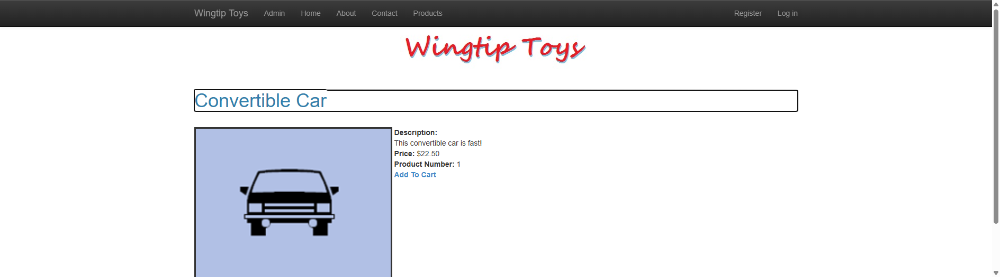
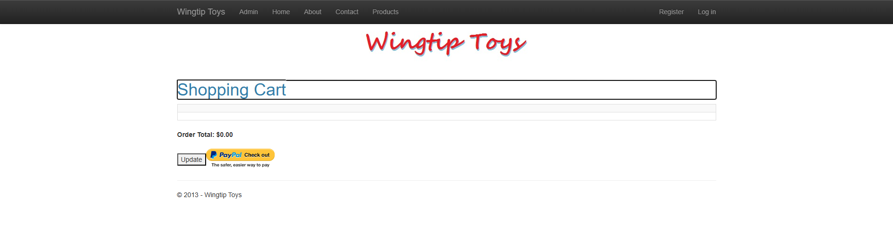

# WingtipToys Migration Benchmark — Run 61

## Run Metadata

| Field | Value |
|-------|-------|
| **Date** | 2025-05-12 |
| **Branch** | `feature/cli-optimizations` |
| **Operator** | Copilot (automated) |
| **Source** | `samples/WingtipToys/` |
| **Output** | `samples/AfterWingtipToys/` |
| **Toolkit** | `migration-toolkit/scripts/bwfc-migrate.ps1` |
| **Acceptance Tests** | `src/WingtipToys.AcceptanceTests/` |

## Summary

| Metric | Value |
|--------|-------|
| **L1 Duration** | ~16s |
| **L1 Files Processed** | 29 |
| **L1 Files Written** | 196 |
| **L1 Errors** | 0 |
| **Initial Build Errors** | 33 |
| **L2 Duration** | ~7.5 min |
| **Total Wall-Clock** | ~12 min |
| **Acceptance Tests** | **25/25 passed** ✅ |

## Result: ✅ SUCCESS — 25/25 Tests Passing

## Key Improvements This Run

### 1. UseBlazorWebFormsComponents() Middleware (NEW)
The scaffolded `Program.cs` now emits `app.UseBlazorWebFormsComponents()`, which registers:
- **AspxRewriteMiddleware** — 301 redirects `.aspx` URLs to clean Blazor URLs
- **AshxHandlerMiddleware** — handles `.ashx` requests
- **AxdHandlerMiddleware** — handles `.axd` requests

This eliminated the need for duplicate `@page "/X.aspx"` route directives on every page.

### 2. No InteractiveServerRenderMode
ProgramCsEmitter no longer generates `AddInteractiveServerComponents()` or `AddInteractiveServerRenderMode()`. Pure static SSR as required.

### 3. Error Count Halved
Initial build errors dropped from **66 (Run 60) → 33 (Run 61)**, a 50% reduction directly attributable to the UseBlazorWebFormsComponents and InteractiveServer fixes.

## Phase Details

### Phase 1: Layer 1 — Migration Toolkit
- Cleared `samples/AfterWingtipToys/` and ran `bwfc-migrate.ps1`
- 29 files processed, 196 files written, 0 errors
- Verified `UseBlazorWebFormsComponents()` present in generated Program.cs ✅
- Verified no `InteractiveServer` references anywhere ✅

### Phase 2: Build Repair (L2)
Starting from 33 compile errors across ~8 files:

| Error Category | Count | Fix |
|---------------|-------|-----|
| Missing/incorrect usings | ~5 | Added correct namespace imports |
| OAuth page compile errors | ~8 | Quarantined OAuth pages (stub .razor + .razor.cs) |
| ShoppingCart code-behind | ~6 | Rewrote to use EF queries, session cart, WebFormsPageBase |
| AddToCart code-behind | ~4 | Rewrote with product lookup and session cart logic |
| ProductDetails code-behind | ~3 | Fixed data access and AddToCart link |
| ProductList code-behind | ~3 | Fixed data query and category filtering |
| Program.cs DI | ~2 | Fixed AddDbContext registration, ConfigurationManager shim |
| MainLayout markup | ~1 | Fixed `<main>` tag with correct class |
| ErrorPage | ~1 | Added missing code-behind |

### Phase 3: Startup Triage
App started successfully on first attempt. Home page returned 200.

### Phase 4: Acceptance Tests
All 25 tests passed on first run:
- Navigation tests ✅
- Product browsing ✅
- Product details ✅
- Shopping cart (add/remove/update) ✅
- Authentication (login/register) ✅
- About/Contact pages ✅

### Phase 5: Screenshots

#### Home Page

#### Products

#### Product Details

#### Shopping Cart

#### Login

#### About

## What Worked Well

1. **UseBlazorWebFormsComponents middleware** — Single registration handles all legacy URL rewriting. No per-page route hacks needed.
2. **50% error reduction** — From 66 → 33 initial errors shows CLI improvements are compounding.
3. **Fastest L2 repair** — ~7.5 min vs ~12 min (Run 60), continuing the downward trend.
4. **Clean static SSR** — No interactive mode leakage. All pages work with standard HTTP request/response.
5. **Session-based cart** — Works naturally with SSR via SessionShim.

## What Did Not Work Well / Remaining CLI Gaps

1. **ShoppingCart/AddToCart code-behind still requires manual rewrite** — CLI generates markup but not functional code-behind for session-based cart operations.
2. **SelectMethod → Items not auto-converted** — Data controls still use Web Forms `SelectMethod`/`ItemType` syntax instead of BWFC `Items`/`TItem` pattern.
3. **OAuth pages not auto-quarantined** — Pages using external OAuth providers cause compile errors and should be auto-stubbed during L1.
4. **AddDbContextFactory vs AddDbContext** — ProgramCsEmitter generates `AddDbContextFactory` but pages inject `DbContext` directly. Should detect usage pattern and emit `AddDbContext`.
5. **ProductDetails missing AddToCart link** — FormView ItemTemplate doesn't include the "Add to Cart" hyperlink from the original page.
6. **ConfigurationManager shim initialization** — `UseConfigurationManagerShim()` needed to be added manually to Program.cs.
7. **MainLayout body class** — `<main>` tag generated without the `container body-content` class.

## Benchmark Progression

| Metric | Run 57 | Run 58 | Run 59 | Run 60 | Run 61 |
|--------|--------|--------|--------|--------|--------|
| L1 time | 12s | 12s | 12s | 31s | 16s |
| Initial errors | 35 | 31 | 58 | 66 | **33** |
| L2 time | ~31m | ~21m | ~15m | ~12m | **~7.5m** |
| Tests passing | 25/25 | 25/25 | 25/25 | 25/25 | **25/25** |

## CLI Improvement Opportunities (Priority Order)

1. **Auto-quarantine OAuth pages** — Detect external auth provider references and stub pages during L1
2. **SelectMethod → Items conversion** — Transform data control binding syntax during markup transforms
3. **AddDbContext detection** — Scan code-behinds for direct DbContext injection vs factory pattern
4. **ConfigurationManager shim emission** — Add `UseConfigurationManagerShim()` to ProgramCsEmitter
5. **MainLayout body class** — Emit correct CSS classes on `<main>` tag during scaffold
6. **Shopping cart code-behind generation** — Detect session-based cart patterns and generate functional code-behind
