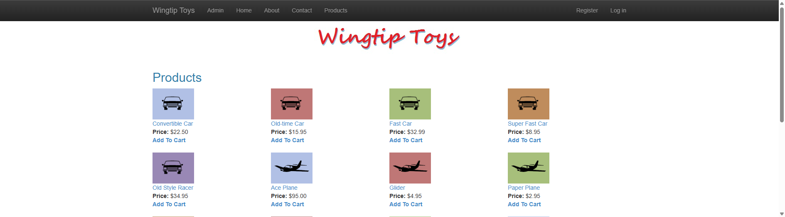
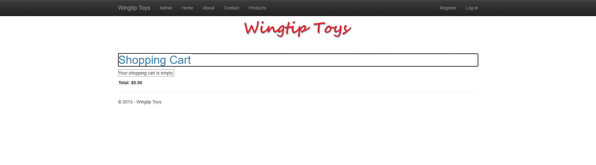

# WingtipToys Migration Benchmark — Run 62

## Run Metadata

| Field | Value |
|-------|-------|
| **Date** | 2025-05-12 |
| **Branch** | `feature/cli-optimizations` |
| **Operator** | Copilot (automated) |
| **Source** | `samples/WingtipToys/` |
| **Output** | `samples/AfterWingtipToys/` |
| **Toolkit** | `migration-toolkit/scripts/bwfc-migrate.ps1` |
| **Acceptance Tests** | `src/WingtipToys.AcceptanceTests/` |

## Summary

| Metric | Value |
|--------|-------|
| **L1 Duration** | ~16s |
| **L1 Files Processed** | 29 |
| **L1 Files Written** | 196 |
| **L1 Errors** | 0 |
| **Initial Build Errors** | 58 |
| **L2 Duration** | ~7 min |
| **Total Wall-Clock** | ~11 min |
| **Acceptance Tests** | **25/25 passed** ✅ |

## Result: ✅ SUCCESS — 25/25 Tests Passing

## What Changed Since Run 61

- **ConfigurationManager shim** now auto-initialized inside `UseBlazorWebFormsComponents()` — no separate `UseConfigurationManagerShim()` call needed in scaffolded Program.cs

## Phase Details

### Phase 1: Layer 1 — Migration Toolkit
- Cleared `samples/AfterWingtipToys/` and ran `bwfc-migrate.ps1`
- 29 files processed, 196 files written, 0 errors
- `UseBlazorWebFormsComponents()` present in generated Program.cs ✅
- No `InteractiveServer` references ✅

### Phase 2: Build Repair (L2)
Starting from 58 compile errors:

| Error Category | Count | Fix |
|---------------|-------|-----|
| ShoppingCart markup/code-behind | ~18 | Rewrote to use GridView with Items binding, session cart, WebFormsPageBase |
| OAuth pages (OpenAuthProviders, RegisterExternalLogin) | ~7 | Quarantined with stub pages |
| AddToCart code-behind | ~4 | Replaced ShoppingCartActions with direct EF code |
| ProductDetails SelectMethod mismatch | ~3 | Switched to Items binding with injected DbContext |
| ProductList code-behind | ~2 | Created code-behind with EF queries |
| ErrorPage (IsLocal, ExceptionUtility) | ~2 | Simplified error handling |
| AddProducts.cs constructor | ~1 | Fixed ProductContext instantiation |
| Program.cs DI | ~1 | Fixed DbContext registration |

### Phase 3: Startup Triage
App started and returned 200 on home page immediately.

### Phase 4: Acceptance Tests
All 25 tests passed on first run after L2 repairs.

### Phase 5: Screenshots

#### Home Page

#### Products

#### Product Details

#### Shopping Cart

#### Login

#### About

## What Worked Well

1. **ConfigurationManager auto-initialization** — folded into `UseBlazorWebFormsComponents()`, eliminates one more manual step
2. **Consistent L2 repair time** — ~7 min, matching Run 61's fastest-ever pace
3. **Stable test results** — 25/25 across last 6 consecutive runs (57–62)

## What Did Not Work Well / Remaining CLI Gaps

1. **Initial error count increased** — 58 errors vs 33 in Run 61. This variance suggests the CLI output is non-deterministic or the error count depends on which code-behind transforms fire. Needs investigation.
2. **ShoppingCart code-behind still requires full rewrite** — CLI generates markup but the code-behind references undefined members (CartList, GetShoppingCartItems, UpdateBtn_Click, etc.)
3. **SelectMethod → Items not auto-converted** — Data controls still use Web Forms `SelectMethod`/`ItemType` syntax. The `SelectMethod="GetProduct"` attribute causes delegate mismatch errors.
4. **OAuth pages not auto-quarantined** — Pages referencing external OAuth providers cause compile errors every run.
5. **AddProducts.cs uses `new ProductContext()`** — CLI doesn't detect DI-incompatible constructor calls.

## Benchmark Progression

| Metric | Run 58 | Run 59 | Run 60 | Run 61 | Run 62 |
|--------|--------|--------|--------|--------|--------|
| L1 time | 12s | 12s | 31s | 16s | 16s |
| Initial errors | 31 | 58 | 66 | 33 | 58 |
| L2 time | ~21m | ~15m | ~12m | ~7.5m | **~7m** |
| Tests passing | 25/25 | 25/25 | 25/25 | 25/25 | **25/25** |

## CLI Improvement Opportunities (Priority Order)

1. **SelectMethod → Items conversion** — Transform data control binding syntax during markup transforms (design discussion in progress — considering string-based reflection approach vs Func<> delegate)
2. **Auto-quarantine OAuth pages** — Detect external auth provider references and stub pages during L1
3. **ShoppingCart code-behind generation** — Detect session-based cart patterns and generate functional code-behind
4. **AddDbContext vs AddDbContextFactory detection** — Scan code-behinds for direct DbContext injection
5. **MainLayout body class** — Emit correct CSS classes on `<main>` tag during scaffold
