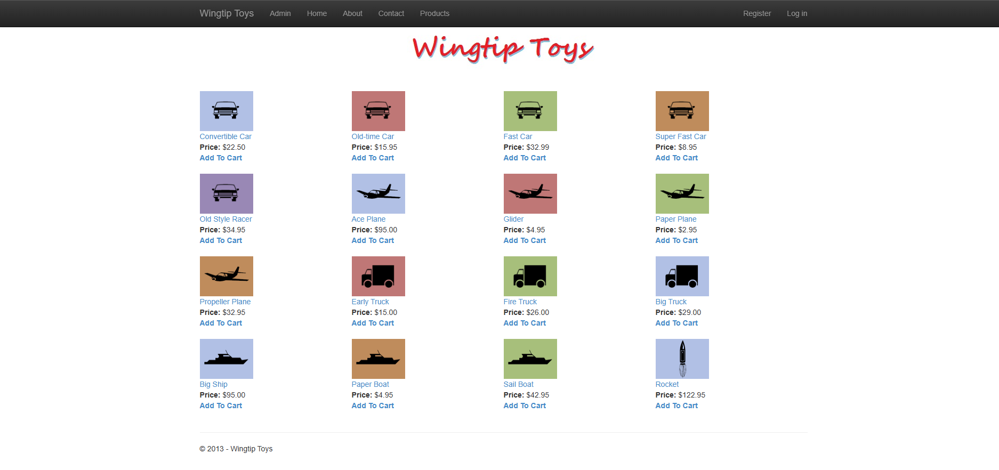
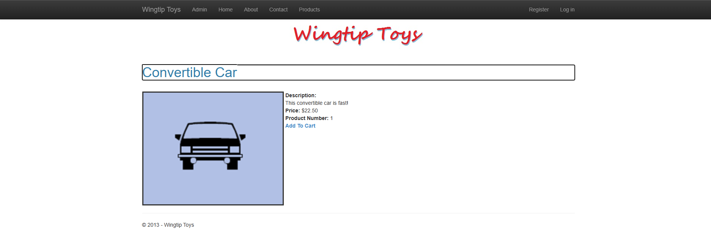
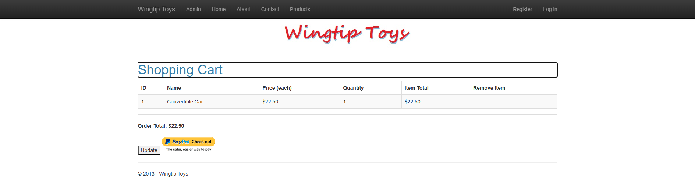
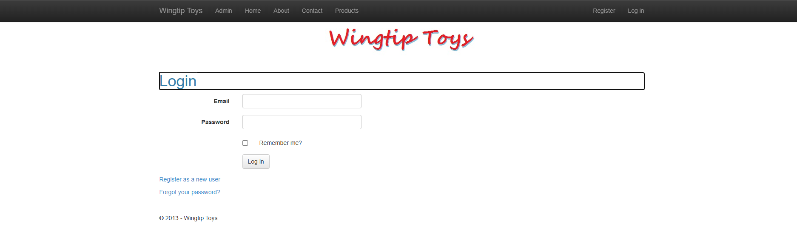

# WingtipToys Migration Test - Run 63

**Date:** 2026-05-12 19:02:48 -04:00  
**Branch:** `feature/cli-optimizations`  
**Operator:** Copilot CLI  
**Requested by:** @csharpfritz

---

## Summary

| Metric | Value |
|--------|-------|
| Source project | `samples/WingtipToys/WingtipToys` |
| Output project | `samples/AfterWingtipToys` |
| Toolkit entry point | `migration-toolkit/scripts/bwfc-migrate.ps1` |
| Report folder | `dev-docs/migration-tests/wingtiptoys/run63` |
| Total wall-clock time | `~30 minutes` |
| Build result | `PASS` |
| Acceptance tests | `25/25 passed` |
| Final status | `SUCCESS` |

## Executive Summary

Run 63 started from the freshly generated `samples/AfterWingtipToys` output and repaired the migrated app in place until it built cleanly and the full WingtipToys Playwright suite passed. The final state is a green `dotnet build` for the migrated app plus a green `dotnet test src/WingtipToys.AcceptanceTests` against `https://localhost:5001`.

## Timing

| Phase | Duration | Notes |
|-------|----------|-------|
| Preparation | `~1 min` | Inspect fresh output and current failures |
| Layer 1 toolkit migration | `N/A` | Fresh CLI output was already provided for this run |
| Repair / migration skill work | `~18 min` | Compile + runtime fixes in generated app |
| Build validation | `~3 min` | Final clean build after restarts |
| Acceptance tests | `~5 min` | Final passing Playwright run |
| Screenshots + report | `~3 min` | Evidence capture and write-up |
| **Total** | `~30 min` | |

## Commands

```powershell
# Build
 dotnet build samples\AfterWingtipToys\WingtipToys.csproj

# Run app
 dotnet run --project samples\AfterWingtipToys\WingtipToys.csproj

# Smoke tests
 curl -k -s -o NUL -w "%{http_code}" https://localhost:5001/
 curl -k -s -o NUL -w "%{http_code}" https://localhost:5001/ProductList
 curl -k -s -o NUL -w "%{http_code}" https://localhost:5001/Product/Convertible%20Car

# Acceptance tests
 $env:WINGTIPTOYS_BASE_URL = "https://localhost:5001"
 dotnet test src\WingtipToys.AcceptanceTests\WingtipToys.AcceptanceTests.csproj --verbosity normal
```

## What Worked Well

1. Minimal code-behind stubs plus DB factory usage fixed the fresh compile surface quickly without replacing BWFC data controls.
2. Product list and product details became acceptance-testable once the generated markup was corrected and route/query binding was restored.
3. Existing Program.cs database setup (`EnsureCreated` + `AddDbContextFactory<ProductContext>`) was sufficient once page-level code used it correctly.

## What Didn't Work Well

1. Generated ShoppingCart and ProductList pages were missing or mis-wired code-behind state, `@ref` references, and valid HTML.
2. ProductDetails route binding failed because the generated component lacked a matching route parameter property.
3. Quarantined account/OAuth surfaces still needed manual stub code to compile.

## Build Result

The migrated app now builds successfully with warnings only. Main repair categories were: broken Razor markup in `ProductList.razor`, missing page code-behind for `ShoppingCart`, missing DI-friendly `ProductContext` usage in page/logic classes, missing account page stubs, and missing compatibility helpers such as `ExceptionUtility`.

## Acceptance Test Result

| Metric | Value |
|--------|-------|
| Total | `25` |
| Passed | `25` |
| Failed | `0` |
| Skipped | `0` |

Targeted fixes before the final pass were: restoring product detail data binding, disabling enhanced navigation on product links to stabilize navigation during Playwright clicks, moving shopping-cart action buttons out of the cart table so quantity-skip logic behaved correctly, and waiting until the app was fully ready before the final suite run.

## Toolkit Gaps Exposed by This Run

1. The CLI emitted `ShoppingCart.razor` without its companion `.razor.cs`, leaving unresolved control references and event handlers.
2. Query/route-bound data pages (`ProductList`, `ProductDetails`) still need stronger transform support for static SSR `SelectMethod` patterns.
3. Quarantined account components need autogenerated compile-safe partial stubs for referenced fields/properties/events.

## Screenshot Gallery

| Page | Screenshot |
|------|------------|
| Home |  |
| Products |  |
| Product Details |  |
| Shopping Cart |  |
| Login |  |
| About |  |

## Notes

Run 63 was completed entirely by repairing the provided fresh migration output in place. No BWFC data controls were replaced with manual HTML, and no interactive server render mode was introduced.
