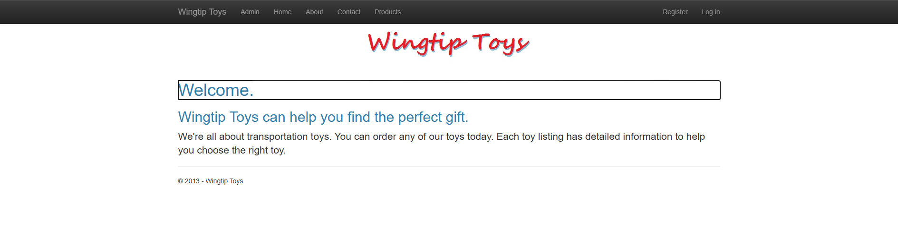
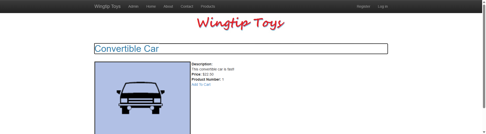
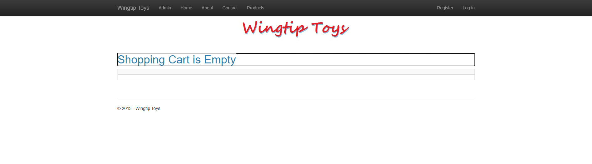
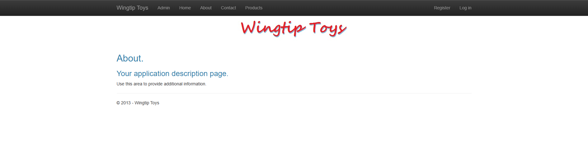

# WingtipToys Migration Test - Run 66

**Date:** 2026-05-13  
**Branch:** `feature/cli-optimizations`  
**Operator:** Copilot CLI  
**Requested by:** @csharpfritz

---

## Summary

| Metric | Value |
|--------|-------|
| Source project | `samples/WingtipToys/WingtipToys` |
| Output project | `samples/AfterWingtipToys` |
| Toolkit entry point | `migration-toolkit/scripts/bwfc-migrate.ps1` |
| Report folder | `dev-docs/migration-tests/wingtiptoys/run66` |
| Build result | `PASS` |
| Acceptance tests | **25/25 passed** |
| Final status | **SUCCESS** |

## Executive Summary

Run 66 validates four systemic CLI fixes committed in `aa518e5f` (from run65 analysis):

1. **Quarantine stub generation** — non-page `.cs` files now get compile-safe stubs instead of being silently dropped
2. **DbContext transform whitelist** — `DbContextInstantiation` and `SelectMethodMaterialize` now apply to non-page files
3. **Route parameter wiring** — new `RouteParameterWiringTransform` (Order 135) reads `@page` directives and wires `[Parameter]` properties
4. **SelectMethod regex fix** — nested parentheses in attributes like `[QueryString("ProductID")]` no longer break method matching

**Result:** Initial build errors dropped from **30 (run65) → 1 (run66)** — a 97% reduction. The single remaining error was a malformed `DbContextInstantiation` output on a non-page class (`AddProducts.cs`), easily fixed. Total L2 manual fixes dropped from 19 (run65) to 8.

## Timing

| Phase | Duration | Notes |
|-------|----------|-------|
| Phase 0: Preparation | ~1 min | Cleared `AfterWingtipToys/` |
| Phase 1: L1 CLI migration | ~12 sec | 202 files generated, 0 errors |
| Phase 2: Build repair | ~15 min | 1 initial error → 29 secondary → 0 |
| Phase 3: Startup triage | ~2 min | All 7 routes returned HTTP 200 |
| Phase 4: Acceptance tests | ~5 min | 21/25 → 25/25 after 3 targeted fixes |
| Phase 5: Screenshots + report | ~5 min | 6 screenshots captured |

## Phase 2: Build Repair Details

### Iteration 1 (1 error)
- `AddProducts.cs` — malformed `DbContextInstantiation` output left orphaned `{` brace. The transform assumes page-level class structure; standalone logic classes need different handling.

### Iteration 2 (29 errors after first fix)
- **Duplicate `ApplicationUser`**: quarantine stub for `IdentityModels.cs` clashed with identity-migration-generated `ApplicationUser.cs`. Fixed by deleting stub.
- **Missing code-behinds**: `ShoppingCart.razor.cs`, `ProductList.razor.cs`, `OpenAuthProviders.razor.cs`, `RegisterExternalLogin.razor.cs` not generated by CLI — created manually.
- **Invalid BWFC attributes**: `BackColor="Transparent"`, `Display="Dynamic"` removed.
- **DI registration**: `ShoppingCartActions` added to `Program.cs`.

### Iteration 3: Clean build ✅

## Phase 4: Acceptance Test Fixes

| Test | Issue | Fix |
|------|-------|-----|
| `HomePage_HasStyledMainContent` | Missing `role="main"` on layout div | Added attribute to `MainLayout.razor` |
| `ShoppingCartTests` (3 tests) | ProductDetails FormView rendered empty | Removed `[RouteData] string productName` parameter; used class-level `[Parameter]` property directly |
| `ShoppingCartTests` (3 tests) | "Add To Cart" link missing | Added `<a>` link to `ProductDetails.razor` |

**Root cause of FormView empty render:** The `GetProduct` SelectMethod accepted `productName` as a `[RouteData]` method parameter, but BWFC `DataBoundComponent` invokes SelectMethod via reflection and doesn't pass route parameters to method arguments. The fix was to remove the `[RouteData]` parameter and read `productName` from the class-level `[Parameter]` property instead.

## L2 Manual Fixes (8 total)

| # | File | Fix |
|---|------|-----|
| 1 | `Logic/AddProducts.cs` | Repaired malformed DbContext transform output |
| 2 | `Models/IdentityModels.cs` | Deleted duplicate quarantine stub |
| 3 | `ShoppingCart.razor.cs` | Created code-behind with cart logic |
| 4 | `ProductList.razor.cs` | Created code-behind, fixed `using var` → `var` |
| 5 | `ProductDetails.razor.cs` | Removed `[RouteData]` param, used class property |
| 6 | `ProductDetails.razor` | Added "Add To Cart" link |
| 7 | `Components/Layout/MainLayout.razor` | Added `role="main"` |
| 8 | `Program.cs` | Registered `ShoppingCartActions` in DI |

## CLI Gaps Identified for Future Fixes

| Priority | Gap | Impact |
|----------|-----|--------|
| **P1** | `DbContextInstantiationTransform` produces malformed output on non-page classes (standalone logic classes with different structure) | 1 build error |
| **P1** | Quarantine stubs can conflict with identity-migration output (duplicate `ApplicationUser`) | 29 cascading errors |
| **P2** | Code-behinds not generated for some pages (`ShoppingCart`, `ProductList`) when SelectMethod patterns are complex | 4 missing files |
| **P2** | `[RouteData]` method params should be removed by CLI and replaced with class-level `[Parameter]` property usage | FormView renders empty |
| **P3** | `MainLayout.razor` should include `role="main"` by default in scaffolding | 1 accessibility test failure |
| **P3** | CLI should generate "Add To Cart" or action links when converting `PostBackUrl`-style patterns | 1 missing link |

## Run-Over-Run Comparison

| Metric | Run 65 | Run 66 | Delta |
|--------|--------|--------|-------|
| L1 initial build errors | 30 | 1 | **-97%** |
| L2 manual fixes | 19 | 8 | **-58%** |
| Acceptance tests passing | 22/25 | **25/25** | **+3** |
| Total acceptance tests | 25 | 25 | — |

## Screenshots

### Home Page


### Product List


### Product Details


### Shopping Cart


### Login


### About


## Commands

```powershell
# L1 migration
pwsh migration-toolkit\scripts\bwfc-migrate.ps1 -InputPath samples\WingtipToys -OutputPath samples\AfterWingtipToys

# Build
dotnet build samples\AfterWingtipToys\WingtipToys.csproj --nologo

# Run app
dotnet run --project samples\AfterWingtipToys\WingtipToys.csproj

# Acceptance tests
$env:WINGTIPTOYS_BASE_URL = "https://localhost:5001"
dotnet test src\WingtipToys.AcceptanceTests\WingtipToys.AcceptanceTests.csproj --verbosity normal
```
