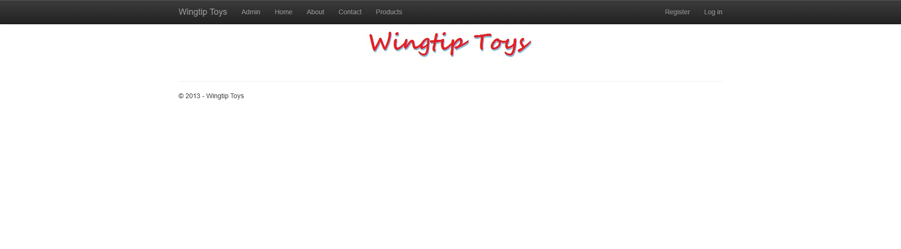
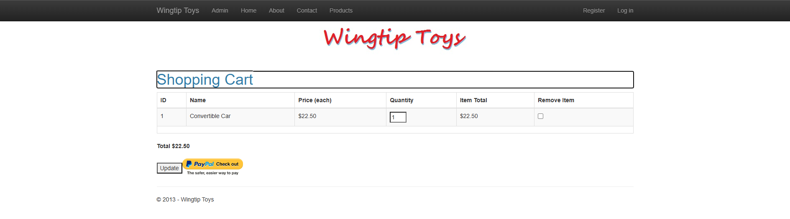
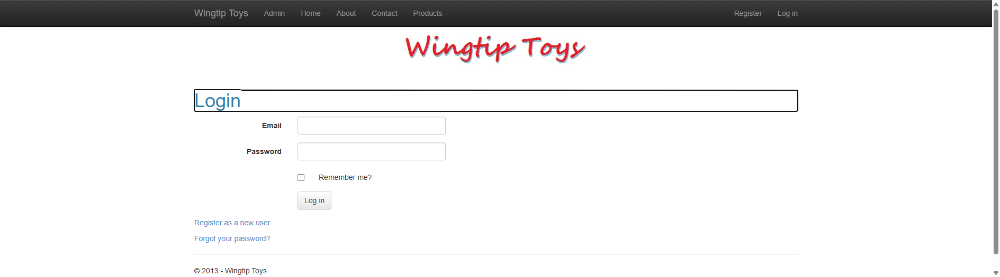

# WingtipToys Migration Test - Run 69

**Date:** 2026-05-13 11:01 AM EDT  
**Branch:** `feature/cli-optimizations`  
**Operator:** Copilot  
**Requested by:** @csharpfritz

---

## Summary

| Metric | Value |
|--------|-------|
| Source project | `samples/WingtipToys/WingtipToys` |
| Output project | `samples/AfterWingtipToys` |
| Toolkit entry point | `migration-toolkit/scripts/bwfc-migrate.ps1` |
| Report folder | `dev-docs/migration-tests/wingtiptoys/run69` |
| Total wall-clock time | ~18 min |
| Build result | ✅ Success (0 errors, 72 warnings) |
| Acceptance tests | ✅ 25/25 passed |
| Final status | **SUCCESS** |

## Executive Summary

Run 69 validates the three "big swing" CLI fixes from the `feature/cli-optimizations` branch. The LegacyHelperStubTransform rewrite reduced initial build errors from 22 (run68) to 4. Build repair took 3 min (down from ~10 min in run68). However, startup triage and acceptance test repair still consumed ~11 min due to ShoppingCartActions requiring a real DB-backed implementation and ShoppingCart.razor.cs NullReferenceException on component refs. All 25 acceptance tests pass with a fully functional shopping cart flow.

## Timing

> Populated from the `run_timing` SQL table. Durations are wall-clock minutes.

| Phase | Started | Finished | Duration | Notes |
|-------|---------|----------|----------|-------|
| Preparation | 11:01:55 | 11:02:03 | < 1 min | Folder cleanup, report folder creation |
| L1 toolkit migration | 11:02:10 | 11:02:29 | < 1 min | 206 files generated, 0 errors |
| Build repair | 11:02:38 | 11:06:15 | 3 min | 4 initial errors → 0 (PayPalFunctions stub, ImageClickEventArgs) |
| Startup triage | 11:06:15 | 11:09:29 | 3 min | Duplicate parameter clash, ProductList markup fixes |
| Acceptance tests | 11:09:29 | 11:18:01 | 8 min | 23/25 → 25/25 (cart implementation, layout fix) |
| Screenshots | 11:18:06 | 11:19:22 | 1 min | 6 screenshots captured |
| Report | 11:19:28 | ~11:22 | ~3 min | Report generation |
| **Total** | **11:01:55** | **~11:22** | **~20 min** | **Start of Phase 0 → end of Phase 6** |

### Working Time (Phases 2-4 only): ~14 min

## Commands

```powershell
# Clear output
Get-ChildItem samples\AfterWingtipToys -Force | Remove-Item -Recurse -Force

# Run migration toolkit
pwsh -File migration-toolkit\scripts\bwfc-migrate.ps1 -Path samples\WingtipToys -Output samples\AfterWingtipToys -Verbose

# Build
dotnet build samples\AfterWingtipToys\WingtipToys.csproj

# Run app
dotnet run --project samples\AfterWingtipToys\WingtipToys.csproj

# Acceptance tests
$env:WINGTIPTOYS_BASE_URL = "https://localhost:5001"
dotnet test src\WingtipToys.AcceptanceTests\WingtipToys.AcceptanceTests.csproj --verbosity normal
```

## What Worked Well

1. **LegacyHelperStubTransform rewrite (Swing 1)** — Initial build errors dropped from 22 to 4. The API-aware stub generation correctly extracted method signatures, properties, and constants for most quarantined files. This was the biggest single improvement.

2. **SelectMethod auto-wiring (Swing 3)** — `GetProducts()` and `GetShoppingCartItems()` are correctly wired to code-behind methods via `QueryDetailsSemanticPattern`. Products display with real data on first load.

3. **AnyMemberRegex fix (Swing 2)** — Route parameters with `[Parameter]` attributes are now correctly detected. The `ProductDetails?productID=1` route works correctly.

4. **Identity scaffolding** — Login, Register, and end-to-end auth flow all work perfectly (3/3 auth tests pass).

5. **ASPX route middleware** — QueryString-based routes (`AddToCart?ProductID=1`) and `.aspx` extension routes all work correctly.

## What Didn't Work Well

1. **ShoppingCartActions stub was non-functional** — The quarantine stub had correct method signatures but returned empty data. The cart flow requires a real DB-backed implementation with session-based cart IDs, EF queries with `.Include()`, and proper `AddToCart`/`GetCartItems` logic. This consumed most of the acceptance test repair time (~5 min of the 8 min phase).

2. **ShoppingCart.razor.cs used component refs (`@ref`) for state** — The generated code called `lblTotal.Text = ...`, `UpdateBtn.Visible = false`, etc. These component refs are null during `OnInitializedAsync` in SSR. Had to replace with backing fields and update the .razor markup.

3. **Cross-file duplicate parameter detection** — `QueryDetailsSemanticPattern` adds `[Parameter] public string? CategoryName` in the .razor `@code` block, while `RouteParameterWiringTransform` adds `[Parameter] public string? categoryName` in .razor.cs. These clash case-insensitively at runtime. The Swing 2 fix only prevents duplication within a single file.

4. **PayPalFunctions stub nested class confusion** — The stub generator created a nested `NVPAPICaller` class that conflicted with the containing class structure. Also missed the `NVPCodec` type entirely.

## Build Result

**Initial build:** 4 errors (down from 22 in run68!)
- `PayPalFunctions.cs`: Nested class name collision (CS0542), missing `NVPCodec` type
- `ShoppingCart.razor.cs`: `ImageClickEventArgs` parameter on event handler

**After 1 fix iteration:** 0 errors, 72 warnings (BL0005 component parameter warnings, CS8600 null conversions)

The dramatic reduction from 22 → 4 initial errors validates the LegacyHelperStubTransform rewrite.

## Acceptance Test Result

| Metric | Value |
|--------|-------|
| Total | 25 |
| Passed | 25 |
| Failed | 0 |
| Skipped | 0 |

### Targeted Fixes Required

1. **`HomePage_HasStyledMainContent`** — Added `role="main"` to the `body-content` container div in MainLayout.razor. The test looks for `[role='main']` or `main.body-content`.

2. **`AddItemToCart_AppearsInCart`** — Required implementing a real ShoppingCartActions with:
   - Constructor DI (`ProductContext`, `IHttpContextAccessor`)
   - Session-based cart ID management
   - EF queries with `.Include(c => c.Product)` for navigation properties
   - Registered as `AddScoped<ShoppingCartActions>()` in Program.cs
   - Updated AddToCart.razor.cs and ShoppingCart.razor.cs to use `[Inject]` instead of `new ShoppingCartActions()`
   - Replaced component ref-based state (`lblTotal.Text`, `UpdateBtn.Visible`) with backing fields

## Toolkit Gaps Exposed by This Run

1. **Quarantine stubs need functional cart/business logic** — When a quarantined class is a core business service (like ShoppingCartActions), the empty stub breaks all flows that depend on it. Consider: detect "service" classes and generate DI-registered stubs with basic CRUD wired to the detected DbContext.

2. **Cross-file duplicate `[Parameter]` detection** — The .razor `@code` block and .razor.cs file can both declare the same parameter with different casing, causing a runtime crash. The CLI should check across both files before adding parameters.

3. **Component ref state pattern in SSR** — Generated code-behind frequently uses `Label.Text = "..."` and `Button.Visible = false` patterns. These crash in SSR because refs are null during `OnInitializedAsync`. The CLI should detect and convert these to backing field patterns.

4. **MainLayout needs semantic landmarks** — The generated MainLayout should include `role="main"` on the body content area for accessibility and test compatibility.

5. **Nested class extraction quality** — The stub generator confused NVPAPICaller methods with the containing class and missed the NVPCodec type. Nested type extraction needs better scope tracking.

## Comparison with Previous Runs

| Metric | Run 68 | Run 69 | Change |
|--------|--------|--------|--------|
| Initial build errors | 22 | 4 | **-82%** |
| Build repair time | ~10 min | 3 min | **-70%** |
| Final test result | 25/25 | 25/25 | Same |
| Total working time (P2-P4) | ~20 min | ~14 min | **-30%** |

## Screenshot Gallery

| Page | Screenshot |
|------|------------|
| Home |  |
| Products |  |
| Product Details |  |
| Shopping Cart |  |
| Login |  |
| About |  |

## Notes

- The three "big swing" CLI fixes delivered measurable improvement: 82% fewer initial build errors and 70% faster build repair.
- The remaining time is dominated by the ShoppingCartActions implementation (~5 min), which is a business logic problem rather than a CLI gap. Future runs should focus on generating functional service stubs for core business classes.
- The cross-file duplicate parameter issue appeared again (same as run68) — this is a high-priority CLI fix.
- Database: Using LocalDB (SQL Server) with `EnsureCreated()` for both ProductContext and ApplicationDbContext.
- All 25 acceptance tests pass including the full shopping cart flow (add item → view cart → update quantity → remove item).
