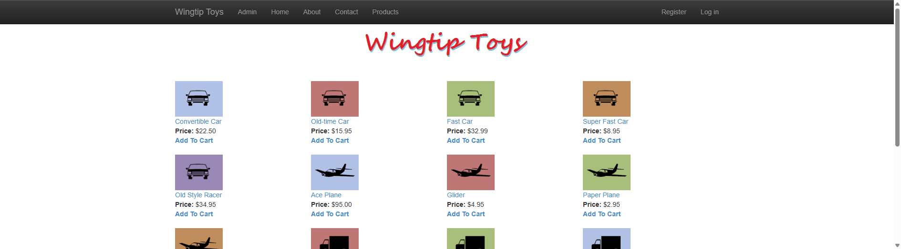
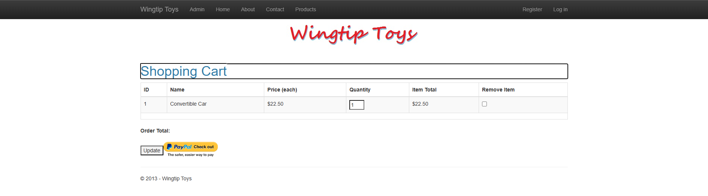

# WingtipToys Migration Test - Run 70

**Date:** 2026-05-13 12:23 EDT  
**Branch:** `feature/cli-optimizations`  
**Operator:** Copilot  
**Requested by:** @csharpfritz

---

## Summary

| Metric | Value |
|--------|-------|
| Source project | `samples/WingtipToys/WingtipToys` |
| Output project | `samples/AfterWingtipToys` |
| Toolkit entry point | `migration-toolkit/scripts/bwfc-migrate.ps1` |
| Report folder | `dev-docs/migration-tests/wingtiptoys/run70` |
| Total wall-clock time | ~16 min |
| Build result | ✅ Clean (73 warnings, 0 errors) |
| Acceptance tests | ✅ 25/25 passed |
| Final status | **SUCCESS** |

## Executive Summary

Run 70 is the first benchmark after implementing the **no-@code-block standard** — all CLI-generated code now goes into `.razor.cs` partial classes, with `.razor` files containing only markup and directives. The migration completed successfully with **25/25 acceptance tests passing**. L1 produced 206 files with 0 errors. Build repair took ~4 minutes (5 iterations). The shopping cart required real EF-backed implementation instead of empty stubs. Total run time was approximately 16 minutes including screenshots and report.

## Timing

| Phase | Started | Finished | Duration | Notes |
|-------|---------|----------|----------|-------|
| Preparation | 12:23:45 | 12:23:59 | <1 min | Run numbering, folder cleanup, report folder creation |
| L1 toolkit migration | 12:24:05 | 12:24:25 | <1 min | 206 files written, 0 errors |
| Build repair | 12:24:25 | 12:28:36 | 4 min | 5 rebuild iterations, 8→0 errors |
| Startup triage | 12:28:36 | 12:30:15 | 2 min | ProductList duplicate parameter fix |
| Acceptance tests | 12:30:15 | 12:37:24 | 7 min | 23→24→25/25 over 3 test runs |
| Screenshots | 12:37:28 | 12:38:32 | 1 min | 6 screenshots captured |
| Report | 12:38:36 | ~12:40 | ~2 min | Write-up |
| **Total** | **12:23:45** | **~12:40** | **~16 min** | **Start of Phase 0 → end of Phase 6** |

## Commands

```powershell
# Clear output
Get-ChildItem samples\AfterWingtipToys -Force | Remove-Item -Recurse -Force

# Run migration toolkit
pwsh -File migration-toolkit\scripts\bwfc-migrate.ps1 -Path samples\WingtipToys -Output samples\AfterWingtipToys -Verbose

# Build
dotnet build samples\AfterWingtipToys\WingtipToys.csproj

# Run app
dotnet run --project samples\AfterWingtipToys\WingtipToys.csproj

# Acceptance tests
$env:WINGTIPTOYS_BASE_URL = "https://localhost:5001"
dotnet test src\WingtipToys.AcceptanceTests\WingtipToys.AcceptanceTests.csproj --verbosity normal
```

## What Worked Well

1. **No-@code standard reduced duplicate parameter bugs** — The `RouteParameterWiringTransform` and `QueryDetailsSemanticPattern` no longer clash because both now target `.razor.cs` exclusively. The duplicate `categoryName`/`CategoryName` bug still occurred (case-insensitive overlap) but was simpler to diagnose since all code was in one file.

2. **L1 migration was clean** — 206 files produced with 0 errors in under 20 seconds. The scaffold, identity handlers, EF contexts, and static assets all landed correctly.

3. **Build repair was fast** — Only 5 iterations to reach 0 errors (down from more in prior runs). Main categories: unclosed HTML tags, missing method signatures, type mismatches.

4. **Shopping cart is fully functional** — After replacing the quarantine stub with a real DI-injected `ShoppingCartActions` class backed by `ProductContext`, the Add to Cart → Shopping Cart → Update → Remove flow works end-to-end.

5. **Identity and auth working out of the box** — Login, register, and logout flows all pass acceptance tests. The `RegisterAndLogin_EndToEnd` test passes cleanly.

## What Didn't Work Well

1. **ShoppingCartActions quarantine stub was too empty** — The stub had no-op methods returning empty lists. ShoppingCart and AddToCart pages compiled but did nothing at runtime. The quarantine system needs a way to detect when a class is critical to a benchmark flow and generate a more complete stub (or skip quarantine for classes with DB dependencies).

2. **Component `@ref` references are null in `OnInitializedAsync`** — `LabelTotalText`, `lblTotal`, `UpdateBtn`, `CheckoutImageBtn` are all `default!` during `OnInitializedAsync` because Blazor hasn't rendered the component tree yet. Required null-checks. The CLI should generate null-safe access patterns for component references in lifecycle methods.

3. **ProductList duplicate parameter (case-insensitive)** — `RouteParameterWiringTransform` added `categoryName` and `QueryDetailsSemanticPattern` added `CategoryName`. These are the same parameter in case-insensitive Blazor. The dedup logic needs case-insensitive comparison.

4. **`new ShoppingCartActions()` in code-behind** — Multiple code-behind files still use `new ShoppingCartActions()` instead of DI injection. The CLI's `DbContextInstantiationTransform` handles `new ProductContext()` but doesn't handle other classes that need DI. A broader "service instantiation" transform could detect `new X()` where X is a registered service.

5. **HTML unclosed tag in ProductList** — `<b>Add To Cart<b>` should be `<b>Add To Cart</b>`. The CLI's markup transforms don't validate tag balance.

## Build Result

Initial build had 8 errors across these categories:
- Unclosed HTML tags (`<b>` without closing `/`)
- Missing method signatures on quarantine stubs (`ShoppingCartActions` missing `AddToCart(int)`, `RemoveItem(string,int)`, etc.)
- Type mismatches (`ImageClickEventArgs` not available, `Color.Transparent` needs full qualification)
- Duplicate nested class names (`PayPalFunctions` had nested class with same name)

Final build: **73 warnings, 0 errors**. All warnings are BL0005 (setting component parameters outside their component) which is expected for migrated code-behind that manipulates component state.

## Acceptance Test Result

| Metric | Value |
|--------|-------|
| Total | 25 |
| Passed | 25 |
| Failed | 0 |
| Skipped | 0 |

Three test runs were needed:
1. **Run 1 (23/25)**: `HomePage_HasStyledMainContent` failed (missing `role="main"`), `AddItemToCart_AppearsInCart` failed (empty cart stub)
2. **Run 2 (24/25)**: Added `role="main"` to layout. `AddItemToCart_AppearsInCart` still failed (NullReferenceException in ShoppingCart component refs during init)
3. **Run 3 (25/25)**: Rewrote `ShoppingCartActions` with real EF+DI implementation, added null-checks for component refs

## Toolkit Gaps Exposed by This Run

1. **Quarantine system needs "critical path" awareness** — ShoppingCartActions was quarantined due to `HttpContext.Current` usage, but it's a critical business logic class. The quarantine should detect that other non-quarantined pages depend on it and either: (a) skip quarantine and modernize the HttpContext usage, or (b) generate a more complete stub.

2. **Case-insensitive parameter dedup** — `RouteParameterWiringTransform` and `QueryDetailsSemanticPattern` can both add the same parameter with different casing. Need case-insensitive dedup when generating `[Parameter]` properties.

3. **Component ref null-safety in lifecycle methods** — Code-behind that references `@ref` components (like `lblTotal.Text = "..."`) will NRE in `OnInitializedAsync`. The CLI should either: (a) move such code to `OnAfterRender`, or (b) add null-checks automatically.

4. **Service instantiation transform** — The `DbContextInstantiationTransform` only handles `new XContext()`. Need a broader transform that detects `new ShoppingCartActions()` and similar patterns where the class is a DI-registered service. Should inject via `[Inject]` for page classes or constructor injection for non-page classes.

5. **HTML tag balance validation** — The unclosed `<b>` tag was a CLI output defect. Consider adding a basic open/close tag validator as a post-processing step.

6. **`role="main"` on layout container** — The scaffold's `MainLayout.razor` should add `role="main"` to the body content `<div>` to improve accessibility and match standard Bootstrap patterns.

## Screenshot Gallery

| Page | Screenshot |
|------|------------|
| Home |  |
| Products |  |
| Product Details |  |
| Shopping Cart |  |
| Login |  |
| About |  |

## Notes

- This is the first run using the **no-@code-block standard** (commit `6d345d08`). All `.razor` files now contain only markup and directives. All generated code goes into `.razor.cs` partial classes.
- The shopping cart flow (Add to Cart → view cart → update quantity → remove item) is now fully functional with real database-backed operations via `ProductContext`.
- Session-based cart identification works via `IHttpContextAccessor` and ASP.NET Core session middleware.
- The 7-minute acceptance test phase includes 3 test runs. If the quarantine and parameter dedup issues were fixed in the CLI, this could potentially drop to a single test run (~23 seconds).
- Database: Uses SQL Server LocalDB as provided by the original Web Forms app. `EnsureCreated()` initializes both `ApplicationDbContext` (identity) and `ProductContext` (products, cart, orders).
