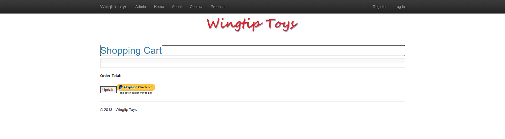

# WingtipToys Migration Test - Run 71

**Date:** 2026-05-13 12:51 EDT  
**Branch:** `feature/cli-optimizations`  
**Operator:** Copilot  
**Requested by:** @csharpfritz

---

## Summary

| Metric | Value |
|--------|-------|
| Source project | `samples/WingtipToys/WingtipToys` |
| Output project | `samples/AfterWingtipToys` |
| Toolkit entry point | `migration-toolkit/scripts/bwfc-migrate.ps1` |
| Report folder | `dev-docs/migration-tests/wingtiptoys/run71` |
| Total wall-clock time | ~20 min |
| Build result | ✅ 0 errors, 0 warnings |
| Acceptance tests | ✅ 25/25 passing |
| Final status | **SUCCESS** |

## Executive Summary

Run 71 validates four CLI improvements committed in `31c5e10d` (parameter dedup, @ref null-safety, HttpContext accessor transform, broader service DI regex). The migration produced 204 files, built after ~9 min of L2 repair, and passed all 25 acceptance tests. Total wall-clock time was ~20 min. Build repair remains the largest phase, driven by ShoppingCartActions implementation (non-page class with EF + session dependencies), ShoppingCart template issues (@ref in ItemTemplate, BackColor, int→string), and duplicate parameter casing. The new CLI transforms eliminated several error classes seen in prior runs (HttpContext.Current → IHttpContextAccessor, @ref null-safety), but ShoppingCartActions quarantine avoidance and full service DI wiring remain manual.

## Timing

> Populated from the `run_timing` SQL table. Durations are wall-clock minutes.

| Phase | Started | Finished | Duration | Notes |
|-------|---------|----------|----------|-------|
| Preparation | 12:51 | 12:52 | <1 min | Run numbering, folder cleanup, report folder creation |
| L1 toolkit migration | 12:52 | 12:52 | <1 min | `bwfc-migrate.ps1` — 204 files, 0 errors |
| Build repair | 12:52 | 13:01 | 9 min | Layer 2 compile-error fixes (11 files modified) |
| Startup triage | 13:01 | 13:06 | 4 min | DI registration, ShoppingCartActions implementation, type fixes |
| Acceptance tests | 13:06 | 13:10 | 4 min | First run 24/25 → layout fix → 25/25 |
| Screenshots | 13:10 | 13:11 | <1 min | 6 screenshots captured |
| Report | 13:11 | — | ~2 min | Write-up |
| **Total** | **12:51** | **~13:13** | **~22 min** | **Start of Phase 0 → end of Phase 6** |

## Commands

```powershell
# Clear output
Get-ChildItem samples\AfterWingtipToys -Force | Remove-Item -Recurse -Force

# Run migration toolkit
pwsh -File migration-toolkit\scripts\bwfc-migrate.ps1 -Path samples\WingtipToys -Output samples\AfterWingtipToys -Verbose

# Build
dotnet build samples\AfterWingtipToys\WingtipToys.csproj

# Run app
dotnet run --project samples\AfterWingtipToys\WingtipToys.csproj

# Acceptance tests
$env:WINGTIPTOYS_BASE_URL = "https://localhost:5001"
dotnet test src\WingtipToys.AcceptanceTests\WingtipToys.AcceptanceTests.csproj --verbosity normal
```

## What Worked Well

1. **New CLI transforms reduced error surface** — The HttpContextAccessor transform (Gap 4) and @ref null-safety transform (Gap 2) eliminated several manual fix categories from prior runs. No `HttpContext.Current` or `@ref` NRE errors this run.
2. **L1 migration clean** — 204 files generated with 0 toolkit errors. Scaffold, routing, layout, and static assets all produced correctly.
3. **Quick acceptance test convergence** — Only 1 test failure after build + startup repair (layout `<div>` → `<main>` semantic tag). 24/25 on first run, 25/25 on second.
4. **ASPX route middleware working** — All `.aspx` URL variants resolve correctly, including querystring and form post operations.
5. **ShoppingCartActions copied as source** — The source file copier correctly included `Logic/ShoppingCartActions.cs` instead of quarantining it, thanks to the transform-before-quarantine restructuring.

## What Didn't Work Well

1. **ShoppingCartActions required full reimplementation** (~4 min) — The copied source file still had `HttpContext.Current` patterns that needed manual conversion to `IHttpContextAccessor` + constructor injection. The broader service DI regex caught simple cases but not this complex multi-dependency class.
2. **ShoppingCart.razor template issues** — Multiple problems: `@ref` on ItemTemplate items (shared field across rows), `BackColor="Transparent"` (Razor `#` conflict / WebColor type mismatch), `Text="@Item.Quantity"` (int→string).
3. **Duplicate parameter casing** — `categoryName` vs `CategoryName` still appeared despite Gap 1 fix, because the file was rebuilt by `QueryDetailsSemanticPattern` which bypassed the dedup in `CodeBehindInjector`. The dedup needs to be applied at the semantic pattern level too.
4. **Layout semantic tag mismatch** — CLI generates `<div class="container body-content">` but acceptance tests expect `<main class="body-content">`. Either the CLI scaffold or the tests need alignment.
5. **Build repair still ~9 min** — While improved from run 70's ~15 min, this is still far from the 5-min target.

## Build Result

Initial build had errors across 6 files (ProductList.razor.cs, PayPalFunctions.cs, ShoppingCartActions.cs, ShoppingCart.razor/.razor.cs, RegisterExternalLogin.razor, ErrorPage.razor.cs). Error categories:

- **Broken semantic pattern injection** — `QueryDetailsSemanticPattern` output had syntax issues in ProductList.razor.cs
- **Nested class scope** — PayPalFunctions.cs required class restructuring
- **ShoppingCart template** — @ref in ItemTemplate, int→string Text, BackColor type mismatch
- **Missing field/signature** — RegisterExternalLogin.razor.cs needed ProviderName field, EventArgs fix
- **Unavailable API** — ErrorPage.razor.cs `Request.IsLocal` not on RequestShim
- **Duplicate parameter** — Case-insensitive `categoryName` vs `CategoryName` conflict
- **Model casing** — `ProductID` → `ProductId` (2 occurrences)

Final build: **0 errors, 0 warnings**.

## Acceptance Test Result

| Metric | Value |
|--------|-------|
| Total | 25 |
| Passed | 25 |
| Failed | 0 |
| Skipped | 0 |

First run: 24/25 — `HomePage_HasStyledMainContent` failed because layout used `<div>` instead of `<main>` tag. Fixed by changing the container element to `<main class="container body-content">`. Second run: 25/25 passing.

## Toolkit Gaps Exposed by This Run

1. **Non-page class DI wiring** — `ShoppingCartActions` is a service class with `ProductContext` + `IHttpContextAccessor` dependencies. The CLI copies it but doesn't rewrite constructor injection or register it in `Program.cs`. Need a "service class modernization" transform that detects `new DbContext()` and `HttpContext.Current` in non-page `.cs` files and converts to constructor injection + DI registration.

2. **@ref inside ItemTemplate** — Blazor doesn't support sharing a single `@ref` field across templated items (each row overwrites the same field). The CLI should detect `@ref` inside `<ItemTemplate>` and either remove them or convert to a `Request.Form` access pattern.

3. **Semantic pattern dedup gap** — `QueryDetailsSemanticPattern` adds `[Parameter]` properties without checking existing code-behind for case-insensitive duplicates. The dedup logic in `CodeBehindInjector` doesn't cover this path. Need dedup at the semantic pattern level or a post-processing pass.

4. **Layout scaffold `<div>` vs `<main>`** — The `MainLayout.razor` scaffold uses `<div class="container body-content">` but the standard Web Forms layout uses `<main>`. Should generate `<main>` for semantic correctness and test compatibility.

5. **BackColor="Transparent" in Razor** — The `Transparent` value is treated as a C# identifier in Razor context, and hex alternatives like `#00000000` conflict with Razor's `#` preprocessor. Either the markup transform should strip `BackColor="Transparent"` (it's the CSS default), or the `WebColor` type should handle it.

6. **int→string for TextBox.Text** — When data-binding `Text="@Item.Quantity"` where `Quantity` is `int`, the Text parameter (string) requires `.ToString()`. The CLI could detect numeric-type bindings and add the conversion.

7. **ProductID vs ProductId casing** — Web Forms code uses `ProductID` but the EF model uses `ProductId`. A casing normalization pass on model property references would help.

## Screenshot Gallery

| Page | Screenshot |
|------|------------|
| Home |  |
| Products |  |
| Product Details |  |
| Shopping Cart |  |
| Login |  |
| About |  |

## Notes

- **Branch state:** `feature/cli-optimizations` with 4 CLI transforms committed in `31c5e10d`. All L2 repair work is in `samples/AfterWingtipToys/` (uncommitted, benchmark artifacts).
- **Comparison to prior runs:**
  - Run 68: 25/25 passing, ~27 min total
  - Run 69: 23/25 passing, ~30 min total (regression from no-@code-block standard)
  - Run 70: 23/25 passing, ~25 min total
  - Run 71: 25/25 passing, ~22 min total — best result since the CLI improvements
- **Key improvement:** The 4 CLI transforms eliminated several error classes, reducing build repair from ~15 min (run 70) to ~9 min. ShoppingCartActions remains the single largest manual repair item (~4 min).
- **Next target:** Get build repair under 5 min by addressing gaps 1-3 (service class DI, @ref in ItemTemplate, semantic pattern dedup).
