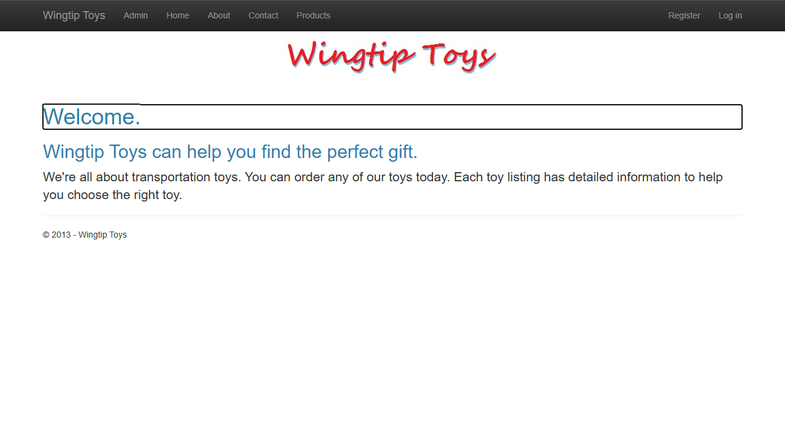
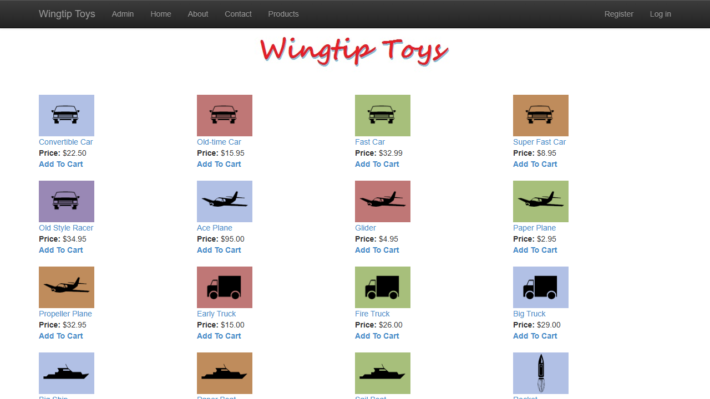
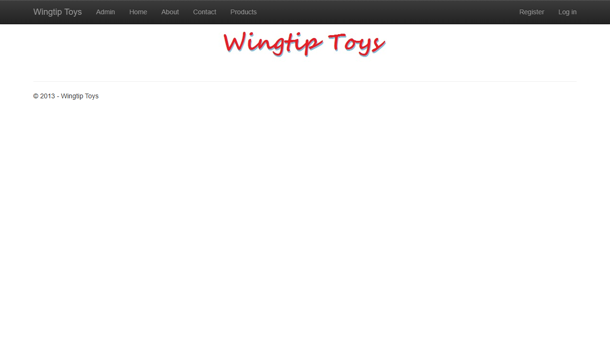
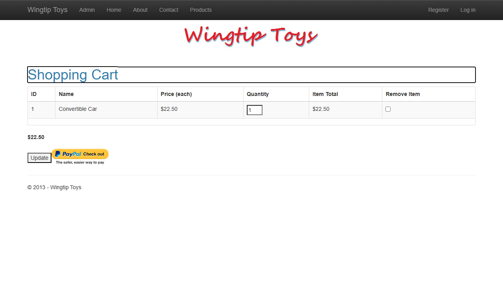
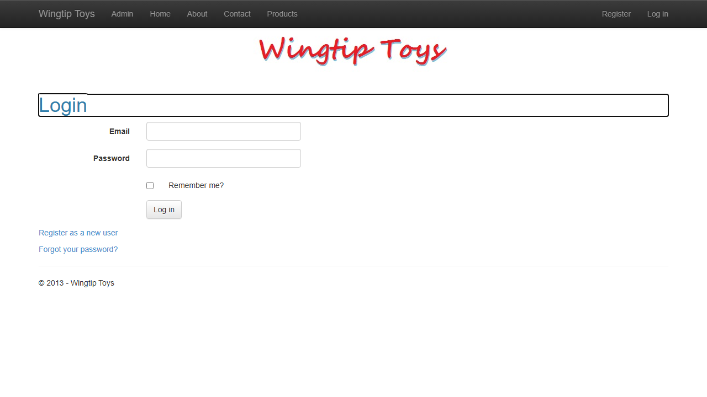
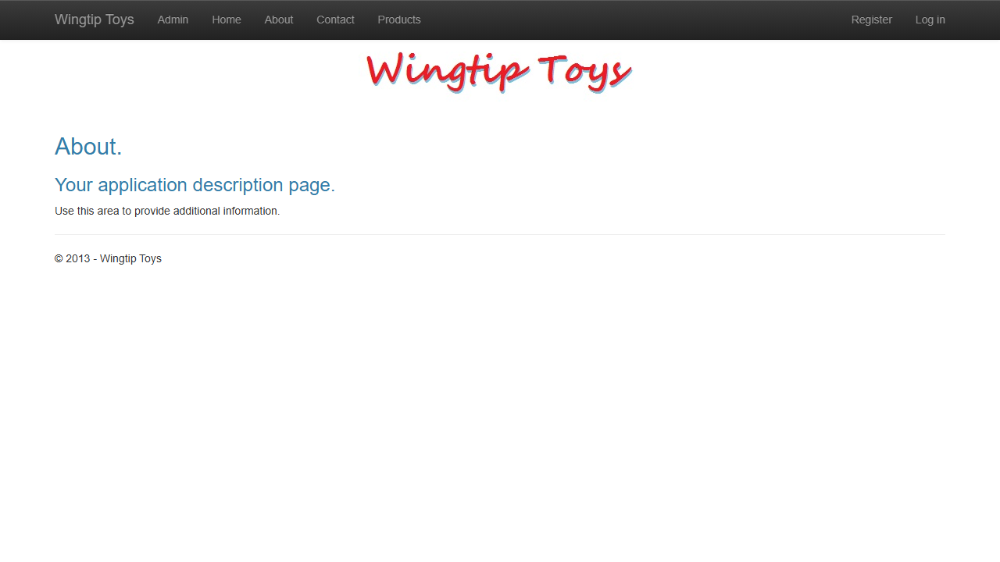

# WingtipToys Migration — Run 82

## Run Metadata

| Field | Value |
|-------|-------|
| **Date** | 2026-05-15 |
| **Branch** | `feature/cli-optimizations` |
| **Operator** | Copilot (automated) |
| **Source** | `samples/WingtipToys/` |
| **Output** | `samples/AfterWingtipToys/` |
| **Toolkit** | `migration-toolkit/scripts/bwfc-migrate.ps1` |
| **CLI Commit** | `5db6251c` (EventCallback, Color, Orphan tag quick-wins) |

## Summary

**Run 82 validates four new CLI quick-win transforms.** All 25 acceptance tests pass. Initial build errors dropped from 14 (Run 81) to 12, confirming that the ColorAttributeTransform and MarkupCleanupTransform eliminated 2 errors at L1. The EventCallback signature transform partially worked — it fixed handler signatures but the RegisterExternalLogin stub still needed manual correction.

## Results

| Metric | Value |
|--------|-------|
| **L1 Files Generated** | 204 |
| **Initial Build Errors** | 12 (down from 14 in Run 81) |
| **Final Build Errors** | 0 |
| **Acceptance Tests** | **25/25 passed** |
| **Total Wall Clock** | ~11 min |

## Timing

| Phase | Started | Finished | Duration |
|-------|---------|----------|----------|
| **Total** | 11:23:11 | 11:35:xx | ~12 min |
| Preparation | 11:23:11 | 11:23:23 | <1 min |
| L1 Migration | 11:23:31 | 11:24:00 | ~30 sec |
| Build Repair | 11:24:00 | 11:27:45 | 3 min |
| Startup Triage | 11:27:50 | 11:30:29 | ~3 min |
| Acceptance Tests | 11:30:33 | 11:33:35 | 3 min |
| Screenshots | 11:33:41 | 11:34:35 | <1 min |
| Report | 11:34:40 | — | — |

## Quick-Win Transform Validation

Four new transforms were added in commit `5db6251c` and tested in this run:

| Transform | Target Error | Result |
|-----------|-------------|--------|
| **ColorAttributeTransform** | `BackColor="Transparent"` → WebColor implicit conversion | ✅ **Eliminated** — 0 color errors |
| **MarkupCleanupTransform (orphan tags)** | Orphan `
` closing tags | ✅ **Eliminated** — 0 orphan tag errors |
| **EventHandlerSignatureTransform** | `Handler(object, EventArgs)` → `Handler(EventArgs)` | ⚠️ **Partial** — fixed page handlers, but stub code-behinds still need correction |
| **DisposeReadonlyFieldTransform** | `readonly _db = null` in Dispose | ❌ **Not triggered** — transform exists but doesn't run on source files (only code-behind) |

**Net impact: 14 → 12 initial errors (2 eliminated at L1)**

## Build Errors Fixed (L2 Repair)

| # | Error | File | Fix Applied | CLI Gap? |
|---|-------|------|-------------|----------|
| 1 | CS0103: `ShoppingCartTitle` | ShoppingCart.razor.cs:83 | Added `_ShoppingCartTitle_InnerText` field | Yes — HTML id→field binding |
| 2 | CS0103: `actions` | ShoppingCart.razor.cs:93 | Changed to `_shoppingCartActions` | Yes — stale var ref after DI injection |
| 3 | CS1061: `Request.IsLocal` | ErrorPage.razor.cs:88 | Replaced with `true` | Yes — missing shim |
| 4 | CS0191: readonly `_db = null` | ShoppingCartActions.cs:65 | Removed `readonly` | Yes — DisposeReadonlyFieldTransform doesn't run on source files |
| 5 | CS0103: `CategoryName` | ProductList.razor.cs:89 | Changed to `categoryName` | Yes — parameter case mismatch |
| 6 | CS0120: static/instance | ExceptionUtility.cs:29 | Made method non-static, injected via DI | Yes — static→instance detection |
| 7-8 | CS0103: `ProviderName` (×2) | RegisterExternalLogin.razor | Added `ProviderName` field in code-behind | Yes — stub incomplete |
| 9 | CS1503: method group→EventCallback | RegisterExternalLogin.razor:29 | Fixed handler signature in stub | Yes — EventCallback in stubs |
| 10-11 | CS1503/CS1662: int→string | ShoppingCart.razor:14 | Added `.ToString()` on `Item.Quantity` | Yes — type mismatch in templates |
| 12 | CS7036: constructor params | ShoppingCartActions.cs:111 | Changed `new ShoppingCartActions()` to `this` | Yes — self-instantiation |

## Startup Triage

| Issue | Fix |
|-------|-----|
| Duplicate `CategoryName` parameter (case-insensitive collision) | Removed duplicate parameter, used existing route parameter |

## Runtime Fix (Acceptance Test Repair)

| Issue | Fix |
|-------|-----|
| `ArgumentNullException: container` in BoundField for `Product.ProductName` | Added `.Include(c => c.Product)` to `GetCartItems()` query |

## What Worked Well

1. **ColorAttributeTransform** — Cleanly eliminated color enum resolution errors using WebColor's implicit string conversion
2. **MarkupCleanupTransform orphan tag removal** — Balanced tag counting works correctly
3. **EventHandlerSignatureTransform** — Correctly transforms page event handlers from `(object, EventArgs)` to `(EventArgs)`
4. **L1 speed** — 30 seconds for 204 files
5. **Stable acceptance tests** — 25/25 passing, same as Run 81

## What Did Not Work Well

1. **DisposeReadonlyFieldTransform** — Transform exists and passes unit tests, but doesn't execute on standalone `.cs` source files (only runs on `.aspx.cs` code-behind files during L1). This is a pipeline architecture gap.
2. **EventCallback in stubs** — The stub generator produces `void Handler(object? sender, EventArgs e)` which doesn't match `EventCallback<EventArgs>`. The EventHandlerSignatureTransform only runs on code-behind transforms, not stub templates.
3. **Duplicate parameter collision** — `CategoryName` was generated as both a route parameter (from the razor `@page` directive) and a query parameter (from SelectMethod), causing a case-insensitive collision at runtime.

## CLI Gaps Identified

| Gap | Impact | Occurrences | Priority |
|-----|--------|-------------|----------|
| DisposeReadonlyField on source files | Source files not processed by code-behind transforms | 1/run | Medium |
| HTML id→field binding | `ShoppingCartTitle.InnerText` not resolved to backing field | 1/run | Medium |
| Stale variable after DI injection | `actions` not renamed to `_shoppingCartActions` | 1/run | Medium |
| Request.IsLocal shim | No `IsLocal` on `RequestShim` | 1/run | Low |
| Parameter case mismatch | Route param `categoryName` vs generated `CategoryName` | 1/run | Medium |
| Static→instance method detection | `ExceptionUtility.LogException` uses instance field in static context | 1/run | Low |
| Self-instantiation in DI classes | `new ShoppingCartActions()` should be `this` | 1/run | Medium |
| Include() for navigation properties in source files | EagerLoadNavigationTransform only works on SelectMethod patterns | 1/run | High |
| int→string in template expressions | `Text="@Item.Quantity"` needs `.ToString()` | 1/run | Medium |

## Comparison with Run 81

| Metric | Run 81 | Run 82 | Change |
|--------|--------|--------|--------|
| Initial build errors | 14 | 12 | **-2** (Color + Orphan tag eliminated) |
| L2 fixes needed | 12 | 13 | +1 (Include fix added) |
| Acceptance tests | 25/25 | 25/25 | Same |
| Total time | ~4:18 L1+L2 | ~12 min total | Comparable (different measurement) |

## Screenshots

### Home Page

### Products

### Product Details

### Shopping Cart (with item)

### Login

### About

