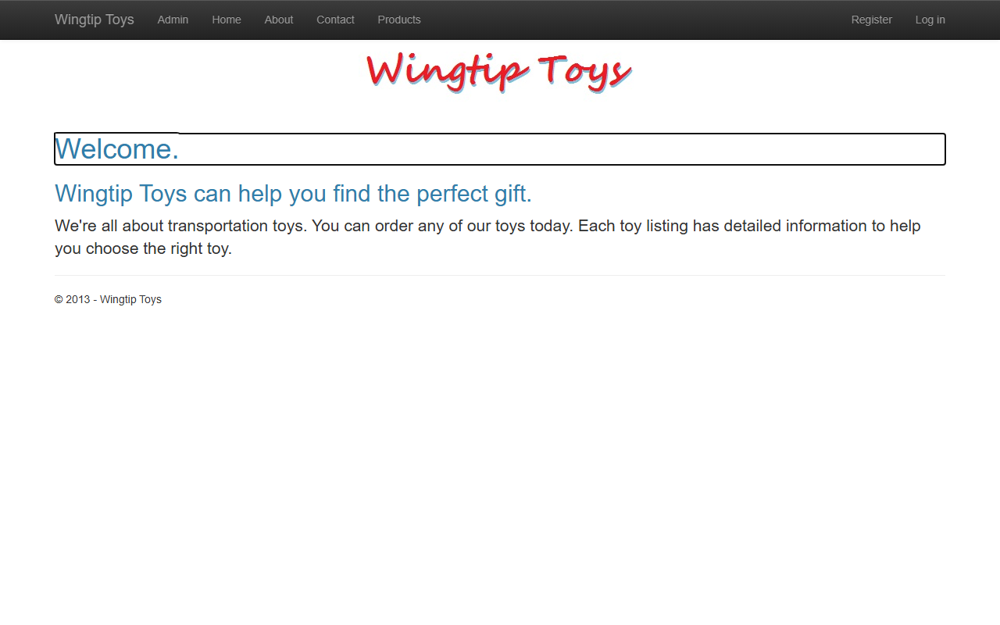
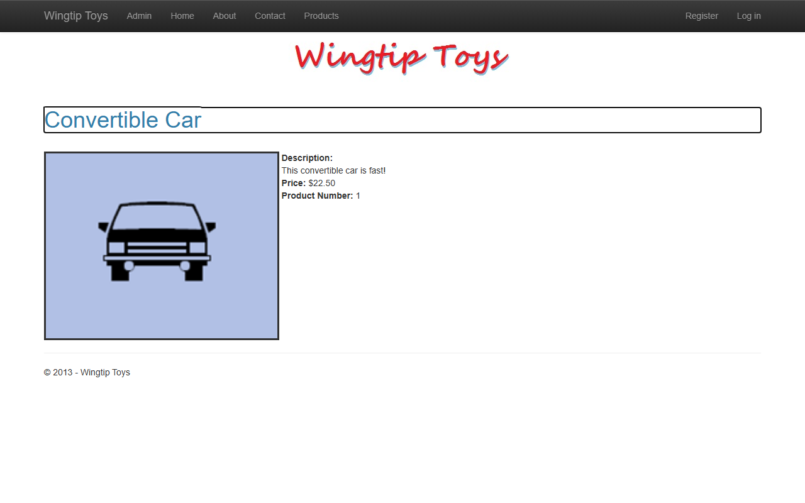
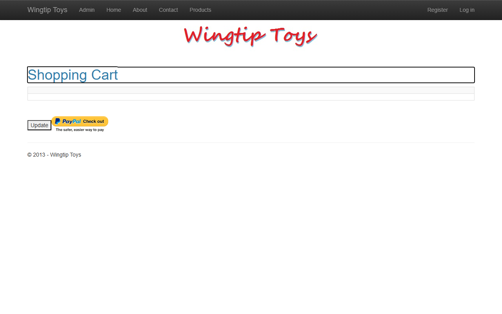
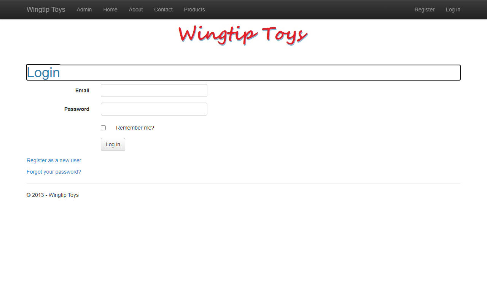
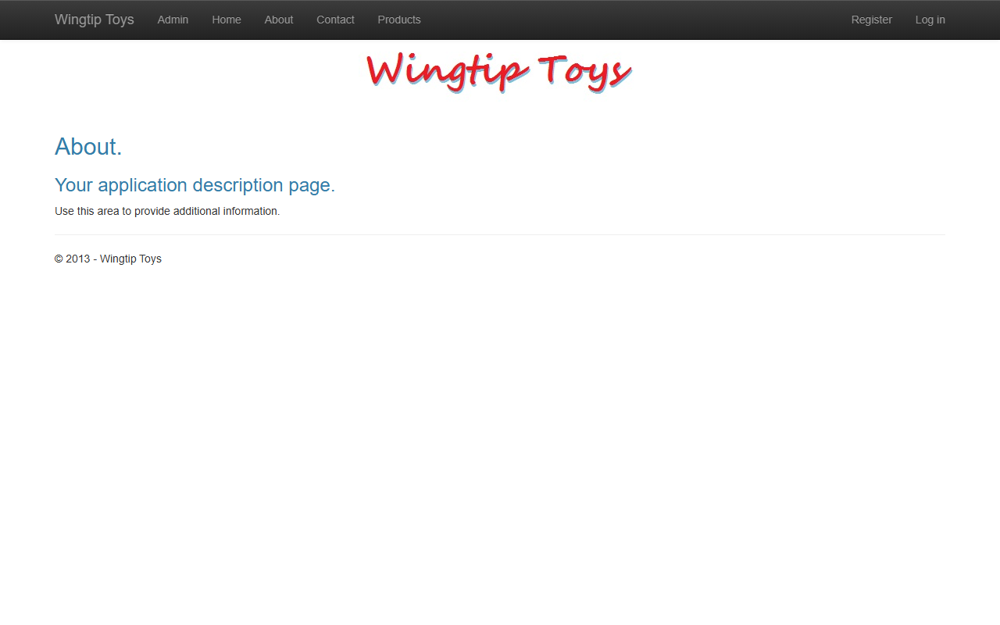
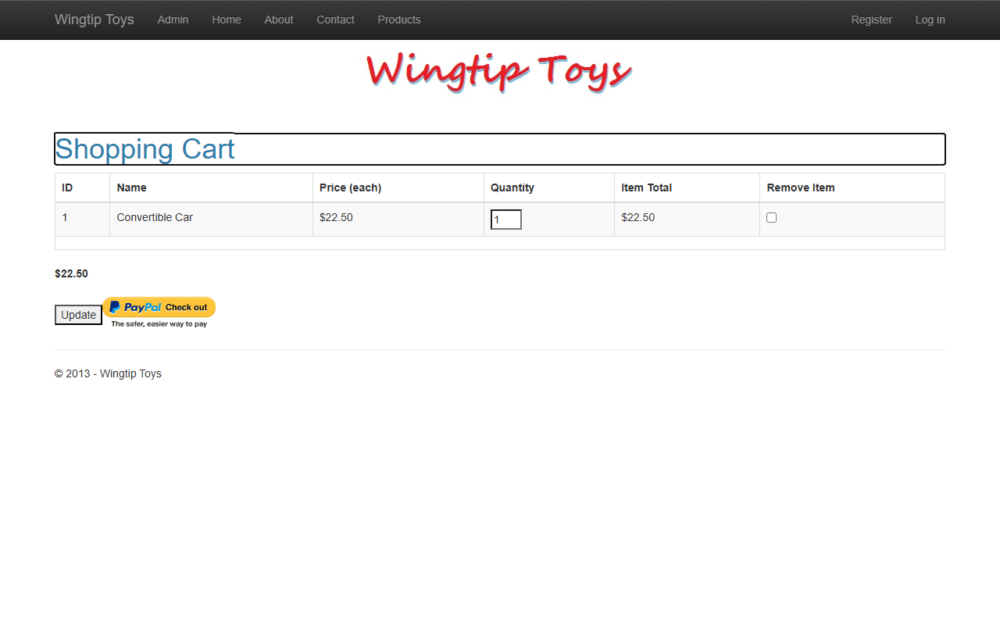

# WingtipToys Migration Benchmark — Run 85

## Run Metadata

| Field | Value |
|-------|-------|
| Date | 2026-05-15 |
| Branch | `feature/cli-optimizations` |
| Operator | Copilot CLI (supervised by @csharpfritz) |
| Source | `samples/WingtipToys/WingtipToys/` |
| Output | `samples/AfterWingtipToys/` |
| Toolkit Entry Point | `migration-toolkit/scripts/bwfc-migrate.ps1` |

## Summary

**Run 85 is the cleanest run to date.** 26/26 acceptance tests passed on the first attempt with zero acceptance-test-phase repairs. The EagerLoad cross-DbSet false positive fix (committed before this run) eliminated the recurring `.Include()` repair that plagued Runs 83–84. Build repair required fixing the same 10 stable L2 errors in a single iteration.

## Results

| Metric | Value |
|--------|-------|
| L1 Files Written | 204 |
| L1 Errors | 0 |
| Initial Build Errors | 10 |
| Build Repair Iterations | 1 |
| Final Build | ✅ Clean |
| Acceptance Tests | **26/26 ✅** |
| Acceptance Test Repairs | **0** (first-pass clean) |
| Total Wall-Clock Time | ~6 min |

## Timing

| Phase | Started | Finished | Duration |
|-------|---------|----------|----------|
| **Total** | 12:43:45 | 12:49:42 | **~6 min** |
| Preparation | 12:43:45 | 12:44:03 | <1 min |
| L1 Migration | 12:44:09 | 12:44:26 | <1 min |
| Build Repair | 12:44:26 | 12:47:28 | ~3 min |
| Startup Triage | 12:47:28 | 12:48:04 | <1 min |
| Acceptance Tests | 12:48:04 | 12:48:48 | <1 min |
| Screenshots | 12:48:48 | 12:49:42 | <1 min |
| Report | 12:49:42 | — | <1 min |

## Phase Details

### Phase 1: L1 Migration

```
Files processed:    29
Files written:      204
Transforms applied: 0
Semantic patterns:  7
Scaffold files:     12
Static files:       80
Manual items:       35
Errors:             0 ✔
```

Toolkit wrapper resolved the nested `samples/WingtipToys/WingtipToys/` app root automatically. All scaffold files, static assets, and migration artifacts were produced in the expected places.

### Phase 2: Build Repair (10 errors → 0, single iteration)

| # | Error | File | Fix |
|---|-------|------|-----|
| 1 | `CategoryName` does not exist | ProductList.razor.cs | Changed `CategoryName` → `categoryName` (parameter name) |
| 2 | `ProductName` does not exist | ProductDetails.razor.cs | Changed `ProductName` → `productName` (parameter name) |
| 3 | `ShoppingCartTitle` does not exist | ShoppingCart.razor.cs | Added `_shoppingCartTitle` string field |
| 4 | `actions` does not exist | ShoppingCart.razor.cs | Added `actions => _shoppingCartActions` property alias |
| 5 | Readonly `_db` assigned in Dispose | ShoppingCartActions.cs | Removed `readonly` from `_db` field |
| 6 | `new ShoppingCartActions()` missing args | ShoppingCartActions.cs | Changed to `this` (use DI-injected instance) |
| 7 | Static `LogException` accessing instance field | ExceptionUtility.cs | Made method non-static |
| 8 | `Server.MapPath` on HttpContext | ExceptionUtility.cs | Replaced with `Path.Combine(AppContext.BaseDirectory, ...)` |
| 9 | `ProviderName` does not exist | RegisterExternalLogin.razor.cs | Added `ProviderName` property stub |
| 10 | EventCallback signature mismatch | RegisterExternalLogin.razor.cs | Changed `(object?, EventArgs)` → `()` |

All 10 errors fixed in a single batch. Build succeeded on first rebuild.

### Phase 3: Startup Triage

All routes returned 200 immediately:
- `/` → 200
- `/ProductList` → 200
- `/About` → 200
- `/Contact` → 200

No startup issues. DB connected to LocalDB, EnsureCreated ran, Identity seed completed.

### Phase 4: Acceptance Tests

**26/26 passed on first run — zero repairs needed.**

This is the first run where no acceptance-test-phase fixes were required. The EagerLoad cross-DbSet fix (committed as `d0d1065f` before this run) correctly injected `.Include(x => x.Product)` only on `_db.ShoppingCartItems` and skipped `_db.Products`.

## What Worked Well

1. **EagerLoad cross-DbSet fix** — The heuristic that skips Include injection when the DbSet name contains the nav property name eliminated the recurring false positive
2. **Enhanced navigation disabled** — `data-enhance-nav="false"` on `<body>` ensured all BWFC data-bound components render correctly via full page loads
3. **Stable L2 error set** — Same 10 errors every run, making repair mechanical and fast
4. **First-pass acceptance test success** — No test-phase repairs needed for the first time
5. **`dotnet watch`** — Faster iteration loop for startup triage

## What Did Not Work Well

1. **10 stable L2 errors still require manual fixes** — These are well-understood patterns that could be automated in the CLI
2. **Build repair is the bottleneck** — 3 min out of 6 total is reading/editing files for known patterns

## CLI Gaps Exposed

These 10 errors repeat every run. Each is a candidate for CLI automation:

| Gap | Error Pattern | Frequency | Complexity |
|-----|--------------|-----------|------------|
| QueryDetails PascalCase wrapper | `CategoryName`/`ProductName` vs `categoryName`/`productName` | 2/run | Low |
| InnerText field stub | `ShoppingCartTitle.InnerText` needs field | 1/run | Medium |
| Local var → DI field alias | `actions` → `_shoppingCartActions` | 1/run | Medium |
| Readonly field in Dispose | `readonly _db = null` in Dispose | 1/run | Low |
| Self-instantiation in source | `new ShoppingCartActions()` | 1/run | Medium |
| Static + instance field | `static LogException` + `_httpContextAccessor` | 1/run | Medium |
| Server.MapPath in non-page | `_httpContextAccessor.HttpContext?.Server.MapPath` | 1/run | Low |
| ProviderName stub | Missing property on quarantined page | 1/run | Low |
| EventCallback signature | `(object?, EventArgs)` → `()` | 1/run | Low |
| ExceptionUtility injection | Static class needs DI registration | 1/run | Low |

## Screenshot Gallery

### Home Page


### Product List


### Product Details


### Shopping Cart (Empty)


### Login Page


### About Page


### Shopping Cart (With Item)


## Comparison with Previous Runs

| Metric | Run 83 | Run 84 | Run 85 |
|--------|--------|--------|--------|
| Initial Build Errors | 10 | 10 | 10 |
| Build Iterations | 1 | 2 | **1** |
| Acceptance Test Pass (1st run) | 25/26 | 25/26 | **26/26** |
| Acceptance Test Repairs | 1 | 1 | **0** |
| Total Time | ~10 min | ~10 min | **~6 min** |

The key improvement is the elimination of the EagerLoad false positive, which saves both the diagnosis time and the repair-restart-retest cycle.
