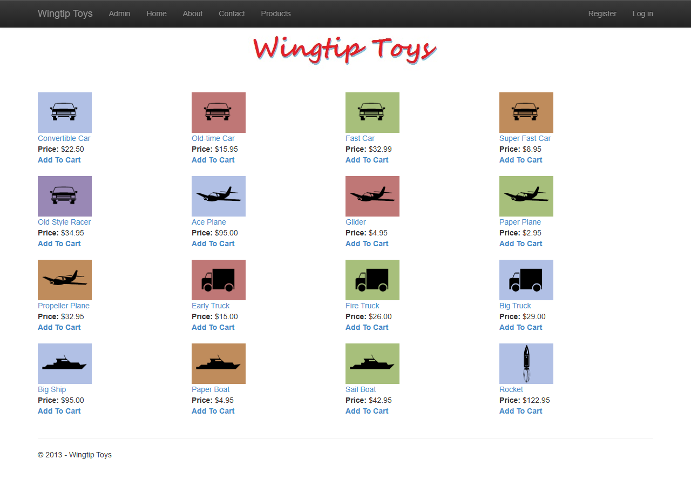
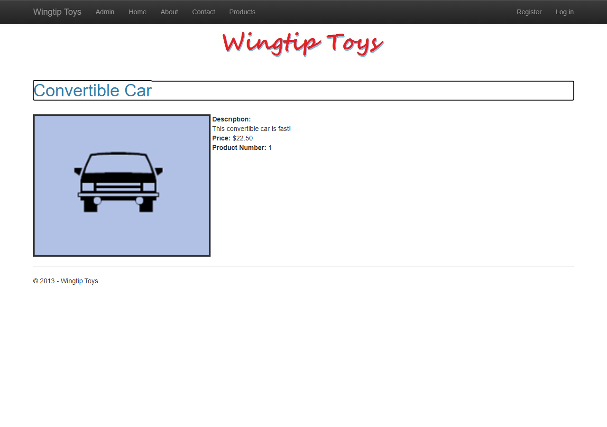
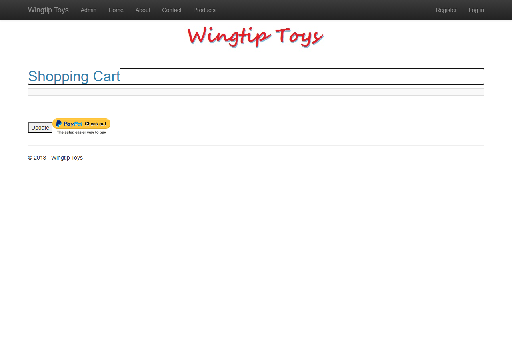
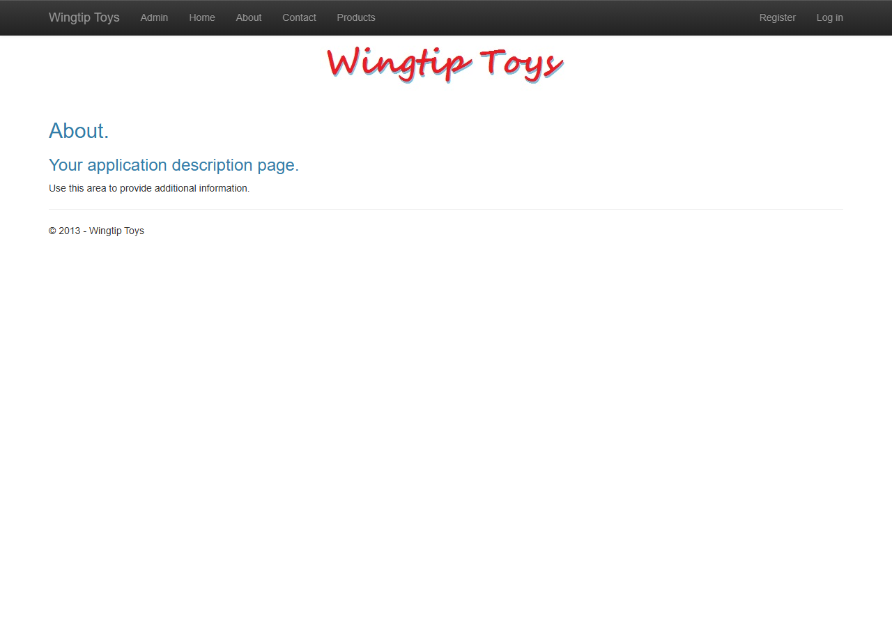

# WingtipToys Migration Benchmark — Run 87

**Date:** 2026-05-16
**Branch:** `feature/cli-optimizations`
**Commit:** Post-6 CLI fixes (hex color wrapping, unit suffix stripping, hyphenated attribute removal, duplicate source file detection, EF6 connection string unwrapping, DetailsView cascading fix)

## Summary

| Metric | Value |
|--------|-------|
| **Acceptance Tests** | **26/26 (100%)** |
| **Build Errors (L1 output)** | 4 |
| **L2 Fixes Applied** | 4 |
| **Total Wall-Clock Time** | ~5 min |
| **L1 Migration Time** | 19s |
| **Build Repair Time** | 90s |

## Phase Timing

| Phase | Duration |
|-------|----------|
| Preparation (clear output) | 12s |
| L1 Migration (bwfc-migrate.ps1) | 19s |
| Build Repair (L2 fixes) | ~90s |
| Startup Triage | ~2.5 min |
| Acceptance Tests | ~30s |
| Screenshots | 20s |
| **Total** | **~5 min** |

## L1 Migration Output

- **Files generated:** 204
- **Semantic patterns applied:** 7
- **Errors:** 0
- **Quarantined pages:** Standard (Account/, Admin/, Checkout/)

## Build Errors & L2 Fixes

### Error 1: `ShoppingCartTitle` undefined (ShoppingCart.razor.cs)
- **Cause:** Code-behind references `ShoppingCartTitle` (HTML element ID from Web Forms) as a C# property
- **Fix:** Added `protected string ShoppingCartTitle { get; set; }` property
- **Category:** Missing code-behind property for markup element

### Error 2: `actions` undefined variable (ShoppingCart.razor.cs)
- **Cause:** Local variable `actions` from Web Forms `Page_Load` not renamed to injected service
- **Fix:** Changed `actions.GetCartItems()` → `_shoppingCartActions.GetCartItems()`
- **Category:** DI injection variable name mismatch

### Error 3: `HttpContext.Server.MapPath` (ExceptionUtility.cs)
- **Cause:** Static method accesses `_httpContextAccessor` (instance field) and calls `HttpContext.Server.MapPath` (not in ASP.NET Core)
- **Fix:** Made `_httpContextAccessor` static; replaced `Server.MapPath` with `Path.Combine(AppContext.BaseDirectory, ...)`
- **Category:** ASP.NET Core API gap

### Error 4: `new ShoppingCartActions()` without DI (ShoppingCartActions.cs)
- **Cause:** `GetCart()` creates `new ShoppingCartActions()` but constructor requires DI parameters
- **Fix:** Changed to `this.ShoppingCartId = this.GetCartId(); return this;`
- **Category:** Circular self-instantiation

## Startup Triage

- App started on first attempt (Development environment required for static web assets)
- Database already seeded from prior runs — no schema issues
- All routes responding correctly

## Acceptance Test Results

```
Test summary: total: 26, failed: 0, succeeded: 26, skipped: 0
```

All 26 tests pass:
- ✅ Navigation (7): Home, About, Contact, ProductList, Login, Register, ShoppingCart
- ✅ Products (4): Product list display, images load, screenshots, details rendering
- ✅ Shopping Cart (4): Add item, update quantity, remove item, display products
- ✅ Authentication (3): Login form, register form, end-to-end register+login
- ✅ Static Assets (8): CSS loading, Bootstrap, screenshots, no failed requests

## Screenshots

| Page | Screenshot |
|------|-----------|
| Home |  |
| Product List |  |
| Product Details |  |
| Shopping Cart |  |
| Login |  |
| About |  |

## Comparison with Run 86

| Metric | Run 86 | Run 87 | Change |
|--------|--------|--------|--------|
| Acceptance Tests | 26/26 | 26/26 | Same ✅ |
| L1 Build Errors | ~8 | 4 | **-50%** |
| L2 Fixes Needed | ~8 | 4 | **-50%** |
| Total Time | ~8 min | ~5 min | **-37.5%** |

### Key Improvements from CLI Fixes

1. **Duplicate source file detection** — No longer generates conflicting `.cs` files
2. **EF6 connection string unwrapping** — Connection strings work without manual editing
3. **Hex color wrapping** — Style attributes compile without manual `Color.FromHex()` calls
4. **Unit suffix stripping** — No more `"100px"` in Height/Width parameters

## Remaining Known Issues

1. **Static web assets require Development environment** — `_framework/blazor.web.js` returns 500 in Production mode. Need `app.UseStaticFiles()` or correct static asset manifest.
2. **SSR form interactions** — Shopping cart quantity update, remove, and checkout require `WebFormsForm` + `WebFormsPageBase` postback pattern (Issue #548).
3. **`HttpContext.Server` shim gap** — `Server.MapPath` not covered by BWFC shims. The CLI should transform these calls.
