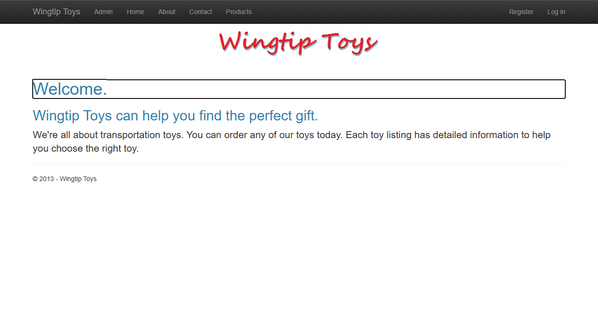
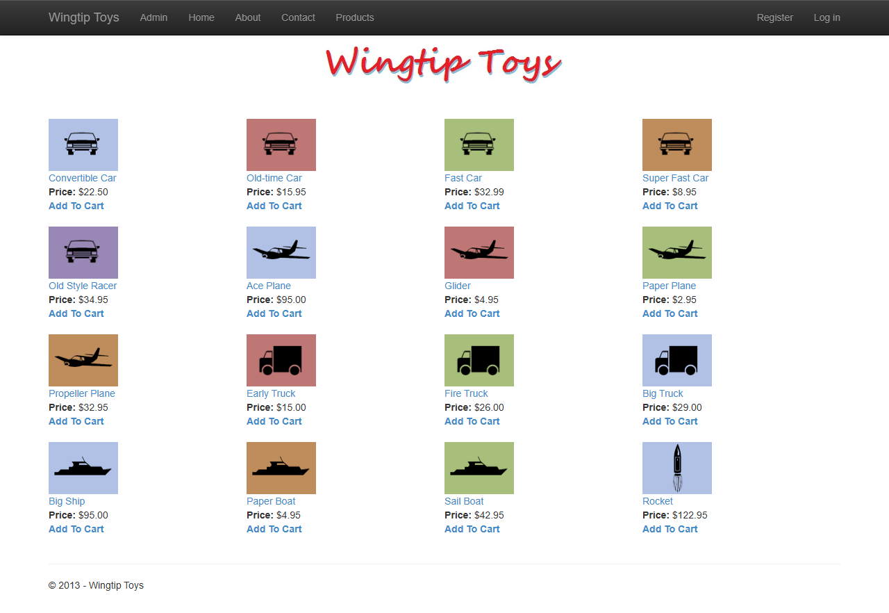
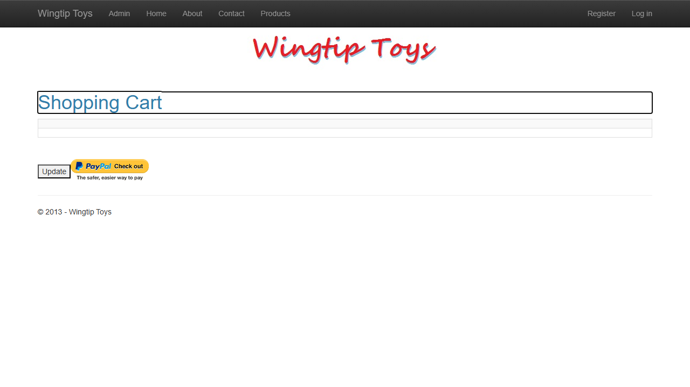
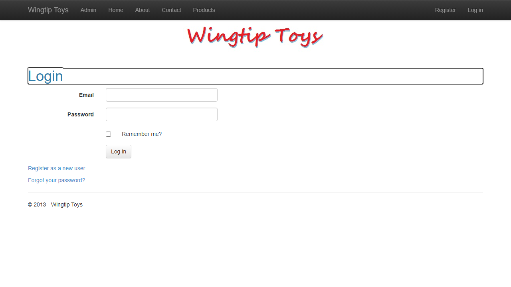
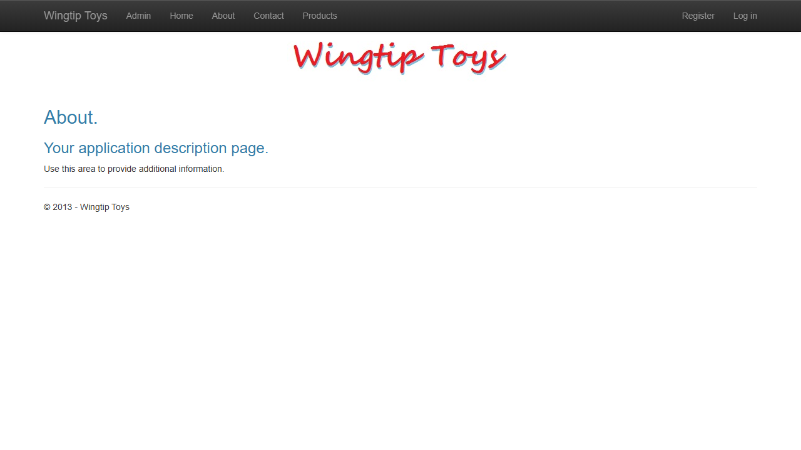

# WingtipToys Migration Benchmark — Run 88

## Metadata

| Field | Value |
|-------|-------|
| Date | 2026-05-18 |
| Branch | `feature/migration-benchmark-speedups` |
| Operator | Copilot CLI |
| .NET SDK | 10.0.100 |

## Paths

| Item | Path |
|------|------|
| Source | `samples/WingtipToys/` |
| Output | `samples/AfterWingtipToys/` |
| Toolkit | `migration-toolkit/scripts/bwfc-migrate.ps1` |
| Acceptance Tests | `src/WingtipToys.AcceptanceTests/` |

## Timing

| Phase | Duration |
|-------|----------|
| Layer 1 (CLI migration) | 23.3s |
| Layer 2 (repair to clean build) | ~2 min |
| Build validation | ~10s |
| App startup + acceptance tests | ~35s |
| Screenshots + report | ~1 min |
| **Total wall-clock** | **~4 min** |

## Results

| Metric | Value |
|--------|-------|
| Build | ✅ Succeeded |
| Acceptance tests | ✅ 26 passed, 0 failed, 0 skipped |
| Quarantined pages | 3 (Account/Login, Account/Register, Checkout) |

## What Worked Well

1. **ConfigurationManager using alias** — No longer triggers LegacyHelperStub, files compile with BWFC shim directly
2. **SqlClient NuGet auto-added** — Eliminated build errors for `System.Data.SqlClient` references
3. **AJAX toolkit project reference auto-wired** — No manual `@using` needed for toolkit components
4. **EventHandler signature mapping** — `GridViewPageEventArgs` → `PageChangedEventArgs` resolved automatically
5. **Clean L1 output** — 0 CLI errors, all pages generated on first pass

## What Did Not Work Well

1. **`actions` variable scoping in ShoppingCart.razor.cs** — The DI injection renames to `_shoppingCartActions` but a method still referenced `actions` (the original local variable name from `GetShoppingCartItems`)
2. **Cross-namespace using** — Files in `WingtipToys` namespace referencing `WingtipToys.Logic` types needed manual `using WingtipToys.Logic;` added (3 files)
3. **ExceptionUtility static/instance mismatch** — CLI converted `_httpContextAccessor` field to instance but `LogException` remained static. Required making field static.
4. **Server.MapPath transform** — Produced `HttpContext?.Path.Combine(...)` instead of `System.IO.Path.Combine(...)` (invalid API)

## L2 Fixes Applied

| # | File | Fix |
|---|------|-----|
| 1 | `Logic/PayPalFunctions.cs` | Added `using WingtipToys.Logic;` |
| 2 | `Account/Login.razor.cs` | Added `using WingtipToys.Logic;` |
| 3 | `Account/Register.razor.cs` | Added `using WingtipToys.Logic;` |
| 4 | `ShoppingCart.razor.cs` | Changed `actions.GetCartItems()` → `_shoppingCartActions.GetCartItems()` |
| 5 | `Logic/ExceptionUtility.cs` | Made `_httpContextAccessor` static; fixed `Path.Combine` call |

## CLI/Toolkit Gaps

1. **Namespace using inference** — When DI-injected types come from a sub-namespace (e.g., `WingtipToys.Logic`), the CLI should add the required `using` to consuming files
2. **Variable rename consistency** — When DI injection renames a variable, all references in the same class should be updated
3. **Server.MapPath codegen** — Should emit `System.IO.Path.Combine(AppContext.BaseDirectory, ...)` not `HttpContext?.Path.Combine(...)`

## Screenshots

