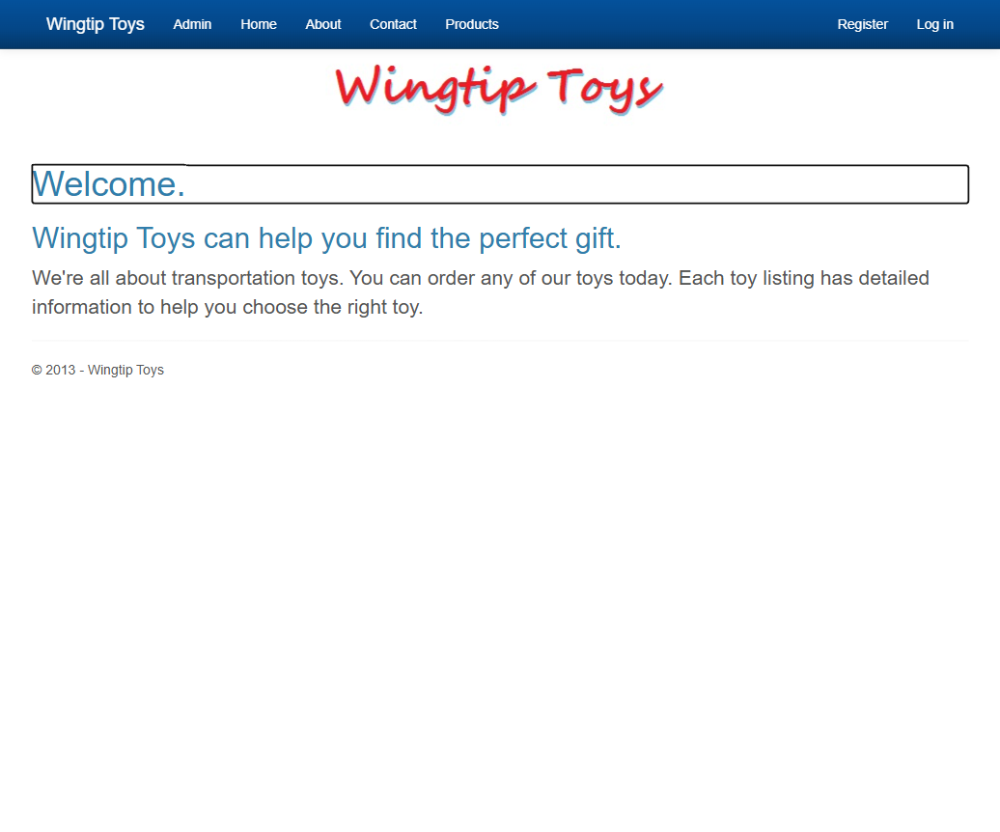
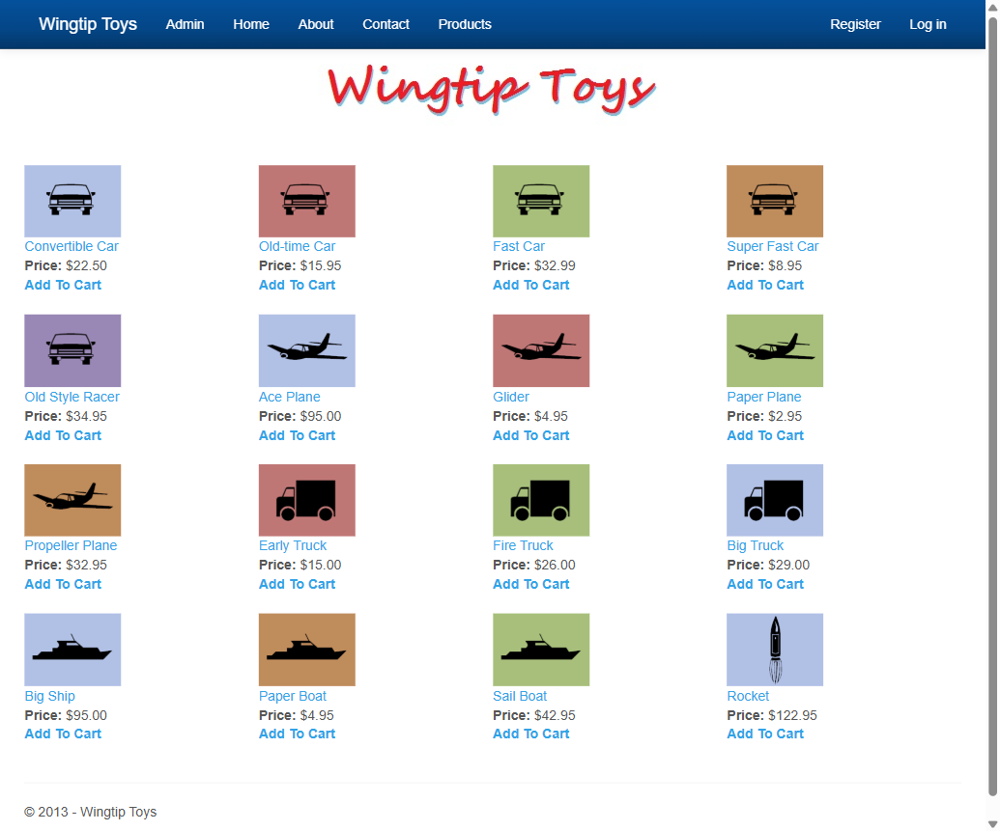
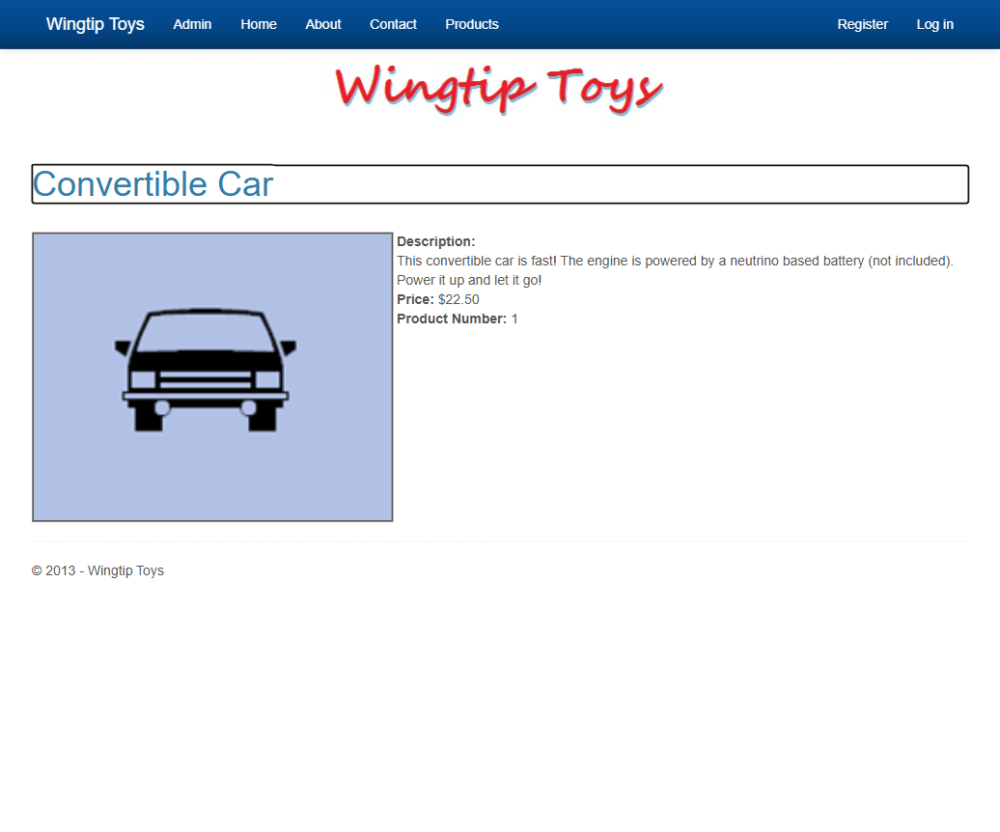
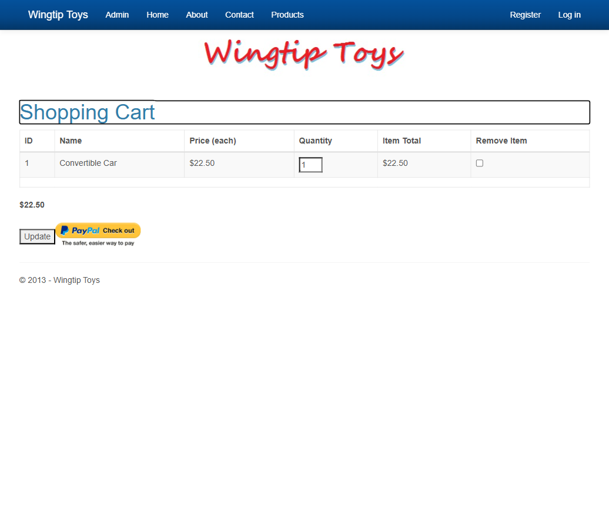
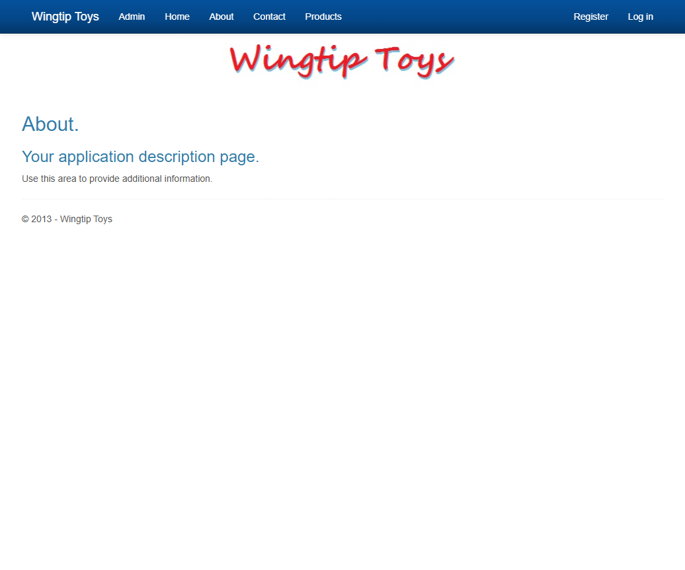

# WingtipToys Migration Test - Run 93

**Date:** 2026-06-02 07:22 – 07:42 PDT  
**Branch:** `feature/ascx-custom-control-migration`  
**Operator:** Copilot CLI  
**Requested by:** @csharpfritz

---

## Summary

| Metric | Value |
|--------|-------|
| Source project | `samples/WingtipToys/WingtipToys` |
| Output project | `samples/AfterWingtipToys` |
| Toolkit entry point | `migration-toolkit/scripts/bwfc-migrate.ps1` |
| Report folder | `dev-docs/migration-tests/wingtiptoys/run93` |
| Total wall-clock time | ~20 minutes |
| Build result | ✅ 0 errors, 58 warnings |
| Acceptance tests | ✅ 26/26 passed |
| Final status | **SUCCESS** |

## Executive Summary

Run 93 completed successfully with all 26 Playwright acceptance tests passing. The migration toolkit processed the WingtipToys source (29 files) and produced 204 output files with 681 transforms applied and zero toolkit errors. Three manual Layer 2 repairs were needed: (1) fixing a static/instance mismatch in ExceptionUtility, (2) switching from SQL Server LocalDB to SQLite (environment constraint), and (3) fixing dual-DbContext schema creation and product data seeding. Total wall-clock time was approximately 20 minutes.

## Timing

| Phase | Duration | Notes |
|-------|----------|-------|
| Preparation | ~1 min | Cleared output, created run93 folder |
| Layer 1 toolkit migration | ~30 sec | 29 files processed, 204 written, 681 transforms, 0 errors |
| Repair / migration skill work | ~15 min | ExceptionUtility fix, SQLite switch, dual-DbContext fix, seed data |
| Build validation | ~8 sec | Final green build (58 warnings, 0 errors) |
| Acceptance tests | ~45 sec | 26/26 passed |
| Screenshots + report | ~3 min | 6 screenshots, report write |
| **Total** | **~20 min** | |

## Commands

```powershell
# Clear output
Get-ChildItem samples\AfterWingtipToys -Force | Remove-Item -Recurse -Force

# Run migration toolkit
pwsh -File migration-toolkit\scripts\bwfc-migrate.ps1 -Path samples\WingtipToys -Output samples\AfterWingtipToys -Verbose

# Build
dotnet build samples\AfterWingtipToys\WingtipToys.csproj

# Run app
dotnet run --project samples\AfterWingtipToys\WingtipToys.csproj

# Acceptance tests
$env:WINGTIPTOYS_BASE_URL = "https://localhost:5001"
dotnet test src\WingtipToys.AcceptanceTests\WingtipToys.AcceptanceTests.csproj --verbosity normal
```

## What Worked Well

1. **CLI transform pipeline** — 681 transforms across 29 source files with zero errors. The pipeline handled ASPX→Razor, code-behind conversion, master page→layout, and static asset copying smoothly.
2. **Project scaffolding** — .NET 10 static SSR scaffold with `_Imports.razor`, `App.razor`, `Routes.razor`, `MainLayout.razor`, and `Program.cs` were all produced correctly with correct service registrations.
3. **BWFC data controls** — `ListView` on the ProductList page and `FormView` on ProductDetails both worked with `SelectMethod` binding against the migrated code-behind.
4. **Identity migration** — Login, Register, and authentication flows all work end-to-end including cookie-based login/logout, with only the scaffold provided by the toolkit.
5. **Shopping cart functionality** — Full add-to-cart, update quantity, and remove item flows pass without any repair needed to the cart logic.
6. **Quarantine system** — Correctly quarantined non-essential pages (Checkout, Admin, Account management) while keeping critical paths runnable.

## What Didn't Work Well

1. **ExceptionUtility static/instance confusion** — The CLI generated an instance field `_httpContextAccessor` with DI constructor injection, but the original methods are `static`. Also generated malformed `_httpContextAccessor.HttpContext?.Path.Combine(...)` instead of `Path.Combine(...)`.
2. **Dual DbContext with shared SQLite file** — `EnsureCreated()` called sequentially on two contexts sharing one DB file only creates tables for the first context. Required manual fix with `IRelationalDatabaseCreator.CreateTables()`.
3. **ProductDatabaseInitializer quarantined without seed replacement** — The original EF6 database initializer was correctly quarantined (it inherits `DropCreateDatabaseIfModelChanges` which doesn't exist in EF Core), but no seed data was emitted as a replacement.
4. **No LocalDB assumption handling** — The toolkit emits SQL Server connection strings from `Web.config` without detecting that the target machine may not have LocalDB. Required manual switch to SQLite.

## Build Result

Final build: **0 errors, 58 warnings** (all warnings are existing CS8618 nullable reference type warnings from migrated code, not introduced by this run).

Only 1 build error encountered during repair:
- `ExceptionUtility.cs`: static method referencing instance field `_httpContextAccessor` — fixed by making the field static with a `Configure()` initialization pattern.

## Acceptance Test Result

| Metric | Value |
|--------|-------|
| Total | 26 |
| Passed | 26 |
| Failed | 0 |
| Skipped | 0 |

First test run had 9 failures due to missing Products table (dual-DbContext EnsureCreated bug) and missing seed data. After fixing the database initialization order and adding seed data, all 26 tests pass cleanly.

## Toolkit Gaps Exposed by This Run

1. **Static method + DI field mismatch** — When a Web Forms class has static methods that use `HttpContext.Current`, the CLI injects an instance field via constructor but doesn't make the field static or provide a `Configure()` entry point. The generated code doesn't compile.

2. **Malformed Path.Combine generation** — CLI generates `_httpContextAccessor.HttpContext?.Path.Combine(...)` instead of `System.IO.Path.Combine(...)`. The `Path` property reference is incorrect.

3. **Dual-DbContext EnsureCreated pattern** — When two DbContexts share a connection string, `EnsureCreated()` on the second one is a no-op. The scaffold should use `IRelationalDatabaseCreator.CreateTables()` with try/catch for the secondary context.

4. **No seed data generation from quarantined DB initializers** — When `ProductDatabaseInitializer` (inheriting `DropCreateDatabaseIfModelChanges<T>`) is quarantined, the Seed() method data should be extracted and emitted as startup code in `Program.cs`.

5. **SQL Server assumption in connection strings** — The scaffold always uses `UseSqlServer()`. Should detect when LocalDB is referenced and offer SQLite as a development fallback, or at minimum document the dependency.

## Screenshot Gallery

| Page | Screenshot |
|------|------------|
| Home |  |
| Products |  |
| Product Details |  |
| Shopping Cart |  |
| Login |  |
| About |  |

## Notes

- Environment: Windows, .NET 10.0.200 SDK, no SQL Server LocalDB installed — required SQLite workaround
- The WingtipToys app uses Web Forms SelectMethod data binding, which BWFC handles via reflection-based `SelectMethodResolver` — this worked without any repair
- All 16 original products are seeded and visible; shopping cart operations work end-to-end
- 3 manual fixes total (ExceptionUtility, SQLite switch, DB init + seed) — all are toolkit-addressable gaps for future improvements
