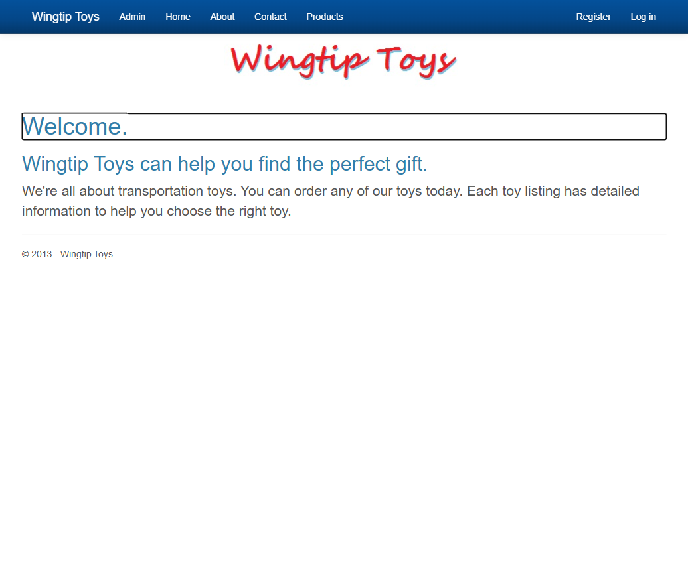
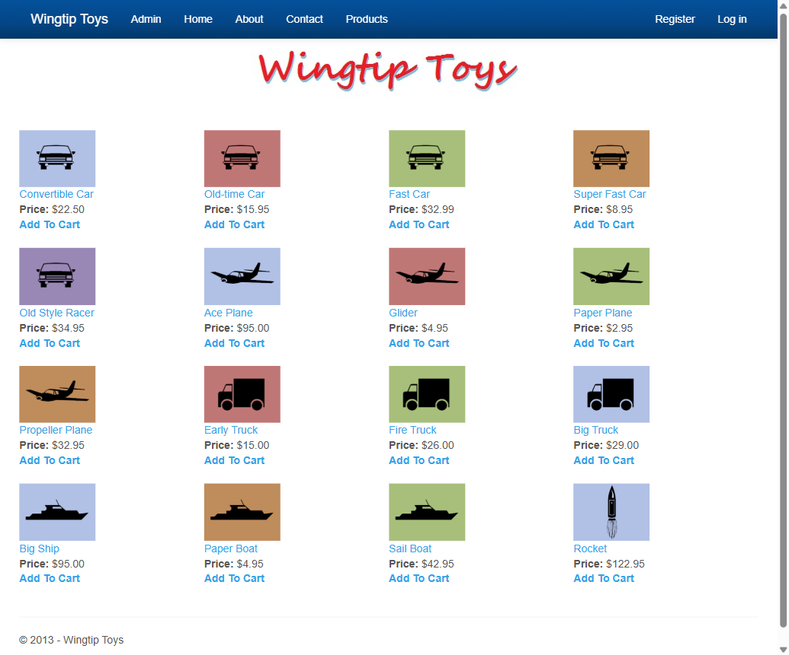
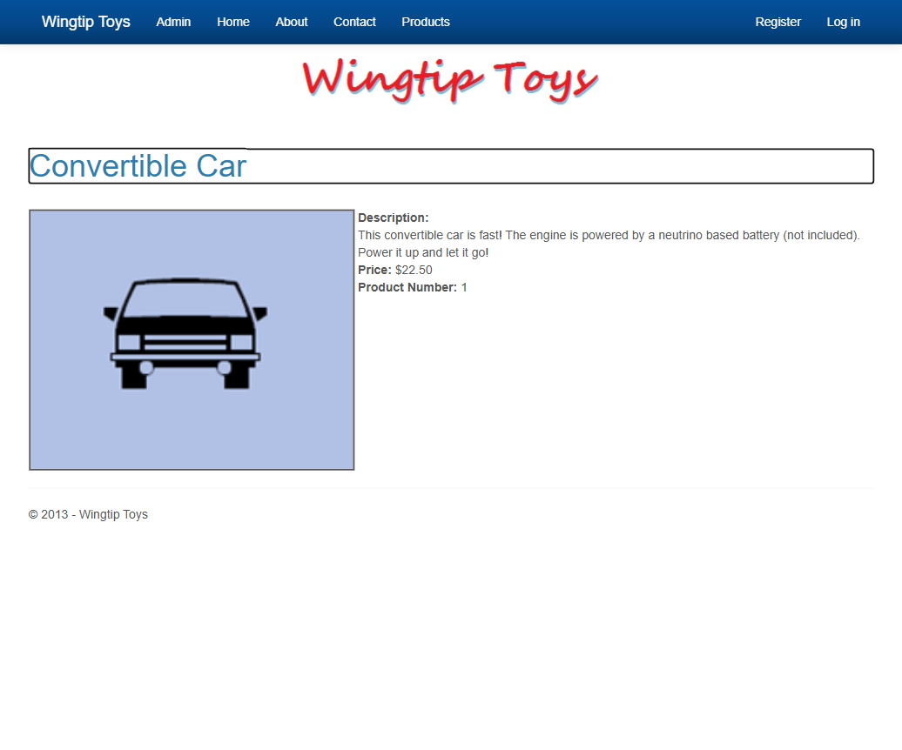
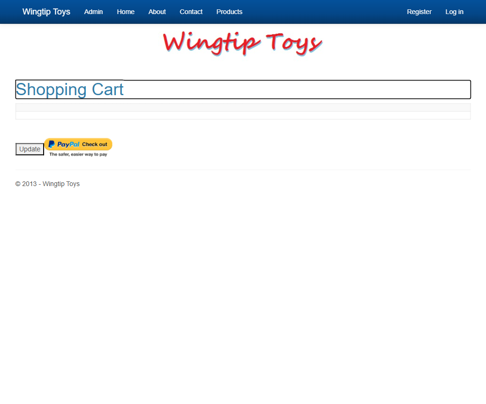
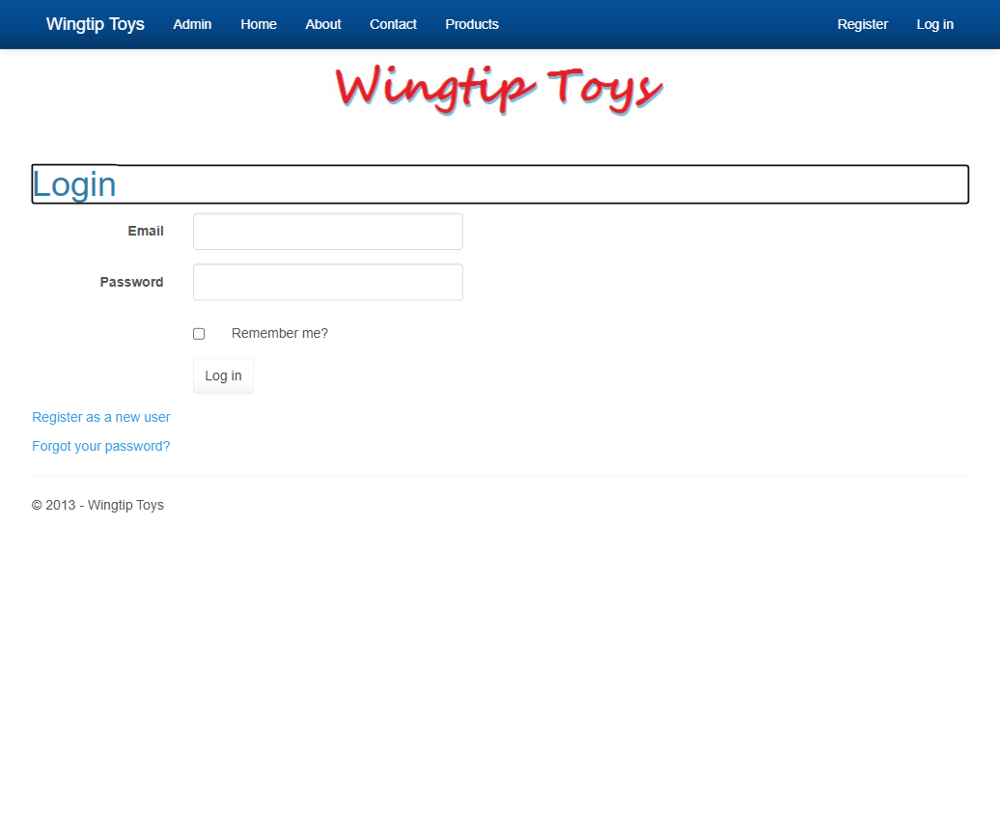
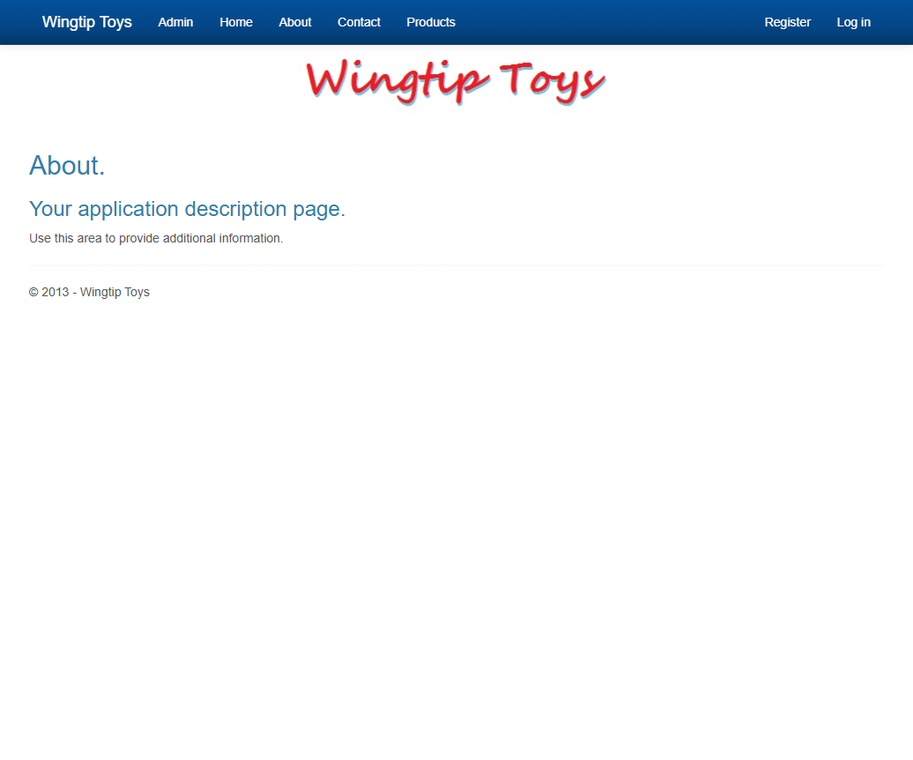

# WingtipToys Migration Benchmark — Run 95

## Metadata

| Field | Value |
|-------|-------|
| Date | 2026-06-02 |
| Branch | `feature/ascx-custom-control-migration` |
| Operator | Copilot CLI |
| Purpose | Validate ASCX/custom-control branch doesn't regress WTT migration |

## Paths

| Item | Path |
|------|------|
| Source | `samples/WingtipToys/WingtipToys/` |
| Output | `samples/AfterWingtipToys/` |
| Toolkit | `migration-toolkit/scripts/bwfc-migrate.ps1` |
| Tests | `src/WingtipToys.AcceptanceTests/` |

## Timing

| Phase | Duration |
|-------|----------|
| Phase 0 (prep) | ~5s |
| Phase 1 (L1 migration) | ~15s |
| Phase 2 (L2 repair) | ~8 min |
| Phase 3 (build) | ~20s |
| Phase 5 (acceptance tests) | ~40s |
| **Total wall-clock** | **~10 min** |

## Results

### Build: ✅ Succeeded (0 errors, 48 warnings)

Warnings are all nullable reference types and `SYSLIB0014` (WebRequest obsolete) — no functional issues.

### Acceptance Tests: ✅ 26/26 Passed

```
Test Run Successful.
  Passed: 26, Failed: 0, Skipped: 0
```

## Layer 2 Repairs Applied

| # | Repair | Toolkit Gap? |
|---|--------|-------------|
| 1 | Removed `ExceptionUtility` DI registration (private constructor, static-only class) | ✅ CLI should not register classes with private constructors |
| 2 | Switched `UseSqlServer` → `UseSqlite` + package swap | ✅ CLI should detect target DB provider from environment/config |
| 3 | Restored `ProductDatabaseInitializer.Seed()` from quarantined stub | ✅ Quarantine should preserve seed logic or emit seed guidance |
| 4 | Added `Description` field to category seed data (NOT NULL constraint) | Minor — EF Core 10 non-nullable string enforcement |
| 5 | Fixed dual-context SQLite DB creation (ProductContext first, then CreateTables for identity) | ✅ Scaffold should handle shared-DB multi-context pattern |

## What Worked Well

- L1 migration produced 204 files (33 razor, 49 CS) from scratch in ~15s
- All navigation, authentication, shopping cart, and product detail flows work
- Static assets (CSS, images, Bootstrap) all serve correctly
- Identity (register + login) works end-to-end
- No regressions from the ASCX/custom-control feature branch work

## What Did Not Work Well

- `ExceptionUtility` with private constructor registered for DI (recurring issue from run94)
- `ProductDatabaseInitializer` quarantined — seed data logic lost
- Dual-context `EnsureCreated()` on shared SQLite DB requires manual ordering
- SQL Server connection string generated when LocalDB not available

## Toolkit Gaps Exposed

1. **Private-constructor DI registration** — `ProgramCsEmitter` should skip classes with only private constructors
2. **Database seed quarantine** — Quarantine system should recognize seed/initializer classes and preserve them or emit a migration note
3. **Multi-context shared DB** — Scaffold should detect multiple DbContexts on one connection string and emit correct `EnsureCreated`/`CreateTables` ordering

## Screenshots







