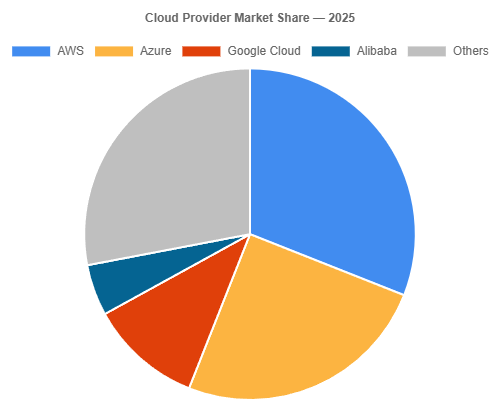
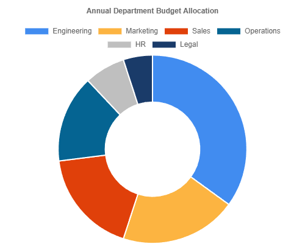
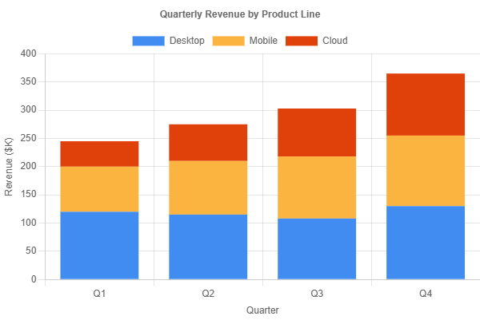

# Chart

**The Chart component provides data visualization by rendering interactive charts in Blazor, emulating the ASP.NET Web Forms `Chart` control.** This is the first component in the library to use JavaScript interop, powered by [Chart.js](https://www.chartjs.org/) for client-side rendering.

Original Microsoft documentation: [System.Web.UI.DataVisualization.Charting.Chart](https://docs.microsoft.com/en-us/dotnet/api/system.web.ui.datavisualization.charting.chart?view=netframework-4.8)

!!! warning "HTML Output Exception"
    The Web Forms Chart control renders an `` tag — a server-generated raster image. The Blazor Chart component renders a `<canvas>` element powered by Chart.js. This is a **justified deviation** from the project's identical-HTML-output rule because:

    - **Vector vs. raster**: Canvas-based charts scale crisply at any resolution; the old `` approach produced fixed-resolution PNGs/JPEGs
    - **Interactive vs. static**: Chart.js supports tooltips, hover effects, and animations out of the box — Web Forms charts were static images
    - **Client-side rendering**: No server round-trip to generate chart images, resulting in better performance
    - **No server dependency**: Web Forms required the `ChartImg.axd` HTTP handler and `System.Web.DataVisualization` assembly on the server

    Any CSS that targeted `img` inside your chart container will need to target `canvas` instead.

!!! note "Chart.js Dependency"
    The Chart component automatically loads Chart.js via JavaScript interop. The `chart.min.js` file is bundled in the library's static assets and loaded on demand — no manual script tags are required. See [JavaScript Setup](../UtilityFeatures/JavaScriptSetup.md) for general JS configuration options.

## Features Supported in Blazor

### Chart Types (Phase 1 — 8 of 35)

| SeriesChartType | Chart.js Mapping | Description |
|-----------------|------------------|-------------|
| `Column` | `bar` (vertical) | Vertical bar chart |
| `Bar` | `bar` (horizontal) | Horizontal bar chart |
| `Line` | `line` | Line chart |
| `Area` | `line` (with fill) | Filled area chart |
| `Pie` | `pie` | Pie chart |
| `Doughnut` | `doughnut` | Doughnut (ring) chart |
| `Point` | `scatter` | Scatter plot |
| `StackedColumn` | `bar` (stacked) | Stacked vertical bar chart |

### Component Parameters

| Parameter | Type | Description |
|-----------|------|-------------|
| `ChartWidth` | `string` | Width in CSS units (e.g., `"400px"`, `"100%"`) |
| `ChartHeight` | `string` | Height in CSS units (e.g., `"300px"`) |
| `Palette` | `ChartPalette` | Color palette for auto-coloring series (default: `BrightPastel`) |
| `ImageType` | `string` | API compatibility only; not functional in Blazor |
| `ID` | `string` | HTML element ID |
| `CssClass` | `string` | CSS class applied to the container `<div>` |
| `Style` | `string` | Inline CSS style |
| `Visible` | `bool` | Whether the chart is rendered |

### Child Components

- **`ChartSeries`** — Defines a data series (chart type, data points, data binding fields)
- **`ChartArea`** — Configures chart area with X/Y axis settings
- **`ChartLegend`** — Adds and configures a chart legend
- **`ChartTitle`** — Adds a chart title

### ChartSeries Parameters

| Parameter | Type | Description |
|-----------|------|-------------|
| `Name` | `string` | Series label shown in the legend |
| `ChartType` | `SeriesChartType` | Chart type for this series |
| `ChartArea` | `string` | Name of the chart area this series belongs to |
| `XValueMember` | `string` | Field name for X values when data-binding |
| `YValueMembers` | `string` | Field name(s) for Y values when data-binding |
| `Color` | `WebColor` | Series color override |
| `BorderWidth` | `int` | Border/line width |
| `IsVisibleInLegend` | `bool` | Whether this series appears in the legend (default: `true`) |
| `Legend` | `string` | Name of the legend this series is associated with |
| `MarkerStyle` | `string` | Marker style for data points |
| `ToolTip` | `string` | Tooltip text |
| `Points` | `List<DataPoint>` | Manual data points |
| `Items` | `IEnumerable<object>` | Data source items for data-binding |

### DataPoint Properties

| Property | Type | Description |
|----------|------|-------------|
| `XValue` | `object` | X-axis value |
| `YValues` | `double[]` | Y-axis values |
| `Label` | `string` | Display label |
| `Color` | `WebColor` | Per-point color override |
| `ToolTip` | `string` | Tooltip text |
| `IsValueShownAsLabel` | `bool` | Show value as a label on the chart |

### ChartArea Parameters

| Parameter | Type | Description |
|-----------|------|-------------|
| `Name` | `string` | Unique name of the chart area |
| `AreaBackColor` | `WebColor` | Background color |
| `AxisX` | `Axis` | X-axis configuration |
| `AxisY` | `Axis` | Y-axis configuration |

### Axis Properties

| Property | Type | Description |
|----------|------|-------------|
| `Title` | `string` | Axis title text |
| `Minimum` | `double?` | Minimum axis value |
| `Maximum` | `double?` | Maximum axis value |
| `Interval` | `double?` | Tick interval (step size) |
| `IsLogarithmic` | `bool` | Use logarithmic scale |

### ChartLegend Parameters

| Parameter | Type | Description |
|-----------|------|-------------|
| `Name` | `string` | Unique name |
| `LegendDocking` | `Docking?` | Position: `Top`, `Bottom`, `Left`, `Right` |
| `Alignment` | `string` | Legend alignment |
| `Title` | `string` | Legend title text |

### ChartTitle Parameters

| Parameter | Type | Description |
|-----------|------|-------------|
| `Text` | `string` | Title text |
| `Alignment` | `string` | Title alignment |
| `TitleDocking` | `Docking?` | Position: `Top`, `Bottom`, `Left`, `Right` |

### Chart Palettes

12 built-in color palettes matching the Web Forms `ChartColorPalette` enum:

`None`, `BrightPastel` (default), `Berry`, `Chocolate`, `EarthTones`, `Excel`, `Fire`, `Grayscale`, `Light`, `Pastel`, `SeaGreen`, `SemiTransparent`

## Chart Type Gallery

Below is a visual reference for each of the 8 chart types supported in Phase 1. Use this gallery to choose the right chart type for your data and to see what the Blazor Chart component produces.

### Column


**Enum value:** `SeriesChartType.Column`

The classic vertical bar chart — ideal for comparing discrete categories side by side. Use this when your X-axis represents categories (months, products, regions) and you want to emphasize differences in magnitude. This is the most commonly used chart type in Web Forms applications.

### Line


**Enum value:** `SeriesChartType.Line`

Connects data points with straight line segments, perfect for showing trends over time. Use this when your X-axis represents a continuous or sequential dimension (dates, quarters, versions) and you want to highlight the direction and rate of change. Supports multiple series for comparison.

### Bar


**Enum value:** `SeriesChartType.Bar`

A horizontal bar chart — the same concept as Column but rotated 90°. Use this when your category labels are long (e.g., product names, department titles) or when you have many categories that would crowd a vertical axis.

### Pie



**Enum value:** `SeriesChartType.Pie`

Displays proportions of a whole as slices of a circle. Use this when you have a single data series and want to show each category's percentage of the total. Best with 3–7 slices — more than that becomes hard to read. Each slice is automatically assigned a distinct color from the active palette.

### Doughnut



**Enum value:** `SeriesChartType.Doughnut`

A ring-shaped variant of the Pie chart with a hollow center. Use this when you want the same part-to-whole visualization as a Pie chart but prefer a cleaner look, or when you want to place a summary value or label in the center area. Each segment receives a distinct palette color automatically.

### Area


**Enum value:** `SeriesChartType.Area`

A Line chart with the region below the line filled in. Use this when you want to emphasize the volume or cumulative total over time, rather than just the trend line. Works well for showing how a value accumulates or for comparing the magnitude of multiple series.

### Scatter


**Enum value:** `SeriesChartType.Point`

Plots individual data points on an X/Y grid without connecting lines. Use this when both axes represent numeric values and you want to reveal correlations, clusters, or outliers in your data. Note that the Web Forms enum value is `Point`, not `Scatter`.

### Stacked Column



**Enum value:** `SeriesChartType.StackedColumn`

Stacks multiple series vertically within each category column. Use this when you want to show both the total value per category and the breakdown of contributing series. Each color band represents one series, and the full column height shows the aggregate.

## Web Forms Features NOT Supported

### Chart Types Not Supported (Phase 1)

27 additional chart types from the `SeriesChartType` enum are defined but will throw `NotSupportedException` if used. The most commonly requested:

| Chart Type | Status | Notes |
|------------|--------|-------|
| `Stock` | Phase 2/3 | OHLC financial charts |
| `Candlestick` | Phase 2/3 | Financial candlestick charts |
| `Bubble` | Phase 2/3 | Bubble charts (sized scatter) |
| `Radar` | Phase 2/3 | Radar/spider charts |
| `Polar` | Phase 2/3 | Polar area charts |
| `Funnel` | Phase 2/3 | Funnel charts |
| `Pyramid` | Phase 2/3 | Pyramid charts |
| `Spline` | Phase 2/3 | Smooth line charts |
| `StackedBar` | Phase 2/3 | Stacked horizontal bars |
| `StackedArea` | Phase 2/3 | Stacked area charts |
| `Range` / `RangeColumn` | Phase 2/3 | Range charts |
| `BoxPlot` | Phase 2/3 | Statistical box plots |

### Other Unsupported Features

- **Image export** (`SaveImage`) — Not available. Use the Chart.js canvas API directly via JS: `canvas.toDataURL()` or `canvas.toBlob()`
- **3D chart rendering** — Chart.js is 2D only; Web Forms supported `ChartArea3DStyle`
- **Annotations** — Web Forms `Annotations` collection is not implemented
- **Map areas / hot spots** — Clickable regions on the chart image (`MapAreas`) are not supported
- **Data binding via `DataSource` / `DataBind()`** — Use the `Items` parameter on `ChartSeries` or populate `Points` manually
- **`ChartImg.axd` HTTP handler** — Not needed; rendering is client-side
- **Skins and themes** — Use CSS and `Palette` instead
- **Serialization** (`ChartSerializer`) — Not applicable

## Web Forms Declarative Syntax

```html
<asp:Chart
    ID="Chart1"
    runat="server"
    Width="600px"
    Height="400px"
    Palette="BrightPastel"
    ImageType="Png"
>
    <Titles>
        <asp:Title Text="Monthly Sales" Docking="Top" />
    </Titles>
    <Legends>
        <asp:Legend Name="Legend1" Docking="Bottom" />
    </Legends>
    <Series>
        <asp:Series
            Name="Sales"
            ChartType="Column"
            XValueMember="Month"
            YValueMembers="Amount"
        />
    </Series>
    <ChartAreas>
        <asp:ChartArea Name="ChartArea1">
            <AxisX Title="Month" />
            <AxisY Title="Revenue ($)" />
        </asp:ChartArea>
    </ChartAreas>
</asp:Chart>
```

**Code-behind (Web Forms):**

```csharp
protected void Page_Load(object sender, EventArgs e)
{
    Chart1.DataSource = GetSalesData();
    Chart1.DataBind();
}
```

## Blazor Razor Syntax

### Basic Chart with Data Points

```razor
<Chart ID="Chart1" ChartWidth="600px" ChartHeight="400px" Palette="ChartPalette.BrightPastel">
    <ChartTitle Text="Monthly Sales" />
    <ChartLegend Name="Legend1" LegendDocking="Docking.Bottom" />
    <ChartSeries Name="Sales" ChartType="SeriesChartType.Column"
                 Points="@salesData" />
    <ChartArea Name="ChartArea1"
               AxisX="@(new Axis { Title = "Month" })"
               AxisY="@(new Axis { Title = "Revenue ($)" })" />
</Chart>

@code {
    private List<DataPoint> salesData = new()
    {
        new DataPoint { Label = "Jan", YValues = new[] { 12000.0 } },
        new DataPoint { Label = "Feb", YValues = new[] { 15000.0 } },
        new DataPoint { Label = "Mar", YValues = new[] { 18000.0 } },
        new DataPoint { Label = "Apr", YValues = new[] { 14000.0 } },
        new DataPoint { Label = "May", YValues = new[] { 21000.0 } },
        new DataPoint { Label = "Jun", YValues = new[] { 19000.0 } }
    };
}
```

### Data-Bound Chart

```razor
<Chart ID="SalesChart" ChartWidth="100%" ChartHeight="400px">
    <ChartTitle Text="Sales by Region" />
    <ChartSeries Name="Revenue" ChartType="SeriesChartType.Column"
                 XValueMember="Region" YValueMembers="Revenue"
                 Items="@regions" />
    <ChartArea Name="MainArea"
               AxisX="@(new Axis { Title = "Region" })"
               AxisY="@(new Axis { Title = "Revenue ($)", Minimum = 0 })" />
</Chart>

@code {
    private List<object> regions = new()
    {
        new { Region = "North", Revenue = 45000 },
        new { Region = "South", Revenue = 38000 },
        new { Region = "East", Revenue = 52000 },
        new { Region = "West", Revenue = 41000 }
    };
}
```

### Multi-Series Line Chart

```razor
<Chart ID="TrendChart" ChartWidth="700px" ChartHeight="400px"
       Palette="ChartPalette.Excel">
    <ChartTitle Text="Quarterly Trends" TitleDocking="Docking.Top" />
    <ChartLegend Name="Legend1" LegendDocking="Docking.Bottom" />
    <ChartSeries Name="2024" ChartType="SeriesChartType.Line"
                 Points="@data2024" BorderWidth="2" />
    <ChartSeries Name="2025" ChartType="SeriesChartType.Line"
                 Points="@data2025" BorderWidth="2" />
    <ChartArea Name="ChartArea1"
               AxisX="@(new Axis { Title = "Quarter" })"
               AxisY="@(new Axis { Title = "Units Sold", Minimum = 0 })" />
</Chart>

@code {
    private List<DataPoint> data2024 = new()
    {
        new DataPoint { Label = "Q1", YValues = new[] { 120.0 } },
        new DataPoint { Label = "Q2", YValues = new[] { 150.0 } },
        new DataPoint { Label = "Q3", YValues = new[] { 180.0 } },
        new DataPoint { Label = "Q4", YValues = new[] { 200.0 } }
    };

    private List<DataPoint> data2025 = new()
    {
        new DataPoint { Label = "Q1", YValues = new[] { 140.0 } },
        new DataPoint { Label = "Q2", YValues = new[] { 175.0 } },
        new DataPoint { Label = "Q3", YValues = new[] { 210.0 } },
        new DataPoint { Label = "Q4", YValues = new[] { 245.0 } }
    };
}
```

### Pie Chart with Legend

```razor
<Chart ID="PieChart" ChartWidth="500px" ChartHeight="400px"
       Palette="ChartPalette.Berry">
    <ChartTitle Text="Market Share" />
    <ChartLegend Name="Legend1" LegendDocking="Docking.Right"
                 Title="Products" />
    <ChartSeries Name="Share" ChartType="SeriesChartType.Pie"
                 Points="@marketData" />
</Chart>

@code {
    private List<DataPoint> marketData = new()
    {
        new DataPoint { Label = "Product A", YValues = new[] { 35.0 } },
        new DataPoint { Label = "Product B", YValues = new[] { 28.0 } },
        new DataPoint { Label = "Product C", YValues = new[] { 22.0 } },
        new DataPoint { Label = "Product D", YValues = new[] { 15.0 } }
    };
}
```

## HTML Output

### Blazor Input

```razor
<Chart ID="MyChart" ChartWidth="400px" ChartHeight="300px">
    <ChartSeries Name="Sales" ChartType="SeriesChartType.Column"
                 Points="@data" />
</Chart>
```

### Rendered HTML

```html
<div id="MyChart" style="width:400px;height:300px">
    <canvas id="MyChart_canvas_a1b2c3d4"></canvas>
</div>
```

!!! tip "Comparison with Web Forms Output"
    Web Forms rendered: ``

    The Blazor component renders a `<div>` wrapper with a `<canvas>` child. Chart.js draws directly on the canvas — no server-generated images, no HTTP handler.

## Migration Notes

1. **Remove the `asp:` prefix** — `<asp:Chart>` becomes `<Chart>`
2. **Remove `runat="server"`** — Not needed in Blazor
3. **Replace `DataSource` + `DataBind()` with `Items` parameter** — Pass your data collection to `ChartSeries.Items` or populate `ChartSeries.Points` manually
4. **`ChartType` values remain the same** — `Column`, `Bar`, `Line`, `Pie`, etc. are identical enum values (use `SeriesChartType.Column` syntax)
5. **`Palette` values remain the same** — Use `ChartPalette.BrightPastel` syntax instead of the string `"BrightPastel"`
6. **Chart.js renders client-side** — No `ChartImg.axd` handler registration needed; better performance and interactivity
7. **`Width`/`Height` become `ChartWidth`/`ChartHeight`** — These accept CSS unit strings (e.g., `"400px"`, `"100%"`)
8. **Axis configuration uses POCO objects** — Instead of nested XML elements, use `new Axis { Title = "...", Minimum = 0 }`
9. **Child element names changed** — `<Titles>` → `<ChartTitle>`, `<Legends>` → `<ChartLegend>`, `<Series>` → `<ChartSeries>`, `<ChartAreas>` → `<ChartArea>` (singular, no wrapper element)
10. **`ImageType` is ignored** — Chart.js renders to canvas, not an image file

### Before (Web Forms)

```html
<asp:Chart ID="Chart1" runat="server" Width="600" Height="400"
           Palette="BrightPastel" ImageType="Png">
    <Titles>
        <asp:Title Text="Sales Report" Docking="Top" />
    </Titles>
    <Legends>
        <asp:Legend Name="Legend1" Docking="Bottom" />
    </Legends>
    <Series>
        <asp:Series Name="Revenue" ChartType="Column"
                    XValueMember="Month" YValueMembers="Amount" />
    </Series>
    <ChartAreas>
        <asp:ChartArea Name="ChartArea1">
            <AxisX Title="Month" />
            <AxisY Title="Amount ($)" />
        </asp:ChartArea>
    </ChartAreas>
</asp:Chart>
```

```csharp
// Code-behind
Chart1.DataSource = GetMonthlyRevenue();
Chart1.DataBind();
```

### After (Blazor)

```razor
<Chart ID="Chart1" ChartWidth="600px" ChartHeight="400px"
       Palette="ChartPalette.BrightPastel">
    <ChartTitle Text="Sales Report" TitleDocking="Docking.Top" />
    <ChartLegend Name="Legend1" LegendDocking="Docking.Bottom" />
    <ChartSeries Name="Revenue" ChartType="SeriesChartType.Column"
                 XValueMember="Month" YValueMembers="Amount"
                 Items="@monthlyRevenue" />
    <ChartArea Name="ChartArea1"
               AxisX="@(new Axis { Title = "Month" })"
               AxisY="@(new Axis { Title = "Amount ($)" })" />
</Chart>

@code {
    private List<object> monthlyRevenue;

    protected override void OnInitialized()
    {
        monthlyRevenue = GetMonthlyRevenue()
            .Cast<object>().ToList();
    }
}
```

## See Also

- [GridView](GridView.md) — Data grid with row templates
- [Repeater](Repeater.md) — Flexible data repeater
- [JavaScript Setup](../UtilityFeatures/JavaScriptSetup.md) — JavaScript configuration for the library
- [Chart.js Documentation](https://www.chartjs.org/docs/) — The underlying charting library
- [Microsoft Chart Class Reference](https://docs.microsoft.com/en-us/dotnet/api/system.web.ui.datavisualization.charting.chart?view=netframework-4.8)
