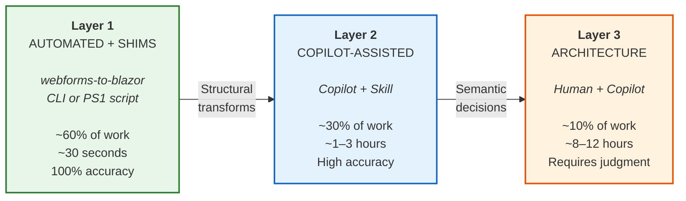

# Migration Methodology: The Three-Layer Pipeline

**Why three layers, not one?** Because migration work falls into three fundamentally different categories — and trying to handle them all with one tool (or one person, or one AI session) is how migrations stall.

---

## Pipeline Overview



Each layer handles a different *kind* of work, not just a different *amount*. The boundary between layers is defined by what type of intelligence is required:

| Layer | Intelligence Required | Tool | Error Rate |
|---|---|---|---|
| Layer 1 | None — compiled transforms or regex matching | `webforms-to-blazor` CLI or PowerShell script | ~0% (deterministic) |
| Layer 2 | Pattern recognition — knows BWFC control mappings | Copilot with migration skill | Low (guided by rules) |
| Layer 3 | Judgment — understands your app's architecture | Human + Copilot with data migration skill | Varies (depends on decisions) |

---

## Layer 0: Assessment (Before You Start)

Before migrating anything, scan your project to understand what you're working with.

**Tool:** [`scripts/bwfc-scan.ps1`](../scripts/bwfc-scan.ps1)

**Input:** Your Web Forms project directory
**Output:** A readiness report showing:
- File inventory (`.aspx`, `.ascx`, `.master` count)
- Control usage (which `asp:` controls, how many instances)
- DataSource controls (these need manual replacement)
- Migration readiness score (percentage of controls covered by BWFC)

**Example:**
```powershell
.\scripts\bwfc-scan.ps1 -Path .\MyWebFormsApp -OutputFormat Markdown -OutputFile scan-report.md
```

The scan report tells you whether BWFC is a good fit before you invest time in migration. If your app is heavy on DataSource controls, Wizard, or Web Parts, you'll know upfront.

---

## Layer 1: Automated Transforms

**Primary tool:** [`webforms-to-blazor` CLI](../src/BlazorWebFormsComponents.Cli/) — 37 compiled C# transforms with 373 unit tests
**Alternative:** [`scripts/bwfc-migrate.ps1`](../scripts/bwfc-migrate.ps1) — lightweight PowerShell regex transforms (no .NET SDK required)

Layer 1 handles every transform that can be applied mechanically. The CLI tool applies compiled, unit-tested transforms with a migration report; the PowerShell script provides simpler regex-based transforms for quick starts.

### What Layer 1 Does

| Transform | Count (WingtipToys) | Accuracy |
|---|---|---|
| `asp:` tag prefix removals | 147+ | 100% |
| `runat="server"` attribute removals | 165+ | 100% |
| Expression conversions (`<%: %>` → `@()`) | ~35 | 100% |
| `ItemType` → `TItem` conversions | 8 | 100% |
| Content wrapper removals (`<asp:Content>`) | 28 | 100% |
| URL conversions (`~/` → `/`) | All | 100% |
| File renaming (`.aspx` → `.razor`) | 33 | 100% |
| Project scaffold (`.csproj`, `Program.cs`, `_Imports.razor`, `App.razor`) | Full | ✅ |

The CLI generates `_Imports.razor` with `@inherits BlazorWebFormsComponents.WebFormsPageBase` so every page automatically gets `Page.Title`, `Page.MetaDescription`, `Page.MetaKeywords`, `IsPostBack`, `Session`, `Response`, `Request`, `Server`, `Cache`, and `ClientScript` — with the same API as Web Forms. The layout scaffold includes `<BlazorWebFormsComponents.Page />` to render `<PageTitle>` and `<meta>` tags.

The CLI also generates `Program.cs` with `builder.Services.AddBlazorWebFormsComponents()`, which registers all the shim infrastructure (SessionShim, ResponseShim, RequestShim, CacheShim, ServerShim, ClientScriptShim, ViewStateShim) automatically.

### Shim Infrastructure

When `AddBlazorWebFormsComponents()` is called in `Program.cs` and pages inherit from `WebFormsPageBase` (via `@inherits` in `_Imports.razor`), the following Web Forms APIs **work AS-IS** with no code changes:

| Shim | What It Enables |
|------|----------------|
| **Page.Title / Page.MetaDescription / Page.MetaKeywords** | Set metadata from code-behind — auto-rendered by `<Page />` |
| **IsPostBack** | Returns `false` on first render, `true` on subsequent interactions |
| **Response.Redirect("~/path")** | Auto-strips `~/` prefix and `.aspx` extension, uses `NavigationManager` internally |
| **Request.Url / Request.QueryString["key"]** | Reads current URL and query parameters |
| **Request.Form["key"]** | Reads form POST data (wrap form in `<WebFormsForm>`) |
| **Session["key"]** | Scoped in-memory dictionary — works like Web Forms Session |
| **Cache["key"]** | In-memory application cache |
| **Server.MapPath("~/path")** | Maps virtual paths to physical paths |
| **Page.ClientScript.RegisterStartupScript(...)** | Registers client-side scripts via JS interop |
| **ViewState["key"]** | Compile-compatible dictionary (in-memory, not serialized to page) |
| **__doPostBack / IPostBackEventHandler** | PostBack event support with JS interop |

This means that code-behind files referencing `Response.Redirect`, `Session`, `Request`, `IsPostBack`, `Page.Title`, `Cache`, `Server.MapPath`, or `ClientScript` **compile and run unchanged** — no manual conversion required.

### What Layer 1 Does NOT Do

- Convert `SelectMethod` to `Items` binding (requires understanding the data flow)
- Convert code-behind lifecycle methods like `Page_Load` signature (requires semantic understanding)
- Replace DataSource controls (requires architecture decisions)
- Wire authentication (requires knowing your auth strategy)
- Convert Master Pages to layouts (partially — removes directives but doesn't create `@Body`)

These are intentionally left for Layer 2 and Layer 3.

### Layer 1 Output

After Layer 1, pages fall into three readiness categories:

| Status | Typical % | Meaning |
|---|---|---|
| ✅ Markup-complete | ~12% | Ready to compile and run — no further work needed |
| ⚠️ Needs Layer 2 | ~64% | Structural transforms needed — Copilot handles these |
| ❌ Needs Layer 3 | ~24% | Architecture decisions required — human judgment needed |

> These percentages are from the [WingtipToys proof-of-concept](../planning-docs/WINGTIPTOYS-MIGRATION-EXECUTIVE-REPORT.md). Your mileage will vary based on how much DataSource/auth/session-state your app uses.

---

## Layer 2: Copilot-Assisted Structural Transforms

**Tool:** [Copilot migration skill](CopilotSkills/CoreMigration.md)

Layer 2 handles transforms that follow consistent patterns but require understanding control semantics. A human *could* do these mechanically, but it's tedious and error-prone. Copilot with the BWFC migration skill handles them reliably.

**L2 Principle: Wire up data binding and lifecycle — NOT to replace shims with native patterns.**

The shims ARE the L2 strategy. If the original Web Forms code says `Session["CartId"]`, the migrated code says `Session["CartId"]`. The shim makes this work. Don't reinvent what already exists. Layer 2 is about making data flow through the page and connecting event handlers — NOT about converting `Response.Redirect()` to `NavigationManager.NavigateTo()`. That's an optional Layer 3 optimization.

### What Shims Handle Automatically (no Layer 2 work needed)

These items were previously Layer 2 manual transforms but are now handled AS-IS by BWFC shims:

| Pattern | Status |
|---|---|
| `Response.Redirect("~/path")` | ✅ Works AS-IS via ResponseShim — auto-strips `~/` and `.aspx` |
| `IsPostBack` checks in code-behind | ✅ Works AS-IS via WebFormsPageBase |
| `Session["key"]` access | ✅ Works AS-IS via SessionShim — no longer needs Layer 3 decision |
| `Page.Title`, `Page.MetaDescription` | ✅ Works AS-IS via WebFormsPageBase + `<Page />` |
| `Request.QueryString["key"]` | ✅ Works AS-IS via RequestShim |
| `Cache["key"]` | ✅ Works AS-IS via CacheShim |
| `Server.MapPath("~/path")` | ✅ Works AS-IS via ServerShim |

### What Layer 2 Still Handles

| Transform | Before | After |
|---|---|---|
| Data binding | `SelectMethod="GetProducts"` | `Items="products"` + `OnInitializedAsync` |
| Template context | `<%#: Item.Name %>` | `@Item.Name` with `Context="Item"` |
| Lifecycle methods | `Page_Load(object sender, EventArgs e)` signature | `OnInitializedAsync` (the `IsPostBack` inside works AS-IS) |
| Event handlers | `void Btn_Click(object sender, EventArgs e)` | `void Btn_Click()` |
| Form wrappers | `<form runat="server">` | Removed, or `<WebFormsForm>` for Request.Form, or `<EditForm>` for validation |
| Layout conversion | `<asp:ContentPlaceHolder ID="MainContent">` | `@Body` |
| Query parameters | `[QueryString] int? id` | `[SupplyParameterFromQuery]` |
| Route parameters | `[RouteData] int id` | `@page "/path/{id:int}"` + `[Parameter]` |

### How to Use Layer 2

1. Copy the [Copilot Skills Overview](CopilotSkills/Overview.md) into your project's `.github/copilot-instructions.md`
2. Open each migrated `.razor` file with Copilot
3. Ask Copilot to apply the migration skill to the file
4. Review and accept the transforms

Or, if using Copilot Chat directly, reference the skill file:

```
@workspace Use the rules in .github/CopilotSkills/CoreMigration.md to complete
the migration of this file. Look for TODO comments and unresolved patterns.
```

### Layer 2 Quality

Layer 2 is "high accuracy" rather than "100% accuracy" because:
- Data binding patterns vary by application (Copilot needs context about your data layer)
- Some event handler signatures have application-specific parameters
- Navigation routes depend on your URL structure

Always review Copilot's changes before committing.

### Shim Path vs. Native Blazor Path

> **You have a choice.** BWFC shims get your app compiling and running fast — but they're not the only option long-term.
>
> | Approach | When to Use | Example |
> |---|---|---|
> | **Shim path** (keep AS-IS) | Migration speed is the priority; code works correctly; team isn't ready to learn Blazor-native patterns yet | `Response.Redirect("~/Products")` — works via ResponseShim |
> | **Native Blazor path** (refactor later) | **Layer 3 optimization** — post-migration polish; team is comfortable with Blazor; want to reduce BWFC dependency | `NavigationManager.NavigateTo("/Products")` — native Blazor |
>
> **Recommendation:** Use shims to get migrated fast (Layer 2), then refactor to native Blazor incrementally in Layer 3 as your team builds Blazor expertise. Both paths produce working code. **Replacing shims with native patterns is OPTIONAL, not required.**

---

## Layer 3: Architecture Decisions

**Tool:** [Data migration skill](CopilotSkills/DataMigration.md) + your own judgment


Layer 3 is the ~15% of migration work that requires understanding your application's architecture. No script or AI can make these decisions for you — but the data migration skill and Copilot can guide you through the options and trade-offs.

**Important:** Replacing shims with native Blazor patterns (e.g., `Response.Redirect()` → `NavigationManager.NavigateTo()`) is an **OPTIONAL Layer 3 optimization**, not a migration requirement. Your app works with the shims. Native patterns are for teams that want to reduce BWFC dependency long-term.

### Common Layer 3 Decisions

| Decision | Web Forms Pattern | Blazor Options |
|---|---|---|
| **Data access** | `SqlDataSource`, inline `DbContext` | EF Core + injected service, Dapper, repository pattern |
| **Authentication** | ASP.NET Membership / Identity | ASP.NET Core Identity, external provider, cookie auth |
| **Global.asax** | `Application_Start`, `Application_Error` | `Program.cs` middleware pipeline |
| **Web.config** | `<connectionStrings>`, `<appSettings>` | `appsettings.json`, user secrets, environment variables |
| **HTTP handlers** | `IHttpHandler`, `IHttpModule` | ASP.NET Core middleware |
| **Third-party APIs** | Direct `WebRequest`/`WebClient` calls | `HttpClient` via DI with `IHttpClientFactory` |

> **Note:** Session state (`Session["key"]`) is no longer a Layer 3 decision. BWFC's `SessionShim` provides a scoped in-memory dictionary that works AS-IS. If you need persistent/distributed session state, that's still an architecture decision — but the code compiles and runs without changes.

### Using the Data Migration Skill

The data migration skill is designed for interactive Copilot sessions. Point Copilot at your scan report and your partially-migrated files:

1. Share the `bwfc-scan.ps1` output
2. Share the `bwfc-migrate.ps1` output directory
3. Copilot identifies remaining `TODO` markers and decision points
4. Walk through each decision interactively

The skill provides decision frameworks for common architecture patterns — see the [full skill reference](CopilotSkills/DataMigration.md).

---

## Layer L3-opt: Performance Optimization Pass (Optional)

**Tool:** [L3 performance optimization skill](https://github.com/FritzAndFriends/BlazorWebFormsComponents/tree/dev/migration-toolkit/skills/l3-performance-optimization/SKILL.md)

This is an **optional fourth step** that runs after the app builds and passes verification. It is not part of the core migration pipeline — it is a post-migration polish pass that applies modern .NET 10 performance patterns to already-functional migrated code.

### What L3-opt Handles

| Optimization | Before (typical migration output) | After |
|---|---|---|
| Sync lifecycle | `void OnInitialized()` with DB calls | `async Task OnInitializedAsync()` |
| Sync EF Core | `.ToList()`, `.SaveChanges()` | `await .ToListAsync()`, `await .SaveChangesAsync()` |
| No-tracking reads | `db.Products.ToListAsync()` | `db.Products.AsNoTracking().ToListAsync()` |
| `@key` on loops | `@foreach (var p in products)` | `@foreach (...) { <C @key="p.ID" ... />}` |
| Query string params | Manual `Uri` parsing | `[SupplyParameterFromQuery]` |
| Code-behind extraction | Inline `@code` blocks > 50 lines | Partial `.razor.cs` class |

### When to Apply

Apply L3-opt after:
1. ✅ App builds without errors
2. ✅ App runs and renders pages correctly
3. ✅ Interactive features (forms, navigation, data) work
4. ✅ Basic verification checklist is complete

Do **not** apply L3-opt to a broken build. Async patterns surface errors that were previously hidden.

---

## Why This Ordering Matters

Layers must run in order: 1 → 2 → 3. Each layer assumes the previous one has completed.

- **Layer 1 before Layer 2:** Copilot expects files to already have `asp:` prefixes removed and expressions converted. If Layer 1 hasn't run, Copilot wastes time on mechanical transforms.
- **Layer 2 before Layer 3:** Architecture decisions are easier when the markup is already in Blazor syntax. You can see what's left to wire up instead of mentally translating Web Forms markup.
- **Layer 3 before L3-opt:** Performance optimizations assume functional code. Async migrations and `IDbContextFactory` patterns require the service layer to already exist.

Don't skip layers. Don't try to do Layer 3 work in Layer 1. The pipeline is designed so that each layer makes the next layer's job easier.

---

## Time Estimates

Based on the [WingtipToys proof-of-concept](../planning-docs/WINGTIPTOYS-MIGRATION-EXECUTIVE-REPORT.md) (33 pages, 230+ control instances):

| Layer | Solo Developer | With Copilot/Agents |
|---|---|---|
| Layer 0 (scan) | 5 minutes | 5 minutes |
| Layer 1 (automated + shims) | ~30 seconds | ~30 seconds |
| Layer 2 (structural) | 6–10 hours | 1–3 hours |
| Layer 3 (architecture) | 10–14 hours | 8–12 hours |
| **L3-opt (optional)** | **1–2 hours** | **30–60 minutes** |
| **Total** | **18–28 hours** | **10–17 hours** |

Layer 3 time varies the most because it depends on your application's complexity. A simple CRUD app with no auth may have almost no Layer 3 work. An enterprise app with custom session state, complex auth, and third-party integrations will spend most of its time in Layer 3.

---

## Cross-References

- [Quick Start](QuickStart.md) — the linear "just do it" path through all three layers
- [Control Coverage](ControlCoverage.md) — what's covered at each complexity level
- [Migration Checklist](ChecklistTemplate.md) — per-page tracking template organized by layer
- [Executive report](../planning-docs/WINGTIPTOYS-MIGRATION-EXECUTIVE-REPORT.md) — WingtipToys metrics source


