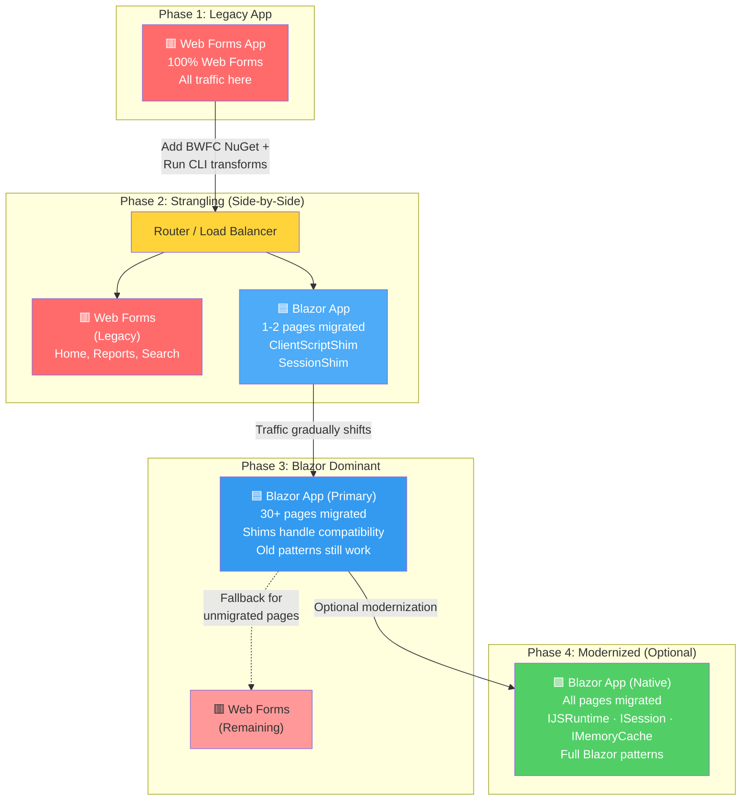

# Strangler Fig Migration Pattern

## What Is the Strangler Fig Pattern?

The **Strangler Fig pattern** is named after a real-world biological process: strangler fig trees grow around the trunk of a host tree, gradually replacing it until the original tree is completely enclosed. In software architecture, the pattern applies the same philosophy: **incrementally replace parts of a legacy system while keeping it running**, rather than attempting a complete rewrite all at once.

### In Practice: Legacy System + New System Running in Parallel

Instead of:
- **Big bang rewrite** — Stop old system, rewrite everything, hope it all works
- **Extended downtime** — Teams lock down the old app, everyone migrates, weeks of risk

The Strangler Fig approach:
- **Keep both running** — Legacy Web Forms app continues in production
- **Route requests** — Some traffic goes to new Blazor components, some stays in Web Forms
- **Migrate incrementally** — Move one page, control, or feature at a time
- **Zero downtime** — Users see no outage; changes are invisible
- **Rollback easily** — If something breaks, switch traffic back instantly

## How BWFC Enables Strangler Fig Migration

BWFC provides three layers of support designed specifically for incremental, side-by-side migration.

### Step 1: Instrument the Legacy App with BWFC

Add the BWFC NuGet package to your .NET 10 Blazor target project:

```bash
dotnet add package Fritz.BlazorWebFormsComponents
```

This unlocks **Roslyn analyzers** that run at **compile time** in your Blazor project:

| Analyzer | What It Detects | Example |
|----------|-----------------|---------|
| **BWFC022** | `Page.ClientScript` access patterns | `Page.ClientScript.RegisterStartupScript(...)` |
| **BWFC023** | ViewState read/write access | `ViewState["key"]` assignments |
| **BWFC024** | Server control event handler patterns | `evt_Click(sender, e)` method signatures |

**Key fact:** These analyzers are **purely syntactic** — they match patterns in the Roslyn syntax tree (e.g., `IsClientScriptAccess()` in the analyzer source) without requiring System.Web type resolution. This means they work in any .NET project, whether or not System.Web is available.

The analyzers highlight every Web Forms pattern that needs attention, guiding you toward migration opportunities one diagnostic at a time.

---

### Step 2: Strangle Incrementally with CLI + Analyzers

Move files from the legacy Web Forms project to the Blazor project one at a time.

#### L1 Automated Transforms

The CLI tool (`webforms-to-blazor`) handles **mechanical L1 transforms**:

- `@Page` directives → `@page`
- `<asp:` tags → `<Button>`, `<GridView>`, etc.
- `Page_Load` → `OnInitialized()`
- `IsPostBack` guards → removed or rewritten
- `web.config` → `appsettings.json` entries

After L1 transforms, your code compiles and runs.

#### Analyzers Show What's Left

The BWFC analyzers then light up the remaining patterns:
- `Page.ClientScript.RegisterStartupScript()` → use ClientScriptShim or IJSRuntime
- `ViewState["key"]` → use field/property or ViewStateDictionary
- Event handler signatures → add `EventCallback<>` return types

No guessing — every diagnostic is actionable.

---

### Step 3: Zero-Rewrite Compatibility with Shims

Here's what makes BWFC unique: **you don't have to rewrite your code to make it work**. BWFC provides **runtime shims** that accept the *exact same API calls* as Web Forms, but run on Blazor's modern foundation.

#### ClientScriptShim

```csharp
// Web Forms code-behind (no changes needed)
protected void Page_Load(object sender, EventArgs e)
{
    Page.ClientScript.RegisterStartupScript(
        GetType(), "init", 
        "console.log('Page loaded');", true);
}
```

```csharp
// Blazor code-behind (inject shim, change lifecycle only)
@inject ClientScriptShim ClientScript

@code {
    protected override void OnInitialized()
    {
        ClientScript.RegisterStartupScript(
            GetType(), "init",
            "console.log('Page loaded');", true);  // ← Identical call
    }
}
```

**How it works:**
1. `RegisterStartupScript()` queues the script in memory
2. During `OnAfterRenderAsync`, scripts execute via `IJSRuntime.InvokeVoidAsync("eval", script)`
3. Queue clears after each cycle
4. Deduplication works exactly like Web Forms (by Type + key)

#### Other Shims

The same philosophy applies to other patterns:

| Shim | Web Forms | Blazor | Migration Path |
|------|-----------|--------|-----------------|
| **ClientScriptShim** | `Page.ClientScript.RegisterStartupScript()` | Same call via injected shim | Zero-rewrite |
| **SessionShim** | `Session["key"] = value` | Same call, modern storage | Zero-rewrite |
| **CacheShim** | `Cache.Insert(key, obj)` | Same call via IMemoryCache | Zero-rewrite |
| **ServerShim** | `Server.UrlEncode()` | Same call via utility | Zero-rewrite |

All shims follow the same pattern: **same API surface, modern implementation underneath**.

---

### Step 4: Modernize at Your Own Pace (Optional)

Once your code is running in Blazor, you can optionally refactor shim calls to native Blazor patterns — but there's no deadline.

```csharp
// Phase 1: Use shim for speed (zero-rewrite)
ClientScript.RegisterStartupScript(GetType(), "init", "alert('hi');", true);

// Phase 2: Optional refactor to native Blazor
@inject IJSRuntime JS

protected override async Task OnAfterRenderAsync(bool firstRender)
{
    if (firstRender)
        await JS.InvokeVoidAsync("eval", "alert('hi');");
}
```

Or better yet, migrate to **JS modules** for production code:

```csharp
@inject IJSRuntime JS

protected override async Task OnAfterRenderAsync(bool firstRender)
{
    if (firstRender)
    {
        var module = await JS.InvokeAsync<IJSObjectReference>(
            "import", "./Components/AlertModule.js");
        await module.InvokeVoidAsync("showAlert");
    }
}
```

**The key:** Shims are production-ready from day one. You modernize when it makes sense, not because you have to.

---

## Visual Progression: From Web Forms to Blazor

Here's what the migration journey looks like:



---

## Why This Works: Three Key Advantages

### 1. Zero Downtime

Users never experience service interruption. Traffic routes smoothly between systems. If a migrated page has a bug, you instantly route traffic back to the legacy app.

### 2. Parallel Velocity

Teams don't have to wait for everything to be ready. Front-end developers can migrate UI pages while back-end developers work on business logic. QA tests pieces incrementally.

### 3. Reversible Migration

Unlike "big bang" rewrites, strangler fig migration is reversible at every step. If the Blazor app isn't ready, you have a working fallback.

---

## Real-World Example: E-Commerce Site

**Week 1–2:** Migrate the **Product Search** page to Blazor
- No SearchBox component yet? Use plain HTML inputs with `@bind`
- JavaScript search filtering? Use ClientScriptShim to keep `Page.ClientScript.RegisterStartupScript()` calls
- Runs in parallel with legacy Search page; router directs traffic

**Week 3:** Migrate the **Shopping Cart** page
- SessionShim keeps `Session["CartItems"]` working
- FormView component for edit/display modes
- Shims handle the Web Forms session storage

**Week 4–5:** Migrate **Order History** and **Account Settings**
- GridView becomes GridView (BWFC component)
- Master page becomes Layout
- Event handlers stay the same

**By Week 6:**
- Core pages in Blazor, legacy becomes fallback
- Team can now *optionally* refactor shims to native patterns
- No deadline — shims are production-ready

---

## Comparison: Migration Strategies

| Strategy | Timeline | Risk | Downtime | Reversibility |
|----------|----------|------|----------|----------------|
| **Big Bang Rewrite** | 6–12 months | Very High | Days/Weeks | None (all-in) |
| **Strangler Fig (BWFC)** | Incremental (weeks) | Low | None | Full (every step) |
| **Parallel Development** | 3–6 months | High | Moderate | Risky (integration required) |

---

## Next Steps

1. **[Migration Readiness Assessment](migration_readiness.md)** — Evaluate your app's readiness for incremental migration
2. **[Strategies](Strategies.md)** — High-level planning for your specific scenario
3. **[Automated Migration Guide](AutomatedMigration.md)** — Use the CLI to kick off L1 transforms
4. **[Analyzers](Analyzers.md)** — Understand what BWFC022, BWFC023, BWFC024 are telling you
5. **[ClientScript Migration Guide](ClientScriptMigrationGuide.md)** — Deep dive on JS patterns with ClientScriptShim
6. **[Phase 2 Session Shim](Phase2-SessionShim.md)** — Keep session state working without rewrites
7. **[Phase 2 Lifecycle Transforms](Phase2-LifecycleTransforms.md)** — Page lifecycle event patterns

---

## Summary

The **Strangler Fig pattern** is the philosophical foundation of BWFC:

- **Don't rewrite everything.** Incrementally replace parts while keeping the system running.
- **Use analyzers to guide.** BWFC's Roslyn analyzers show you exactly what needs attention.
- **Use shims to bridge.** ClientScriptShim, SessionShim, and others let migrated code work unchanged.
- **Modernize on your schedule.** Refactor to native Blazor patterns when it makes sense, not because you have to.
- **Zero downtime, zero risk.** Both systems run in parallel. Every step is reversible.

BWFC was purpose-built for this pattern. The analyzers, CLI, and shims all exist to make incremental, side-by-side migration possible.
