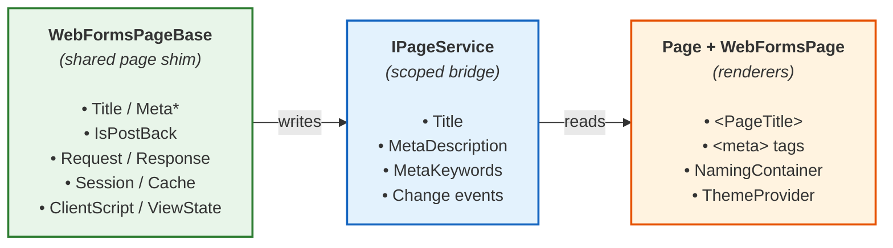

# Page System

The Page system in BlazorWebFormsComponents recreates the `System.Web.UI.Page` code-behind experience for Blazor. It lets converted pages use `Page.Title`, `Page.MetaDescription`, `Page.MetaKeywords`, and `if (!IsPostBack)` with **zero syntax changes** from Web Forms.

Original Microsoft implementation: [System.Web.UI.Page](https://docs.microsoft.com/en-us/dotnet/api/system.web.ui.page?view=netframework-4.8)

## Background

In ASP.NET Web Forms, the `Page` object provided a central place for page-level properties and functionality. Every code-behind file inherited from `System.Web.UI.Page`, giving automatic access to `Page.Title`, `Page.MetaDescription`, `Page.MetaKeywords`, and `IsPostBack`:

```csharp
// Web Forms code-behind (.aspx.cs)
public partial class Products : System.Web.UI.Page
{
    protected void Page_Load(object sender, EventArgs e)
    {
        if (!IsPostBack)
        {
            Page.Title = "Products - Contoso";
            Page.MetaDescription = "Browse our product catalog";
            Page.MetaKeywords = "products, catalog, shopping";
        }
    }
}
```

These properties automatically updated the HTML `<title>` and `<meta>` elements in the rendered page.

## Architecture

The Page system uses three complementary pieces:


*Your pages inherit _ _ _ _ DI service _ _ _ _ In your layout*

| Piece | Role | Where it lives |
|---|---|---|
| **`WebFormsPageBase`** | Abstract base class for converted pages and the shared runtime shim behind `<Page />`. Provides `Title`, `MetaDescription`, `MetaKeywords`, `IsPostBack`, `Page`, `Request`, `Response`, `Session`, `Server`, `Cache`, `ClientScript`, and `ViewState`. | `@inherits` in `_Imports.razor`, inherited by `<Page />` |
| **`IPageService` / `PageService`** | Scoped service that bridges the base class and the renderer. Property setters fire change events. | Registered by `AddBlazorWebFormsComponents()` |
| **`Page`** | Head renderer that inherits `WebFormsPageBase`, reads the current title/meta values, and disables postback interop because it only renders `<PageTitle>` and `<meta>` tags. | `<Page />` |
| **`WebFormsPage`** | Unified layout wrapper that provides NamingContainer (ID mangling), ThemeProvider (skin cascading), and optionally composes `<Page />` for head rendering. | `<WebFormsPage>` wrapping `@Body` in layout |

**Key point:** `WebFormsPageBase` is now the shared page shim. Converted pages inherit it directly, `<Page />` reuses it for head rendering, and `<WebFormsPage>` composes `<Page />` instead of duplicating page-service subscription logic.

!!! tip "Default layout pattern"
    `<WebFormsPage>` is still the simplest layout wrapper. It now renders `<Page />` internally by default, so you get naming, theming, and page-head rendering from one component.

## One-Time Setup

Two things need to happen once in your application:

### 1. Register the service (Program.cs)

```csharp
// Program.cs
builder.Services.AddBlazorWebFormsComponents();
```

This registers `IPageService` as a scoped service.

### 2. Add `WebFormsPage` to your layout

```razor
@* MainLayout.razor *@
@inherits LayoutComponentBase

<WebFormsPage ID="MainContent">
    @Body
</WebFormsPage>
```

`<WebFormsPage>` provides three features in one component:

- **NamingContainer** — Web Forms-style `ctl00` ID mangling for child controls
- **ThemeProvider** — Cascades `ThemeConfiguration` to child components (optional `Theme` parameter)
- **Page head rendering** — Subscribes to `IPageService` and renders `<PageTitle>` + `<meta>` tags

!!! note "RenderPageHead parameter"
    If you need to handle head rendering separately, set `RenderPageHead="false"` on `<WebFormsPage>` and place `<Page />` yourself. Otherwise, let `<WebFormsPage>` own that composition to avoid duplicate head tags.

## Primary Approach: WebFormsPageBase

For converted Web Forms pages, inherit from `WebFormsPageBase`. This is the recommended approach because it preserves your existing code-behind patterns with zero syntax changes.

### Setup

Add to your `_Imports.razor`:

```razor
@inherits BlazorWebFormsComponents.WebFormsPageBase
```

!!! note "Scope"
    The `@inherits` directive applies to all `.razor` files in the same directory and subdirectories. If only some pages need it, place a separate `_Imports.razor` in the pages folder.

### Usage

With `WebFormsPageBase` as your base class, Web Forms code-behind patterns work unchanged:

```razor
@page "/products"

<h1>Products</h1>

@code {
    protected override void OnInitialized()
    {
        if (!IsPostBack)
        {
            Page.Title = "Products - Contoso";
            Page.MetaDescription = "Browse our product catalog";
            Page.MetaKeywords = "products, catalog, shopping";
        }
    }
}
```

This works because:

- **`Page`** returns `this` (a self-reference), so `Page.Title` resolves to `this.Title`
- **`Title`**, **`MetaDescription`**, and **`MetaKeywords`** delegate to the scoped `IPageService` when available
- **`IsPostBack`** always returns `false` — so `if (!IsPostBack)` blocks always execute, matching first-load behavior

### Properties Available

| Property | Type | Description |
|---|---|---|
| `Title` | `string` | Gets/sets the page title. Delegates to `IPageService.Title`. |
| `MetaDescription` | `string` | Gets/sets the meta description. Delegates to `IPageService.MetaDescription`. |
| `MetaKeywords` | `string` | Gets/sets the meta keywords. Delegates to `IPageService.MetaKeywords`. |
| `IsPostBack` | `bool` | Always returns `false`. Blazor has no postback model. |
| `Page` | `WebFormsPageBase` | Returns `this`. Enables `Page.Title` syntax. |
| `Request` | `RequestShim` | Compatibility wrapper for query string, cookies, URL, and form data. |
| `Response` | `ResponseShim` | Compatibility wrapper for redirects and cookies. |
| `Session` | `SessionShim` | Dictionary-style session storage with SSR and in-memory fallback behavior. |
| `Server` | `ServerShim` | Compatibility wrapper for `MapPath`, HTML encoding, and URL encoding. |
| `Cache` | `CacheShim` | Compatibility wrapper over `IMemoryCache`. |
| `ClientScript` | `ClientScriptShim` | Registers startup scripts, client script blocks, and postback helpers. |
| `ViewState` | `ViewStateDictionary` | Per-page ViewState-style dictionary. |

!!! warning "Dead Code: `if (IsPostBack)`"
    Code guarded by `if (IsPostBack)` (without `!`) will **never execute** because `IsPostBack` is always `false`. During migration, search for `if (IsPostBack)` (without the negation) and flag those blocks for review — they likely contain logic that needs to be reimplemented as Blazor event handlers.

## Secondary Approach: Direct IPageService Injection

For components that don't inherit from `WebFormsPageBase`, you can inject `IPageService` directly. This is useful for:

- Non-page components that need to set page metadata
- Shared components used across pages
- Developers who prefer explicit dependency injection

```razor
@inject IPageService PageService

@code {
    protected override void OnInitialized()
    {
        PageService.Title = "My Page Title";
        PageService.MetaDescription = "Description for search engines";
        PageService.MetaKeywords = "keyword1, keyword2";
    }
}
```

!!! tip "Naming Convention"
    If you name the injection `@inject IPageService Page`, the syntax matches Web Forms exactly: `Page.Title = "..."`. However, this may conflict with the `Page` property on `WebFormsPageBase`, so use `PageService` as the variable name when both patterns appear in the same project.

## Web Forms Usage

In Web Forms, the `Page` object was automatically available in all code-behind files:

```aspx
<%@ Page Language="C#" Title="Static Title" 
         MetaDescription="Page description" 
         MetaKeywords="keyword1, keyword2" %>
```

```csharp
// Code-behind (.aspx.cs)
public partial class MyPage : System.Web.UI.Page
{
    protected void Page_Load(object sender, EventArgs e)
    {
        if (!IsPostBack)
        {
            Page.Title = GetTitleFromDatabase();
            Page.MetaDescription = GetDescriptionFromDatabase();
            Page.MetaKeywords = GetKeywordsFromDatabase();
        }
    }
}
```

## Migration Path

### Before (Web Forms)

```aspx
<%@ Page Language="C#" MasterPageFile="~/Site.Master"
         MetaDescription="Customer details page"
         MetaKeywords="customer, details, crm"
         CodeBehind="CustomerDetails.aspx.cs"
         Inherits="MyApp.CustomerDetails" %>
```

```csharp
// CustomerDetails.aspx.cs
public partial class CustomerDetails : System.Web.UI.Page
{
    protected void Page_Load(object sender, EventArgs e)
    {
        if (!IsPostBack)
        {
            var customer = GetCustomer(Request.QueryString["id"]);
            Page.Title = "Customer Details - " + customer.Name;
            Page.MetaDescription = $"View details for {customer.Name}";
        }
    }
}
```

### After (Blazor with WebFormsPageBase)

```razor
@page "/customer/{Id:int}"

<h1>Customer Details</h1>

@if (customer != null)
{
    <p>@customer.Name</p>
}

@code {
    [Parameter]
    public int Id { get; set; }

    private Customer? customer;

    protected override async Task OnInitializedAsync()
    {
        if (!IsPostBack)
        {
            customer = await GetCustomer(Id);
            Page.Title = "Customer Details - " + customer.Name;
            Page.MetaDescription = $"View details for {customer.Name}";
            Page.MetaKeywords = "customer, details, crm";
        }
    }
}
```

The only changes from the original code-behind:

1. Removed `System.Web.UI.Page` inheritance (replaced by `WebFormsPageBase` via `_Imports.razor`)
2. Changed `Request.QueryString["id"]` to a Blazor `[Parameter]`
3. Made the method `async` (optional — depends on data access)

Everything else — `if (!IsPostBack)`, `Page.Title`, `Page.MetaDescription` — works unchanged.

## Features

### Title Property

- **Get/Set**: Read and write the page title dynamically
- **Event-Driven**: `TitleChanged` event fires when title is updated
- **Reactive**: The `Page.razor` component automatically updates the browser title when the property changes

### MetaDescription Property

- **Get/Set**: Read and write the meta description dynamically
- **SEO-Friendly**: Appears in search engine results (recommended 150-160 characters)
- **Event-Driven**: `MetaDescriptionChanged` event fires when description is updated
- **Reactive**: The `Page.razor` component automatically updates the `<meta>` tag when the property changes

### MetaKeywords Property

- **Get/Set**: Read and write the meta keywords dynamically
- **SEO Support**: Helps categorize page content for search engines
- **Event-Driven**: `MetaKeywordsChanged` event fires when keywords are updated
- **Reactive**: The `Page.razor` component automatically updates the `<meta>` tag when the property changes

### Future Extensibility

The `IPageService` interface can be extended in future versions to support additional `Page` object features:

- Open Graph meta tags for social media
- Page-level client script registration
- Page-level CSS registration
- Custom meta tags

## Key Differences from Web Forms

| Web Forms | Blazor (WebFormsPageBase) | Blazor (inject IPageService) | Notes |
|---|---|---|---|
| `Page.Title` | `Page.Title` ✅ | `PageService.Title` | Identical syntax with base class |
| `Page.MetaDescription` | `Page.MetaDescription` ✅ | `PageService.MetaDescription` | .NET 4.0+ |
| `Page.MetaKeywords` | `Page.MetaKeywords` ✅ | `PageService.MetaKeywords` | .NET 4.0+ |
| `if (!IsPostBack)` | `if (!IsPostBack)` ✅ | N/A | Always `false` — block always runs |
| Inherits `System.Web.UI.Page` | Inherits `WebFormsPageBase` | No inheritance needed | Set via `_Imports.razor` |
| Available automatically | Available automatically | Must inject `IPageService` | Base class injects for you |
| `Page.Request`, `Page.Response` | **Not available** | **Not available** | Use Blazor equivalents |

## Moving On

While the Page system provides familiar Web Forms compatibility, consider these Blazor-native approaches as you refactor:

### For Static Metadata

Use the built-in Blazor components directly:

```razor
@page "/about"

<PageTitle>About Us - My Company</PageTitle>
<HeadContent>
    <meta name="description" content="Learn about our company" />
    <meta name="keywords" content="about, company, team" />
</HeadContent>

<h1>About Us</h1>
```

### For Dynamic Metadata

The Page system approach is appropriate when:
- Metadata depends on data loaded asynchronously
- Metadata changes based on user actions
- Metadata is set in response to events
- You want Web Forms-style programmatic control

For simpler scenarios, you can use built-in Blazor components with bound variables:

```razor
<PageTitle>@currentTitle</PageTitle>
<HeadContent>
    <meta name="description" content="@currentDescription" />
</HeadContent>

@code {
    private string currentTitle = "Default Title";
    private string currentDescription = "Default description";

    private void UpdateTitle(string newTitle)
    {
        currentTitle = newTitle;
    }
}
```

## Best Practices

1. **Set Title Early**: Set the title in `OnInitializedAsync` or `OnParametersSet` to ensure it's available before first render
2. **SEO Considerations**: Provide meaningful, descriptive titles for better search engine optimization
3. **User Context**: Include relevant context in the title (e.g., customer name, product name)
4. **Length**: Keep titles under 60 characters for optimal display in browser tabs and search results
5. **Consistent Pattern**: Use a consistent title format across your application (e.g., "Page Name - Site Name")
6. **One Renderer**: Place `<BlazorWebFormsComponents.Page />` in the layout **once** — do not add it to individual pages

## See Also

- [WebFormsPage](WebFormsPage.md) — Different component: provides NamingContainer + ThemeProvider
- [Live Sample](https://blazorwebformscomponents.azurewebsites.net/UtilityFeatures/PageService)
- [Microsoft Docs: System.Web.UI.Page](https://docs.microsoft.com/en-us/dotnet/api/system.web.ui.page?view=netframework-4.8)
- [Blazor PageTitle Component](https://docs.microsoft.com/en-us/aspnet/core/blazor/fundamentals/routing#page-title)
