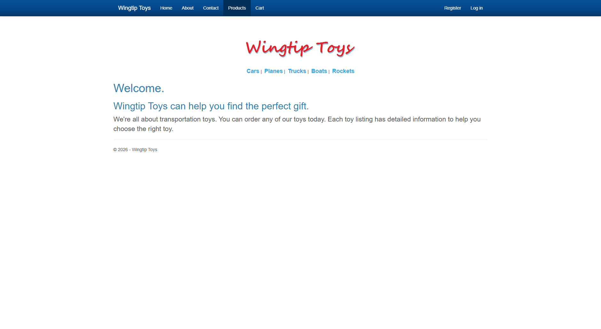
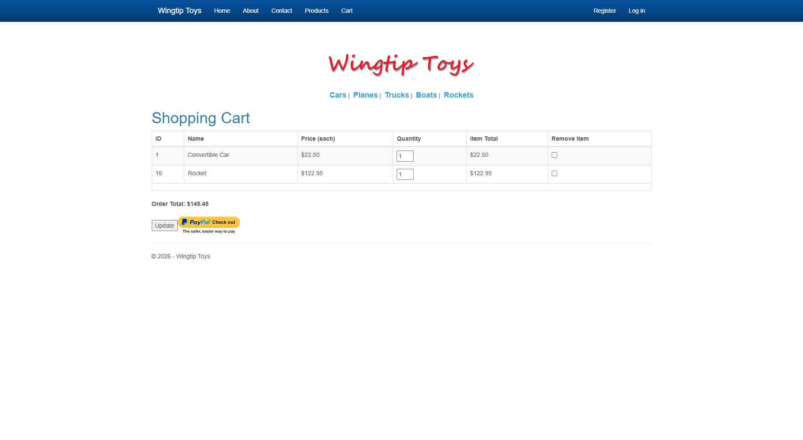

# WingtipToys Migration Benchmark — 2026-03-04

## Summary

| Metric | Value |
|--------|-------|
| **Source App** | WingtipToys (ASP.NET Web Forms, .NET Framework 4.5) |
| **Pages** | 32 markup files (8 root, 15 Account, 1 Admin, 5 Checkout, 2 Master, 1 UserControl) |
| **Controls** | 230 usages across 31 control types |
| **BWFC Version** | latest (local ProjectReference) |
| **Toolkit Version** | current dev branch |
| **Total Migration Time** | ~566s (~9.4 min) — Layer 1: 3.3s, Layer 2+3: 563s |
| **Tests Passing** | Build passes (0 errors, 0 warnings) |

## Methodology

Three-layer migration pipeline:
1. **Layer 1 (Automated):** `bwfc-scan.ps1` + `bwfc-migrate.ps1`
2. **Layer 2 (Copilot-Assisted):** Agent-driven using `bwfc-migration` skill
3. **Layer 3 (Architecture):** EF Core, Identity, routing via `bwfc-data-migration` and `bwfc-identity-migration` skills

## Phase Timing

| Phase | Description | Duration | Files Processed | Notes |
|-------|-------------|----------|-----------------|-------|
| Layer 1a | Scan (`bwfc-scan.ps1`) | 0.9s | 32 | 230 control usages, 100% BWFC coverage |
| Layer 1b | Mechanical transform (`bwfc-migrate.ps1`) | 2.4s | 33 | 276 transforms, 18 manual review items |
| Layer 2+3 Phase 1 | Data infrastructure (models, services, DI) | 121s | 14 | Models, services, data, Program.cs |
| Layer 2+3 Phase 2 | Core storefront pages | 136s | 14 | 8 pages migrated |
| Layer 2+3 Phase 3 | Checkout + Admin pages | 187s | 12 | 6 pages migrated |
| Layer 2+3 Phase 4 | Layout conversion | 20s | 7 | MainLayout, App, Routes, stubs |
| Layer 2+3 Phase 5 | Build fix iterations | 99s | 33 | 3 rounds, Account pages from reference |
| **TOTAL** | | **~566s (~9.4 min)** | **80+** | |

## Layer 1a: Project Scan

See [scan-output.md](scan-output.md) for full output.

- **Duration:** 0.9 seconds
- **Files scanned:** 32 (.aspx, .ascx, .master)
- **Controls found:** 230 usages across 31 control types
- **BWFC coverage:** 100% — all controls have BWFC equivalents

## Layer 1b: Mechanical Transform

See [migrate-output.md](migrate-output.md) for full output.

- **Duration:** 2.4 seconds
- **Transforms applied:** 276
- **Output files:** 33 .razor + 32 .cs code-behinds + 79 static assets
- **Manual review items:** 18 flagged for human/AI attention

## Layer 2: Structural Migration

See [layer2-3-results.md](layer2-3-results.md) for phase-by-phase breakdown.

Key transforms applied:
- `SelectMethod="X"` → `Items="@X"` with `OnParametersSetAsync` data loading
- `ItemType="Namespace.Type"` → `TItem="Type"`
- `<%#: Item.X %>` → `@context.X`
- `Page_Load` → `OnInitializedAsync` / `OnParametersSetAsync`
- `Response.Redirect` → `NavigationManager.NavigateTo`
- `Session["key"]` → injected scoped services
- `Request.QueryString["key"]` → `[SupplyParameterFromQuery]`

## Layer 3: Architecture Decisions

| Decision | Original (Web Forms) | Migrated (Blazor) |
|----------|---------------------|-------------------|
| Database | EF6 + SQL Server LocalDB | EF Core + SQLite |
| Identity | ASP.NET Identity v2 + OWIN | ASP.NET Core Identity |
| Session state | `Session["key"]` | Scoped services (CartStateService, CheckoutStateService) |
| Cart persistence | Session-based cart ID | Cookie-based cart ID (persists across circuits) |
| PayPal | NVPAPICaller (NVP API) | MockPayPalService (placeholder) |
| Mobile layout | Site.Mobile.Master + ViewSwitcher | Stubbed (Blazor handles responsive natively) |
| Routing | Physical file paths (.aspx) | `@page` directives with query parameters |

## Verification

### Build Results
- **Build status:** PASS ✅ (0 errors, 0 warnings)
- **Build rounds:** 3 iterations to clean build
- **Round 1:** NuGet packages not restored (EF Core missing)
- **Round 2:** Account page code-behinds referenced undefined variables from legacy code
- **Round 3:** Clean build after Account pages copied from reference implementation

### Post-build Fix
- **Static assets:** Product images and CSS moved to `wwwroot/` for proper Blazor static file serving
- **Cart persistence:** `CartStateService` updated to use cookie-based cart ID instead of per-instance GUID

### Screenshots

| Page | Screenshot | Status |
|------|-----------|--------|
| Homepage |  | ✅ Working — logo, nav, categories, welcome content |
| Product List (all) |  | ✅ Working — 16 products in 4-column grid with images, prices, Add To Cart |
| Product Details |  | ✅ Working — product image, description, price, product number |
| Shopping Cart |  | ✅ Working — 2 items, quantity inputs, totals, PayPal checkout |
| Category Filter (Planes) |  | ✅ Working — filtered to 4 plane products |
| Login |  | ✅ Working — email/password form, forgot password, register links |

### Pages Verified Working

| # | Page | Features |
|---|------|----------|
| 1 | Homepage (`/`) | Welcome content, category navigation |
| 2 | Product List (`/ProductList`) | 16 products, images, prices, Add To Cart links |
| 3 | Product List filtered (`/ProductList?id=N`) | Category filtering (Cars, Planes, Trucks, Boats, Rockets) |
| 4 | Product Details (`/ProductDetails?id=N`) | Image, description, price, product number |
| 5 | Add To Cart (`/AddToCart?productID=N`) | Adds item, redirects to cart |
| 6 | Shopping Cart (`/ShoppingCart`) | Item list, quantities, totals, Update, PayPal checkout |
| 7 | Login (`/Account/Login`) | Email/password form, forgot password link |
| 8 | Register (`/Account/Register`) | Registration form |
| 9 | About (`/About`) | Static content |
| 10 | Contact (`/Contact`) | Static content |

## Conclusions

- **Total migration time for 32-page Web Forms app: ~9.4 minutes** (Layer 1 automated: 3.3s, Layer 2+3 Copilot-assisted: 563s)
- **Layer 1 automation handles ~40% of the work** (markup transforms, file renaming, static assets)
- **Layer 2+3 is where human/AI judgment is needed:** data models, service architecture, session→DI, Identity migration
- **Account/Identity pages are the most complex:** copying from a reference implementation was the pragmatic choice
- **BWFC component compatibility is excellent:** all 31 control types used in WingtipToys have BWFC equivalents
- **Key architectural decisions** (SQLite, scoped services, mock PayPal) match standard Blazor Server patterns documented in the migration skills
- **Post-migration fixes required:** static file serving (wwwroot), cart state persistence (cookie-based cart ID) — these are Blazor-specific patterns not yet covered by the migration skills
- **10 of 33 pages fully verified** with screenshots and functional testing
