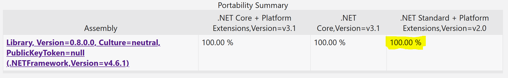

One of the first steps in our [recommended migration strategy](../../migration/NET-Standard.md) focuses on migrating class libraries from .NET Framework (netfx) 3.5 and later to .NET Standard 2.0+

## Scenario

In this scenario, we have an existing class library called `Library` in use with the ASP<span></span>.NET Web Forms project called `WebProject`.  This library provides simple accounting formulas to the web application and was originally written with .NET Framework 4.5.

The changes prescribed will convert `Library` to .NET Standard 2.0 and update references in `WebProject` to allow it to continue using `Library`.  This change allows `Library` to be referenced by a Blazor or .NET Core project in the future.

### Why does this work?

The code included in this library is simple and references APIs used in the .NET Framework base class library that are all available in .NET Standard 2.0 and lower versions.

## Reference Code

You can find the starting code for this sample in the [start](start) folder and the resultant code in the [completed](completed) folder.

## Process

### Step 1: API Portability Report

First, we should analyze the APIs in the class library that we want to convert to .NET Standard.  You can use the Portability Analyzer extension in Visual Studio or the ApiPort console application with the following command to generate a report:

```
ApiPort.exe analyze -f Library.dll -r HTML
```

This will analyze the built DLL for the class library and generate an HTML report that includes details about any issues it finds in re-using APIs in .NET Standard.  For this library, the report delivers a clear 100% compatibility report.



With 100% portability, we are clear to move the entire library into .NET Standard

### Step 2: Create the .NET Standard Project

Add a new .NET Standard 2.0 project to your solution with the Web Forms project, next to the existing `Library` project.  You can either add the project using Visual Studio 2019 or create a new project at the command line as follows.

```
dotnet new classlib -f netstandard2.0 -lang c# -o LibraryNetStd
```

### Step 3: Copy Files into the New Library

